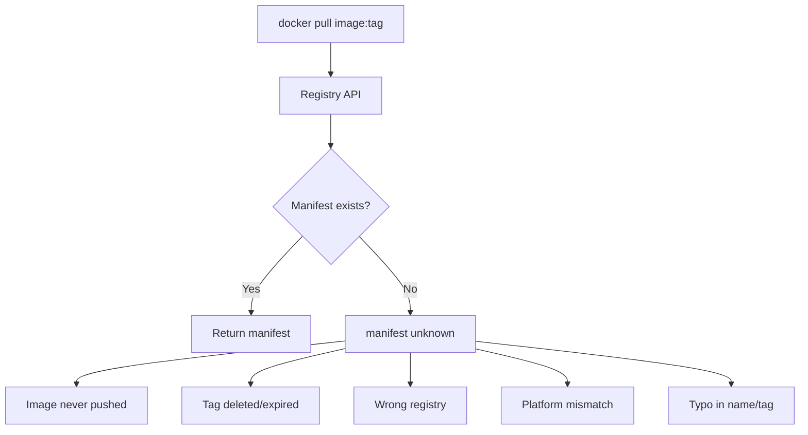

# How to Fix Docker 'Manifest Unknown' Errors

Author: [nawazdhandala](https://www.github.com/nawazdhandala)

Tags: Docker, Troubleshooting, Registry, DevOps, Images

Description: Diagnose and resolve Docker manifest unknown errors caused by missing images, incorrect tags, platform mismatches, and registry synchronization issues.

---

The "manifest unknown" error means Docker could not find the image manifest you requested. This happens when the image does not exist, the tag is wrong, or there is a mismatch between what you are requesting and what the registry has. This guide covers all the scenarios and how to fix them.

## Understanding the Error

The error typically appears as:

```bash
docker pull myimage:mytag
# Error response from daemon: manifest for myimage:mytag not found: manifest unknown: manifest unknown
```

Or with full registry paths:

```bash
docker pull registry.example.com/myapp:v1.0.0
# manifest unknown: manifest unknown
```

What this means:



## Cause 1: Image or Tag Does Not Exist

The most common cause is simply that the image or tag was never pushed:

```bash
# Verify the image exists
docker manifest inspect myimage:mytag

# For Docker Hub, check available tags
curl -s https://registry.hub.docker.com/v2/repositories/library/nginx/tags?page_size=10 | jq '.results[].name'

# For private registries
curl -s -u user:pass https://registry.example.com/v2/myapp/tags/list | jq
```

Solutions:

```bash
# Check for typos - list similar images
docker search myimage

# Use a tag that exists
docker pull nginx:1.25-alpine  # Instead of nginx:1.25.0-alpine

# Pull latest if tag unknown
docker pull myimage:latest
```

## Cause 2: Platform Mismatch

Multi-platform images may not have a manifest for your platform:

```bash
# Error when pulling on ARM Mac
docker pull myimage:latest
# manifest unknown: manifest unknown for linux/arm64
```

Diagnose:

```bash
# Check available platforms
docker manifest inspect nginx:alpine | jq '.manifests[].platform'
# Shows available os/architecture combinations

# Or using crane tool
crane manifest nginx:alpine | jq '.manifests[].platform'
```

Solutions:

```bash
# Pull specific platform that exists
docker pull --platform linux/amd64 myimage:latest

# Check your current platform
docker info --format '{{.OSType}}/{{.Architecture}}'
```

## Cause 3: Wrong Registry

You might be pulling from the wrong registry:

```bash
# This pulls from Docker Hub
docker pull mycompany/myapp:latest

# This pulls from your private registry
docker pull registry.example.com/mycompany/myapp:latest
```

Check your image sources:

```bash
# See where an image came from
docker inspect myapp:latest --format '{{.RepoTags}}'

# Check configured registries
cat /etc/docker/daemon.json | jq '.registry-mirrors'
```

## Cause 4: Registry Synchronization Issues

In multi-region or replicated registries, newly pushed images may not be available everywhere:

```bash
# Pushed to us-east, pulling from eu-west
docker pull eu-west.registry.example.com/myapp:latest
# manifest unknown - not yet replicated
```

Solutions:

```bash
# Wait for replication
sleep 60 && docker pull eu-west.registry.example.com/myapp:latest

# Pull from the primary registry
docker pull us-east.registry.example.com/myapp:latest

# Check replication status (registry-specific)
```

## Cause 5: Tag Was Overwritten or Deleted

Mutable tags like `latest` or `dev` can be overwritten or deleted:

```bash
# Image was re-pushed with different content
# Old manifest digest no longer exists
docker pull myapp@sha256:abc123...  # Old digest
# manifest unknown
```

Solutions:

```bash
# Pull by current tag instead of digest
docker pull myapp:latest

# Find current digest
docker manifest inspect myapp:latest | jq '.config.digest'

# Use immutable tags in production
docker pull myapp:v1.2.3  # Better than myapp:latest
```

## Cause 6: Authentication Issues

Some registries return "manifest unknown" instead of "unauthorized":

```bash
# Not logged in to private registry
docker pull private.registry.com/myapp:latest
# manifest unknown (instead of 401)
```

Verify authentication:

```bash
# Check login status
cat ~/.docker/config.json | jq '.auths'

# Login and retry
docker login private.registry.com
docker pull private.registry.com/myapp:latest
```

## Cause 7: Build Never Pushed

After building locally, forgetting to push:

```bash
# Built locally
docker build -t registry.example.com/myapp:v1.0.0 .

# Try to pull on another machine - not pushed yet!
docker pull registry.example.com/myapp:v1.0.0
# manifest unknown
```

Check if image exists locally vs remotely:

```bash
# Local images
docker images | grep myapp

# Remote images
docker manifest inspect registry.example.com/myapp:v1.0.0

# Push if needed
docker push registry.example.com/myapp:v1.0.0
```

## Debugging Steps

### Step 1: Verify Exact Image Reference

```bash
# Break down the image reference
IMAGE="registry.example.com/namespace/myapp:v1.0.0"

# Extract components
REGISTRY=$(echo $IMAGE | cut -d'/' -f1)
REPO=$(echo $IMAGE | cut -d'/' -f2-)
TAG=$(echo $REPO | cut -d':' -f2)
NAME=$(echo $REPO | cut -d':' -f1)

echo "Registry: $REGISTRY"
echo "Repository: $NAME"
echo "Tag: $TAG"
```

### Step 2: Test Registry Connectivity

```bash
# Test v2 API endpoint
curl -I https://registry.example.com/v2/

# Test repository access
curl https://registry.example.com/v2/namespace/myapp/tags/list

# Test specific manifest
curl -I https://registry.example.com/v2/namespace/myapp/manifests/v1.0.0
```

### Step 3: Check Available Tags

```bash
# Docker Hub
curl -s "https://registry.hub.docker.com/v2/repositories/library/nginx/tags?page_size=100" | \
  jq -r '.results[].name' | sort

# Private registry (with auth)
TOKEN=$(curl -s -u user:pass "https://registry.example.com/v2/token" | jq -r .token)
curl -s -H "Authorization: Bearer $TOKEN" \
  "https://registry.example.com/v2/myapp/tags/list" | jq
```

### Step 4: Verify Manifest Content

```bash
# Get manifest for specific tag
docker manifest inspect registry.example.com/myapp:v1.0.0

# Check manifest type and layers
docker manifest inspect registry.example.com/myapp:v1.0.0 | jq '.mediaType'
docker manifest inspect registry.example.com/myapp:v1.0.0 | jq '.layers | length'
```

## CI/CD Pipeline Fixes

Ensure images are pushed before being pulled:

```yaml
# GitHub Actions
jobs:
  build:
    runs-on: ubuntu-latest
    steps:
      - name: Build and push
        uses: docker/build-push-action@v5
        with:
          push: true
          tags: registry.example.com/myapp:${{ github.sha }}

  deploy:
    needs: build  # Wait for build to complete
    runs-on: ubuntu-latest
    steps:
      - name: Pull image
        run: docker pull registry.example.com/myapp:${{ github.sha }}
```

Add verification step:

```yaml
- name: Verify image exists
  run: |
    for i in 1 2 3 4 5; do
      docker manifest inspect registry.example.com/myapp:${{ github.sha }} && exit 0
      echo "Waiting for image to be available..."
      sleep 10
    done
    exit 1
```

## Registry-Specific Solutions

### Docker Hub

```bash
# Check rate limiting
TOKEN=$(curl -s "https://auth.docker.io/token?service=registry.docker.io&scope=repository:library/nginx:pull" | jq -r .token)
curl -sI -H "Authorization: Bearer $TOKEN" https://registry-1.docker.io/v2/library/nginx/manifests/latest | grep -i rate

# Use official image names
docker pull nginx:alpine  # Not library/nginx:alpine
```

### AWS ECR

```bash
# Ensure image exists
aws ecr describe-images --repository-name myapp --image-ids imageTag=v1.0.0

# Refresh credentials
aws ecr get-login-password | docker login --username AWS --password-stdin 123456789.dkr.ecr.us-east-1.amazonaws.com
```

### Google Artifact Registry

```bash
# List images
gcloud artifacts docker images list us-docker.pkg.dev/PROJECT/REPO

# Check specific tag
gcloud artifacts docker tags list us-docker.pkg.dev/PROJECT/REPO/myapp

# Refresh auth
gcloud auth configure-docker us-docker.pkg.dev
```

### Harbor

```bash
# Check replication status
curl -s -u admin:password https://harbor.example.com/api/v2.0/replication/executions | jq

# Verify image
curl -s -u admin:password https://harbor.example.com/v2/myproject/myapp/manifests/v1.0.0
```

## Quick Diagnostic Script

```bash
#!/bin/bash
# diagnose-manifest.sh

IMAGE=${1:-"nginx:latest"}

echo "=== Diagnosing: $IMAGE ==="

# Parse image reference
if [[ "$IMAGE" == *"/"* ]]; then
  REGISTRY=$(echo $IMAGE | cut -d'/' -f1)
  if [[ "$REGISTRY" != *"."* ]]; then
    REGISTRY="registry-1.docker.io"
    REPO="library/$IMAGE"
  else
    REPO=$(echo $IMAGE | cut -d'/' -f2-)
  fi
else
  REGISTRY="registry-1.docker.io"
  REPO="library/$IMAGE"
fi

echo "Registry: $REGISTRY"
echo "Repository: ${REPO%:*}"
echo "Tag: ${REPO#*:}"

echo -e "\n=== Checking manifest ==="
docker manifest inspect $IMAGE 2>&1 | head -20

echo -e "\n=== Available platforms ==="
docker manifest inspect $IMAGE 2>/dev/null | jq -r '.manifests[]? | "\(.platform.os)/\(.platform.architecture)"' || echo "Could not get platforms"

echo -e "\n=== Local images ==="
docker images --format "{{.Repository}}:{{.Tag}}" | grep -i "${REPO%:*}" | head -5

echo -e "\n=== Pull attempt ==="
docker pull $IMAGE 2>&1 | tail -5
```

---

The "manifest unknown" error always means the exact image reference you requested does not exist in the registry. Verify the image name, tag, and registry are correct. Check if the image was actually pushed, if you have the right permissions, and if you are requesting a platform that exists in the manifest list. When in doubt, use `docker manifest inspect` to see exactly what is available.
