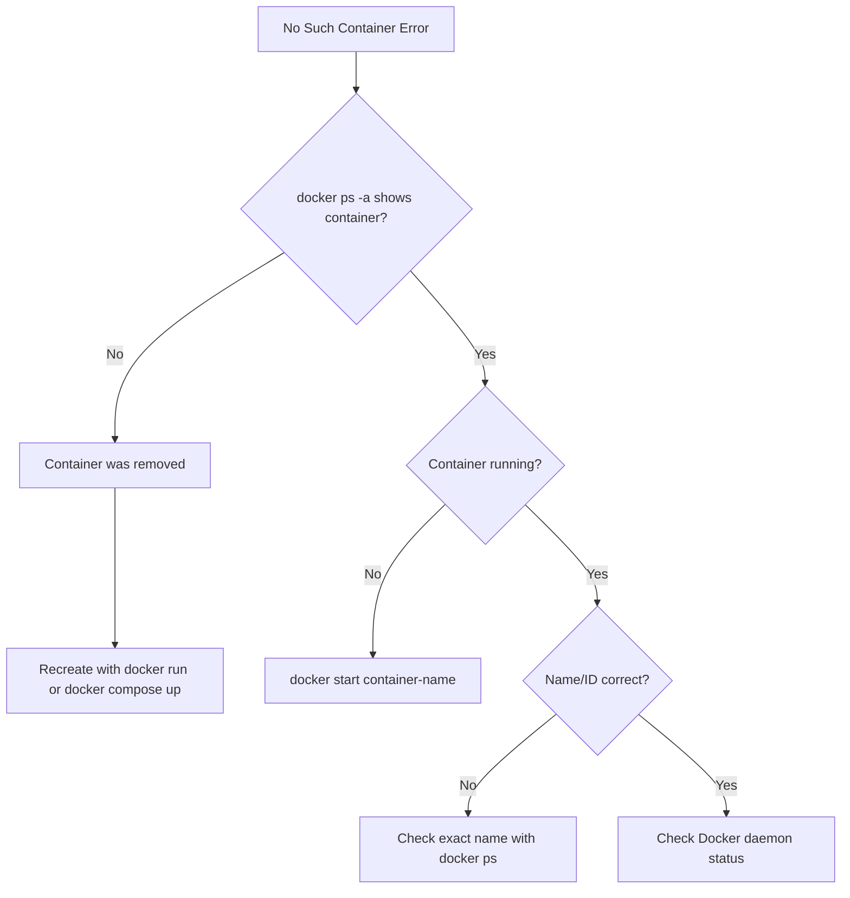

# How to Fix Docker 'No Such Container' Errors

Author: [nawazdhandala](https://www.github.com/nawazdhandala)

Tags: Docker, Troubleshooting, Container Management, DevOps, Errors

Description: Diagnose and resolve Docker 'No such container' errors including stopped container issues, name vs ID mismatches, and scripts that reference containers that no longer exist.

---

The "No such container" error occurs when you reference a container that Docker cannot find. The container may have been removed, stopped, renamed, or the identifier you are using does not match any existing container.

## Understanding the Error

```bash
# Common error messages
Error: No such container: mycontainer
Error response from daemon: No such container: abc123def456

# Commands that trigger this error
docker stop mycontainer      # Container doesn't exist
docker logs mycontainer      # Container was removed
docker exec mycontainer sh   # Container stopped or removed
docker inspect mycontainer   # Wrong container name/ID
```

## Step 1: Verify Container Exists

Check if the container exists at all, including stopped containers.

```bash
# List running containers
docker ps

# List ALL containers (including stopped)
docker ps -a

# Search for container by name pattern
docker ps -a --filter "name=mycontainer"

# Search for container by partial ID
docker ps -a --filter "id=abc123"

# List with more details
docker ps -a --format "table {{.ID}}\t{{.Names}}\t{{.Status}}\t{{.CreatedAt}}"
```

If the container does not appear in `docker ps -a`, it has been removed and must be recreated.

## Step 2: Check Container Status

Containers in different states require different handling.

```bash
# Check container state
docker ps -a --filter "name=mycontainer" --format "{{.Status}}"

# Possible states:
# Created          - Container exists but never started
# Up 2 hours       - Running
# Exited (0)       - Stopped normally
# Exited (1)       - Stopped with error
# Dead             - Container failed to stop properly
# Paused           - Temporarily suspended
```

### Cannot Exec into Stopped Container

```bash
# This fails - you can't exec into a stopped container
docker exec mycontainer sh
# Error: Container is not running

# Solution: Start the container first
docker start mycontainer
docker exec mycontainer sh

# Or start with interactive shell
docker start -ai mycontainer
```

## Step 3: Verify Container Name/ID

Container names and IDs must match exactly (though IDs can be partial).

```bash
# Find exact container name
docker ps -a --format "{{.Names}}"

# Common naming issues:
# - Docker Compose prefixes: project_service_1 vs service
# - Typos in container names
# - Case sensitivity (container names are case-sensitive)

# With Docker Compose, container names include project name
docker compose ps --format "table {{.Name}}\t{{.Service}}"
# NAME               SERVICE
# myproject_api_1    api
# myproject_db_1     db

# Reference by service name within compose
docker compose exec api sh

# Or by full container name
docker exec myproject_api_1 sh
```

### Container ID Shortcuts

```bash
# Full container ID (64 characters)
docker inspect abc123def456789...

# Short container ID (first 12 characters)
docker inspect abc123def456

# Even shorter (as long as unique)
docker inspect abc12

# List IDs to find the right one
docker ps -a --format "{{.ID}} {{.Names}}"
```

## Common Scenarios

### Scenario 1: Container Was Auto-Removed

Containers started with `--rm` are automatically removed when they stop.

```bash
# This container disappears after stopping
docker run --rm --name temp-container nginx

# After the container stops, you cannot reference it
docker logs temp-container
# Error: No such container

# Solution: Don't use --rm if you need logs after exit
docker run --name persistent-container nginx
```

### Scenario 2: Docker Compose Container Names

Docker Compose generates container names using a specific pattern.

```yaml
# docker-compose.yml
services:
  api:
    image: myapp/api:latest
```

```bash
# Container name depends on project name and numbering
# Default project name is the directory name

# Wrong: Service name alone doesn't work
docker exec api sh
# Error: No such container

# Correct: Use docker compose exec
docker compose exec api sh

# Or find and use full container name
docker ps --filter "label=com.docker.compose.service=api" --format "{{.Names}}"
# myproject-api-1

docker exec myproject-api-1 sh
```

### Scenario 3: Container Restarted with New ID

When you recreate a container, it gets a new ID.

```bash
# Old container ID stored in script
CONTAINER_ID="abc123def456"
docker exec $CONTAINER_ID sh
# Error: No such container (if container was recreated)

# Better approach: Use container name
docker exec mycontainer sh

# Or resolve name to current ID
CONTAINER_ID=$(docker ps -qf "name=mycontainer")
docker exec $CONTAINER_ID sh
```

### Scenario 4: Referencing Removed Container in Scripts

Scripts that cache container references can fail after restarts.

```bash
#!/bin/bash
# Bad: Hardcoded container ID
CONTAINER="abc123def456"

# Good: Lookup container by name each time
CONTAINER=$(docker ps -qf "name=myapp")

if [ -z "$CONTAINER" ]; then
  echo "Container not found. Is it running?"
  exit 1
fi

docker exec "$CONTAINER" your-command
```

## Debugging Container Lifecycle

```bash
# Watch container events in real-time
docker events --filter "type=container"

# Events show container lifecycle
# container create, start, stop, die, destroy

# View recent events
docker events --since "1h" --filter "container=mycontainer"

# Check if container was recently removed
docker events --since "30m" --filter "event=destroy"
```

## Prevention and Best Practices

### Use Meaningful Container Names

```bash
# Always name your containers explicitly
docker run -d --name api-production myapp/api:latest
docker run -d --name api-staging myapp/api:latest

# Names make scripts and commands more maintainable
docker logs api-production
docker exec api-staging sh
```

### Verify Before Operating

```bash
#!/bin/bash
# Robust script that checks container existence

CONTAINER_NAME="myapp"

# Check if container exists (any state)
if ! docker ps -a --format "{{.Names}}" | grep -q "^${CONTAINER_NAME}$"; then
  echo "Container $CONTAINER_NAME does not exist"
  exit 1
fi

# Check if container is running
if ! docker ps --format "{{.Names}}" | grep -q "^${CONTAINER_NAME}$"; then
  echo "Container $CONTAINER_NAME exists but is not running"
  docker start "$CONTAINER_NAME"
fi

docker exec "$CONTAINER_NAME" your-command
```

### Use Docker Compose Service Names

```bash
# With Docker Compose, prefer service-based commands
docker compose exec api sh           # Works regardless of container name
docker compose logs api --follow     # Follows correct container
docker compose restart api           # Restarts the right service

# These work even if container names change
```

## Error Recovery Checklist



### Quick Reference Commands

```bash
# Find container by partial name
docker ps -a --filter "name=partial"

# Find container by label
docker ps -a --filter "label=app=myapp"

# Get container ID by name
docker ps -qf "name=exact-name"

# Check if container exists
docker inspect container-name > /dev/null 2>&1 && echo "exists" || echo "missing"

# List recently removed containers
docker events --since "1h" --filter "event=destroy" --format "{{.Actor.Attributes.name}}"
```

---

"No such container" errors typically mean the container was removed, stopped, or you are using the wrong identifier. Start by checking `docker ps -a` to see all containers including stopped ones. Use meaningful container names instead of relying on IDs, and prefer Docker Compose service commands when working with multi-container applications. For scripts, always verify container existence before attempting operations.
