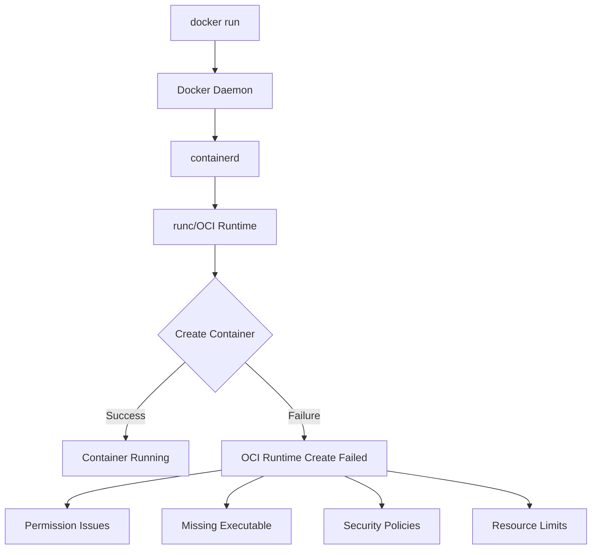

# How to Fix Docker 'OCI Runtime Create Failed' Errors

Author: [nawazdhandala](https://www.github.com/nawazdhandala)

Tags: Docker, Troubleshooting, DevOps, OCI, Linux

Description: Diagnose and resolve OCI runtime create failed errors in Docker caused by missing executables, permission issues, seccomp policies, and container configuration problems.

---

The "OCI runtime create failed" error is Docker's way of telling you that the low-level container runtime (runc) could not start your container. The actual error message follows this prefix and contains clues about what went wrong. This guide covers the most common causes and their solutions.

## Understanding the Error

The full error typically looks like:

```
OCI runtime create failed: container_linux.go:380: starting container process caused:
exec: "/app/start.sh": permission denied: unknown
```

The key information is after "caused:" - this tells you the specific failure reason.



## Cause 1: Permission Denied on Entrypoint

The most common cause is trying to execute a file without execute permissions:

```bash
# Error message
OCI runtime create failed: ... exec: "/app/start.sh": permission denied

# Check file permissions in the image
docker run --rm --entrypoint ls myapp:latest -la /app/start.sh
# -rw-r--r-- 1 root root 245 Jan 25 10:00 /app/start.sh
# Notice: no 'x' (execute) permission
```

Solution in Dockerfile:

```dockerfile
COPY start.sh /app/start.sh
RUN chmod +x /app/start.sh

# Or copy with correct permissions
COPY --chmod=755 start.sh /app/start.sh
```

Solution without rebuilding:

```bash
# Override entrypoint to fix permissions and run
docker run --rm myapp:latest sh -c "chmod +x /app/start.sh && /app/start.sh"
```

## Cause 2: Executable Not Found

The specified command or entrypoint does not exist in the container:

```bash
# Error message
OCI runtime create failed: ... exec: "node": executable file not found in $PATH

# Or
OCI runtime create failed: ... exec: "/app/server": no such file or directory
```

Verify the file exists:

```bash
# Check if command exists in image
docker run --rm --entrypoint which myapp:latest node

# List files in expected location
docker run --rm --entrypoint ls myapp:latest -la /app/

# Check PATH variable
docker run --rm --entrypoint sh myapp:latest -c 'echo $PATH'
```

Solution:

```dockerfile
# Ensure binary is in PATH
ENV PATH="/app/bin:$PATH"

# Or use absolute path
CMD ["/usr/local/bin/node", "server.js"]
```

## Cause 3: Wrong Binary Architecture

Running an AMD64 binary on ARM (or vice versa):

```bash
# Error message
OCI runtime create failed: ... exec format error

# Check binary architecture
docker run --rm --entrypoint file myapp:latest /app/server
# ELF 64-bit LSB executable, x86-64, version 1 (SYSV)
# But running on ARM!
```

Solution:

```bash
# Build for the correct platform
docker build --platform linux/arm64 -t myapp:arm64 .

# Or pull the correct platform
docker pull --platform linux/amd64 myapp:latest
```

## Cause 4: Shell Script Issues

Scripts with Windows line endings or missing shebang:

```bash
# Error message
OCI runtime create failed: ... exec: "/app/start.sh": no such file or directory
# (File exists but interpreter in shebang not found due to \r\n)
```

Check for Windows line endings:

```bash
# Show line endings
docker run --rm --entrypoint cat myapp:latest -A /app/start.sh
# #!/bin/bash^M$  <- ^M indicates Windows line ending

# Fix in Dockerfile
RUN sed -i 's/\r$//' /app/start.sh
```

Ensure proper shebang:

```bash
#!/bin/sh
# Not #!/bin/bash if bash is not installed (Alpine)
```

## Cause 5: Seccomp or AppArmor Restrictions

Security profiles may block container operations:

```bash
# Error message
OCI runtime create failed: ... operation not permitted

# Try without security profiles (for debugging only)
docker run --security-opt seccomp=unconfined myapp:latest

# Or without AppArmor
docker run --security-opt apparmor=unconfined myapp:latest
```

For production, use appropriate security profiles:

```bash
# Use default Docker seccomp profile
docker run --security-opt seccomp=default myapp:latest

# Or custom profile
docker run --security-opt seccomp=/path/to/profile.json myapp:latest
```

## Cause 6: User Namespace Issues

Running as non-root with user namespace remapping:

```bash
# Error message
OCI runtime create failed: ... permission denied

# Check user namespace configuration
cat /etc/docker/daemon.json | grep userns
```

Solution:

```bash
# Run without user namespace remapping for this container
docker run --userns=host myapp:latest

# Or fix ownership in image
```

```dockerfile
RUN chown -R 100000:100000 /app  # Use remapped UID
```

## Cause 7: Cgroup Configuration

Invalid cgroup settings or cgroup v2 compatibility issues:

```bash
# Error message
OCI runtime create failed: ... cgroup ... operation not permitted
```

Solutions:

```bash
# Check cgroup version
mount | grep cgroup

# For cgroup v2 systems, ensure Docker is configured
cat /etc/docker/daemon.json
```

```json
{
  "exec-opts": ["native.cgroupdriver=systemd"],
  "cgroup-parent": "docker.slice"
}
```

## Cause 8: Resource Limit Issues

Invalid resource constraints:

```bash
# Error message
OCI runtime create failed: ... invalid argument

# Check your resource limits
docker run --memory=0 myapp:latest  # Invalid: memory cannot be 0
```

Fix resource configurations:

```bash
# Valid memory limit
docker run --memory=256m myapp:latest

# Valid CPU limit
docker run --cpus=0.5 myapp:latest
```

## Cause 9: Device or Mount Issues

Problems with device mappings or volume mounts:

```bash
# Error message
OCI runtime create failed: ... no such device

# Check if device exists
ls -la /dev/sda1

# Mount with correct options
docker run --device=/dev/sda1:/dev/sda1:r myapp:latest
```

## Cause 10: SELinux Denials

On SELinux-enabled systems:

```bash
# Error message
OCI runtime create failed: ... permission denied

# Check SELinux status
sestatus

# Check for SELinux denials
ausearch -m avc -ts recent

# Run with SELinux label
docker run --security-opt label=disable myapp:latest

# Or fix volumes with :z or :Z suffix
docker run -v /host/path:/container/path:z myapp:latest
```

## Debugging Steps

### Step 1: Get Full Error Details

```bash
# Enable debug mode
dockerd --debug

# Or check daemon logs
sudo journalctl -u docker.service --since "5 minutes ago"
```

### Step 2: Inspect the Image

```bash
# Check image configuration
docker inspect myapp:latest | jq '.[0].Config'

# Check entrypoint and cmd
docker inspect myapp:latest --format '{{.Config.Entrypoint}} {{.Config.Cmd}}'

# Check user
docker inspect myapp:latest --format '{{.Config.User}}'
```

### Step 3: Test with Minimal Configuration

```bash
# Try with overridden entrypoint
docker run --rm --entrypoint sh myapp:latest -c "echo Hello"

# Try with different user
docker run --rm --user root myapp:latest

# Try without resource limits
docker run --rm --memory=0 --cpus=0 myapp:latest
```

### Step 4: Compare with Working Container

```bash
# Use a known working base image
docker run --rm alpine echo "Hello"

# Check runc directly
sudo runc --version

# Test runc directly (advanced)
sudo runc spec  # Generate config
sudo runc run test-container
```

## Quick Reference: Error to Solution

| Error Contains | Likely Cause | Solution |
|----------------|--------------|----------|
| permission denied | No execute permission | `chmod +x` or `--chmod=755` in COPY |
| no such file or directory | Missing file or wrong path | Verify file exists in image |
| executable file not found | Not in PATH | Use absolute path or fix PATH |
| exec format error | Wrong architecture | Build for correct platform |
| operation not permitted | Security policy | Check seccomp/AppArmor/SELinux |
| invalid argument | Bad resource limit | Verify memory/CPU values |

## Prevention

```dockerfile
# Always set execute permissions explicitly
COPY --chmod=755 scripts/*.sh /app/scripts/

# Use absolute paths for commands
CMD ["/usr/local/bin/node", "/app/server.js"]

# Verify executables exist
RUN which node && node --version

# Test the entrypoint during build
RUN /app/start.sh --help || true

# Document expected runtime requirements
LABEL runtime.requirements="seccomp=default"
```

---

OCI runtime create failed errors point to container startup failures at the lowest level. Start by reading the full error message - it usually tells you exactly what failed. Missing execute permissions, wrong binary architecture, and security policy restrictions are the most common causes. When in doubt, override the entrypoint with `sh` to get a shell and investigate inside the container.
