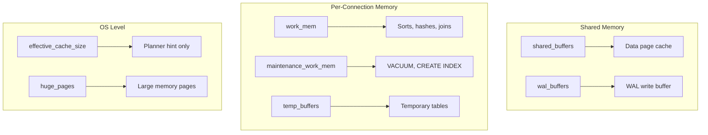

# How to Fix 'out of memory' Errors in PostgreSQL

Author: [nawazdhandala](https://www.github.com/nawazdhandala)

Tags: PostgreSQL, Database, Troubleshooting, Memory, Performance, Configuration, OOM

Description: Learn how to diagnose and fix 'out of memory' errors in PostgreSQL. This guide covers memory configuration, query optimization, and system-level settings to prevent OOM issues.

---

"Out of memory" errors in PostgreSQL can crash your database server or kill individual queries. These errors occur when PostgreSQL or the operating system cannot allocate the memory needed for an operation. Understanding how PostgreSQL uses memory and how to configure it properly is essential for running a stable production database.

---

## Understanding the Error

Out of memory errors can appear in several forms:

```
ERROR: out of memory
DETAIL: Failed on request of size 1073741824.

FATAL: out of memory
DETAIL: Failed while creating hash table.

LOG: server process (PID 12345) was terminated by signal 9: Killed
DETAIL: Failed process was running: SELECT * FROM large_table...
```

The last example shows the Linux OOM killer terminating a PostgreSQL process, which is particularly dangerous as it can kill the main postgres process.

---

## PostgreSQL Memory Architecture



---

## Diagnosing Memory Issues

### Check Current Memory Configuration

```sql
-- View all memory-related settings
SELECT name, setting, unit, context
FROM pg_settings
WHERE name IN (
    'shared_buffers',
    'work_mem',
    'maintenance_work_mem',
    'effective_cache_size',
    'temp_buffers',
    'wal_buffers',
    'max_connections'
)
ORDER BY name;

-- Calculate maximum possible memory usage
SELECT
    (SELECT setting::int FROM pg_settings WHERE name = 'shared_buffers') *
    (SELECT setting::int FROM pg_settings WHERE name = 'block_size') / (1024*1024) AS shared_buffers_mb,

    (SELECT setting::int FROM pg_settings WHERE name = 'max_connections') *
    (SELECT setting::int FROM pg_settings WHERE name = 'work_mem') / 1024 AS max_work_mem_mb,

    (SELECT setting::int FROM pg_settings WHERE name = 'maintenance_work_mem') / 1024 AS maintenance_work_mem_mb;
```

### Monitor Memory Usage

```sql
-- Check memory usage by backend
SELECT
    pid,
    usename,
    application_name,
    state,
    backend_type,
    query
FROM pg_stat_activity
WHERE state = 'active';

-- Check for memory-intensive operations
SELECT
    pid,
    now() - query_start AS duration,
    query,
    state
FROM pg_stat_activity
WHERE state != 'idle'
AND query NOT LIKE '%pg_stat_activity%'
ORDER BY query_start;
```

### System-Level Memory Check

```bash
# Check system memory
free -h

# Check PostgreSQL process memory
ps aux --sort=-%mem | grep postgres | head -20

# Check for OOM killer activity
dmesg | grep -i "out of memory"
dmesg | grep -i "killed process"

# Check system logs
journalctl -u postgresql --since "1 hour ago" | grep -i memory
```

---

## Solutions

### Solution 1: Tune shared_buffers

`shared_buffers` is the main memory cache for PostgreSQL.

```ini
# postgresql.conf

# General recommendation: 25% of total RAM
# For a server with 32GB RAM:
shared_buffers = 8GB

# For smaller servers (4GB RAM):
shared_buffers = 1GB

# Never exceed 40% of total RAM
```

### Solution 2: Tune work_mem

`work_mem` is allocated per operation (sort, hash), per query, per connection.

```ini
# postgresql.conf

# Default is often too low (4MB)
# But be careful - this is per operation!
work_mem = 64MB

# For a server with 100 connections doing complex queries:
# 100 connections * 4 operations * 64MB = 25.6GB potential usage!
# So keep it reasonable:
work_mem = 32MB
```

```sql
-- Set work_mem for specific sessions
SET work_mem = '256MB';  -- For a complex query
-- Run your query
RESET work_mem;

-- Check if a query needs more work_mem
EXPLAIN (ANALYZE, BUFFERS) SELECT * FROM large_table ORDER BY column;
-- Look for "Sort Method: external merge Disk" - indicates work_mem too low
```

### Solution 3: Tune maintenance_work_mem

```ini
# postgresql.conf

# Used for VACUUM, CREATE INDEX, etc.
# Can be much higher than work_mem since only one runs at a time
maintenance_work_mem = 1GB

# For large databases:
maintenance_work_mem = 2GB
```

### Solution 4: Reduce max_connections

Each connection uses memory even when idle.

```ini
# postgresql.conf

# Default of 100 is often too high
max_connections = 50

# Use connection pooling (PgBouncer) to handle many clients
# with fewer actual connections
```

### Solution 5: Configure Linux OOM Killer

Prevent the OOM killer from targeting PostgreSQL:

```bash
# Find postgres main process PID
PGPID=$(head -1 /var/lib/postgresql/14/main/postmaster.pid)

# Set OOM score adjustment (lower = less likely to be killed)
echo -1000 > /proc/${PGPID}/oom_score_adj

# Or in systemd service file
# /etc/systemd/system/postgresql.service.d/override.conf
[Service]
OOMScoreAdjust=-1000
```

### Solution 6: Configure Linux Memory Overcommit

```bash
# Check current setting
cat /proc/sys/vm/overcommit_memory

# Option 0: Heuristic overcommit (default)
# Option 1: Always overcommit (dangerous)
# Option 2: Don't overcommit more than swap + ratio of physical RAM

# Recommended for PostgreSQL:
echo 2 > /proc/sys/vm/overcommit_memory
echo 80 > /proc/sys/vm/overcommit_ratio

# Make permanent in /etc/sysctl.conf:
vm.overcommit_memory = 2
vm.overcommit_ratio = 80
```

---

## Query Optimization for Memory

### Identify Memory-Hungry Queries

```sql
-- Install pg_stat_statements extension
CREATE EXTENSION IF NOT EXISTS pg_stat_statements;

-- Find queries with most temporary file usage (indicates memory pressure)
SELECT
    substring(query, 1, 100) AS query_preview,
    calls,
    total_exec_time / 1000 AS total_seconds,
    mean_exec_time / 1000 AS mean_seconds,
    temp_blks_read + temp_blks_written AS temp_blocks
FROM pg_stat_statements
ORDER BY temp_blks_read + temp_blks_written DESC
LIMIT 10;
```

### Optimize Sorts and Joins

```sql
-- Check query plan for memory usage
EXPLAIN (ANALYZE, BUFFERS, FORMAT TEXT)
SELECT *
FROM orders o
JOIN customers c ON o.customer_id = c.id
ORDER BY o.created_at DESC
LIMIT 100;

-- Look for:
-- "Sort Method: external merge Disk" - needs more work_mem
-- "Hash Batch" - hash join spilling to disk

-- Fix: Add appropriate indexes
CREATE INDEX idx_orders_customer_created ON orders (customer_id, created_at DESC);

-- Or rewrite the query to use less memory
-- Instead of ORDER BY on full result, use a subquery
SELECT *
FROM orders o
JOIN customers c ON o.customer_id = c.id
WHERE o.id IN (
    SELECT id FROM orders ORDER BY created_at DESC LIMIT 100
);
```

### Limit Result Sets

```sql
-- Bad: Fetches entire table into memory
SELECT * FROM large_table;

-- Better: Paginate results
SELECT * FROM large_table
ORDER BY id
LIMIT 100 OFFSET 0;

-- Best: Use cursor for processing large results
BEGIN;
DECLARE my_cursor CURSOR FOR SELECT * FROM large_table;
FETCH 1000 FROM my_cursor;
-- Process rows
FETCH 1000 FROM my_cursor;
-- Continue until done
CLOSE my_cursor;
COMMIT;
```

---

## Memory Configuration Examples

### Small Server (4GB RAM)

```ini
# postgresql.conf for 4GB server

shared_buffers = 1GB                    # 25% of RAM
effective_cache_size = 3GB              # 75% of RAM
work_mem = 16MB                         # Conservative
maintenance_work_mem = 256MB
max_connections = 50
wal_buffers = 64MB
```

### Medium Server (16GB RAM)

```ini
# postgresql.conf for 16GB server

shared_buffers = 4GB                    # 25% of RAM
effective_cache_size = 12GB             # 75% of RAM
work_mem = 64MB
maintenance_work_mem = 1GB
max_connections = 100
wal_buffers = 64MB
```

### Large Server (64GB RAM)

```ini
# postgresql.conf for 64GB server

shared_buffers = 16GB                   # 25% of RAM
effective_cache_size = 48GB             # 75% of RAM
work_mem = 128MB
maintenance_work_mem = 2GB
max_connections = 200
wal_buffers = 64MB
huge_pages = try                        # Use huge pages if available
```

---

## Monitoring and Alerting

### Create Memory Monitoring View

```sql
-- View to monitor memory-related metrics
CREATE VIEW memory_stats AS
SELECT
    (SELECT setting FROM pg_settings WHERE name = 'shared_buffers') AS shared_buffers,
    (SELECT setting FROM pg_settings WHERE name = 'work_mem') AS work_mem,
    (SELECT count(*) FROM pg_stat_activity) AS current_connections,
    (SELECT count(*) FROM pg_stat_activity WHERE state = 'active') AS active_queries,
    pg_size_pretty(pg_database_size(current_database())) AS database_size;

-- Query the view
SELECT * FROM memory_stats;
```

### Application-Level Memory Handling

```python
# Python example: Handle out of memory gracefully
import psycopg2
from psycopg2 import OperationalError

def execute_large_query(conn, query):
    """Execute query with memory error handling"""
    try:
        with conn.cursor(name='server_side_cursor') as cur:
            # Use server-side cursor for large results
            cur.itersize = 1000  # Fetch 1000 rows at a time
            cur.execute(query)

            for row in cur:
                process_row(row)

    except OperationalError as e:
        if 'out of memory' in str(e).lower():
            # Handle memory error
            print(f"Memory error: {e}")
            # Try with smaller batch size
            return execute_with_smaller_batches(conn, query)
        raise

def execute_with_smaller_batches(conn, query):
    """Fallback to smaller batches"""
    with conn.cursor() as cur:
        # Add LIMIT/OFFSET for pagination
        offset = 0
        batch_size = 100

        while True:
            cur.execute(f"{query} LIMIT {batch_size} OFFSET {offset}")
            rows = cur.fetchall()

            if not rows:
                break

            for row in rows:
                process_row(row)

            offset += batch_size
```

---

## Prevention Checklist

1. **Configure memory settings** based on your server's RAM
2. **Use connection pooling** to limit actual database connections
3. **Add indexes** to avoid memory-intensive sorts
4. **Paginate queries** to limit result set sizes
5. **Monitor memory usage** with pg_stat_activity and system tools
6. **Set statement_timeout** to kill runaway queries
7. **Configure OOM killer** to protect PostgreSQL processes
8. **Test with production-like data** to catch memory issues early

---

## Conclusion

Out of memory errors in PostgreSQL are usually caused by:

1. **Insufficient shared_buffers** or **excessive work_mem**
2. **Too many connections** consuming per-connection memory
3. **Queries returning huge result sets** or performing large sorts
4. **Linux OOM killer** targeting PostgreSQL processes

The key is finding the right balance between giving PostgreSQL enough memory to perform well while leaving headroom for the operating system and preventing runaway queries from consuming all available memory.

---

*Need to monitor your PostgreSQL memory usage? [OneUptime](https://oneuptime.com) provides real-time database monitoring with memory alerts, query analysis, and OOM detection.*
