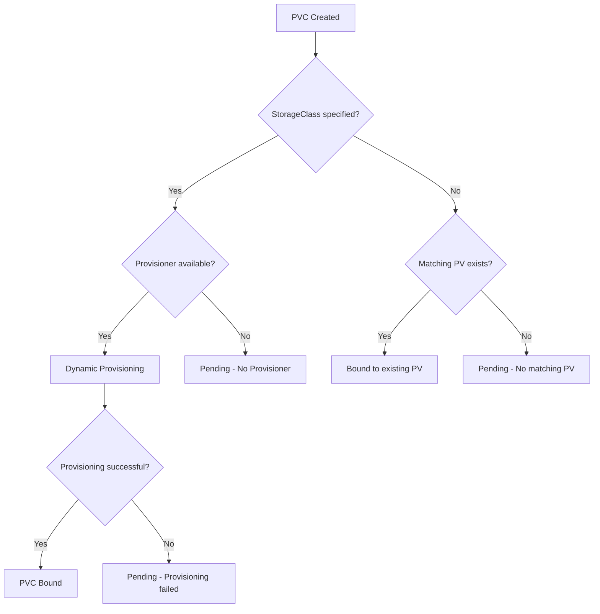

# How to Fix "PersistentVolumeClaim is not bound" Errors in Kubernetes

Author: [nawazdhandala](https://www.github.com/nawazdhandala)

Tags: Kubernetes, Storage, PersistentVolume, PVC, Troubleshooting

Description: Learn how to diagnose and fix PersistentVolumeClaim binding failures in Kubernetes. This guide covers storage classes, volume provisioning, and common configuration mistakes.

---

When you create a PersistentVolumeClaim (PVC) in Kubernetes and it stays in the `Pending` state, your pods cannot start. The error "PersistentVolumeClaim is not bound" blocks deployments until you fix the underlying storage issue. This guide walks through the causes and solutions.

## Understanding PVC Binding

A PVC requests storage, and Kubernetes tries to match it with an available PersistentVolume (PV). If dynamic provisioning is configured, Kubernetes creates a new PV automatically. The binding fails when no suitable PV exists and no provisioner can create one.



## Step 1: Check PVC Status

Start by examining the PVC state and its events:

```bash
# List PVCs and their status
kubectl get pvc -n your-namespace

# Example output showing unbound PVC
# NAME          STATUS    VOLUME   CAPACITY   ACCESS MODES   STORAGECLASS   AGE
# data-claim    Pending                                      standard       5m

# Get detailed information including events
kubectl describe pvc data-claim -n your-namespace
```

The Events section at the bottom of `describe` output reveals why binding failed. Common messages include:
- "no persistent volumes available for this claim"
- "storageclass.storage.k8s.io not found"
- "waiting for first consumer to be created"

## Step 2: Verify StorageClass Exists

Most PVC issues stem from StorageClass problems. Check if the requested StorageClass exists:

```bash
# List all storage classes
kubectl get storageclass

# Example output
# NAME                 PROVISIONER             RECLAIMPOLICY   VOLUMEBINDINGMODE      AGE
# standard (default)   rancher.io/local-path   Delete          WaitForFirstConsumer   30d
# fast-ssd             kubernetes.io/gce-pd    Delete          Immediate              30d
```

If your PVC references a non-existent StorageClass, create one or update the PVC:

```yaml
# Example PVC with explicit StorageClass
apiVersion: v1
kind: PersistentVolumeClaim
metadata:
  name: data-claim
  namespace: your-namespace
spec:
  accessModes:
    - ReadWriteOnce
  storageClassName: standard  # Must match an existing StorageClass
  resources:
    requests:
      storage: 10Gi
```

## Step 3: Check Volume Binding Mode

Some StorageClasses use `WaitForFirstConsumer` binding mode. The PVC stays Pending until a pod actually tries to use it:

```bash
# Check the binding mode of your StorageClass
kubectl get storageclass standard -o jsonpath='{.volumeBindingMode}'
# Output: WaitForFirstConsumer
```

This is normal behavior, not an error. The PVC binds when you create a pod that references it:

```yaml
# Pod that uses the PVC - this triggers binding
apiVersion: v1
kind: Pod
metadata:
  name: data-pod
spec:
  containers:
  - name: app
    image: nginx:1.25
    volumeMounts:
    - name: data
      mountPath: /data
  volumes:
  - name: data
    persistentVolumeClaim:
      claimName: data-claim
```

## Step 4: Verify Provisioner is Running

Dynamic provisioning requires a working provisioner. Check if it is running:

```bash
# Common provisioner namespaces and names
kubectl get pods -n kube-system | grep -E "provisioner|csi"

# For cloud providers, check the CSI driver pods
kubectl get pods -n kube-system -l app=ebs-csi-controller  # AWS
kubectl get pods -n kube-system -l k8s-app=gce-pd-csi-driver  # GCP
```

If the provisioner is not running or crashing, fix it first. On managed Kubernetes (EKS, GKE, AKS), ensure the CSI driver addon is enabled.

## Step 5: Match Access Modes and Capacity

PVCs bind to PVs when access modes and capacity match. For static provisioning (pre-created PVs), verify compatibility:

```bash
# List available PVs
kubectl get pv

# Check if any PV matches your PVC requirements
kubectl get pv -o custom-columns=NAME:.metadata.name,CAPACITY:.spec.capacity.storage,ACCESS:.spec.accessModes,STATUS:.status.phase
```

Common access modes:
- `ReadWriteOnce (RWO)` - Single node read/write
- `ReadOnlyMany (ROX)` - Multiple nodes read-only
- `ReadWriteMany (RWX)` - Multiple nodes read/write

A PVC requesting RWX will not bind to a PV that only supports RWO.

## Step 6: Check Node Affinity Constraints

Some PVs are tied to specific nodes (like local volumes). If your pod is scheduled on a different node, binding fails:

```bash
# Check PV node affinity
kubectl get pv your-pv -o yaml | grep -A 10 nodeAffinity
```

Solutions:
1. Schedule the pod on the correct node using nodeSelector
2. Use a StorageClass that provisions volumes accessible from any node

## Common Fixes

### Fix 1: Create a Default StorageClass

If no default StorageClass exists, PVCs without an explicit class stay Pending:

```yaml
# Make an existing StorageClass the default
apiVersion: storage.k8s.io/v1
kind: StorageClass
metadata:
  name: standard
  annotations:
    storageclass.kubernetes.io/is-default-class: "true"  # Add this annotation
provisioner: kubernetes.io/gce-pd
parameters:
  type: pd-standard
```

Or patch an existing class:

```bash
# Set a StorageClass as default
kubectl patch storageclass standard -p '{"metadata": {"annotations":{"storageclass.kubernetes.io/is-default-class":"true"}}}'
```

### Fix 2: Manually Create a PersistentVolume

For testing or when dynamic provisioning is unavailable:

```yaml
# Create a PV that matches your PVC
apiVersion: v1
kind: PersistentVolume
metadata:
  name: manual-pv
spec:
  capacity:
    storage: 10Gi  # Must be >= PVC request
  accessModes:
    - ReadWriteOnce  # Must match PVC
  persistentVolumeReclaimPolicy: Retain
  storageClassName: standard  # Must match PVC or be empty
  hostPath:
    path: /mnt/data  # Local path on node (not for production)
```

### Fix 3: Use Local Path Provisioner for Development

For local clusters (minikube, kind, k3s), install a local provisioner:

```bash
# Install local-path-provisioner on k3s/Rancher
kubectl apply -f https://raw.githubusercontent.com/rancher/local-path-provisioner/master/deploy/local-path-storage.yaml

# Verify it is running
kubectl get pods -n local-path-storage
```

### Fix 4: Resize Existing PVC

If your PVC is bound but needs more space, expand it (if supported):

```bash
# Check if StorageClass allows expansion
kubectl get storageclass standard -o jsonpath='{.allowVolumeExpansion}'
# Output: true

# Edit the PVC to request more storage
kubectl edit pvc data-claim -n your-namespace
# Change spec.resources.requests.storage to a larger value
```

## Diagnostic Script

Use this script to quickly diagnose PVC issues:

```bash
#!/bin/bash
# pvc-debug.sh - Diagnose PVC binding issues

PVC=$1
NAMESPACE=${2:-default}

echo "=== PVC Status ==="
kubectl get pvc $PVC -n $NAMESPACE

echo -e "\n=== PVC Events ==="
kubectl describe pvc $PVC -n $NAMESPACE | grep -A 20 "Events:"

echo -e "\n=== StorageClass ==="
SC=$(kubectl get pvc $PVC -n $NAMESPACE -o jsonpath='{.spec.storageClassName}')
if [ -n "$SC" ]; then
    kubectl get storageclass $SC -o yaml
else
    echo "No StorageClass specified, checking default..."
    kubectl get storageclass -o jsonpath='{range .items[*]}{.metadata.name}{"\t"}{.metadata.annotations.storageclass\.kubernetes\.io/is-default-class}{"\n"}{end}'
fi

echo -e "\n=== Available PVs ==="
kubectl get pv
```

## Summary

PVC binding failures typically result from missing StorageClasses, unavailable provisioners, or mismatched requirements between PVCs and PVs. The fix depends on your environment: cloud clusters need working CSI drivers, local clusters need a local provisioner, and manual provisioning requires PVs that match PVC specifications. Check events first to identify the specific cause, then apply the appropriate solution from this guide.
