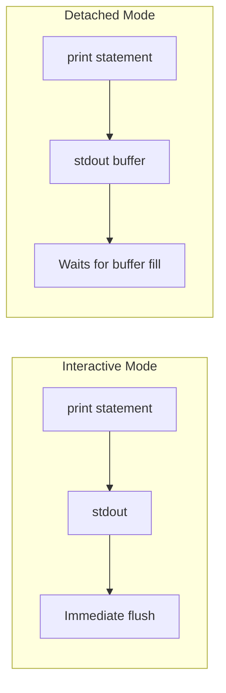

# How to Fix Python App No Output in Docker Detached Mode

Author: [nawazdhandala](https://www.github.com/nawazdhandala)

Tags: Docker, Python, Troubleshooting, Logging, DevOps

Description: Solve the common problem of Python applications showing no output in Docker logs when running in detached mode, caused by output buffering.

---

You run your Python application in Docker with `docker run -d`, then check the logs with `docker logs`, and see nothing. The container is running, the app is working, but all your print statements and log messages have vanished. This is one of the most common Python Docker issues, and the fix is simple once you understand what is happening.

## The Problem: Python Output Buffering

Python buffers stdout by default when it detects that output is not going to a terminal. In interactive mode (when you run `docker run -it`), Python sees a TTY and flushes output immediately. In detached mode (`docker run -d`), there is no TTY, so Python holds output in a buffer until it fills up or the process exits.



Your logs are there, just stuck in the buffer.

## Solution 1: PYTHONUNBUFFERED Environment Variable

The easiest fix is to disable Python's output buffering entirely:

```dockerfile
# Dockerfile
FROM python:3.11-slim

# Disable Python output buffering
ENV PYTHONUNBUFFERED=1

WORKDIR /app
COPY . .
RUN pip install -r requirements.txt

CMD ["python", "app.py"]
```

Or set it when running the container:

```bash
# Pass the environment variable at runtime
docker run -d -e PYTHONUNBUFFERED=1 my-python-app
```

In Docker Compose:

```yaml
# docker-compose.yml
version: '3.8'

services:
  app:
    build: .
    environment:
      PYTHONUNBUFFERED: "1"
```

With `PYTHONUNBUFFERED=1`, Python writes output directly without buffering. Any non-empty value works; the variable just needs to be set.

## Solution 2: Python -u Flag

The `-u` flag forces Python to run in unbuffered mode:

```dockerfile
# Dockerfile
FROM python:3.11-slim

WORKDIR /app
COPY . .
RUN pip install -r requirements.txt

# Use -u flag for unbuffered output
CMD ["python", "-u", "app.py"]
```

This is equivalent to setting `PYTHONUNBUFFERED=1` but specified at the Python interpreter level.

## Solution 3: Explicit Flushing

If you cannot modify the Dockerfile or environment, flush output explicitly in your code:

```python
# app.py
import sys

print("Starting application...")
sys.stdout.flush()  # Force immediate output

# Or use the flush parameter (Python 3.3+)
print("Processing data...", flush=True)
```

For existing code with many print statements, you can redirect stdout to an unbuffered stream:

```python
# At the start of your application
import sys
import io

# Replace stdout with an unbuffered version
sys.stdout = io.TextIOWrapper(
    sys.stdout.buffer,
    encoding='utf-8',
    line_buffering=True  # Flush on newline
)

# Now all print() calls flush automatically
print("This appears immediately")
```

## Solution 4: Logging Module

The logging module handles buffering more intelligently and is better suited for production applications:

```python
# app.py
import logging
import sys

# Configure logging to write to stdout
logging.basicConfig(
    level=logging.INFO,
    format='%(asctime)s - %(name)s - %(levelname)s - %(message)s',
    handlers=[
        logging.StreamHandler(sys.stdout)
    ]
)

logger = logging.getLogger(__name__)

def main():
    logger.info("Application starting")
    logger.info("Processing data...")
    logger.warning("Something might be wrong")
    logger.error("An error occurred")

if __name__ == '__main__':
    main()
```

The logging StreamHandler flushes after each log message by default, avoiding the buffering issue.

### Configuring Log Levels via Environment

```python
# app.py
import logging
import os
import sys

# Get log level from environment, default to INFO
log_level = os.getenv('LOG_LEVEL', 'INFO').upper()

logging.basicConfig(
    level=getattr(logging, log_level),
    format='%(asctime)s - %(levelname)s - %(message)s',
    handlers=[logging.StreamHandler(sys.stdout)]
)

logger = logging.getLogger(__name__)
```

```yaml
# docker-compose.yml
version: '3.8'

services:
  app:
    build: .
    environment:
      LOG_LEVEL: DEBUG  # Set to DEBUG for more verbose output
```

## Solution 5: Using stdbuf

For applications you cannot modify, use `stdbuf` to control buffering at the OS level:

```dockerfile
# Dockerfile
FROM python:3.11-slim

RUN apt-get update && apt-get install -y coreutils && rm -rf /var/lib/apt/lists/*

WORKDIR /app
COPY . .
RUN pip install -r requirements.txt

# stdbuf -oL means line-buffered stdout
CMD ["stdbuf", "-oL", "python", "app.py"]
```

The `-oL` flag sets stdout to line-buffered mode, flushing on every newline.

## Best Practices for Docker Python Logging

### Complete Dockerfile Template

```dockerfile
# Dockerfile
FROM python:3.11-slim

# Prevent Python from writing bytecode files
ENV PYTHONDONTWRITEBYTECODE=1

# Disable output buffering for real-time logs
ENV PYTHONUNBUFFERED=1

# Set default log level (can be overridden at runtime)
ENV LOG_LEVEL=INFO

WORKDIR /app

# Install dependencies first for better caching
COPY requirements.txt .
RUN pip install --no-cache-dir -r requirements.txt

# Copy application code
COPY . .

# Create non-root user for security
RUN useradd --create-home appuser
USER appuser

CMD ["python", "app.py"]
```

### Production Logging Setup

```python
# logging_config.py
import logging
import sys
import os
from datetime import datetime

def setup_logging():
    """Configure logging for Docker environments."""

    # JSON-like format for log aggregation systems
    log_format = (
        '{"time": "%(asctime)s", '
        '"level": "%(levelname)s", '
        '"logger": "%(name)s", '
        '"message": "%(message)s"}'
    )

    # Plain format for development
    dev_format = '%(asctime)s - %(name)s - %(levelname)s - %(message)s'

    # Use JSON format in production
    use_json = os.getenv('LOG_FORMAT', 'plain') == 'json'
    chosen_format = log_format if use_json else dev_format

    logging.basicConfig(
        level=os.getenv('LOG_LEVEL', 'INFO'),
        format=chosen_format,
        handlers=[
            logging.StreamHandler(sys.stdout)
        ]
    )

    # Reduce noise from third-party libraries
    logging.getLogger('urllib3').setLevel(logging.WARNING)
    logging.getLogger('requests').setLevel(logging.WARNING)

    return logging.getLogger(__name__)
```

```python
# app.py
from logging_config import setup_logging

logger = setup_logging()

def main():
    logger.info("Application started")

    try:
        # Your application logic
        process_data()
    except Exception as e:
        logger.exception("Unhandled exception occurred")
        raise

def process_data():
    logger.debug("Processing started")
    # ... processing logic
    logger.info("Processing complete")

if __name__ == '__main__':
    main()
```

## Debugging Output Issues

### Verify Buffering is the Problem

```bash
# Run interactively - if you see output, buffering is the issue
docker run -it my-python-app

# Check if the container is actually running
docker ps

# Check container logs with timestamps
docker logs -t my-python-app
```

### Test the Fix

```bash
# Build with PYTHONUNBUFFERED
docker build -t my-python-app .

# Run detached
docker run -d --name test-app my-python-app

# Follow logs in real-time
docker logs -f test-app
```

### Check for Other Issues

If output still does not appear:

```bash
# Check if the application is crashing
docker logs test-app 2>&1

# Check the exit code
docker inspect test-app --format='{{.State.ExitCode}}'

# Run with shell to debug
docker run -it my-python-app /bin/bash
python -c "print('test')"
```

## Common Pitfalls

### Print vs Logging in Threads

```python
# Bad: print() in threads may still buffer oddly
import threading

def worker():
    print("Thread started")  # Might not appear

# Good: Use logging in threads
import logging

logger = logging.getLogger(__name__)

def worker():
    logger.info("Thread started")  # Properly handled
```

### Subprocess Output

If your Python app spawns subprocesses, their output needs separate handling:

```python
import subprocess

# Capture and log subprocess output
result = subprocess.run(
    ['some-command'],
    capture_output=True,
    text=True
)

# Log the output
logger.info(f"Command stdout: {result.stdout}")
if result.stderr:
    logger.warning(f"Command stderr: {result.stderr}")
```

### Framework-Specific Logging

Different frameworks have their own logging configurations:

```python
# Flask
import logging
from flask import Flask

app = Flask(__name__)

# Configure Flask to use stdout
if __name__ != '__main__':
    gunicorn_logger = logging.getLogger('gunicorn.error')
    app.logger.handlers = gunicorn_logger.handlers
    app.logger.setLevel(gunicorn_logger.level)
```

```python
# Django - settings.py
LOGGING = {
    'version': 1,
    'disable_existing_loggers': False,
    'handlers': {
        'console': {
            'class': 'logging.StreamHandler',
            'stream': 'ext://sys.stdout',
        },
    },
    'root': {
        'handlers': ['console'],
        'level': 'INFO',
    },
}
```

## Summary

Python buffers stdout when running in Docker's detached mode because there is no TTY. The simplest fix is setting `PYTHONUNBUFFERED=1` in your Dockerfile or docker-compose.yml. For production applications, switch from print statements to the logging module, which handles buffering correctly and provides better control over log levels and formatting. Always verify your fix by running the container detached and checking `docker logs -f` to confirm output appears in real-time.
