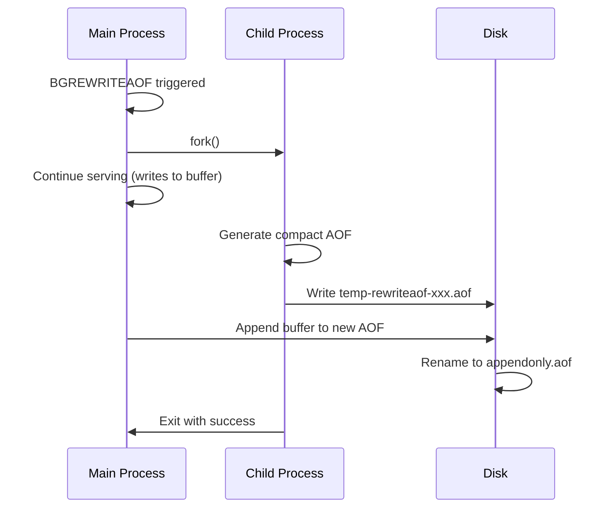

# How to Fix "Redis AOF rewrite failed" Errors

Author: [nawazdhandala](https://www.github.com/nawazdhandala)

Tags: Redis, AOF, Persistence, Troubleshooting, DevOps

Description: Learn how to diagnose and fix Redis AOF rewrite failures, understand the rewrite process, resolve memory and disk issues, and configure AOF persistence correctly.

---

AOF (Append Only File) rewrite is how Redis compacts its persistence log. When this fails, your AOF file grows unbounded, potentially filling your disk and causing startup delays. The error "Background AOF rewrite terminated with error" or "BGREWRITEAOF failed" needs immediate attention.

## Understanding AOF Rewrite

The AOF file logs every write command. Over time, it contains redundant operations (setting the same key multiple times). Rewrite creates a compact version with just the current state:



## Diagnosing AOF Failures

### Check AOF Status

```bash
# Get AOF information
redis-cli INFO persistence

# Key fields:
# aof_enabled:1
# aof_rewrite_in_progress:0
# aof_last_rewrite_time_sec:5
# aof_last_bgrewrite_status:ok          # or 'err'
# aof_current_size:1073741824           # Current AOF size
# aof_base_size:536870912               # Size after last rewrite
# aof_buffer_length:0
# aof_pending_bio_fsync:0
```

### Check Logs for Errors

```bash
grep -i "aof\|rewrite\|bgrewrite" /var/log/redis/redis-server.log

# Common error messages:
# "Can't rewrite append only file in background: fork: Cannot allocate memory"
# "Background AOF rewrite terminated with error"
# "Error opening/writing to AOF file: No space left on device"
# "AOF fsync is taking too long"
```

### Manual Rewrite Test

```bash
# Trigger manual rewrite
redis-cli BGREWRITEAOF

# Watch progress
redis-cli INFO persistence | grep aof_rewrite
```

## Common Causes and Solutions

### 1. Fork Memory Failure

Like RDB, AOF rewrite forks the process:

```bash
# Enable memory overcommit
echo 1 > /proc/sys/vm/overcommit_memory

# Make permanent
echo "vm.overcommit_memory = 1" >> /etc/sysctl.conf
sysctl -p

# Disable Transparent Huge Pages
echo never > /sys/kernel/mm/transparent_hugepage/enabled
```

Reduce memory usage:

```bash
# Set maxmemory to leave headroom
redis-cli CONFIG SET maxmemory 6gb  # For 8gb total memory

# Enable memory-efficient encodings
redis-cli CONFIG SET hash-max-listpack-entries 512
redis-cli CONFIG SET hash-max-listpack-value 64
```

### 2. Disk Space Exhausted

```bash
# Check disk space
df -h $(redis-cli CONFIG GET dir | tail -1)

# Check AOF file sizes
ls -lh /var/lib/redis/appendonly.aof*

# Solutions:
# 1. Free disk space
# 2. Move to larger disk
# 3. Delete old backup files
```

Move data directory:

```bash
# Stop Redis
systemctl stop redis

# Move data
mv /var/lib/redis /mnt/larger-disk/redis

# Update config
sed -i 's|dir /var/lib/redis|dir /mnt/larger-disk/redis|' /etc/redis/redis.conf

# Start Redis
systemctl start redis
```

### 3. I/O Bottleneck

Slow disk can cause rewrite to fail or timeout:

```bash
# Monitor disk I/O during rewrite
iostat -x 1 20

# If I/O is saturated, consider:
# 1. Use SSD instead of HDD
# 2. Reduce fsync frequency
redis-cli CONFIG SET appendfsync everysec

# 3. Adjust rewrite thresholds
redis-cli CONFIG SET auto-aof-rewrite-percentage 200
redis-cli CONFIG SET auto-aof-rewrite-min-size 256mb
```

### 4. Permission Issues

```bash
# Check permissions
ls -la /var/lib/redis/

# Redis needs to:
# - Read existing AOF file
# - Create temp files
# - Rename files

# Fix permissions
chown -R redis:redis /var/lib/redis/
chmod 750 /var/lib/redis/
```

### 5. Rewrite During High Load

Heavy write load during rewrite can cause buffer overflow:

```python
import redis
import time

def safe_rewrite(redis_client, max_wait=300):
    """Trigger AOF rewrite during low activity."""
    # Check current load
    info = redis_client.info('stats')
    ops_per_sec = info.get('instantaneous_ops_per_sec', 0)

    if ops_per_sec > 10000:
        print(f"High load ({ops_per_sec} ops/s), skipping rewrite")
        return False

    # Trigger rewrite
    redis_client.bgrewriteaof()

    # Wait for completion
    start = time.time()
    while time.time() - start < max_wait:
        info = redis_client.info('persistence')
        if not info.get('aof_rewrite_in_progress', 0):
            status = info.get('aof_last_bgrewrite_status', 'err')
            return status == 'ok'
        time.sleep(5)

    return False

r = redis.Redis()
if safe_rewrite(r):
    print("AOF rewrite completed successfully")
else:
    print("AOF rewrite failed or skipped")
```

## Configuring AOF Correctly

### Basic Configuration

```bash
# In redis.conf
appendonly yes
appendfilename "appendonly.aof"

# Fsync policy:
# always - fsync after every write (safest, slowest)
# everysec - fsync every second (balanced)
# no - let OS handle fsync (fastest, least safe)
appendfsync everysec

# Prevent fsync during rewrite (reduces I/O contention)
no-appendfsync-on-rewrite yes

# Auto rewrite thresholds
auto-aof-rewrite-percentage 100  # Rewrite when AOF is 100% larger than base
auto-aof-rewrite-min-size 64mb   # Minimum size before considering rewrite

# Use RDB preamble for faster loading
aof-use-rdb-preamble yes
```

### Tuning for Large Datasets

```bash
# For large datasets, be more conservative with rewrite
auto-aof-rewrite-percentage 200    # Rewrite less frequently
auto-aof-rewrite-min-size 1gb      # Only rewrite large files

# Allow more time for rewrite buffer
# (Redis 7.0+)
aof-rewrite-incremental-fsync yes
```

## Monitoring and Alerting

### Monitor AOF Health

```python
def check_aof_health(redis_client):
    """Check AOF persistence health."""
    info = redis_client.info('persistence')

    issues = []

    # Check if AOF is enabled
    if not info.get('aof_enabled', 0):
        issues.append("AOF is disabled")
        return issues

    # Check last rewrite status
    status = info.get('aof_last_bgrewrite_status', 'ok')
    if status != 'ok':
        issues.append(f"Last AOF rewrite failed: {status}")

    # Check AOF growth
    current_size = info.get('aof_current_size', 0)
    base_size = info.get('aof_base_size', 1)  # Avoid division by zero

    growth_ratio = current_size / base_size
    if growth_ratio > 3:
        issues.append(f"AOF has grown {growth_ratio:.1f}x since last rewrite")

    # Check buffer
    buffer_length = info.get('aof_buffer_length', 0)
    if buffer_length > 10 * 1024 * 1024:  # 10MB
        issues.append(f"Large AOF buffer: {buffer_length / 1024 / 1024:.1f}MB")

    # Check pending fsync
    pending_fsync = info.get('aof_pending_bio_fsync', 0)
    if pending_fsync > 0:
        issues.append(f"Pending AOF fsync operations: {pending_fsync}")

    return issues

# Usage
r = redis.Redis()
issues = check_aof_health(r)
if issues:
    for issue in issues:
        print(f"WARNING: {issue}")
else:
    print("AOF health: OK")
```

### Health Check Script

```bash
#!/bin/bash
# aof-health-check.sh

# Check AOF status
aof_status=$(redis-cli INFO persistence | grep aof_last_bgrewrite_status | cut -d: -f2 | tr -d '\r')

if [ "$aof_status" != "ok" ]; then
    echo "CRITICAL: AOF rewrite status is $aof_status"
    exit 2
fi

# Check AOF growth ratio
current=$(redis-cli INFO persistence | grep aof_current_size | cut -d: -f2 | tr -d '\r')
base=$(redis-cli INFO persistence | grep aof_base_size | cut -d: -f2 | tr -d '\r')

if [ "$base" -gt 0 ]; then
    ratio=$((current / base))
    if [ "$ratio" -gt 5 ]; then
        echo "WARNING: AOF growth ratio is ${ratio}x"
        exit 1
    fi
fi

echo "OK: AOF persistence healthy"
exit 0
```

## Recovery from Failed Rewrite

### If AOF is Corrupted

```bash
# Check AOF file integrity
redis-check-aof /var/lib/redis/appendonly.aof

# Fix truncated AOF (removes incomplete command at end)
redis-check-aof --fix /var/lib/redis/appendonly.aof

# If unfixable, you may need to use RDB backup
```

### Manual Compaction

If automatic rewrite keeps failing:

```python
def manual_compact(redis_client, batch_size=10000):
    """Manually compact by reading all data and rewriting."""
    # This is a last resort - creates downtime

    # 1. Disable automatic rewrites temporarily
    redis_client.config_set('auto-aof-rewrite-percentage', 0)

    # 2. Collect all data
    data = {}
    cursor = 0
    while True:
        cursor, keys = redis_client.scan(cursor, count=batch_size)
        for key in keys:
            key_type = redis_client.type(key)
            ttl = redis_client.ttl(key)

            if key_type == b'string':
                data[key] = ('string', redis_client.get(key), ttl)
            elif key_type == b'hash':
                data[key] = ('hash', redis_client.hgetall(key), ttl)
            # Add other types as needed

        if cursor == 0:
            break

    # 3. Flush and restore
    # WARNING: This causes data loss if interrupted
    # redis_client.flushall()
    # for key, (dtype, value, ttl) in data.items():
    #     if dtype == 'string':
    #         redis_client.set(key, value)
    #     elif dtype == 'hash':
    #         redis_client.hset(key, mapping=value)
    #     if ttl > 0:
    #         redis_client.expire(key, ttl)

    # 4. Re-enable automatic rewrites
    redis_client.config_set('auto-aof-rewrite-percentage', 100)
```

## Using Both AOF and RDB

Best practice is to use both persistence methods:

```bash
# In redis.conf
appendonly yes
appendfsync everysec
aof-use-rdb-preamble yes  # AOF starts with RDB snapshot

# RDB for backups
save 900 1
save 300 10
save 60 10000
```

Benefits:
- RDB for fast restart (loaded first in AOF with preamble)
- AOF for durability (captures commands since last RDB)
- RDB for backups (easy to copy and restore)

---

AOF rewrite failures threaten your data durability and can fill your disk. Most failures stem from memory issues during fork or disk space problems. Enable memory overcommit, monitor disk usage, and tune your rewrite thresholds for your workload. With proper configuration and monitoring, AOF provides excellent durability with manageable overhead.
