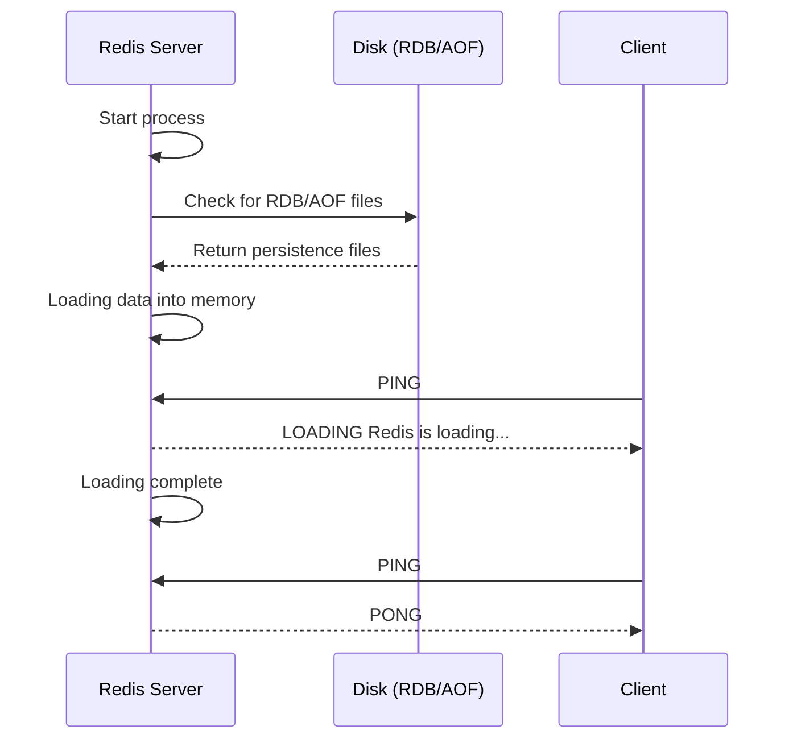

# How to Fix "Redis is loading the dataset" Errors

Author: [nawazdhandala](https://www.github.com/nawazdhandala)

Tags: Redis, Troubleshooting, Persistence, RDB, AOF

Description: Learn how to handle "LOADING Redis is loading the dataset in memory" errors, understand Redis startup behavior, and implement strategies to minimize application impact during Redis restarts.

---

When Redis starts up, it needs to load its persisted data back into memory. During this loading phase, the server is alive but cannot serve requests. Your applications see the dreaded "LOADING Redis is loading the dataset in memory" error, and suddenly nothing works.

## Understanding the Loading Phase

When Redis starts, it goes through these phases:



The loading time depends on:
- Dataset size
- Disk I/O speed
- Persistence method (RDB vs AOF)
- Server memory and CPU

## Diagnosing Loading Times

### Check Loading Progress

```bash
# Connect and check INFO during loading
redis-cli INFO persistence

# Look for these fields:
# loading:1                      # 1 means still loading
# loading_start_time:1706185200  # When loading started
# loading_total_bytes:5368709120 # Total bytes to load
# loading_loaded_bytes:1073741824 # Bytes loaded so far
# loading_loaded_perc:20.00      # Percentage complete
# loading_eta_seconds:45         # Estimated time remaining
```

### Monitor Progress Script

```python
import redis
import time

def monitor_loading():
    """Monitor Redis loading progress."""
    r = redis.Redis(socket_timeout=5)

    while True:
        try:
            info = r.info('persistence')

            if info.get('loading', 0) == 0:
                print("Loading complete!")
                break

            loaded_pct = info.get('loading_loaded_perc', 0)
            eta = info.get('loading_eta_seconds', 'unknown')
            loaded_bytes = info.get('loading_loaded_bytes', 0)
            total_bytes = info.get('loading_total_bytes', 0)

            print(f"Loading: {loaded_pct:.1f}% "
                  f"({loaded_bytes / 1024 / 1024:.0f}MB / "
                  f"{total_bytes / 1024 / 1024:.0f}MB) "
                  f"ETA: {eta}s")

        except redis.exceptions.BusyLoadingError:
            print("Still loading, waiting...")
        except redis.exceptions.ConnectionError:
            print("Cannot connect, Redis may still be starting...")

        time.sleep(2)

monitor_loading()
```

## Immediate Solutions

### 1. Client-Side Retry Logic

Handle the loading error gracefully in your application:

```python
import redis
from redis.exceptions import BusyLoadingError
import time

def redis_with_loading_retry(func, max_retries=30, retry_delay=1):
    """Wrap Redis calls with loading retry logic."""
    for attempt in range(max_retries):
        try:
            return func()
        except BusyLoadingError:
            if attempt < max_retries - 1:
                print(f"Redis loading, retry {attempt + 1}/{max_retries}")
                time.sleep(retry_delay)
            else:
                raise

# Usage
r = redis.Redis()

result = redis_with_loading_retry(lambda: r.get('mykey'))
```

### 2. Connection Pool with Health Checks

```python
import redis

# Configure pool to handle loading state
pool = redis.ConnectionPool(
    host='redis-host',
    port=6379,
    max_connections=10,
    health_check_interval=30,
    retry_on_timeout=True
)

r = redis.Redis(connection_pool=pool)
```

### 3. Wait for Ready Before Routing Traffic

In Kubernetes or similar environments, configure readiness probes:

```yaml
apiVersion: v1
kind: Pod
spec:
  containers:
  - name: redis
    image: redis:7
    readinessProbe:
      exec:
        command:
        - redis-cli
        - ping
      initialDelaySeconds: 5
      periodSeconds: 5
      timeoutSeconds: 3
      failureThreshold: 3
```

Custom readiness check script:

```bash
#!/bin/bash
# redis-ready.sh

# Check if Redis is ready (not loading)
result=$(redis-cli PING 2>&1)

if [ "$result" = "PONG" ]; then
    exit 0
else
    exit 1
fi
```

## Reducing Loading Times

### 1. Choose the Right Persistence Method

RDB is faster to load than AOF:

```bash
# Check current persistence config
redis-cli CONFIG GET save
redis-cli CONFIG GET appendonly

# RDB-only (faster loading)
save 900 1
save 300 10
save 60 10000
appendonly no

# AOF-only (potentially slower loading)
save ""
appendonly yes
appendfsync everysec

# Both (RDB used for loading, AOF for durability)
save 900 1
appendonly yes
aof-use-rdb-preamble yes
```

### 2. Use RDB Preamble for AOF

Redis 4.0+ can use an RDB preamble in AOF files, combining fast loading with AOF durability:

```bash
# In redis.conf
aof-use-rdb-preamble yes
```

This writes the initial data as RDB (fast to load) and appends new commands as AOF.

### 3. Optimize Disk I/O

Loading is disk-bound. Faster storage means faster loading:

```bash
# Move RDB/AOF to faster storage (SSD or NVMe)
# In redis.conf
dir /fast-ssd/redis-data

# Check current disk I/O
iostat -x 1
```

### 4. Reduce Dataset Size

Less data means faster loading:

```bash
# Check memory usage
redis-cli INFO memory

# Identify large keys
redis-cli --bigkeys

# Set appropriate maxmemory and eviction policy
CONFIG SET maxmemory 4gb
CONFIG SET maxmemory-policy allkeys-lru
```

## High Availability Solutions

### 1. Redis Sentinel for Automatic Failover

With Sentinel, a replica can serve requests while the primary is loading:

```bash
# sentinel.conf
sentinel monitor mymaster 127.0.0.1 6379 2
sentinel down-after-milliseconds mymaster 5000
sentinel failover-timeout mymaster 60000
sentinel parallel-syncs mymaster 1
```

### 2. Redis Cluster

In a cluster, other shards remain available while one loads:

```python
from redis.cluster import RedisCluster

# Cluster handles partial availability
rc = RedisCluster(
    host='redis-node-1',
    port=6379,
    skip_full_coverage_check=True  # Allow partial cluster availability
)
```

### 3. Rolling Restarts

Restart nodes one at a time to maintain availability:

```bash
#!/bin/bash
# rolling-restart.sh

NODES=("redis-1" "redis-2" "redis-3")

for node in "${NODES[@]}"; do
    echo "Restarting $node..."

    # Trigger failover if this is primary
    redis-cli -h $node CLUSTER FAILOVER TAKEOVER

    # Wait for failover
    sleep 10

    # Restart the node
    ssh $node "systemctl restart redis"

    # Wait for it to load and sync
    while true; do
        result=$(redis-cli -h $node PING 2>&1)
        if [ "$result" = "PONG" ]; then
            echo "$node is ready"
            break
        fi
        sleep 5
    done

    # Allow time for cluster to stabilize
    sleep 30
done
```

## Application Architecture Patterns

### 1. Graceful Degradation

Design your application to function (with reduced features) when Redis is unavailable:

```python
class CacheWithFallback:
    """Cache that falls back gracefully during Redis loading."""

    def __init__(self, redis_client, fallback_ttl=60):
        self.r = redis_client
        self.local_cache = {}
        self.fallback_ttl = fallback_ttl

    def get(self, key: str):
        try:
            value = self.r.get(key)
            if value:
                # Update local cache
                self.local_cache[key] = {
                    'value': value,
                    'expires': time.time() + self.fallback_ttl
                }
            return value
        except BusyLoadingError:
            # Fall back to local cache
            cached = self.local_cache.get(key)
            if cached and cached['expires'] > time.time():
                return cached['value']
            return None

    def set(self, key: str, value: str, ex: int = None):
        try:
            self.r.set(key, value, ex=ex)
            self.local_cache[key] = {
                'value': value,
                'expires': time.time() + (ex or self.fallback_ttl)
            }
        except BusyLoadingError:
            # Queue for later or just cache locally
            self.local_cache[key] = {
                'value': value,
                'expires': time.time() + (ex or self.fallback_ttl)
            }
```

### 2. Read Replicas

Direct reads to replicas while primary is loading:

```python
class RedisWithReplicas:
    """Redis client with read replica support."""

    def __init__(self, primary_host, replica_hosts):
        self.primary = redis.Redis(host=primary_host)
        self.replicas = [redis.Redis(host=h) for h in replica_hosts]
        self.current_replica = 0

    def get(self, key: str):
        """Read from replica, with fallback to primary."""
        for _ in range(len(self.replicas) + 1):
            try:
                if self.replicas:
                    replica = self.replicas[self.current_replica]
                    self.current_replica = (self.current_replica + 1) % len(self.replicas)
                    return replica.get(key)
                else:
                    return self.primary.get(key)
            except (BusyLoadingError, ConnectionError):
                continue
        raise Exception("All Redis instances unavailable")

    def set(self, key: str, value: str, **kwargs):
        """Write to primary only."""
        return self.primary.set(key, value, **kwargs)
```

## Preventing Extended Loading Times

### Regular RDB Snapshots

More frequent snapshots mean smaller AOF replay:

```bash
# In redis.conf - snapshot more often
save 300 1    # Every 5 minutes if at least 1 change
save 60 100   # Every minute if at least 100 changes
```

### AOF Rewrites

Compact the AOF file regularly:

```bash
# Check AOF size
redis-cli INFO persistence | grep aof

# Trigger manual rewrite
redis-cli BGREWRITEAOF

# Configure automatic rewrite
auto-aof-rewrite-percentage 100
auto-aof-rewrite-min-size 64mb
```

---

The "Redis is loading" error is a natural part of Redis operation during restarts. The key is to minimize loading time through proper configuration and to design your application to handle this state gracefully. With the right combination of persistence settings, high availability architecture, and client-side resilience, you can reduce the impact of Redis restarts to a minimum.
