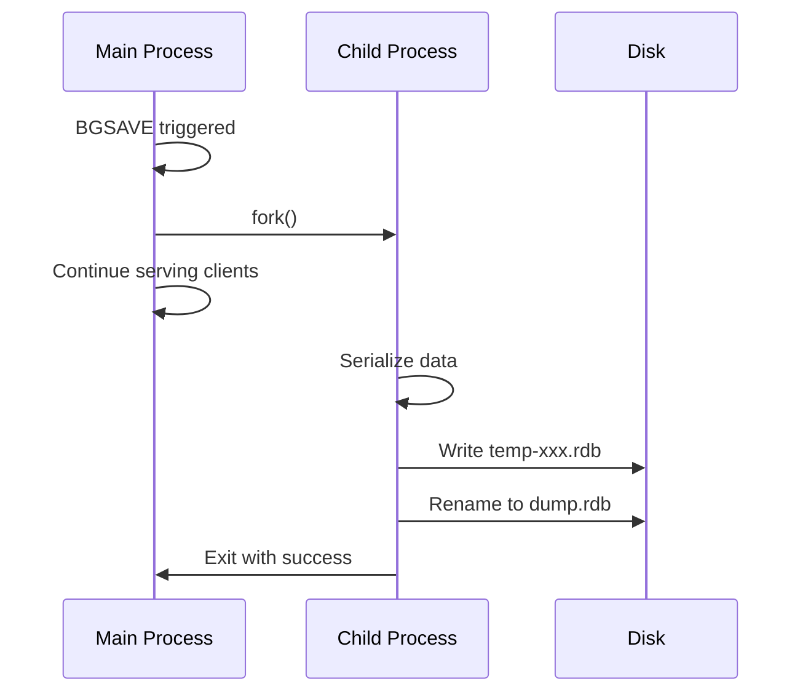

# How to Fix "Redis RDB snapshot failed" Errors

Author: [nawazdhandala](https://www.github.com/nawazdhandala)

Tags: Redis, RDB, Persistence, Troubleshooting, DevOps

Description: Learn how to diagnose and fix Redis RDB snapshot failures, understand the BGSAVE process, resolve disk and memory issues, and configure persistence correctly.

---

RDB snapshots are Redis's way of saving point-in-time copies of your data to disk. When these snapshots fail, your data is at risk. The error "Can't save in background: fork: Cannot allocate memory" or similar messages indicate your Redis persistence is broken. Let us fix it.

## Understanding RDB Snapshots

Redis uses the BGSAVE command to create RDB snapshots:

1. Redis forks the main process
2. The child process writes data to a temp file
3. When complete, the temp file replaces the old RDB file
4. The child process exits



## Diagnosing RDB Failures

### Check Last Save Status

```bash
# Get last save information
redis-cli INFO persistence

# Key fields:
# rdb_last_save_time:1706185200      # Unix timestamp of last successful save
# rdb_last_bgsave_status:ok          # or 'err' if failed
# rdb_last_bgsave_time_sec:5         # Duration of last BGSAVE
# rdb_current_bgsave_time_sec:-1     # -1 means no BGSAVE in progress
# rdb_last_cow_size:52428800         # Memory used by copy-on-write
```

### Check Redis Logs

```bash
# Look for BGSAVE errors
grep -i "bgsave\|rdb\|fork" /var/log/redis/redis-server.log

# Common error messages:
# "Can't save in background: fork: Cannot allocate memory"
# "Background saving error"
# "Write error saving DB on disk: No space left on device"
```

### Trigger Manual Save

```bash
# Try BGSAVE and watch for errors
redis-cli BGSAVE

# Check status
redis-cli LASTSAVE
```

## Common Causes and Solutions

### 1. Cannot Allocate Memory (Fork Failure)

This is the most common RDB failure. Linux's overcommit settings prevent the fork.

**Why it happens:**
When Redis forks, the OS reserves memory for the child process. Even though copy-on-write means it will not use all that memory, the reservation might fail.

**Solutions:**

Option A: Enable memory overcommit
```bash
# Temporary (until reboot)
echo 1 > /proc/sys/vm/overcommit_memory

# Permanent
echo "vm.overcommit_memory = 1" >> /etc/sysctl.conf
sysctl -p
```

Option B: Reduce Redis memory usage
```bash
# Set maxmemory to leave room for fork
redis-cli CONFIG SET maxmemory 6gb  # If you have 8gb total

# Use eviction to control memory
redis-cli CONFIG SET maxmemory-policy allkeys-lru
```

Option C: Disable Transparent Huge Pages
```bash
# THP can cause fork issues
echo never > /sys/kernel/mm/transparent_hugepage/enabled
echo never > /sys/kernel/mm/transparent_hugepage/defrag

# Make permanent in /etc/rc.local or systemd
```

### 2. No Space Left on Device

```bash
# Check disk space
df -h /var/lib/redis

# Check RDB file size
ls -lh /var/lib/redis/dump.rdb

# Solutions:
# 1. Free disk space
# 2. Move Redis data directory to larger disk
# 3. Enable RDB compression (default is yes)
redis-cli CONFIG GET rdbcompression
```

Change data directory if needed:

```bash
# In redis.conf
dir /mnt/large-disk/redis

# Or at runtime (careful - affects where Redis looks for files)
redis-cli CONFIG SET dir /mnt/large-disk/redis
redis-cli CONFIG REWRITE
```

### 3. Permission Issues

```bash
# Check file permissions
ls -la /var/lib/redis/

# Redis user must own the directory
chown -R redis:redis /var/lib/redis/

# Directory must be writable
chmod 750 /var/lib/redis/
```

### 4. I/O Errors

Disk problems can cause write failures:

```bash
# Check for disk errors
dmesg | grep -i "error\|fail"

# Check disk health
smartctl -a /dev/sda

# Monitor I/O during BGSAVE
iostat -x 1 10
```

### 5. RDB Configuration Issues

```bash
# Check RDB settings
redis-cli CONFIG GET save

# Default save rules:
# save 900 1    - Save if at least 1 key changed in 900 seconds
# save 300 10   - Save if at least 10 keys changed in 300 seconds
# save 60 10000 - Save if at least 10000 keys changed in 60 seconds

# Adjust for your needs
redis-cli CONFIG SET save "900 1 300 10 60 10000"

# Or disable automatic saves (manual only)
redis-cli CONFIG SET save ""
```

## Preventing Future Failures

### Monitor RDB Health

```python
import redis
import time

def monitor_rdb_health(redis_client):
    """Monitor RDB persistence health."""
    while True:
        info = redis_client.info('persistence')

        status = info.get('rdb_last_bgsave_status', 'unknown')
        last_save = info.get('rdb_last_save_time', 0)
        current_time = int(time.time())
        seconds_since_save = current_time - last_save

        print(f"Last BGSAVE status: {status}")
        print(f"Seconds since last save: {seconds_since_save}")

        if status != 'ok':
            print("ALERT: RDB save is failing!")
            # Send alert

        if seconds_since_save > 3600:
            print("WARNING: No successful save in over an hour")
            # Send warning

        cow_size = info.get('rdb_last_cow_size', 0)
        print(f"Last copy-on-write size: {cow_size / 1024 / 1024:.2f} MB")

        time.sleep(60)

r = redis.Redis()
monitor_rdb_health(r)
```

### Health Check Script

```bash
#!/bin/bash
# redis-rdb-health.sh

# Check last BGSAVE status
status=$(redis-cli INFO persistence | grep rdb_last_bgsave_status | cut -d: -f2 | tr -d '\r')

if [ "$status" != "ok" ]; then
    echo "CRITICAL: RDB BGSAVE status is $status"
    exit 2
fi

# Check time since last save
last_save=$(redis-cli LASTSAVE)
current_time=$(date +%s)
diff=$((current_time - last_save))

if [ $diff -gt 7200 ]; then
    echo "WARNING: No RDB save in $diff seconds"
    exit 1
fi

echo "OK: RDB persistence healthy, last save $diff seconds ago"
exit 0
```

### Pre-flight Checks Before BGSAVE

```python
def safe_bgsave(redis_client, min_free_disk_gb=10, min_free_memory_pct=30):
    """Trigger BGSAVE only if safe to do so."""
    import shutil
    import psutil

    # Check disk space
    info = redis_client.info('persistence')
    rdb_dir = redis_client.config_get('dir')['dir']

    disk = shutil.disk_usage(rdb_dir)
    free_gb = disk.free / (1024 ** 3)

    if free_gb < min_free_disk_gb:
        raise Exception(f"Insufficient disk space: {free_gb:.2f}GB free")

    # Check memory
    memory = psutil.virtual_memory()
    free_pct = memory.available / memory.total * 100

    if free_pct < min_free_memory_pct:
        raise Exception(f"Insufficient memory: {free_pct:.1f}% free")

    # Check if BGSAVE already running
    if info.get('rdb_bgsave_in_progress', 0):
        raise Exception("BGSAVE already in progress")

    # Trigger BGSAVE
    redis_client.bgsave()

    return True

# Usage
r = redis.Redis()
try:
    safe_bgsave(r)
    print("BGSAVE initiated successfully")
except Exception as e:
    print(f"Cannot start BGSAVE: {e}")
```

## Alternative: AOF Persistence

If RDB failures persist, consider using AOF (Append Only File):

```bash
# Enable AOF
redis-cli CONFIG SET appendonly yes

# Set fsync policy
redis-cli CONFIG SET appendfsync everysec

# Use RDB preamble for faster loading (best of both)
redis-cli CONFIG SET aof-use-rdb-preamble yes
```

AOF advantages:
- No fork required for regular operations
- More durable (fsync options)
- Easier recovery from corruption

AOF disadvantages:
- Larger files than RDB
- Slower restart times (without RDB preamble)
- Rewrite still requires fork

## Recovery from Failed RDB

If your RDB file is corrupted:

```bash
# Check RDB file integrity
redis-check-rdb /var/lib/redis/dump.rdb

# If corrupt, Redis will not start with it
# Options:
# 1. Start without the RDB (lose data)
mv /var/lib/redis/dump.rdb /var/lib/redis/dump.rdb.corrupt
redis-server /etc/redis/redis.conf

# 2. Restore from backup
cp /backups/redis/dump.rdb /var/lib/redis/dump.rdb
redis-server /etc/redis/redis.conf

# 3. If you have AOF, use that instead
redis-server --appendonly yes --dbfilename ""
```

---

RDB snapshot failures are serious because they put your data at risk. Most failures come from memory allocation issues during fork, which can be resolved by tuning Linux memory settings. Always monitor your persistence status and set up alerts for failures. Consider using AOF in addition to RDB for better durability, especially in environments where fork is problematic.
