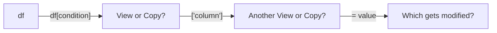

# How to Fix SettingWithCopyWarning in Pandas

Author: [nawazdhandala](https://www.github.com/nawazdhandala)

Tags: Python, Pandas, Debugging, Data Science, DataFrames

Description: Understand why SettingWithCopyWarning occurs in pandas and learn how to fix it properly using .loc, .copy(), and correct chained indexing patterns.

---

The `SettingWithCopyWarning` is one of the most common warnings pandas users encounter. It appears when you try to modify a DataFrame that might be a view of another DataFrame, leading to potentially unexpected behavior. This guide explains why it happens and how to fix it properly.

## What Triggers the Warning

The warning appears when pandas cannot determine whether you are modifying a copy or the original DataFrame.

```python
import pandas as pd

# Create a DataFrame
df = pd.DataFrame({
    'name': ['Alice', 'Bob', 'Charlie'],
    'age': [25, 30, 35],
    'city': ['NYC', 'LA', 'Chicago']
})

# This triggers SettingWithCopyWarning
filtered = df[df['age'] > 25]
filtered['age'] = filtered['age'] + 1  # Warning!
```

The warning message looks like this:

```
SettingWithCopyWarning: A value is trying to be set on a copy of a slice
from a DataFrame. Try using .loc[row_indexer,col_indexer] = value instead.
```

## Why This Matters

The issue is about views versus copies. When you slice a DataFrame, pandas might return either:

1. **A view**: A window into the original data (modifications affect the original)
2. **A copy**: Independent data (modifications do not affect the original)

The problem is that pandas cannot always predict which one you will get, and neither can you.

```python
import pandas as pd

df = pd.DataFrame({'A': [1, 2, 3], 'B': [4, 5, 6]})

# Is this a view or a copy? It depends on internal pandas details.
subset = df[df['A'] > 1]

# Modifying subset might or might not modify df
# This unpredictability is the core issue
subset['B'] = 0
```

## Fix 1: Use .loc for Selection and Assignment

The most common fix is using `.loc` for both selecting and modifying data.

```python
import pandas as pd

df = pd.DataFrame({
    'name': ['Alice', 'Bob', 'Charlie'],
    'age': [25, 30, 35],
    'city': ['NYC', 'LA', 'Chicago']
})

# Instead of chained indexing, use .loc
# This modifies df in place
df.loc[df['age'] > 25, 'age'] = df.loc[df['age'] > 25, 'age'] + 1

# Or for multiple operations
mask = df['age'] > 25
df.loc[mask, 'age'] = df.loc[mask, 'age'] + 1

print(df)
```

### Understanding .loc Syntax

```python
# .loc[row_selector, column_selector] = value

# Select specific rows and columns
df.loc[df['city'] == 'NYC', 'age'] = 26

# Select specific rows, all columns
df.loc[df['city'] == 'NYC', :] = ['New Alice', 26, 'NYC']

# Select all rows, specific column
df.loc[:, 'age'] = df['age'] + 1
```

## Fix 2: Make an Explicit Copy

If you want to work with a subset without affecting the original, use `.copy()` explicitly.

```python
import pandas as pd

df = pd.DataFrame({
    'name': ['Alice', 'Bob', 'Charlie'],
    'age': [25, 30, 35],
    'city': ['NYC', 'LA', 'Chicago']
})

# Explicit copy - modifications will not affect df
filtered = df[df['age'] > 25].copy()

# No warning - pandas knows this is a copy
filtered['age'] = filtered['age'] + 1

print("Original df unchanged:")
print(df)

print("\nFiltered copy modified:")
print(filtered)
```

## Fix 3: Avoid Chained Indexing

Chained indexing means using multiple bracket operators in sequence. This is the root cause of most `SettingWithCopyWarning` issues.

```python
import pandas as pd

df = pd.DataFrame({
    'name': ['Alice', 'Bob', 'Charlie'],
    'age': [25, 30, 35],
    'city': ['NYC', 'LA', 'Chicago']
})

# BAD: Chained indexing
# df[df['age'] > 25]['age'] = 99  # Warning!

# GOOD: Single .loc operation
df.loc[df['age'] > 25, 'age'] = 99
```

### Why Chained Indexing Fails

When you write `df[condition]['column']`, Python executes two separate operations:

1. `df[condition]` returns something (view or copy - unclear)
2. `['column']` selects from that intermediate result
3. Assignment happens on the intermediate result

If step 1 returned a copy, your assignment modifies the copy and the original DataFrame is unchanged.



## Common Scenarios and Fixes

### Scenario 1: Modifying a Filtered Subset

```python
import pandas as pd

df = pd.DataFrame({
    'product': ['A', 'B', 'C'],
    'price': [10, 20, 30],
    'category': ['X', 'Y', 'X']
})

# Problem: Update prices for category X
# BAD
# df[df['category'] == 'X']['price'] = df[df['category'] == 'X']['price'] * 1.1

# GOOD
mask = df['category'] == 'X'
df.loc[mask, 'price'] = df.loc[mask, 'price'] * 1.1
```

### Scenario 2: Creating New Columns on a Subset

```python
import pandas as pd

df = pd.DataFrame({
    'name': ['Alice', 'Bob', 'Charlie'],
    'score': [85, 92, 78]
})

# Problem: Add a 'passed' column for high scorers
# BAD
# high_scores = df[df['score'] > 80]
# high_scores['passed'] = True  # Warning!

# GOOD - if you want to modify df
df.loc[df['score'] > 80, 'passed'] = True

# GOOD - if you want a separate DataFrame
high_scores = df[df['score'] > 80].copy()
high_scores['passed'] = True
```

### Scenario 3: Iteration and Modification

```python
import pandas as pd

df = pd.DataFrame({
    'value': [1, 2, 3, 4, 5]
})

# BAD: Modifying during iteration
# for idx, row in df.iterrows():
#     if row['value'] > 2:
#         df.loc[idx, 'value'] = row['value'] * 2  # Can cause issues

# GOOD: Use vectorized operations
df.loc[df['value'] > 2, 'value'] = df.loc[df['value'] > 2, 'value'] * 2

# GOOD: Use apply if logic is complex
def transform(x):
    return x * 2 if x > 2 else x

df['value'] = df['value'].apply(transform)
```

### Scenario 4: Working with Multiple DataFrames

```python
import pandas as pd

original = pd.DataFrame({
    'id': [1, 2, 3],
    'value': [100, 200, 300]
})

# If you need an independent copy to modify
working_copy = original.copy()
working_copy['value'] = working_copy['value'] * 2

# original is unchanged
print(original['value'].tolist())  # [100, 200, 300]
print(working_copy['value'].tolist())  # [200, 400, 600]
```

## Checking and Suppressing the Warning

### Seeing Full Warning Details

```python
import pandas as pd
import warnings

# Show full warning details
warnings.filterwarnings('always')
pd.options.mode.chained_assignment = 'warn'  # Default
```

### Raising an Error Instead

For stricter code, have pandas raise an exception instead of a warning.

```python
import pandas as pd

# Turn warnings into errors to catch issues early
pd.options.mode.chained_assignment = 'raise'

df = pd.DataFrame({'A': [1, 2, 3]})
# df[df['A'] > 1]['A'] = 0  # Raises SettingWithCopyError
```

### Suppressing the Warning (Not Recommended)

You can suppress the warning, but this hides potential bugs.

```python
import pandas as pd

# Suppress the warning (not recommended for production)
pd.options.mode.chained_assignment = None

# Or temporarily suppress
with pd.option_context('mode.chained_assignment', None):
    # Code that triggers warning
    pass
```

## The Copy-on-Write Future

Pandas 2.0+ introduced Copy-on-Write (CoW) mode, which will become the default in future versions. This eliminates many of these issues.

```python
import pandas as pd

# Enable Copy-on-Write mode
pd.options.mode.copy_on_write = True

df = pd.DataFrame({'A': [1, 2, 3]})
subset = df[df['A'] > 1]

# With CoW, this creates a copy only when needed
# No more ambiguity about views vs copies
subset['A'] = 0  # Safe - automatically copies
```

## Quick Reference

| Situation | Solution |
|-----------|----------|
| Modify filtered rows | `df.loc[condition, 'col'] = value` |
| Work with subset independently | `subset = df[condition].copy()` |
| Add column to filtered data | `df.loc[condition, 'new_col'] = value` |
| Multiple column updates | Use `.loc` with multiple columns |
| Avoid chained `[][]` | Single `.loc[row, col]` call |

## Summary

The `SettingWithCopyWarning` exists to protect you from silent bugs where modifications do not apply where you expect. The fixes are straightforward:

1. Use `.loc[rows, cols]` for combined row and column selection
2. Use `.copy()` when you explicitly want an independent DataFrame
3. Avoid chained indexing like `df[x][y]`
4. Consider enabling Copy-on-Write mode for simpler semantics

Understanding the view vs copy distinction helps you write more predictable pandas code. When in doubt, be explicit about your intentions with `.loc` or `.copy()`.
