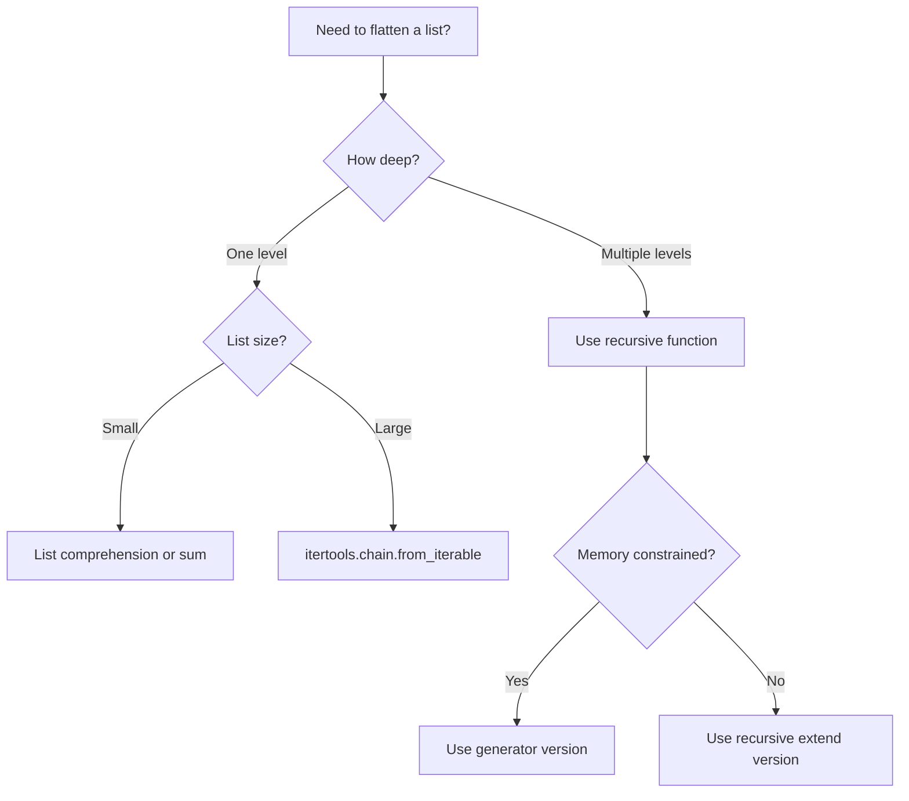

# How to Flatten a List of Lists in Python

Author: [nawazdhandala](https://www.github.com/nawazdhandala)

Tags: Python, Lists, Data Structures, Iteration, Performance

Description: Learn multiple ways to flatten nested lists in Python, from simple list comprehensions to recursive solutions for deeply nested structures.

---

Flattening a list of lists means converting a nested structure like `[[1, 2], [3, 4], [5, 6]]` into a single flat list `[1, 2, 3, 4, 5, 6]`. Python offers several ways to do this, each with different trade-offs. This guide covers all the common approaches and helps you choose the right one for your situation.

## The Problem

You have data structured as a list containing other lists, and you need a single flat list.

```python
# Nested list structure
nested = [[1, 2, 3], [4, 5], [6, 7, 8, 9]]

# Goal: [1, 2, 3, 4, 5, 6, 7, 8, 9]
```

## Method 1: List Comprehension

The most Pythonic way for simple cases is a nested list comprehension.

```python
nested = [[1, 2, 3], [4, 5], [6, 7, 8, 9]]

# Read as: for each sublist, for each item in sublist, add item
flat = [item for sublist in nested for item in sublist]

print(flat)  # [1, 2, 3, 4, 5, 6, 7, 8, 9]
```

The order of the for loops in the comprehension matches how you would write nested for loops:

```python
# Equivalent explicit loops
flat = []
for sublist in nested:
    for item in sublist:
        flat.append(item)
```

## Method 2: itertools.chain

The `itertools.chain` function is designed for this exact purpose and is often faster for large lists.

```python
from itertools import chain

nested = [[1, 2, 3], [4, 5], [6, 7, 8, 9]]

# chain.from_iterable takes a single iterable of iterables
flat = list(chain.from_iterable(nested))

print(flat)  # [1, 2, 3, 4, 5, 6, 7, 8, 9]
```

If you have the sublists as separate variables, use `chain` directly:

```python
from itertools import chain

list1 = [1, 2, 3]
list2 = [4, 5]
list3 = [6, 7, 8]

flat = list(chain(list1, list2, list3))
print(flat)  # [1, 2, 3, 4, 5, 6, 7, 8]
```

## Method 3: sum() with Empty List

A clever trick uses `sum()` with an empty list as the start value. This works because Python's `+` operator concatenates lists.

```python
nested = [[1, 2, 3], [4, 5], [6, 7, 8, 9]]

flat = sum(nested, [])

print(flat)  # [1, 2, 3, 4, 5, 6, 7, 8, 9]
```

This approach is elegant but has poor performance for large lists because it creates a new list for each concatenation. Avoid it for anything beyond small lists.

## Method 4: functools.reduce

Using `reduce` to concatenate lists. Similar to `sum()`, this has performance issues for large lists.

```python
from functools import reduce
import operator

nested = [[1, 2, 3], [4, 5], [6, 7, 8, 9]]

flat = reduce(operator.concat, nested)
# Or with lambda
flat = reduce(lambda x, y: x + y, nested)

print(flat)  # [1, 2, 3, 4, 5, 6, 7, 8, 9]
```

## Method 5: NumPy for Numeric Data

If you are working with numeric data and have NumPy installed, its flatten or ravel methods are very fast.

```python
import numpy as np

# Works when all sublists have the same length
nested = [[1, 2, 3], [4, 5, 6], [7, 8, 9]]
arr = np.array(nested)
flat = arr.flatten().tolist()

print(flat)  # [1, 2, 3, 4, 5, 6, 7, 8, 9]

# For uneven sublists, use hstack
nested_uneven = [[1, 2], [3, 4, 5], [6]]
flat = np.hstack(nested_uneven).tolist()

print(flat)  # [1, 2, 3, 4, 5, 6]
```

## Deep Flattening: Nested to Any Depth

The methods above only flatten one level. For deeply nested structures, you need recursion.

```python
def flatten_deep(nested):
    """Recursively flatten a list to any depth.

    Args:
        nested: A list that may contain other lists at any depth

    Returns:
        A flat list with all items
    """
    result = []
    for item in nested:
        if isinstance(item, list):
            # Recursively flatten and extend result
            result.extend(flatten_deep(item))
        else:
            result.append(item)
    return result

# Works with any depth of nesting
deeply_nested = [1, [2, [3, [4, [5]]]]]
flat = flatten_deep(deeply_nested)
print(flat)  # [1, 2, 3, 4, 5]

# Mixed structure
mixed = [[1, 2], [3, [4, 5]], 6, [[7, 8], [9]]]
flat = flatten_deep(mixed)
print(flat)  # [1, 2, 3, 4, 5, 6, 7, 8, 9]
```

### Generator Version for Memory Efficiency

For very large structures, a generator avoids creating intermediate lists.

```python
def flatten_generator(nested):
    """Yield items from any nested structure, depth-first."""
    for item in nested:
        if isinstance(item, list):
            yield from flatten_generator(item)
        else:
            yield item

deeply_nested = [1, [2, [3, [4, [5]]]]]

# Iterate without creating full list in memory
for item in flatten_generator(deeply_nested):
    print(item, end=' ')  # 1 2 3 4 5

# Or convert to list if needed
flat = list(flatten_generator(deeply_nested))
```

### Handling Multiple Iterable Types

Real data might contain tuples, sets, or other iterables alongside lists.

```python
from collections.abc import Iterable

def flatten_any(nested, ignore_types=(str, bytes)):
    """Flatten any iterable except strings and bytes.

    Args:
        nested: Any nested iterable structure
        ignore_types: Types to treat as non-iterable (default: str, bytes)

    Yields:
        Individual items from the flattened structure
    """
    for item in nested:
        if isinstance(item, Iterable) and not isinstance(item, ignore_types):
            yield from flatten_any(item, ignore_types)
        else:
            yield item

# Works with mixed types
mixed = [[1, 2], (3, 4), {5, 6}, 'hello']
flat = list(flatten_any(mixed))
print(flat)  # [1, 2, 3, 4, 5, 6, 'hello']

# Strings stay intact (not flattened to characters)
```

## Performance Comparison

Different methods have dramatically different performance characteristics.

```python
import timeit
from itertools import chain
from functools import reduce

# Create test data
nested = [[i] * 10 for i in range(1000)]

# List comprehension
def method_comprehension():
    return [x for sub in nested for x in sub]

# itertools.chain
def method_chain():
    return list(chain.from_iterable(nested))

# sum with empty list
def method_sum():
    return sum(nested, [])

# Benchmark results (relative time, lower is better):
# chain.from_iterable: 1.0x (fastest)
# list comprehension:  1.2x
# sum with []:        50x+ (avoid for large lists!)
```

The key insight: `sum()` and `reduce()` create a new list on each step, leading to O(n^2) behavior. Use them only for small lists.

## Choosing the Right Method



## Practical Examples

### Flattening Database Results

```python
# Query returns list of rows, each row is a list of columns
db_results = [
    ['Alice', 'Engineering'],
    ['Bob', 'Marketing'],
    ['Charlie', 'Engineering']
]

# Get all unique values across all columns
all_values = set(item for row in db_results for item in row)
print(all_values)  # {'Alice', 'Bob', 'Charlie', 'Engineering', 'Marketing'}
```

### Combining Multiple API Responses

```python
from itertools import chain

# Each API call returns a list of items
page1 = [{'id': 1}, {'id': 2}]
page2 = [{'id': 3}, {'id': 4}]
page3 = [{'id': 5}]

# Combine all pages into one list
all_items = list(chain(page1, page2, page3))
print(len(all_items))  # 5
```

### Processing Nested File Structures

```python
def flatten_deep(nested):
    result = []
    for item in nested:
        if isinstance(item, list):
            result.extend(flatten_deep(item))
        else:
            result.append(item)
    return result

# Directory tree represented as nested lists
file_tree = [
    'root.txt',
    ['folder1', ['file1.txt', 'file2.txt']],
    ['folder2', ['subfolder', ['deep_file.txt']]]
]

all_files = flatten_deep(file_tree)
print(all_files)  # ['root.txt', 'folder1', 'file1.txt', ...]
```

## Summary

Python offers many ways to flatten lists:

| Method | Best For | Avoid When |
|--------|----------|------------|
| List comprehension | Simple, readable code | - |
| `itertools.chain` | Large lists, performance | - |
| `sum(nested, [])` | Small lists, quick scripts | Large lists |
| Recursive function | Deeply nested structures | Very deep (stack overflow) |
| Generator | Memory-constrained | You need random access |

For most cases, stick with list comprehension for readability or `itertools.chain.from_iterable` for performance. Use recursive solutions only when dealing with arbitrarily nested data.
