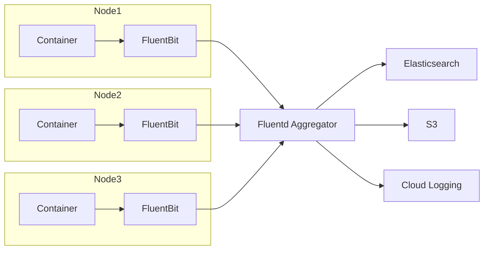

# How to Implement FluentBit for Lightweight Logging

Author: [nawazdhandala](https://www.github.com/nawazdhandala)

Tags: FluentBit, Logging, Kubernetes, Containers, Observability, Log Collection, Cloud Native

Description: Learn how to implement FluentBit for lightweight log collection in containerized environments. This guide covers installation, configuration, Kubernetes deployment, and optimization for resource-constrained systems.

---

> FluentBit is a fast, lightweight log processor and forwarder designed for high-throughput environments. At roughly 650KB with no external dependencies, it is perfect for containers and edge devices where resources are limited.

While Fluentd offers extensive plugin support and flexibility, FluentBit focuses on doing one thing extremely well: collecting and forwarding logs with minimal resource usage. For Kubernetes environments where you need a log shipper on every node, FluentBit's small footprint makes it the better choice.

---

## FluentBit vs Fluentd

Understanding when to use each tool helps you make the right choice:

| Feature | FluentBit | Fluentd |
|---------|-----------|---------|
| Memory Usage | ~650KB | ~40MB |
| Language | C | C and Ruby |
| Plugin System | Built-in | Extensive ecosystem |
| Use Case | Log forwarding | Log aggregation |
| Dependencies | None | Ruby runtime |

The common pattern is to run FluentBit on edge nodes for collection and Fluentd as an aggregator for complex processing.



---

## Installing FluentBit

Install FluentBit on Linux systems using the official packages:

```bash
# Ubuntu/Debian installation
curl https://raw.githubusercontent.com/fluent/fluent-bit/master/install.sh | sh

# Start the service
sudo systemctl start fluent-bit
sudo systemctl enable fluent-bit

# Verify installation
fluent-bit --version
```

For Docker deployments:

```bash
# Run FluentBit container
docker run -d \
  --name fluent-bit \
  -v /var/log:/var/log:ro \
  -v $(pwd)/fluent-bit.conf:/fluent-bit/etc/fluent-bit.conf \
  fluent/fluent-bit:2.2
```

---

## Configuration Fundamentals

FluentBit uses a simple configuration format with sections for service settings, inputs, filters, and outputs:

```ini
# /etc/fluent-bit/fluent-bit.conf
# FluentBit main configuration file

[SERVICE]
    # Flush interval in seconds
    Flush         5

    # Daemon mode (set to Off for containers)
    Daemon        Off

    # Log level: error, warning, info, debug, trace
    Log_Level     info

    # Parser configuration file
    Parsers_File  parsers.conf

    # Enable built-in HTTP server for monitoring
    HTTP_Server   On
    HTTP_Listen   0.0.0.0
    HTTP_Port     2020

    # Health check endpoint
    Health_Check  On

# INPUT: Collect logs from various sources
[INPUT]
    Name          tail
    Tag           app.*
    Path          /var/log/app/*.log
    Parser        json
    DB            /var/log/flb_app.db
    Mem_Buf_Limit 5MB
    Skip_Long_Lines On
    Refresh_Interval 10

# FILTER: Process and transform logs
[FILTER]
    Name          record_modifier
    Match         *
    Record        hostname ${HOSTNAME}
    Record        environment production

# OUTPUT: Send logs to destination
[OUTPUT]
    Name          forward
    Match         *
    Host          fluentd-aggregator
    Port          24224
```

---

## Input Plugins for Log Collection

### Tail Input

The most common input for collecting log files:

```ini
# Tail application logs with automatic rotation handling
[INPUT]
    Name              tail
    Tag               app.backend

    # Path supports wildcards
    Path              /var/log/app/*.log
    Path_Key          source_file

    # Exclude certain files
    Exclude_Path      /var/log/app/debug.log

    # Parser for log format
    Parser            json

    # Database file to track position (survives restarts)
    DB                /var/log/flb_backend.db
    DB.sync           normal

    # Memory buffer limit per monitored file
    Mem_Buf_Limit     10MB

    # Handle long lines
    Skip_Long_Lines   On

    # How often to check for new files
    Refresh_Interval  5

    # Read from end of file on first run
    Read_from_Head    Off

    # Handle log rotation
    Rotate_Wait       30

    # Multiline configuration for stack traces
    Multiline         On
    Multiline_Flush   5
    Parser_Firstline  multiline_start
```

### Systemd Input

Collect logs from systemd journal:

```ini
# Collect systemd journal logs
[INPUT]
    Name            systemd
    Tag             system.journal

    # Read from specific systemd unit
    Systemd_Filter  _SYSTEMD_UNIT=docker.service
    Systemd_Filter  _SYSTEMD_UNIT=kubelet.service

    # Read all priorities (0-7)
    Read_From_Tail  On

    # Strip systemd-specific fields
    Strip_Underscores On

    # Database for position tracking
    DB              /var/log/flb_systemd.db
```

### Kubernetes Input

Collect container logs in Kubernetes:

```ini
# Kubernetes container log collection
[INPUT]
    Name              tail
    Tag               kube.*

    # Standard container log path
    Path              /var/log/containers/*.log

    # Exclude FluentBit's own logs
    Exclude_Path      /var/log/containers/*fluent-bit*.log

    # CRI parser for containerd/CRI-O
    Parser            cri

    # Position database
    DB                /var/log/flb_kube.db

    # Memory management
    Mem_Buf_Limit     5MB
    Skip_Long_Lines   On

    # Refresh interval
    Refresh_Interval  10
```

---

## Filter Plugins for Processing

### Kubernetes Metadata

Enrich logs with Kubernetes metadata:

```ini
# Add Kubernetes metadata to logs
[FILTER]
    Name                kubernetes
    Match               kube.*

    # Kubernetes API server
    Kube_URL            https://kubernetes.default.svc:443
    Kube_CA_File        /var/run/secrets/kubernetes.io/serviceaccount/ca.crt
    Kube_Token_File     /var/run/secrets/kubernetes.io/serviceaccount/token

    # Cache settings for performance
    Kube_Meta_Cache_TTL 300s

    # Merge log field into root
    Merge_Log           On
    Merge_Log_Key       log_processed

    # Keep original log field
    Keep_Log            On

    # Labels and annotations to include
    K8S-Logging.Parser  On
    K8S-Logging.Exclude On

    # Add labels as fields
    Labels              On
    Annotations         Off
```

### Record Modifier

Add, remove, or modify fields:

```ini
# Add static fields to all records
[FILTER]
    Name          record_modifier
    Match         *

    # Add new fields
    Record        cluster_name production-us-east
    Record        datacenter us-east-1
    Record        log_shipper fluent-bit

    # Remove sensitive fields
    Remove_key    password
    Remove_key    secret
    Remove_key    token

# Add dynamic fields using environment variables
[FILTER]
    Name          record_modifier
    Match         *
    Record        node_name ${NODE_NAME}
    Record        pod_name ${POD_NAME}
```

### Grep Filter

Filter logs based on content:

```ini
# Exclude health check logs
[FILTER]
    Name    grep
    Match   app.*
    Exclude log /health|/ready|/live/

# Only include error logs
[FILTER]
    Name    grep
    Match   critical.*
    Regex   level (error|fatal|critical)
```

### Lua Filter

Custom processing with Lua scripts:

```ini
# Custom processing with Lua
[FILTER]
    Name    lua
    Match   *
    Script  /fluent-bit/scripts/process.lua
    Call    process_log
```

```lua
-- /fluent-bit/scripts/process.lua
-- Custom log processing function

function process_log(tag, timestamp, record)
    -- Add processing timestamp
    record["processed_at"] = os.date("!%Y-%m-%dT%H:%M:%SZ")

    -- Normalize log level
    local level = record["level"] or record["severity"] or "info"
    record["normalized_level"] = string.lower(level)

    -- Calculate message length
    if record["message"] then
        record["message_length"] = string.len(record["message"])
    end

    -- Mask sensitive patterns
    if record["message"] then
        -- Mask email addresses
        record["message"] = string.gsub(
            record["message"],
            "[%w%.%-]+@[%w%.%-]+%.%w+",
            "[EMAIL_REDACTED]"
        )
    end

    -- Return modified record
    -- Return code: 0=keep, 1=modify, 2=drop
    return 1, timestamp, record
end
```

---

## Output Plugins for Delivery

### Elasticsearch Output

```ini
# Send logs to Elasticsearch
[OUTPUT]
    Name            es
    Match           *

    # Elasticsearch connection
    Host            elasticsearch.logging.svc
    Port            9200

    # Authentication
    HTTP_User       elastic
    HTTP_Passwd     ${ES_PASSWORD}

    # TLS configuration
    tls             On
    tls.verify      On
    tls.ca_file     /etc/fluent-bit/certs/ca.crt

    # Index configuration
    Index           logs
    Type            _doc

    # Use time-based indices
    Logstash_Format On
    Logstash_Prefix app-logs
    Logstash_DateFormat %Y.%m.%d

    # Include tag in document
    Include_Tag_Key On
    Tag_Key         fluentbit_tag

    # Retry configuration
    Retry_Limit     5

    # Buffer in case of failures
    Buffer_Size     5MB
```

### Forward Output

Send to Fluentd or another FluentBit:

```ini
# Forward to Fluentd aggregator
[OUTPUT]
    Name            forward
    Match           *

    Host            fluentd-aggregator.logging.svc
    Port            24224

    # Shared secret for authentication
    Shared_Key      your_shared_key_here

    # TLS encryption
    tls             On
    tls.verify      On
    tls.ca_file     /etc/fluent-bit/certs/ca.crt

    # Send as MessagePack (more efficient)
    Send_options    true
    Require_ack_response true
```

### CloudWatch Output

Send to AWS CloudWatch:

```ini
# Send to AWS CloudWatch Logs
[OUTPUT]
    Name              cloudwatch_logs
    Match             *

    Region            us-east-1
    Log_Group_Name    /app/production
    Log_Stream_Prefix ${HOSTNAME}-

    # Auto create log group
    Auto_Create_Group On

    # Retry settings
    Retry_Limit       5

    # Use IAM role (for EKS)
    # Credentials from environment or instance profile
```

---

## Kubernetes DaemonSet Deployment

Deploy FluentBit across all Kubernetes nodes:

```yaml
# fluent-bit-daemonset.yaml
apiVersion: apps/v1
kind: DaemonSet
metadata:
  name: fluent-bit
  namespace: logging
  labels:
    app: fluent-bit
spec:
  selector:
    matchLabels:
      app: fluent-bit
  template:
    metadata:
      labels:
        app: fluent-bit
    spec:
      serviceAccountName: fluent-bit
      tolerations:
        # Run on all nodes
        - operator: Exists
      containers:
        - name: fluent-bit
          image: fluent/fluent-bit:2.2
          ports:
            - containerPort: 2020
              name: metrics
          env:
            - name: NODE_NAME
              valueFrom:
                fieldRef:
                  fieldPath: spec.nodeName
            - name: POD_NAME
              valueFrom:
                fieldRef:
                  fieldPath: metadata.name
          resources:
            limits:
              memory: 128Mi
              cpu: 200m
            requests:
              memory: 64Mi
              cpu: 50m
          volumeMounts:
            - name: varlog
              mountPath: /var/log
            - name: containers
              mountPath: /var/lib/docker/containers
              readOnly: true
            - name: config
              mountPath: /fluent-bit/etc/
          livenessProbe:
            httpGet:
              path: /
              port: 2020
            initialDelaySeconds: 10
            periodSeconds: 30
          readinessProbe:
            httpGet:
              path: /api/v1/health
              port: 2020
            initialDelaySeconds: 5
            periodSeconds: 10
      volumes:
        - name: varlog
          hostPath:
            path: /var/log
        - name: containers
          hostPath:
            path: /var/lib/docker/containers
        - name: config
          configMap:
            name: fluent-bit-config
```

---

## Performance Optimization

Tune FluentBit for high-throughput environments:

```ini
[SERVICE]
    # Increase flush frequency for low latency
    Flush         1

    # Enable threading for parallel processing
    # Note: Some outputs don't support threading

    # Increase buffer size
    storage.path              /var/log/flb-storage/
    storage.sync              normal
    storage.checksum          off
    storage.max_chunks_up     128
    storage.backlog.mem_limit 5M

[INPUT]
    Name              tail
    Path              /var/log/app/*.log

    # Increase buffer for high-volume files
    Buffer_Chunk_Size 512k
    Buffer_Max_Size   5M

    # Faster refresh for dynamic files
    Refresh_Interval  5

    # Skip problematic long lines
    Skip_Long_Lines   On
    Skip_Empty_Lines  On

[OUTPUT]
    Name              es
    Match             *

    # Batch writes for efficiency
    Buffer_Size       10M

    # Connection pooling
    HTTP_Pooling      On

    # Compression reduces network usage
    Compress          gzip

    # Workers for parallel sending
    Workers           2
```

---

## Monitoring FluentBit

Access the built-in metrics endpoint:

```bash
# Check FluentBit health
curl http://localhost:2020/

# Get metrics in Prometheus format
curl http://localhost:2020/api/v1/metrics/prometheus

# Check input/output stats
curl http://localhost:2020/api/v1/storage
```

Key metrics to monitor:
- `fluentbit_input_bytes_total`: Bytes received
- `fluentbit_output_retries_total`: Output retries
- `fluentbit_filter_records_total`: Records processed

---

## Summary

FluentBit excels at lightweight log collection in resource-constrained environments. Its small footprint makes it perfect for:

1. Kubernetes DaemonSets where every byte matters
2. Edge devices with limited resources
3. High-density container environments
4. Forwarding to central aggregators

Start with basic tail inputs and forward outputs, then add filters as needed. The key is keeping configurations simple and letting FluentBit do what it does best: move logs efficiently.

---

*Want log collection without the configuration overhead? [OneUptime](https://oneuptime.com) provides native log ingestion that works with FluentBit, Fluentd, or direct application integration, giving you powerful log management without managing the infrastructure.*
