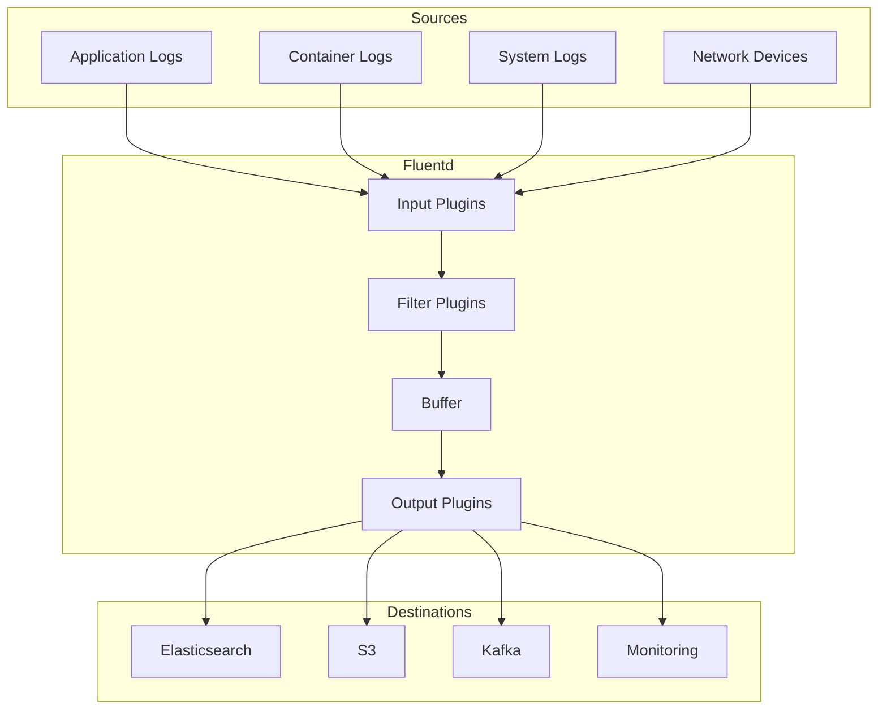

# How to Configure Fluentd for Log Collection

Author: [nawazdhandala](https://www.github.com/nawazdhandala)

Tags: Fluentd, Log Collection, Logging, Kubernetes, Observability, Data Pipeline, DevOps

Description: Learn how to configure Fluentd for log collection across distributed systems. This guide covers installation, input plugins, filters, output routing, and production best practices for reliable log aggregation.

---

> Fluentd is an open-source data collector that unifies log collection and consumption. It allows you to collect logs from various sources, transform them, and route them to multiple destinations.

When you run applications across multiple servers, containers, or cloud environments, logs scatter everywhere. Fluentd acts as a unified logging layer that collects logs from all these sources and sends them wherever you need them.

---

## Why Fluentd?

Fluentd stands out for several reasons:

**Unified Logging Layer**: One tool to collect logs from files, containers, applications, and network devices.

**Plugin Ecosystem**: Over 500 plugins for inputs, outputs, and transformations. If you need to connect to something, there is probably a plugin for it.

**Reliability**: Built-in buffering and retry mechanisms prevent log loss during network issues or destination outages.

**Performance**: Written in C and Ruby, Fluentd handles high throughput while maintaining low memory footprint.



---

## Installing Fluentd

Install Fluentd using the td-agent package, which bundles Fluentd with commonly used plugins:

```bash
# Ubuntu/Debian installation
curl -fsSL https://toolbelt.treasuredata.com/sh/install-ubuntu-jammy-fluent-package5-lts.sh | sh

# Start the service
sudo systemctl start fluentd
sudo systemctl enable fluentd

# Verify installation
fluentd --version
```

For containerized environments, use the official Docker image:

```dockerfile
# Dockerfile for custom Fluentd image
FROM fluent/fluentd:v1.16-debian

# Switch to root to install plugins
USER root

# Install required plugins
RUN gem install fluent-plugin-elasticsearch \
    fluent-plugin-s3 \
    fluent-plugin-kafka \
    fluent-plugin-prometheus

# Switch back to fluent user
USER fluent

# Copy custom configuration
COPY fluent.conf /fluentd/etc/fluent.conf
```

---

## Basic Configuration Structure

Fluentd configuration uses a directive-based syntax. Each directive defines a component of your logging pipeline:

```xml
# /etc/fluent/fluent.conf
# Basic Fluentd configuration structure

# System-wide settings
<system>
  # Log level for Fluentd internal logs
  log_level info

  # Suppress repeated warning messages
  suppress_repeated_stacktrace true

  # Enable metrics endpoint for monitoring
  enable_jit false
</system>

# SOURCE: Define where logs come from
<source>
  @type forward
  port 24224
  bind 0.0.0.0
</source>

# FILTER: Transform and enrich log data
<filter **>
  @type record_transformer
  <record>
    hostname "#{Socket.gethostname}"
    environment "#{ENV['ENVIRONMENT'] || 'development'}"
  </record>
</filter>

# MATCH: Define where logs go
<match **>
  @type stdout
</match>
```

---

## Configuring Input Plugins

Fluentd supports many input sources. Here are the most common configurations:

### File Input

Collect logs from files with automatic rotation handling:

```xml
# Tail application log files
<source>
  @type tail
  @id app_logs

  # Path to log files (supports wildcards)
  path /var/log/app/*.log

  # Position file tracks read position across restarts
  pos_file /var/log/fluentd/app.log.pos

  # Tag for routing
  tag app.logs

  # Refresh file list interval
  refresh_interval 5s

  # Handle log rotation
  rotate_wait 5s

  # Parse JSON formatted logs
  <parse>
    @type json
    time_key timestamp
    time_format %Y-%m-%dT%H:%M:%S.%NZ
  </parse>
</source>

# Tail syslog
<source>
  @type tail
  @id syslog
  path /var/log/syslog
  pos_file /var/log/fluentd/syslog.pos
  tag system.syslog

  <parse>
    @type syslog
  </parse>
</source>
```

### Forward Input

Receive logs from other Fluentd instances or applications using the Fluent protocol:

```xml
# Accept forwarded logs from other Fluentd instances
<source>
  @type forward
  @id forward_input

  port 24224
  bind 0.0.0.0

  # Enable TLS for secure communication
  <transport tls>
    cert_path /etc/fluent/certs/server.crt
    private_key_path /etc/fluent/certs/server.key
    client_cert_auth true
    ca_path /etc/fluent/certs/ca.crt
  </transport>

  # Authentication
  <security>
    self_hostname aggregator.example.com
    shared_key your_secret_key_here
  </security>
</source>
```

### HTTP Input

Accept logs via HTTP POST requests:

```xml
# HTTP endpoint for receiving logs
<source>
  @type http
  @id http_input

  port 8888
  bind 0.0.0.0

  # Body size limit
  body_size_limit 32m

  # Keep alive timeout
  keepalive_timeout 10s

  # CORS settings for browser clients
  cors_allow_origins ["*"]

  <parse>
    @type json
  </parse>
</source>
```

---

## Filter Plugins for Transformation

Filters process log records before routing. Use them to parse, enrich, or filter data:

```xml
# Parse nested JSON in message field
<filter app.**>
  @type parser
  key_name message
  reserve_data true
  remove_key_name_field true

  <parse>
    @type json
  </parse>
</filter>

# Add metadata to all records
<filter **>
  @type record_transformer
  enable_ruby true

  <record>
    # Add processing timestamp
    processed_at ${Time.now.utc.iso8601}

    # Add host information
    host_name "#{Socket.gethostname}"
    host_ip "#{Socket.ip_address_list.find { |a| a.ipv4? && !a.ipv4_loopback? }.ip_address}"

    # Normalize log level
    level ${record["level"] || record["severity"] || "info"}

    # Generate unique ID
    log_id ${SecureRandom.uuid}
  </record>
</filter>

# Filter out health check logs to reduce noise
<filter app.http.**>
  @type grep

  <exclude>
    key path
    pattern /^\/health|^\/ready|^\/live/
  </exclude>
</filter>

# Mask sensitive data
<filter **>
  @type record_transformer
  enable_ruby true

  <record>
    # Mask email addresses
    message ${record["message"].gsub(/[\w+\-.]+@[a-z\d\-.]+\.[a-z]+/i, '[EMAIL REDACTED]')}

    # Mask credit card numbers
    message ${record["message"].gsub(/\b\d{4}[\s-]?\d{4}[\s-]?\d{4}[\s-]?\d{4}\b/, '[CARD REDACTED]')}
  </record>
</filter>
```

---

## Output Plugins for Routing

Configure where logs should be sent. Fluentd supports multiple simultaneous outputs:

```xml
# Send to Elasticsearch
<match app.**>
  @type elasticsearch
  @id elasticsearch_output

  host elasticsearch.example.com
  port 9200
  scheme https
  user elastic
  password ${ES_PASSWORD}

  # Index configuration
  index_name logs
  type_name _doc

  # Use logstash format for time-based indices
  logstash_format true
  logstash_prefix app-logs
  logstash_dateformat %Y.%m.%d

  # Include tag in index name
  include_tag_key true
  tag_key @log_name

  # Buffering configuration for reliability
  <buffer>
    @type file
    path /var/log/fluentd/buffer/elasticsearch

    # Flush settings
    flush_interval 5s
    flush_thread_count 2

    # Retry settings
    retry_type exponential_backoff
    retry_wait 1s
    retry_max_interval 60s
    retry_forever true

    # Chunk settings
    chunk_limit_size 8MB
    total_limit_size 2GB
    overflow_action block
  </buffer>
</match>

# Send system logs to S3 for long-term storage
<match system.**>
  @type s3
  @id s3_output

  aws_key_id ${AWS_ACCESS_KEY_ID}
  aws_sec_key ${AWS_SECRET_ACCESS_KEY}
  s3_bucket my-logs-bucket
  s3_region us-east-1

  # Path format in S3
  path logs/%Y/%m/%d/
  s3_object_key_format %{path}%{time_slice}_%{index}.%{file_extension}

  # Time slicing for file organization
  <buffer time>
    @type file
    path /var/log/fluentd/buffer/s3
    timekey 3600
    timekey_wait 10m
    chunk_limit_size 256m
  </buffer>

  # Compression
  store_as gzip
</match>

# Copy to multiple destinations
<match critical.**>
  @type copy

  # Primary destination
  <store>
    @type elasticsearch
    host elasticsearch.example.com
    port 9200
    index_name critical-logs

    <buffer>
      flush_interval 1s
    </buffer>
  </store>

  # Backup destination
  <store>
    @type s3
    s3_bucket critical-logs-backup
    path backup/
  </store>

  # Send to alerting system
  <store>
    @type http
    endpoint https://alerts.example.com/webhook
    http_method post
    content_type application/json
  </store>
</match>
```

---

## Kubernetes Integration

Deploy Fluentd as a DaemonSet to collect logs from all nodes:

```yaml
# fluentd-daemonset.yaml
apiVersion: apps/v1
kind: DaemonSet
metadata:
  name: fluentd
  namespace: logging
spec:
  selector:
    matchLabels:
      app: fluentd
  template:
    metadata:
      labels:
        app: fluentd
    spec:
      serviceAccountName: fluentd
      tolerations:
        # Run on all nodes including masters
        - key: node-role.kubernetes.io/master
          effect: NoSchedule
      containers:
        - name: fluentd
          image: fluent/fluentd-kubernetes-daemonset:v1.16-debian-elasticsearch8
          env:
            - name: FLUENT_ELASTICSEARCH_HOST
              value: "elasticsearch.logging.svc"
            - name: FLUENT_ELASTICSEARCH_PORT
              value: "9200"
            - name: FLUENT_ELASTICSEARCH_SCHEME
              value: "http"
          resources:
            limits:
              memory: 512Mi
            requests:
              cpu: 100m
              memory: 256Mi
          volumeMounts:
            # Mount container logs
            - name: varlog
              mountPath: /var/log
            - name: dockercontainers
              mountPath: /var/lib/docker/containers
              readOnly: true
            # Custom configuration
            - name: config
              mountPath: /fluentd/etc/fluent.conf
              subPath: fluent.conf
      volumes:
        - name: varlog
          hostPath:
            path: /var/log
        - name: dockercontainers
          hostPath:
            path: /var/lib/docker/containers
        - name: config
          configMap:
            name: fluentd-config
```

---

## Performance Tuning

Optimize Fluentd for high-volume environments:

```xml
# Performance-optimized configuration
<system>
  # Use multiple worker processes
  workers 4

  # Root directory for buffers
  root_dir /var/log/fluentd

  # Suppress config dump for security
  suppress_config_dump true
</system>

# Optimize buffer settings for throughput
<buffer>
  @type file

  # Use multiple threads for flushing
  flush_thread_count 8

  # Larger chunks for better throughput
  chunk_limit_size 32MB

  # More buffer space
  total_limit_size 8GB

  # Async flushing
  flush_mode interval
  flush_interval 5s

  # Compress chunks to save disk space
  compress gzip
</buffer>
```

---

## Monitoring Fluentd

Enable the Prometheus metrics endpoint for monitoring:

```xml
# Expose metrics for Prometheus
<source>
  @type prometheus
  port 24231
  bind 0.0.0.0
</source>

<source>
  @type prometheus_monitor
</source>

<source>
  @type prometheus_output_monitor
</source>

# Monitor buffer status
<source>
  @type prometheus_tail_monitor
</source>
```

Key metrics to watch:
- `fluentd_output_status_buffer_queue_length`: Buffer queue size
- `fluentd_output_status_buffer_total_bytes`: Total buffer size
- `fluentd_output_status_retry_count`: Retry attempts

---

## Summary

Fluentd provides a reliable foundation for log collection across diverse environments. Start with simple configurations and expand as your needs grow:

1. Begin with file tailing for application logs
2. Add filters to enrich and normalize data
3. Configure multiple outputs for different use cases
4. Deploy as a DaemonSet in Kubernetes
5. Monitor buffer health and throughput

The plugin ecosystem means you can connect almost anything to anything. Focus on building a clean, maintainable configuration that handles your current needs while leaving room to grow.

---

*Looking for simpler log collection? [OneUptime](https://oneuptime.com) provides native log ingestion with automatic parsing and correlation, so you can focus on your applications instead of managing logging infrastructure.*
