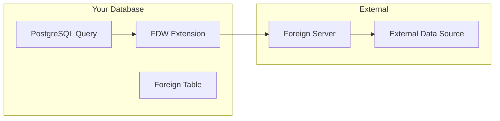

# How to Query External Data with Foreign Data Wrappers in PostgreSQL

Author: [nawazdhandala](https://www.github.com/nawazdhandala)

Tags: PostgreSQL, Foreign Data Wrappers, Data Integration, Database, Federation

Description: Learn how to use PostgreSQL Foreign Data Wrappers (FDW) to query external data sources including other PostgreSQL databases, MySQL, CSV files, and REST APIs as if they were local tables.

---

Foreign Data Wrappers (FDW) let PostgreSQL query external data sources as if they were local tables. You can join data from MySQL, query CSV files, pull from REST APIs, or federate queries across multiple PostgreSQL servers. This guide covers practical implementations for the most common use cases.

## How FDW Works

FDW provides a standard interface for accessing foreign data:



The key components:
- **Extension**: The FDW implementation (e.g., postgres_fdw, mysql_fdw)
- **Foreign Server**: Connection details for the external system
- **User Mapping**: Credentials for the foreign server
- **Foreign Table**: Local table definition that maps to external data

## postgres_fdw: Querying Other PostgreSQL Databases

The most common use case is federating queries across PostgreSQL instances.

### Setup

```sql
-- Install the extension (included with PostgreSQL)
CREATE EXTENSION IF NOT EXISTS postgres_fdw;

-- Define the foreign server
CREATE SERVER remote_db
FOREIGN DATA WRAPPER postgres_fdw
OPTIONS (
    host 'remote-server.example.com',
    port '5432',
    dbname 'analytics'
);

-- Create user mapping (credentials for the remote server)
CREATE USER MAPPING FOR current_user
SERVER remote_db
OPTIONS (
    user 'readonly_user',
    password 'secure_password'
);
```

### Import Foreign Tables

```sql
-- Import a single table
CREATE FOREIGN TABLE remote_orders (
    id INTEGER,
    customer_id INTEGER,
    amount NUMERIC(10,2),
    created_at TIMESTAMP
)
SERVER remote_db
OPTIONS (
    schema_name 'public',
    table_name 'orders'
);

-- Or import all tables from a schema
IMPORT FOREIGN SCHEMA public
FROM SERVER remote_db
INTO local_schema;

-- Import specific tables
IMPORT FOREIGN SCHEMA public
LIMIT TO (orders, customers, products)
FROM SERVER remote_db
INTO local_schema;
```

### Query Foreign Tables

```sql
-- Query remote data as if it were local
SELECT * FROM remote_orders WHERE created_at > '2026-01-01';

-- Join local and remote tables
SELECT
    l.name AS customer_name,
    r.amount,
    r.created_at
FROM local_customers l
JOIN remote_orders r ON r.customer_id = l.id
WHERE r.amount > 100;
```

### Optimize Remote Queries

PostgreSQL can push down WHERE clauses, joins, and aggregations to the remote server:

```sql
-- Check what gets pushed to remote
EXPLAIN VERBOSE
SELECT customer_id, sum(amount)
FROM remote_orders
WHERE created_at > '2026-01-01'
GROUP BY customer_id;

-- You should see "Remote SQL:" showing what runs on the remote server
```

Enable additional pushdown options:

```sql
-- Allow more operations to be pushed to remote
ALTER SERVER remote_db OPTIONS (
    ADD fetch_size '10000',
    ADD extensions 'pg_trgm'
);
```

## file_fdw: Querying CSV and Text Files

Query CSV files directly without importing them:

### Setup

```sql
-- Install the extension
CREATE EXTENSION IF NOT EXISTS file_fdw;

-- Create a server (file_fdw requires one but it's just a placeholder)
CREATE SERVER file_server FOREIGN DATA WRAPPER file_fdw;

-- Create foreign table for a CSV file
CREATE FOREIGN TABLE sales_import (
    date DATE,
    product_id INTEGER,
    quantity INTEGER,
    revenue NUMERIC(10,2)
)
SERVER file_server
OPTIONS (
    filename '/var/lib/postgresql/data/sales_2026.csv',
    format 'csv',
    header 'true',
    delimiter ','
);
```

### Query the File

```sql
-- Query CSV data
SELECT
    date,
    sum(revenue) AS total_revenue
FROM sales_import
WHERE date >= '2026-01-01'
GROUP BY date
ORDER BY date;

-- Join with local tables
SELECT
    p.name,
    sum(s.quantity) AS total_sold
FROM sales_import s
JOIN products p ON p.id = s.product_id
GROUP BY p.name;
```

### Multiple Files with Different Schemas

```sql
-- Create foreign tables for different file formats
CREATE FOREIGN TABLE log_entries (
    timestamp TIMESTAMP,
    level TEXT,
    message TEXT
)
SERVER file_server
OPTIONS (
    filename '/var/log/app/app.log',
    format 'csv',
    delimiter '|'
);
```

## mysql_fdw: Querying MySQL Databases

Connect to MySQL databases from PostgreSQL:

### Installation

```bash
# Ubuntu/Debian
sudo apt-get install postgresql-16-mysql-fdw

# Or build from source
git clone https://github.com/EnterpriseDB/mysql_fdw
cd mysql_fdw
make USE_PGXS=1
sudo make USE_PGXS=1 install
```

### Setup

```sql
-- Create the extension
CREATE EXTENSION mysql_fdw;

-- Define MySQL server
CREATE SERVER mysql_server
FOREIGN DATA WRAPPER mysql_fdw
OPTIONS (
    host 'mysql.example.com',
    port '3306'
);

-- Create user mapping
CREATE USER MAPPING FOR current_user
SERVER mysql_server
OPTIONS (
    username 'mysql_user',
    password 'mysql_password'
);

-- Create foreign table
CREATE FOREIGN TABLE mysql_users (
    id INTEGER,
    username VARCHAR(100),
    email VARCHAR(255),
    created_at TIMESTAMP
)
SERVER mysql_server
OPTIONS (
    dbname 'legacy_app',
    table_name 'users'
);
```

### Query MySQL Data

```sql
-- Simple query
SELECT * FROM mysql_users WHERE created_at > '2025-01-01';

-- Join PostgreSQL and MySQL data
SELECT
    pg.order_id,
    my.username,
    pg.amount
FROM local_orders pg
JOIN mysql_users my ON my.id = pg.user_id;
```

## Practical Use Cases

### Data Migration

Use FDW to migrate data between databases:

```sql
-- Copy data from remote to local
INSERT INTO local_customers
SELECT * FROM remote_customers
WHERE created_at > '2025-01-01';

-- Incremental sync
INSERT INTO local_orders
SELECT * FROM remote_orders
WHERE id > (SELECT COALESCE(max(id), 0) FROM local_orders);
```

### Cross-Database Reporting

Aggregate data from multiple sources:

```sql
-- Combine data from different systems
SELECT
    'PostgreSQL' AS source,
    count(*) AS user_count,
    sum(revenue) AS total_revenue
FROM local_analytics
UNION ALL
SELECT
    'MySQL Legacy' AS source,
    count(*) AS user_count,
    sum(amount) AS total_revenue
FROM mysql_orders;
```

### Materialized View for Performance

Cache foreign data locally for faster queries:

```sql
-- Create materialized view from foreign table
CREATE MATERIALIZED VIEW cached_remote_orders AS
SELECT * FROM remote_orders
WHERE created_at > current_date - interval '30 days';

-- Create indexes on the materialized view
CREATE INDEX ON cached_remote_orders (customer_id);
CREATE INDEX ON cached_remote_orders (created_at);

-- Refresh periodically
REFRESH MATERIALIZED VIEW CONCURRENTLY cached_remote_orders;
```

Schedule refresh with cron or pg_cron:

```sql
-- Using pg_cron extension
SELECT cron.schedule('refresh-remote-orders', '0 * * * *',
    'REFRESH MATERIALIZED VIEW CONCURRENTLY cached_remote_orders');
```

## Advanced: Custom FDW for REST APIs

You can use wrappers like `multicorn` or `http` to query REST APIs:

### Using the http Extension

```sql
-- Install http extension
CREATE EXTENSION http;

-- Query a REST API
SELECT content::json->>'temperature'
FROM http_get('https://api.weather.com/current?city=NYC');

-- Create a function for cleaner syntax
CREATE OR REPLACE FUNCTION get_weather(city TEXT)
RETURNS JSON AS $$
DECLARE
    result http_response;
BEGIN
    SELECT * INTO result
    FROM http_get('https://api.weather.com/current?city=' || city);
    RETURN result.content::json;
END;
$$ LANGUAGE plpgsql;

-- Use it
SELECT get_weather('NYC')->>'temperature';
```

### Using Multicorn (Python-based FDW)

```sql
-- Install multicorn
CREATE EXTENSION multicorn;

-- Create a custom FDW in Python
CREATE SERVER rest_api_server
FOREIGN DATA WRAPPER multicorn
OPTIONS (
    wrapper 'myfdw.RestApiWrapper'
);

CREATE FOREIGN TABLE api_users (
    id INTEGER,
    name TEXT,
    email TEXT
)
SERVER rest_api_server
OPTIONS (
    url 'https://api.example.com/users'
);
```

## Performance Considerations

### 1. Pushdown Optimization

Check what operations are pushed to the remote server:

```sql
EXPLAIN VERBOSE
SELECT customer_id, count(*)
FROM remote_orders
WHERE status = 'completed'
GROUP BY customer_id
HAVING count(*) > 10;
```

### 2. Fetch Size

Adjust batch size for large result sets:

```sql
ALTER SERVER remote_db OPTIONS (ADD fetch_size '50000');
```

### 3. Connection Pooling

FDW opens connections per session. For high-concurrency workloads, consider PgBouncer on the foreign server.

### 4. Use Materialized Views

For frequently accessed foreign data:

```sql
-- Cache frequently queried data
CREATE MATERIALIZED VIEW mv_remote_summary AS
SELECT
    date_trunc('day', created_at) AS day,
    count(*) AS order_count,
    sum(amount) AS total_amount
FROM remote_orders
GROUP BY 1;

-- Query the local cache instead
SELECT * FROM mv_remote_summary WHERE day > '2026-01-01';
```

## Security Considerations

### Password Storage

User mapping passwords are stored in `pg_user_mappings`:

```sql
-- Check user mappings (passwords are visible to superusers)
SELECT * FROM pg_user_mappings;
```

For better security:
- Use `.pgpass` file on the server
- Use SSL for connections
- Restrict access to the foreign server definition

```sql
-- Revoke public access
REVOKE ALL ON FOREIGN SERVER remote_db FROM PUBLIC;
GRANT USAGE ON FOREIGN SERVER remote_db TO analytics_role;
```

### Connection Encryption

```sql
-- Force SSL for remote connections
ALTER SERVER remote_db OPTIONS (
    ADD sslmode 'require'
);
```

## Troubleshooting

### Connection Failures

```sql
-- Test connection
SELECT * FROM remote_test_table LIMIT 1;

-- Check server options
SELECT * FROM pg_foreign_server WHERE srvname = 'remote_db';

-- Verify network connectivity from PostgreSQL server
-- (run as postgres user)
-- psql -h remote-server.example.com -p 5432 -U readonly_user -d analytics
```

### Performance Issues

```sql
-- Check if queries are being pushed down
EXPLAIN (VERBOSE, ANALYZE)
SELECT * FROM remote_orders WHERE customer_id = 42;

-- Look for "Remote SQL:" in the output
-- If conditions aren't pushed, the entire table is fetched
```

## Summary

Foreign Data Wrappers extend PostgreSQL into a data federation platform:

1. **postgres_fdw**: Connect PostgreSQL instances for distributed queries
2. **file_fdw**: Query CSV/text files without importing
3. **mysql_fdw**: Integrate with MySQL databases
4. **Custom FDW**: Build wrappers for any data source

Use cases include data migration, cross-database reporting, and integrating legacy systems. For frequently accessed foreign data, combine FDW with materialized views to balance freshness with query performance.
