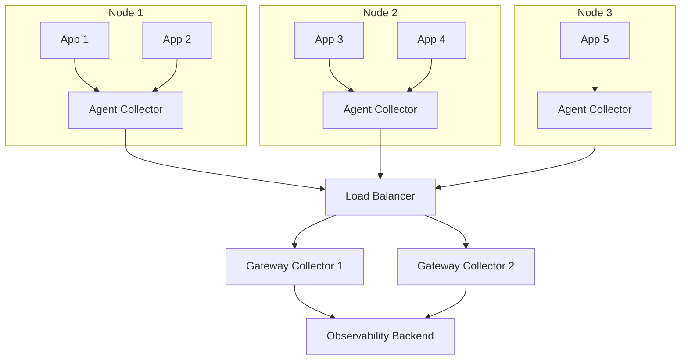

# How to Configure Gateway Pattern in OpenTelemetry

Author: [nawazdhandala](https://www.github.com/nawazdhandala)

Tags: OpenTelemetry, Gateway Pattern, Collector, Architecture, Observability, Scalability, Telemetry Pipeline

Description: Learn how to configure the gateway pattern in OpenTelemetry for centralized telemetry collection. This guide covers architecture decisions, load balancing, and configuration examples for production deployments.

---

As your infrastructure grows, sending telemetry directly from every application to your observability backend becomes impractical. The gateway pattern introduces a centralized collection layer that provides buffering, processing, and fan-out capabilities.

This guide covers how to implement the gateway pattern with OpenTelemetry Collectors.

## What is the Gateway Pattern?

In the gateway pattern, applications send telemetry to local collectors (agents), which then forward data to a centralized gateway collector. The gateway handles heavy processing, authentication, and export to backends.



## Why Use the Gateway Pattern?

| Benefit | Description |
|---------|-------------|
| Centralized processing | Apply sampling, filtering, and transformation once at the gateway |
| Reduced backend connections | Many agents connect to few gateways, gateways connect to backend |
| Buffering | Gateway can buffer during backend outages |
| Security | Only gateways need credentials for the backend |
| Simplified agents | Agents stay lightweight, gateways handle heavy lifting |

## Agent Collector Configuration

The agent collector runs on each node alongside your applications. Keep it lightweight.

```yaml
# agent-collector-config.yaml
receivers:
  otlp:
    protocols:
      grpc:
        endpoint: 0.0.0.0:4317
      http:
        endpoint: 0.0.0.0:4318

processors:
  # Memory limiter to prevent OOM on the node
  memory_limiter:
    check_interval: 1s
    limit_mib: 256
    spike_limit_mib: 64

  # Basic batching before sending to gateway
  batch:
    send_batch_size: 512
    timeout: 5s

  # Add node-level resource attributes
  resource:
    attributes:
      - key: host.name
        from_attribute: host.name
        action: upsert
      - key: k8s.node.name
        value: ${K8S_NODE_NAME}
        action: upsert

exporters:
  # Send to gateway via OTLP
  otlp:
    endpoint: "gateway-collector.observability.svc.cluster.local:4317"
    tls:
      insecure: true  # Use TLS in production
    retry_on_failure:
      enabled: true
      initial_interval: 5s
      max_interval: 30s
      max_elapsed_time: 120s

service:
  pipelines:
    traces:
      receivers: [otlp]
      processors: [memory_limiter, batch, resource]
      exporters: [otlp]
    metrics:
      receivers: [otlp]
      processors: [memory_limiter, batch, resource]
      exporters: [otlp]
    logs:
      receivers: [otlp]
      processors: [memory_limiter, batch, resource]
      exporters: [otlp]
```

## Gateway Collector Configuration

The gateway collector handles the heavy processing and exports to your backend.

```yaml
# gateway-collector-config.yaml
receivers:
  otlp:
    protocols:
      grpc:
        endpoint: 0.0.0.0:4317
        max_recv_msg_size_mib: 16  # Allow larger messages from agents
      http:
        endpoint: 0.0.0.0:4318

processors:
  # Memory limiter with higher limits for gateway
  memory_limiter:
    check_interval: 1s
    limit_mib: 2048
    spike_limit_mib: 512

  # Larger batch sizes for efficient export
  batch:
    send_batch_size: 2000
    send_batch_max_size: 3000
    timeout: 10s

  # Tail sampling at the gateway level
  tail_sampling:
    decision_wait: 10s
    num_traces: 100000
    expected_new_traces_per_sec: 1000
    policies:
      - name: errors
        type: status_code
        status_code:
          status_codes: [ERROR]
      - name: high-latency
        type: latency
        latency:
          threshold_ms: 1000
      - name: probabilistic
        type: probabilistic
        probabilistic:
          sampling_percentage: 10

  # Filter out noisy spans
  filter:
    traces:
      span:
        - 'attributes["http.target"] == "/health"'
        - 'attributes["http.target"] == "/ready"'
        - 'attributes["http.target"] == "/metrics"'

  # Add environment-level attributes
  resource:
    attributes:
      - key: deployment.environment
        value: ${DEPLOY_ENV}
        action: upsert
      - key: collector.gateway
        value: "true"
        action: upsert

exporters:
  otlphttp:
    endpoint: "https://oneuptime.com/otlp"
    headers:
      "x-oneuptime-token": "${ONEUPTIME_TOKEN}"
    retry_on_failure:
      enabled: true
      initial_interval: 5s
      max_interval: 60s
      max_elapsed_time: 300s
    sending_queue:
      enabled: true
      num_consumers: 20
      queue_size: 50000

service:
  pipelines:
    traces:
      receivers: [otlp]
      processors: [memory_limiter, filter, tail_sampling, batch, resource]
      exporters: [otlphttp]
    metrics:
      receivers: [otlp]
      processors: [memory_limiter, batch, resource]
      exporters: [otlphttp]
    logs:
      receivers: [otlp]
      processors: [memory_limiter, filter, batch, resource]
      exporters: [otlphttp]
```

## Kubernetes Deployment

### Agent DaemonSet

Deploy agents as a DaemonSet so every node gets one:

```yaml
# agent-daemonset.yaml
apiVersion: apps/v1
kind: DaemonSet
metadata:
  name: otel-agent
  namespace: observability
spec:
  selector:
    matchLabels:
      app: otel-agent
  template:
    metadata:
      labels:
        app: otel-agent
    spec:
      containers:
        - name: collector
          image: otel/opentelemetry-collector-contrib:latest
          args:
            - --config=/conf/agent-config.yaml
          ports:
            - containerPort: 4317
              hostPort: 4317
              protocol: TCP
            - containerPort: 4318
              hostPort: 4318
              protocol: TCP
          env:
            - name: K8S_NODE_NAME
              valueFrom:
                fieldRef:
                  fieldPath: spec.nodeName
          resources:
            limits:
              cpu: 500m
              memory: 512Mi
            requests:
              cpu: 100m
              memory: 128Mi
          volumeMounts:
            - name: config
              mountPath: /conf
      volumes:
        - name: config
          configMap:
            name: otel-agent-config
```

### Gateway Deployment

Deploy gateways as a Deployment with multiple replicas:

```yaml
# gateway-deployment.yaml
apiVersion: apps/v1
kind: Deployment
metadata:
  name: otel-gateway
  namespace: observability
spec:
  replicas: 3
  selector:
    matchLabels:
      app: otel-gateway
  template:
    metadata:
      labels:
        app: otel-gateway
    spec:
      containers:
        - name: collector
          image: otel/opentelemetry-collector-contrib:latest
          args:
            - --config=/conf/gateway-config.yaml
          ports:
            - containerPort: 4317
              protocol: TCP
            - containerPort: 4318
              protocol: TCP
          env:
            - name: DEPLOY_ENV
              value: "production"
            - name: ONEUPTIME_TOKEN
              valueFrom:
                secretKeyRef:
                  name: oneuptime-credentials
                  key: token
          resources:
            limits:
              cpu: 2
              memory: 4Gi
            requests:
              cpu: 500m
              memory: 1Gi
          volumeMounts:
            - name: config
              mountPath: /conf
      volumes:
        - name: config
          configMap:
            name: otel-gateway-config
---
apiVersion: v1
kind: Service
metadata:
  name: otel-gateway
  namespace: observability
spec:
  selector:
    app: otel-gateway
  ports:
    - name: otlp-grpc
      port: 4317
      targetPort: 4317
    - name: otlp-http
      port: 4318
      targetPort: 4318
```

## Load Balancing Strategies

### Round Robin (Default)

The Kubernetes Service provides round-robin load balancing by default. This works well for stateless processing.

### Consistent Hashing for Tail Sampling

Tail sampling requires all spans from a trace to arrive at the same gateway instance. Use the load balancing exporter:

```yaml
# agent-config-with-lb.yaml
exporters:
  loadbalancing:
    protocol:
      otlp:
        tls:
          insecure: true
    resolver:
      dns:
        hostname: otel-gateway-headless.observability.svc.cluster.local
        port: 4317
    routing_key: traceID  # Route by trace ID for tail sampling

service:
  pipelines:
    traces:
      receivers: [otlp]
      processors: [memory_limiter, batch]
      exporters: [loadbalancing]
```

Create a headless service for the load balancing exporter to discover gateway pods:

```yaml
# gateway-headless-service.yaml
apiVersion: v1
kind: Service
metadata:
  name: otel-gateway-headless
  namespace: observability
spec:
  clusterIP: None
  selector:
    app: otel-gateway
  ports:
    - name: otlp-grpc
      port: 4317
      targetPort: 4317
```

## High Availability Configuration

### Gateway Redundancy

Deploy gateways across availability zones:

```yaml
# gateway-deployment-ha.yaml
spec:
  replicas: 3
  template:
    spec:
      affinity:
        podAntiAffinity:
          preferredDuringSchedulingIgnoredDuringExecution:
            - weight: 100
              podAffinityTerm:
                labelSelector:
                  matchLabels:
                    app: otel-gateway
                topologyKey: topology.kubernetes.io/zone
```

### Persistent Queuing

Enable persistent queues to survive gateway restarts:

```yaml
# gateway-config-persistent.yaml
extensions:
  file_storage:
    directory: /var/lib/otelcol/queue
    timeout: 10s

exporters:
  otlphttp:
    endpoint: "https://oneuptime.com/otlp"
    sending_queue:
      enabled: true
      storage: file_storage
      queue_size: 100000

service:
  extensions: [file_storage]
```

## Monitoring the Gateway

Enable internal metrics to monitor gateway health:

```yaml
# gateway-config-monitoring.yaml
service:
  telemetry:
    metrics:
      level: detailed
      address: 0.0.0.0:8888

  pipelines:
    # Your existing pipelines
```

Key metrics to watch:

| Metric | Description | Alert Threshold |
|--------|-------------|-----------------|
| `otelcol_receiver_accepted_spans` | Spans received | Sudden drop |
| `otelcol_exporter_sent_spans` | Spans exported | Divergence from received |
| `otelcol_exporter_queue_size` | Current queue size | > 80% capacity |
| `otelcol_processor_dropped_spans` | Dropped spans | > 0 sustained |

## Scaling Guidelines

| Telemetry Volume | Agent Resources | Gateway Replicas | Gateway Resources |
|------------------|-----------------|------------------|-------------------|
| < 10K spans/sec  | 0.5 CPU, 256MB  | 2                | 1 CPU, 2GB        |
| 10K-50K spans/sec| 0.5 CPU, 512MB  | 3                | 2 CPU, 4GB        |
| 50K-200K spans/sec| 1 CPU, 1GB     | 5                | 4 CPU, 8GB        |
| > 200K spans/sec | 1 CPU, 1GB      | 10+              | 8 CPU, 16GB       |

## Summary

The gateway pattern provides a scalable architecture for telemetry collection. Lightweight agents run on each node, handling basic processing and forwarding. Centralized gateways handle heavy processing like tail sampling, filtering, and transformation.

Key implementation points:
- Deploy agents as DaemonSets for node-level collection
- Deploy gateways as Deployments with multiple replicas
- Use consistent hashing (load balancing exporter) when tail sampling
- Enable persistent queuing for reliability
- Monitor gateway health with internal metrics

This architecture scales from small deployments to handling millions of spans per second.
