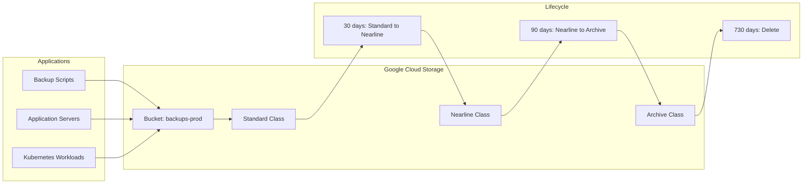

# How to Implement GCS for Object Storage

Author: [nawazdhandala](https://www.github.com/nawazdhandala)

Tags: Google Cloud, GCS, Object Storage, Backup, Cloud Storage

Description: A practical guide to using Google Cloud Storage for backups and application data, covering bucket configuration, storage classes, lifecycle rules, and integration with backup tools.

---

Google Cloud Storage (GCS) offers object storage with strong consistency, multiple storage classes, and global availability. For backup strategies, it provides fine-grained access control, lifecycle management, and seamless integration with other Google Cloud services. This guide walks through GCS configuration from bucket creation to automated backup workflows.

## Why GCS for Backups?

GCS provides several advantages for backup storage:

1. **Strong consistency:** Writes are immediately visible to reads. No eventual consistency surprises.
2. **Storage classes:** Standard, Nearline, Coldline, and Archive for cost optimization.
3. **Object versioning:** Keep historical versions automatically.
4. **Retention policies:** Lock objects for compliance requirements.
5. **gsutil and SDKs:** Powerful CLI and native client libraries.

The tradeoff is that egress costs can add up quickly when restoring large datasets.

## GCS Architecture



## Setting Up GCS

Install and configure the Google Cloud CLI:

```bash
# Install gcloud CLI (Debian/Ubuntu)
echo "deb [signed-by=/usr/share/keyrings/cloud.google.gpg] https://packages.cloud.google.com/apt cloud-sdk main" | sudo tee /etc/apt/sources.list.d/google-cloud-sdk.list
curl https://packages.cloud.google.com/apt/doc/apt-key.gpg | sudo apt-key --keyring /usr/share/keyrings/cloud.google.gpg add -
sudo apt update && sudo apt install google-cloud-cli

# Authenticate
gcloud auth login

# Set project
gcloud config set project my-project-id

# Install gsutil (included with gcloud CLI)
gsutil version
```

## Creating Buckets

Create a bucket with appropriate settings:

```bash
# Create a bucket with standard storage class
gsutil mb -l us-central1 -c standard gs://company-backups-prod

# Create with specific options
gsutil mb \
    -l us-central1 \
    -c standard \
    -b on \
    --pap enforced \
    gs://company-backups-prod

# Enable uniform bucket-level access
gsutil uniformbucketlevelaccess set on gs://company-backups-prod

# Block public access
gsutil pap set enforced gs://company-backups-prod
```

Options explained:
- `-l`: Location (region or multi-region)
- `-c`: Storage class (standard, nearline, coldline, archive)
- `-b on`: Enable object versioning
- `--pap enforced`: Public access prevention

## Storage Classes

| Class | Minimum Storage Duration | Use Case | Price (per GB/month) |
|-------|-------------------------|----------|---------------------|
| Standard | None | Frequent access | $0.020 |
| Nearline | 30 days | Monthly access | $0.010 |
| Coldline | 90 days | Quarterly access | $0.004 |
| Archive | 365 days | Yearly access | $0.0012 |

Set storage class on upload:

```bash
# Upload with specific storage class
gsutil -o "GSUtil:default_storage_class=nearline" cp backup.tar.gz gs://company-backups-prod/

# Change storage class of existing object
gsutil rewrite -s coldline gs://company-backups-prod/old-backup.tar.gz
```

## Object Versioning

Enable versioning to keep historical copies:

```bash
# Enable versioning
gsutil versioning set on gs://company-backups-prod

# Check versioning status
gsutil versioning get gs://company-backups-prod

# List all versions of an object
gsutil ls -a gs://company-backups-prod/backup.tar.gz

# Download specific version
gsutil cp gs://company-backups-prod/backup.tar.gz#1706140800000000 ./backup-old.tar.gz

# Delete specific version
gsutil rm gs://company-backups-prod/backup.tar.gz#1706140800000000
```

## Lifecycle Management

Configure lifecycle rules to automate storage class transitions and deletion:

```json
{
    "lifecycle": {
        "rule": [
            {
                "action": {
                    "type": "SetStorageClass",
                    "storageClass": "NEARLINE"
                },
                "condition": {
                    "age": 30,
                    "matchesStorageClass": ["STANDARD"]
                }
            },
            {
                "action": {
                    "type": "SetStorageClass",
                    "storageClass": "COLDLINE"
                },
                "condition": {
                    "age": 90,
                    "matchesStorageClass": ["NEARLINE"]
                }
            },
            {
                "action": {
                    "type": "SetStorageClass",
                    "storageClass": "ARCHIVE"
                },
                "condition": {
                    "age": 365,
                    "matchesStorageClass": ["COLDLINE"]
                }
            },
            {
                "action": {
                    "type": "Delete"
                },
                "condition": {
                    "age": 730,
                    "isLive": true
                }
            },
            {
                "action": {
                    "type": "Delete"
                },
                "condition": {
                    "numNewerVersions": 5,
                    "isLive": false
                }
            }
        ]
    }
}
```

Apply lifecycle configuration:

```bash
gsutil lifecycle set lifecycle.json gs://company-backups-prod

# View current lifecycle rules
gsutil lifecycle get gs://company-backups-prod
```

## Uploading Backups

Upload files efficiently with gsutil:

```bash
# Upload a single file
gsutil cp backup.tar.gz gs://company-backups-prod/daily/

# Upload with parallel composite uploads (faster for large files)
gsutil -o GSUtil:parallel_composite_upload_threshold=150M \
    cp large-backup.tar.gz gs://company-backups-prod/

# Upload directory recursively
gsutil -m cp -r ./backup-dir/ gs://company-backups-prod/daily/

# Sync directory (only upload changed files)
gsutil -m rsync -r ./backup-dir/ gs://company-backups-prod/daily/

# Upload with metadata
gsutil -h "x-goog-meta-hostname:web-01" \
    -h "x-goog-meta-backup-type:daily" \
    cp backup.tar.gz gs://company-backups-prod/daily/
```

The `-m` flag enables parallel operations for better throughput.

## Backup Script Example

Complete backup script with error handling:

```bash
#!/bin/bash
# gcs-backup.sh

set -euo pipefail

# Configuration
BUCKET="gs://company-backups-prod"
PREFIX="servers/$(hostname)"
TIMESTAMP=$(date +%Y-%m-%d-%H%M%S)
BACKUP_DIR="/tmp/backup-${TIMESTAMP}"
LOG_FILE="/var/log/gcs-backup.log"

# Logging
log() {
    echo "[$(date '+%Y-%m-%d %H:%M:%S')] $1" | tee -a "$LOG_FILE"
}

# Error handling
cleanup() {
    rm -rf "$BACKUP_DIR"
}
trap cleanup EXIT

log "Starting backup to GCS"

# Create backup directory
mkdir -p "$BACKUP_DIR"

# Dump database
log "Creating database dump"
pg_dump -h localhost -U appuser -d appdb -F c \
    -f "$BACKUP_DIR/database.dump"

# Archive application files
log "Archiving application files"
tar -czf "$BACKUP_DIR/app-files.tar.gz" \
    --exclude='*.log' \
    --exclude='cache/*' \
    /var/www/app

# Upload to GCS
log "Uploading to GCS"
gsutil -m cp -r "$BACKUP_DIR/" "${BUCKET}/${PREFIX}/${TIMESTAMP}/"

# Create latest marker
echo "$TIMESTAMP" | gsutil cp - "${BUCKET}/${PREFIX}/LATEST"

# Verify upload
log "Verifying upload"
gsutil ls -l "${BUCKET}/${PREFIX}/${TIMESTAMP}/"

log "Backup completed successfully"
```

## Service Account Authentication

For automated backups, use a service account:

```bash
# Create service account
gcloud iam service-accounts create backup-service \
    --display-name="Backup Service Account"

# Grant storage permissions
gcloud projects add-iam-policy-binding my-project-id \
    --member="serviceAccount:backup-service@my-project-id.iam.gserviceaccount.com" \
    --role="roles/storage.objectAdmin"

# Create and download key
gcloud iam service-accounts keys create ~/backup-service-key.json \
    --iam-account=backup-service@my-project-id.iam.gserviceaccount.com

# Use in backup scripts
export GOOGLE_APPLICATION_CREDENTIALS=~/backup-service-key.json
gsutil cp backup.tar.gz gs://company-backups-prod/
```

## Python SDK Example

Use the Google Cloud Storage Python client:

```python
#!/usr/bin/env python3
# gcs_backup.py

import os
import datetime
from google.cloud import storage

def upload_backup(local_file, bucket_name, blob_name):
    """Upload a backup file to GCS."""

    # Initialize client (uses GOOGLE_APPLICATION_CREDENTIALS)
    storage_client = storage.Client()

    bucket = storage_client.bucket(bucket_name)
    blob = bucket.blob(blob_name)

    # Set metadata
    blob.metadata = {
        "backup_date": datetime.datetime.now().isoformat(),
        "hostname": os.uname().nodename,
        "source_file": local_file
    }

    # Upload with progress callback for large files
    blob.upload_from_filename(local_file)

    print(f"Uploaded {local_file} to gs://{bucket_name}/{blob_name}")

def list_backups(bucket_name, prefix=""):
    """List backups in a bucket."""

    storage_client = storage.Client()
    bucket = storage_client.bucket(bucket_name)

    blobs = bucket.list_blobs(prefix=prefix)

    for blob in blobs:
        print(f"{blob.name} - {blob.size} bytes - {blob.updated}")

def download_latest(bucket_name, prefix, destination):
    """Download the latest backup."""

    storage_client = storage.Client()
    bucket = storage_client.bucket(bucket_name)

    # Get latest marker
    latest_blob = bucket.blob(f"{prefix}/LATEST")
    latest_timestamp = latest_blob.download_as_text().strip()

    # Download backup files
    blobs = bucket.list_blobs(prefix=f"{prefix}/{latest_timestamp}/")

    for blob in blobs:
        local_path = os.path.join(destination, os.path.basename(blob.name))
        blob.download_to_filename(local_path)
        print(f"Downloaded {blob.name} to {local_path}")

if __name__ == "__main__":
    today = datetime.date.today().isoformat()

    upload_backup(
        local_file="./backup.tar.gz",
        bucket_name="company-backups-prod",
        blob_name=f"servers/web-01/{today}/backup.tar.gz"
    )

    print("\nRecent backups:")
    list_backups("company-backups-prod", prefix="servers/web-01")
```

## Retention Policies and Object Locks

For compliance, configure retention policies:

```bash
# Set retention policy (minimum 1 day)
gsutil retention set 365d gs://company-backups-compliance

# Lock retention policy (irreversible!)
gsutil retention lock gs://company-backups-compliance

# Set temporary hold on specific object
gsutil retention temp set gs://company-backups-compliance/critical-backup.tar.gz

# Release temporary hold
gsutil retention temp release gs://company-backups-compliance/critical-backup.tar.gz
```

## Monitoring and Alerting

Set up monitoring for backup operations:

```bash
# Create sink for audit logs
gcloud logging sinks create gcs-backup-audit \
    storage.googleapis.com/company-backup-logs \
    --log-filter='resource.type="gcs_bucket" AND protoPayload.methodName=~"storage.objects.(create|delete)"'

# Create alert policy for failed uploads
gcloud alpha monitoring policies create \
    --display-name="GCS Backup Failures" \
    --condition-display-name="Upload Failures" \
    --condition-filter='resource.type="gcs_bucket" AND metric.type="storage.googleapis.com/api/request_count" AND metric.label.response_code!="OK"' \
    --notification-channels="projects/my-project/notificationChannels/123"
```

## Integration with Backup Tools

### Restic with GCS

```bash
export GOOGLE_PROJECT_ID=my-project-id
export GOOGLE_APPLICATION_CREDENTIALS=/path/to/service-account.json
export RESTIC_REPOSITORY="gs:company-backups-prod:/restic"
export RESTIC_PASSWORD_FILE=/etc/restic/password

restic init
restic backup /var/www/app
restic forget --keep-daily 7 --keep-weekly 4 --prune
```

### Velero with GCS

```bash
velero install \
    --provider gcp \
    --plugins velero/velero-plugin-for-gcp:v1.9.0 \
    --bucket company-backups-prod \
    --secret-file ./credentials-velero
```

## Cost Optimization

1. **Use lifecycle rules aggressively.** Moving data to Archive class saves significant money over time.

2. **Enable object composition for large files.** Reduces failed upload costs.

3. **Use regional buckets when possible.** Multi-region is more expensive and usually unnecessary for backups.

4. **Monitor egress.** Restoring from GCS incurs egress charges. Use `gsutil -m` for parallel downloads to minimize time.

5. **Delete old versions.** Configure lifecycle rules to limit the number of noncurrent versions retained.

## Best Practices

1. **Enable versioning from the start.** You cannot recover from accidental overwrites without it.

2. **Use uniform bucket-level access.** Simplifies permission management and improves security.

3. **Test restores regularly.** Download and verify backups monthly. Automate verification where possible.

4. **Encrypt sensitive data client-side.** GCS encrypts at rest, but client-side encryption adds another layer for sensitive backups.

5. **Use signed URLs for temporary access.** Avoid distributing service account keys.

## Wrapping Up

GCS provides a solid foundation for backup strategies with its strong consistency, flexible storage classes, and powerful CLI tools. Start with lifecycle rules that transition data through storage classes automatically, enable versioning for point-in-time recovery, and use service accounts for automated workflows. The goal is a backup system that runs without intervention and survives the disasters you have not thought of yet.
