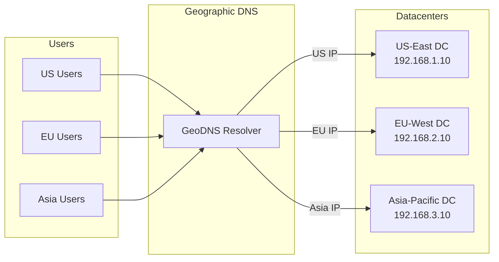

# How to Implement Geographic Load Balancing

Author: [nawazdhandala](https://www.github.com/nawazdhandala)

Tags: Load Balancing, GeoDNS, Networking, CDN, Latency, Global Infrastructure, High Availability

Description: A hands-on guide to implementing geographic load balancing that routes users to the nearest server. Learn how to reduce latency, improve reliability, and configure geo-aware traffic distribution.

---

Geographic load balancing routes users to servers based on their physical location. When a user in Tokyo requests your service, they connect to your Asia datacenter rather than one in Virginia. This reduces latency and improves the user experience while also providing resilience against regional outages.

## Why Geographic Load Balancing Matters

Consider the physics: light travels through fiber at roughly 200,000 km/s. A round trip from New York to Singapore (15,000 km) takes at minimum 150ms just for the speed of light, before any processing. Geographic load balancing eliminates this unnecessary latency.



## GeoDNS with PowerDNS and GeoIP

PowerDNS combined with the GeoIP backend provides a solid foundation for geographic routing:

```bash
# Install PowerDNS with GeoIP backend
sudo apt-get update
sudo apt-get install pdns-server pdns-backend-geoip

# Download MaxMind GeoLite2 database
# Note: Requires free registration at maxmind.com
wget -O /usr/share/GeoIP/GeoLite2-City.mmdb \
    "https://download.maxmind.com/app/geoip_download?edition_id=GeoLite2-City&suffix=tar.gz"
```

Configure PowerDNS to use GeoIP:

```yaml
# /etc/pdns/pdns.conf
launch=geoip
geoip-database-files=/usr/share/GeoIP/GeoLite2-City.mmdb
geoip-zones-file=/etc/pdns/geo-zones.yaml
```

Define geographic zones and records:

```yaml
# /etc/pdns/geo-zones.yaml
domains:
  - domain: example.com
    ttl: 300
    records:
      # Default record for unknown locations
      api.example.com:
        - a:
            content: 192.168.1.10
            ttl: 60

      # Geographic overrides
      api.example.com:
        - a:
            content: 192.168.1.10  # US East
            ttl: 60
            geoip:
              continents: ["NA"]
              countries: ["US", "CA", "MX"]

        - a:
            content: 192.168.2.10  # EU West
            ttl: 60
            geoip:
              continents: ["EU"]

        - a:
            content: 192.168.3.10  # Asia Pacific
            ttl: 60
            geoip:
              continents: ["AS", "OC"]
              countries: ["JP", "KR", "AU", "SG", "IN"]

    services:
      # Health check configuration
      api.example.com:
        default: ["192.168.1.10"]
```

## Implementing with BIND and GeoIP Views

BIND supports geographic routing through views that match client subnets:

```bash
# /etc/named.conf - BIND with geographic views

# Define ACLs for different regions based on IP ranges
# These are simplified examples - real deployments use full GeoIP databases

acl "north_america" {
    3.0.0.0/8;      # Amazon US
    8.0.0.0/8;      # Level3 US
    12.0.0.0/8;     # AT&T
    # Add more North American ranges
};

acl "europe" {
    2.0.0.0/8;      # European ranges
    5.0.0.0/8;
    31.0.0.0/8;
    # Add more European ranges
};

acl "asia_pacific" {
    1.0.0.0/8;      # APNIC ranges
    14.0.0.0/8;
    27.0.0.0/8;
    # Add more APNIC ranges
};

# View for North American clients
view "north_america" {
    match-clients { north_america; };

    zone "example.com" {
        type master;
        file "/var/named/zones/na.example.com.zone";
    };
};

# View for European clients
view "europe" {
    match-clients { europe; };

    zone "example.com" {
        type master;
        file "/var/named/zones/eu.example.com.zone";
    };
};

# View for Asia-Pacific clients
view "asia_pacific" {
    match-clients { asia_pacific; };

    zone "example.com" {
        type master;
        file "/var/named/zones/ap.example.com.zone";
    };
};

# Default view for everyone else
view "default" {
    match-clients { any; };

    zone "example.com" {
        type master;
        file "/var/named/zones/default.example.com.zone";
    };
};
```

Create region-specific zone files:

```bash
# /var/named/zones/na.example.com.zone
$TTL 60
@   IN  SOA ns1.example.com. admin.example.com. (
        2026012501 3600 600 86400 60
)
@       IN  NS      ns1.example.com.
ns1     IN  A       10.0.1.1

; North American servers
api     IN  A       192.168.1.10
api     IN  A       192.168.1.11
www     IN  A       192.168.1.20
```

## AWS Route 53 Geolocation Routing

Route 53 offers built-in geolocation routing with health checks:

```python
# route53_geo_setup.py - Configure geolocation routing in Route 53
import boto3

route53 = boto3.client('route53')
hosted_zone_id = 'Z1234567890ABC'

# Regional endpoints
regions = [
    {
        'name': 'us-east',
        'ip': '54.1.2.3',
        'location': {'ContinentCode': 'NA'},
        'description': 'North America'
    },
    {
        'name': 'eu-west',
        'ip': '52.4.5.6',
        'location': {'ContinentCode': 'EU'},
        'description': 'Europe'
    },
    {
        'name': 'ap-northeast',
        'ip': '13.7.8.9',
        'location': {'ContinentCode': 'AS'},
        'description': 'Asia'
    },
    {
        'name': 'default',
        'ip': '54.1.2.3',  # Fallback to US
        'location': {'CountryCode': '*'},  # Default location
        'description': 'Default (fallback)'
    }
]

def create_health_check(region_name: str, ip: str) -> str:
    """Create health check for regional endpoint"""
    response = route53.create_health_check(
        CallerReference=f"geo-{region_name}-{ip}",
        HealthCheckConfig={
            'IPAddress': ip,
            'Port': 443,
            'Type': 'HTTPS',
            'ResourcePath': '/health',
            'RequestInterval': 10,
            'FailureThreshold': 2,
            'EnableSNI': True,
        }
    )
    return response['HealthCheck']['Id']

def create_geolocation_record(record_name: str, region: dict, health_check_id: str):
    """Create a geolocation-based DNS record"""

    record_set = {
        'Name': f'{record_name}.example.com',
        'Type': 'A',
        'SetIdentifier': region['name'],
        'GeoLocation': region['location'],
        'TTL': 60,
        'ResourceRecords': [{'Value': region['ip']}],
    }

    # Add health check for non-default records
    if region['name'] != 'default':
        record_set['HealthCheckId'] = health_check_id

    route53.change_resource_record_sets(
        HostedZoneId=hosted_zone_id,
        ChangeBatch={
            'Changes': [{
                'Action': 'UPSERT',
                'ResourceRecordSet': record_set
            }]
        }
    )

# Create records for each region
for region in regions:
    health_check_id = None
    if region['name'] != 'default':
        health_check_id = create_health_check(region['name'], region['ip'])

    create_geolocation_record('api', region, health_check_id)
    print(f"Created geolocation record for {region['description']}")
```

## Latency-Based Routing

Sometimes geographic proximity does not equal lowest latency. Latency-based routing measures actual round-trip times:

```python
# latency_routing.py - Route based on measured latency
import subprocess
import json
from dataclasses import dataclass
from typing import List

@dataclass
class Endpoint:
    name: str
    ip: str
    region: str
    latency_ms: float = 0.0

def measure_latency(ip: str, count: int = 5) -> float:
    """Measure average latency to an endpoint using ping"""
    try:
        result = subprocess.run(
            ['ping', '-c', str(count), '-q', ip],
            capture_output=True,
            text=True,
            timeout=30
        )

        # Parse average from ping output
        # Example: rtt min/avg/max/mdev = 1.234/2.345/3.456/0.567 ms
        for line in result.stdout.split('\n'):
            if 'avg' in line:
                parts = line.split('=')[1].split('/')
                return float(parts[1])

        return float('inf')
    except Exception:
        return float('inf')

def select_best_endpoint(endpoints: List[Endpoint]) -> Endpoint:
    """Select endpoint with lowest latency"""
    for endpoint in endpoints:
        endpoint.latency_ms = measure_latency(endpoint.ip)
        print(f"  {endpoint.name}: {endpoint.latency_ms:.2f}ms")

    # Sort by latency and return the best
    endpoints.sort(key=lambda e: e.latency_ms)
    return endpoints[0]

# Define endpoints
endpoints = [
    Endpoint("us-east", "192.168.1.10", "Virginia"),
    Endpoint("eu-west", "192.168.2.10", "Ireland"),
    Endpoint("ap-northeast", "192.168.3.10", "Tokyo"),
]

print("Measuring latency to endpoints:")
best = select_best_endpoint(endpoints)
print(f"\nBest endpoint: {best.name} ({best.region}) at {best.latency_ms:.2f}ms")
```

## Combining Geo Routing with Health Checks

A robust implementation needs failover when regional endpoints fail:

```python
# geo_health_router.py - Geographic routing with health-based failover
import requests
import time
from dataclasses import dataclass
from typing import List, Optional
import geoip2.database

@dataclass
class RegionalEndpoint:
    region: str
    primary_ip: str
    backup_ip: str
    countries: List[str]
    healthy: bool = True

class GeoRouter:
    def __init__(self, geoip_db_path: str):
        self.geoip_reader = geoip2.database.Reader(geoip_db_path)
        self.endpoints: List[RegionalEndpoint] = []
        self.default_endpoint: Optional[RegionalEndpoint] = None

    def add_endpoint(self, endpoint: RegionalEndpoint, is_default: bool = False):
        """Register a regional endpoint"""
        self.endpoints.append(endpoint)
        if is_default:
            self.default_endpoint = endpoint

    def check_health(self, ip: str) -> bool:
        """Check if an endpoint is healthy"""
        try:
            response = requests.get(
                f"http://{ip}/health",
                timeout=5
            )
            return response.status_code == 200
        except requests.RequestException:
            return False

    def update_health_status(self):
        """Update health status for all endpoints"""
        for endpoint in self.endpoints:
            endpoint.healthy = self.check_health(endpoint.primary_ip)
            status = "healthy" if endpoint.healthy else "unhealthy"
            print(f"Region {endpoint.region}: {status}")

    def get_client_country(self, client_ip: str) -> str:
        """Lookup country for a client IP"""
        try:
            response = self.geoip_reader.country(client_ip)
            return response.country.iso_code
        except Exception:
            return "UNKNOWN"

    def route(self, client_ip: str) -> str:
        """Route a client to the appropriate endpoint IP"""
        country = self.get_client_country(client_ip)

        # Find endpoint for client's country
        for endpoint in self.endpoints:
            if country in endpoint.countries:
                if endpoint.healthy:
                    return endpoint.primary_ip
                else:
                    # Try backup if primary is down
                    if self.check_health(endpoint.backup_ip):
                        return endpoint.backup_ip

        # Fallback to default endpoint
        if self.default_endpoint and self.default_endpoint.healthy:
            return self.default_endpoint.primary_ip

        # Last resort: return first healthy endpoint
        for endpoint in self.endpoints:
            if endpoint.healthy:
                return endpoint.primary_ip
            if self.check_health(endpoint.backup_ip):
                return endpoint.backup_ip

        # Everything is down, return primary of default
        return self.default_endpoint.primary_ip if self.default_endpoint else ""

# Example usage
router = GeoRouter("/usr/share/GeoIP/GeoLite2-Country.mmdb")

router.add_endpoint(RegionalEndpoint(
    region="north-america",
    primary_ip="192.168.1.10",
    backup_ip="192.168.1.11",
    countries=["US", "CA", "MX"]
), is_default=True)

router.add_endpoint(RegionalEndpoint(
    region="europe",
    primary_ip="192.168.2.10",
    backup_ip="192.168.2.11",
    countries=["GB", "DE", "FR", "NL", "ES", "IT"]
))

router.add_endpoint(RegionalEndpoint(
    region="asia-pacific",
    primary_ip="192.168.3.10",
    backup_ip="192.168.3.11",
    countries=["JP", "KR", "AU", "SG", "IN"]
))

# Route some example clients
test_ips = [
    ("8.8.8.8", "US client"),
    ("185.199.108.1", "EU client"),
    ("1.1.1.1", "AP client"),
]

router.update_health_status()
for ip, description in test_ips:
    target = router.route(ip)
    print(f"{description} -> {target}")
```

## Testing Geographic Routing

Verify your geo routing works correctly from different locations:

```bash
# Test using DNS servers in different regions
# This shows what IP each region would receive

echo "Testing from US perspective (Google DNS):"
dig @8.8.8.8 api.example.com +short

echo "Testing from EU perspective (Cloudflare London):"
dig @1.1.1.1 api.example.com +short

# Use online tools for more comprehensive testing
# - https://www.whatsmydns.net
# - https://dnschecker.org
```

## Performance Monitoring

Track the effectiveness of your geographic routing:

```python
# geo_metrics.py - Collect geographic routing metrics
from prometheus_client import Counter, Histogram, start_http_server
import time

# Track requests by region
requests_by_region = Counter(
    'geo_requests_total',
    'Total requests by geographic region',
    ['region', 'country']
)

# Track latency by region
latency_by_region = Histogram(
    'geo_request_latency_seconds',
    'Request latency by region',
    ['region'],
    buckets=[.01, .025, .05, .1, .25, .5, 1, 2.5, 5]
)

# Track failovers
failover_events = Counter(
    'geo_failover_total',
    'Geographic failover events',
    ['from_region', 'to_region']
)

def record_request(region: str, country: str, latency: float):
    """Record metrics for a routed request"""
    requests_by_region.labels(region=region, country=country).inc()
    latency_by_region.labels(region=region).observe(latency)

def record_failover(from_region: str, to_region: str):
    """Record a failover event"""
    failover_events.labels(from_region=from_region, to_region=to_region).inc()

if __name__ == '__main__':
    start_http_server(9102)
    print("Metrics server running on :9102")
    while True:
        time.sleep(60)
```

## Conclusion

Geographic load balancing significantly improves user experience by reducing latency and provides resilience against regional failures. Start with GeoDNS for basic geographic routing, add health checks for automatic failover, and consider latency-based routing when geographic proximity does not guarantee the best performance. Monitor your routing effectiveness to ensure users actually reach the nearest healthy endpoint.
