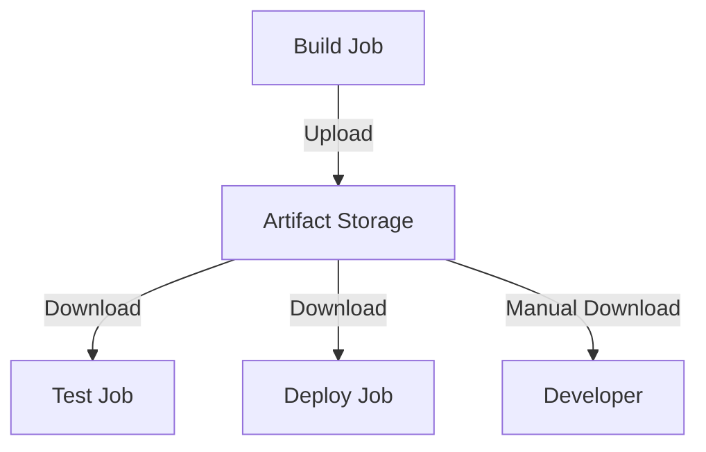

# How to Manage Artifacts in GitHub Actions

Author: [nawazdhandala](https://www.github.com/nawazdhandala)

Tags: GitHub Actions, Artifacts, CI/CD, Build Management, DevOps, Storage

Description: Learn how to upload, download, and manage build artifacts in GitHub Actions. This guide covers artifact sharing between jobs, retention policies, compression strategies, and patterns for efficient artifact handling.

---

Artifacts let you persist data between jobs and store build outputs for later access. Test reports, compiled binaries, Docker images, and coverage data all need to survive beyond the job that created them. This guide shows you how to manage artifacts effectively in GitHub Actions workflows.

## Understanding Artifacts

Artifacts are files produced during workflow runs that you can:
- Share between jobs in the same workflow
- Download after the workflow completes
- Retain for a configurable period



Limitations:
- 500 MB per file (10 GB with compression)
- 10 GB total per workflow run
- Default retention: 90 days (configurable)

## Basic Upload and Download

Upload artifacts from one job and download in another:

```yaml
# .github/workflows/build.yml
name: Build and Test

on: [push]

jobs:
  build:
    runs-on: ubuntu-latest

    steps:
      - uses: actions/checkout@v4

      - name: Build application
        run: npm run build

      # Upload build output
      - name: Upload build artifact
        uses: actions/upload-artifact@v4
        with:
          name: build-output
          path: dist/
          # Keep for 7 days (default is 90)
          retention-days: 7

  test:
    needs: build
    runs-on: ubuntu-latest

    steps:
      - uses: actions/checkout@v4

      # Download build from previous job
      - name: Download build artifact
        uses: actions/download-artifact@v4
        with:
          name: build-output
          path: dist/

      - name: Run tests
        run: npm test
```

## Uploading Multiple Files and Directories

Upload complex directory structures:

```yaml
- name: Upload multiple artifacts
  uses: actions/upload-artifact@v4
  with:
    name: test-results
    path: |
      coverage/
      test-reports/
      screenshots/
    # Exclude certain files
    if-no-files-found: error
```

Upload multiple named artifacts:

```yaml
- name: Upload coverage report
  uses: actions/upload-artifact@v4
  with:
    name: coverage-report
    path: coverage/

- name: Upload test results
  uses: actions/upload-artifact@v4
  with:
    name: test-results
    path: test-reports/

- name: Upload screenshots
  uses: actions/upload-artifact@v4
  with:
    name: screenshots
    path: e2e/screenshots/
```

## Downloading All Artifacts

Download all artifacts at once:

```yaml
jobs:
  report:
    needs: [unit-tests, integration-tests, e2e-tests]
    runs-on: ubuntu-latest

    steps:
      # Download all artifacts to current directory
      - name: Download all artifacts
        uses: actions/download-artifact@v4

      # Each artifact in its own directory
      - name: List artifacts
        run: |
          ls -la
          # unit-test-results/
          # integration-test-results/
          # e2e-test-results/
```

Download with pattern matching:

```yaml
- name: Download test artifacts
  uses: actions/download-artifact@v4
  with:
    pattern: '*-test-results'
    path: all-results/
    merge-multiple: true
```

## Matrix Builds with Artifacts

Handle artifacts from matrix jobs:

```yaml
jobs:
  build:
    runs-on: ${{ matrix.os }}

    strategy:
      matrix:
        os: [ubuntu-latest, windows-latest, macos-latest]
        node: [18, 20]

    steps:
      - uses: actions/checkout@v4

      - name: Setup Node.js
        uses: actions/setup-node@v4
        with:
          node-version: ${{ matrix.node }}

      - name: Build
        run: npm run build

      # Unique artifact name per matrix combination
      - name: Upload artifact
        uses: actions/upload-artifact@v4
        with:
          name: build-${{ matrix.os }}-node${{ matrix.node }}
          path: dist/

  release:
    needs: build
    runs-on: ubuntu-latest

    steps:
      # Download all build artifacts
      - name: Download all builds
        uses: actions/download-artifact@v4
        with:
          pattern: build-*
          path: builds/
          merge-multiple: false

      - name: List builds
        run: |
          ls -la builds/
          # builds/build-ubuntu-latest-node18/
          # builds/build-ubuntu-latest-node20/
          # builds/build-windows-latest-node18/
          # ...
```

## Retention Policies

Configure how long artifacts are kept:

```yaml
- name: Upload with short retention
  uses: actions/upload-artifact@v4
  with:
    name: temporary-files
    path: temp/
    retention-days: 1  # Delete after 1 day

- name: Upload with long retention
  uses: actions/upload-artifact@v4
  with:
    name: release-binaries
    path: release/
    retention-days: 90  # Keep for 90 days
```

Set default retention at the repository level:
Settings > Actions > General > Artifact and log retention

## Compression and Performance

Artifacts are compressed by default. Optimize for large files:

```yaml
- name: Upload large artifact
  uses: actions/upload-artifact@v4
  with:
    name: large-dataset
    path: data/
    # Compression level: 0 (none) to 9 (maximum)
    compression-level: 6
```

For already-compressed files, disable compression:

```yaml
- name: Upload zip files
  uses: actions/upload-artifact@v4
  with:
    name: archives
    path: '*.zip'
    compression-level: 0  # Already compressed
```

## Test Reports and Coverage

Upload and publish test results:

```yaml
jobs:
  test:
    runs-on: ubuntu-latest

    steps:
      - uses: actions/checkout@v4

      - name: Run tests
        run: npm test -- --reporter=junit --outputFile=test-results.xml

      # Upload test results
      - name: Upload test results
        if: always()  # Upload even if tests fail
        uses: actions/upload-artifact@v4
        with:
          name: test-results
          path: test-results.xml

      # Upload coverage
      - name: Upload coverage
        uses: actions/upload-artifact@v4
        with:
          name: coverage
          path: coverage/

  # Publish test results
  publish-results:
    needs: test
    runs-on: ubuntu-latest
    if: always()

    steps:
      - name: Download test results
        uses: actions/download-artifact@v4
        with:
          name: test-results

      - name: Publish test results
        uses: dorny/test-reporter@v1
        with:
          name: Test Results
          path: test-results.xml
          reporter: jest-junit
```

## Sharing Data Between Jobs

Pass complex data using artifacts:

```yaml
jobs:
  analyze:
    runs-on: ubuntu-latest
    outputs:
      report-path: ${{ steps.analyze.outputs.path }}

    steps:
      - uses: actions/checkout@v4

      - name: Run analysis
        id: analyze
        run: |
          npm run analyze > analysis-report.json
          echo "path=analysis-report.json" >> $GITHUB_OUTPUT

      - name: Upload analysis
        uses: actions/upload-artifact@v4
        with:
          name: analysis
          path: analysis-report.json

  report:
    needs: analyze
    runs-on: ubuntu-latest

    steps:
      - name: Download analysis
        uses: actions/download-artifact@v4
        with:
          name: analysis

      - name: Generate report
        run: |
          cat analysis-report.json | jq '.summary'
```

## Build Artifacts for Releases

Create and upload release artifacts:

```yaml
name: Release

on:
  push:
    tags: ['v*']

jobs:
  build:
    runs-on: ${{ matrix.os }}

    strategy:
      matrix:
        include:
          - os: ubuntu-latest
            target: linux-x64
          - os: windows-latest
            target: windows-x64
          - os: macos-latest
            target: darwin-x64

    steps:
      - uses: actions/checkout@v4

      - name: Build
        run: npm run build:${{ matrix.target }}

      - name: Package
        run: |
          mkdir -p release
          tar -czvf release/myapp-${{ matrix.target }}.tar.gz dist/

      - name: Upload release artifact
        uses: actions/upload-artifact@v4
        with:
          name: release-${{ matrix.target }}
          path: release/

  release:
    needs: build
    runs-on: ubuntu-latest

    steps:
      - name: Download all release artifacts
        uses: actions/download-artifact@v4
        with:
          pattern: release-*
          path: release/
          merge-multiple: true

      - name: Create GitHub Release
        uses: softprops/action-gh-release@v1
        with:
          files: release/*
```

## Artifact Cleanup

Delete artifacts programmatically:

```yaml
- name: Delete old artifacts
  uses: geekyeggo/delete-artifact@v4
  with:
    name: temporary-build
    failOnError: false
```

Bulk cleanup using the API:

```yaml
- name: Cleanup old artifacts
  uses: actions/github-script@v7
  with:
    script: |
      const artifacts = await github.rest.actions.listArtifactsForRepo({
        owner: context.repo.owner,
        repo: context.repo.repo,
        per_page: 100
      });

      const cutoffDate = new Date();
      cutoffDate.setDate(cutoffDate.getDate() - 7);

      for (const artifact of artifacts.data.artifacts) {
        const createdAt = new Date(artifact.created_at);
        if (createdAt < cutoffDate) {
          await github.rest.actions.deleteArtifact({
            owner: context.repo.owner,
            repo: context.repo.repo,
            artifact_id: artifact.id
          });
          console.log(`Deleted: ${artifact.name}`);
        }
      }
```

## Conditional Artifact Upload

Upload artifacts based on conditions:

```yaml
- name: Upload on failure
  if: failure()
  uses: actions/upload-artifact@v4
  with:
    name: failure-logs
    path: |
      logs/
      screenshots/

- name: Upload on success
  if: success()
  uses: actions/upload-artifact@v4
  with:
    name: build-output
    path: dist/

- name: Always upload
  if: always()
  uses: actions/upload-artifact@v4
  with:
    name: test-results
    path: test-results/
```

## Downloading Artifacts via API

Access artifacts programmatically:

```bash
# List artifacts for a workflow run
gh api repos/{owner}/{repo}/actions/runs/{run_id}/artifacts

# Download specific artifact
gh run download {run_id} -n {artifact_name}

# Download all artifacts from a run
gh run download {run_id}
```

## Artifacts vs Cache

Choose the right tool:

| Feature | Artifacts | Cache |
|---------|-----------|-------|
| Purpose | Store build outputs | Speed up builds |
| Retention | Configurable (1-90 days) | 7 days unused |
| Size limit | 10 GB per run | 10 GB per repo |
| Sharing | Between jobs, downloadable | Between runs |
| Use case | Test reports, binaries | npm modules, build cache |

Use artifacts for outputs that need to be preserved or downloaded.
Use cache for dependencies that speed up future builds.

## Best Practices

### Use Descriptive Names

```yaml
# Good: Clear purpose
name: coverage-report-unit-tests
name: build-linux-x64-release

# Avoid: Ambiguous
name: output
name: files
```

### Handle Missing Files

```yaml
- name: Upload with error handling
  uses: actions/upload-artifact@v4
  with:
    name: test-results
    path: test-results/
    if-no-files-found: warn  # or 'error' or 'ignore'
```

### Clean Up Temporary Artifacts

```yaml
# Delete intermediate artifacts after use
- name: Delete temporary artifact
  if: always()
  uses: geekyeggo/delete-artifact@v4
  with:
    name: intermediate-build
```

### Document Artifact Contents

```yaml
- name: Generate artifact manifest
  run: |
    echo "Build artifacts generated at $(date)" > manifest.txt
    echo "Git SHA: ${{ github.sha }}" >> manifest.txt
    ls -la dist/ >> manifest.txt

- name: Upload with manifest
  uses: actions/upload-artifact@v4
  with:
    name: build
    path: |
      dist/
      manifest.txt
```

---

Artifacts bridge the gap between jobs and preserve your build outputs. Use them for test reports, compiled binaries, and any data that needs to survive beyond a single job. Keep retention periods appropriate for each artifact type, and clean up temporary artifacts to stay within storage limits. Combined with caching, artifacts make complex multi-job workflows practical.
