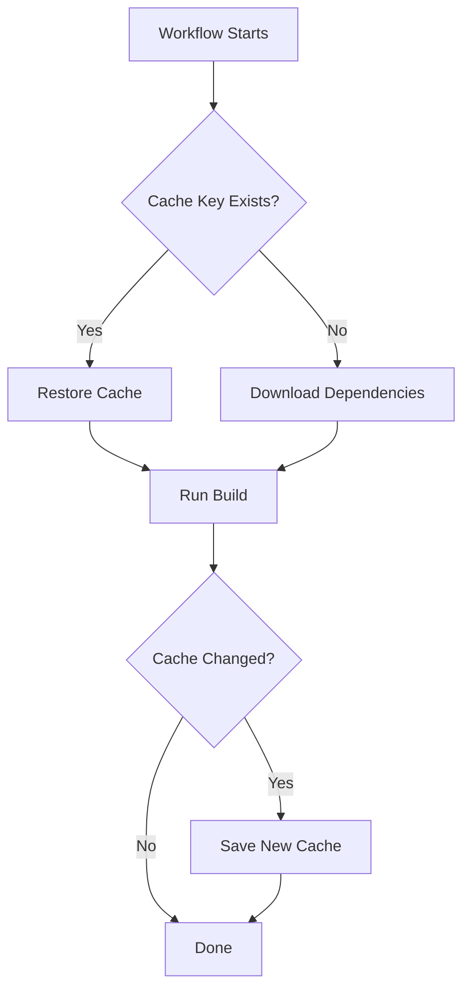

# How to Cache Dependencies in GitHub Actions

Author: [nawazdhandala](https://www.github.com/nawazdhandala)

Tags: GitHub Actions, Caching, CI/CD, Performance, Build Optimization, DevOps

Description: Speed up your GitHub Actions workflows by caching dependencies effectively. Learn caching strategies for npm, pip, Maven, Docker layers, and more with practical examples and cache key patterns.

---

Workflow speed matters. Every minute your CI pipeline spends downloading dependencies is a minute developers wait for feedback. GitHub Actions provides a caching mechanism that can cut build times by 50% or more. This guide shows you how to cache effectively across different languages and build tools.

## How GitHub Actions Caching Works

The cache action stores files between workflow runs using keys. When a cache key matches, files are restored from storage instead of being downloaded or built again.



Cache limits:
- 10 GB total per repository
- Caches unused for 7 days are evicted
- Oldest caches are evicted when the limit is reached

## Basic Caching with actions/cache

The core caching pattern uses the `actions/cache` action:

```yaml
# .github/workflows/build.yml
name: Build with Cache

on: push

jobs:
  build:
    runs-on: ubuntu-latest

    steps:
      - uses: actions/checkout@v4

      # Cache npm dependencies
      - name: Cache node modules
        uses: actions/cache@v4
        with:
          # Path to cache
          path: ~/.npm
          # Cache key based on OS and lockfile
          key: ${{ runner.os }}-npm-${{ hashFiles('**/package-lock.json') }}
          # Fallback keys if exact match not found
          restore-keys: |
            ${{ runner.os }}-npm-

      - name: Install dependencies
        run: npm ci

      - name: Build
        run: npm run build
```

The `hashFiles` function creates a hash of your lockfile. When dependencies change, the hash changes, creating a new cache key.

## Built-in Caching for Setup Actions

Many setup actions include built-in caching. Use these when available:

### Node.js with npm/yarn/pnpm

```yaml
- uses: actions/setup-node@v4
  with:
    node-version: '20'
    cache: 'npm'  # or 'yarn' or 'pnpm'
    cache-dependency-path: 'package-lock.json'
```

### Python with pip

```yaml
- uses: actions/setup-python@v5
  with:
    python-version: '3.12'
    cache: 'pip'
    cache-dependency-path: 'requirements.txt'
```

### Go modules

```yaml
- uses: actions/setup-go@v5
  with:
    go-version: '1.22'
    cache: true  # Automatically caches go modules
```

### Java with Maven

```yaml
- uses: actions/setup-java@v4
  with:
    distribution: 'temurin'
    java-version: '21'
    cache: 'maven'
```

## Advanced Cache Key Strategies

Design cache keys for optimal hit rates:

```yaml
- name: Cache dependencies
  uses: actions/cache@v4
  with:
    path: |
      ~/.npm
      ~/.cache/pip
    key: ${{ runner.os }}-deps-${{ hashFiles('**/package-lock.json', '**/requirements.txt') }}
    restore-keys: |
      ${{ runner.os }}-deps-${{ hashFiles('**/package-lock.json') }}
      ${{ runner.os }}-deps-
```

This key structure provides fallbacks:
1. Exact match on both lockfiles
2. Match on package-lock.json only
3. Any cache for this OS

## Caching Multiple Directories

Cache multiple paths in a single action:

```yaml
- name: Cache build dependencies
  uses: actions/cache@v4
  with:
    path: |
      node_modules
      ~/.npm
      .next/cache
      ~/.gradle/caches
      ~/.gradle/wrapper
    key: ${{ runner.os }}-build-${{ hashFiles('**/package-lock.json', '**/gradle.lockfile') }}
    restore-keys: |
      ${{ runner.os }}-build-
```

## Caching Docker Layers

Speed up Docker builds with layer caching:

```yaml
jobs:
  build:
    runs-on: ubuntu-latest

    steps:
      - uses: actions/checkout@v4

      # Set up Docker buildx with cache support
      - uses: docker/setup-buildx-action@v3

      # Cache Docker layers
      - name: Cache Docker layers
        uses: actions/cache@v4
        with:
          path: /tmp/.buildx-cache
          key: ${{ runner.os }}-buildx-${{ github.sha }}
          restore-keys: |
            ${{ runner.os }}-buildx-

      # Build with cache
      - uses: docker/build-push-action@v5
        with:
          context: .
          push: false
          tags: myapp:latest
          cache-from: type=local,src=/tmp/.buildx-cache
          cache-to: type=local,dest=/tmp/.buildx-cache-new,mode=max

      # Prevent cache from growing unbounded
      - name: Move cache
        run: |
          rm -rf /tmp/.buildx-cache
          mv /tmp/.buildx-cache-new /tmp/.buildx-cache
```

## Language-Specific Caching Examples

### Python with Poetry

```yaml
- name: Cache Poetry dependencies
  uses: actions/cache@v4
  with:
    path: |
      ~/.cache/pypoetry
      .venv
    key: ${{ runner.os }}-poetry-${{ hashFiles('**/poetry.lock') }}
    restore-keys: |
      ${{ runner.os }}-poetry-

- name: Install dependencies
  run: |
    poetry config virtualenvs.in-project true
    poetry install --no-interaction
```

### Ruby with Bundler

```yaml
- name: Cache Ruby gems
  uses: actions/cache@v4
  with:
    path: vendor/bundle
    key: ${{ runner.os }}-gems-${{ hashFiles('**/Gemfile.lock') }}
    restore-keys: |
      ${{ runner.os }}-gems-

- name: Install dependencies
  run: |
    bundle config path vendor/bundle
    bundle install --jobs 4 --retry 3
```

### Rust with Cargo

```yaml
- name: Cache Cargo
  uses: actions/cache@v4
  with:
    path: |
      ~/.cargo/bin/
      ~/.cargo/registry/index/
      ~/.cargo/registry/cache/
      ~/.cargo/git/db/
      target/
    key: ${{ runner.os }}-cargo-${{ hashFiles('**/Cargo.lock') }}
    restore-keys: |
      ${{ runner.os }}-cargo-

- name: Build
  run: cargo build --release
```

### .NET with NuGet

```yaml
- name: Cache NuGet packages
  uses: actions/cache@v4
  with:
    path: ~/.nuget/packages
    key: ${{ runner.os }}-nuget-${{ hashFiles('**/*.csproj', '**/packages.lock.json') }}
    restore-keys: |
      ${{ runner.os }}-nuget-

- name: Restore dependencies
  run: dotnet restore
```

## Conditional Caching

Save caches only on specific branches to avoid cache pollution:

```yaml
- name: Cache dependencies
  uses: actions/cache@v4
  with:
    path: node_modules
    key: ${{ runner.os }}-modules-${{ hashFiles('**/package-lock.json') }}
    restore-keys: |
      ${{ runner.os }}-modules-
    # Only save cache on main branch
    save-always: false

- name: Save cache on main
  if: github.ref == 'refs/heads/main'
  uses: actions/cache/save@v4
  with:
    path: node_modules
    key: ${{ runner.os }}-modules-${{ hashFiles('**/package-lock.json') }}
```

## Caching Between Jobs

Share cached data between jobs in the same workflow:

```yaml
jobs:
  install:
    runs-on: ubuntu-latest
    steps:
      - uses: actions/checkout@v4

      - name: Cache dependencies
        id: cache
        uses: actions/cache@v4
        with:
          path: node_modules
          key: ${{ runner.os }}-modules-${{ hashFiles('**/package-lock.json') }}

      - name: Install if cache miss
        if: steps.cache.outputs.cache-hit != 'true'
        run: npm ci

  test:
    needs: install
    runs-on: ubuntu-latest
    steps:
      - uses: actions/checkout@v4

      # Restore the same cache
      - name: Restore dependencies
        uses: actions/cache@v4
        with:
          path: node_modules
          key: ${{ runner.os }}-modules-${{ hashFiles('**/package-lock.json') }}

      - name: Run tests
        run: npm test

  lint:
    needs: install
    runs-on: ubuntu-latest
    steps:
      - uses: actions/checkout@v4

      - name: Restore dependencies
        uses: actions/cache@v4
        with:
          path: node_modules
          key: ${{ runner.os }}-modules-${{ hashFiles('**/package-lock.json') }}

      - name: Run linter
        run: npm run lint
```

## Cache Performance Tips

### Use Exact Lockfile Hashes

```yaml
# Good: Cache key tied to exact lockfile
key: ${{ runner.os }}-npm-${{ hashFiles('package-lock.json') }}

# Avoid: Too broad, may restore incompatible cache
key: ${{ runner.os }}-npm
```

### Include Version in Key

```yaml
# Include Node version to prevent compatibility issues
key: ${{ runner.os }}-node-${{ matrix.node-version }}-${{ hashFiles('package-lock.json') }}
```

### Clean Up Large Caches

```yaml
- name: Post-build cleanup
  run: |
    # Remove test artifacts from cache
    rm -rf node_modules/.cache/test
    # Remove source maps
    find node_modules -name "*.map" -delete
```

### Monitor Cache Usage

Check cache metrics in Actions tab > Caches to identify:
- Large caches that could be trimmed
- Low hit rates indicating poor key design
- Stale caches consuming space

## Troubleshooting Cache Issues

### Cache Not Restoring

Check the cache key in workflow logs:

```yaml
- name: Cache with debug
  uses: actions/cache@v4
  with:
    path: node_modules
    key: ${{ runner.os }}-modules-${{ hashFiles('**/package-lock.json') }}
  env:
    ACTIONS_STEP_DEBUG: true
```

### Cache Hit But Build Fails

The cache might be corrupt or incompatible:

```yaml
- name: Clear cache on failure
  if: failure()
  run: |
    echo "Build failed, cache may be corrupt"
    # The next run will create a fresh cache
```

### Cache Size Too Large

Reduce cache size by excluding unnecessary files:

```yaml
- name: Prepare for caching
  run: |
    # Remove dev dependencies not needed for production
    npm prune --production
    # Remove documentation
    find node_modules -name "*.md" -delete
    find node_modules -name "docs" -type d -exec rm -rf {} +
```

---

Effective caching turns slow CI pipelines into fast feedback loops. Start with the built-in caching in setup actions, then add custom caching for build artifacts and generated files. Monitor your cache hit rates and adjust keys when you see misses. The time invested in cache optimization pays dividends across every commit your team pushes.
