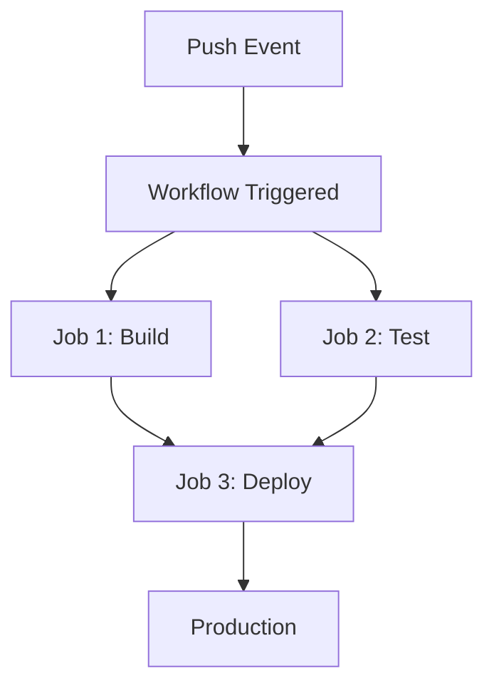

# How to Build CI/CD Pipelines with GitHub Actions

Author: [nawazdhandala](https://www.github.com/nawazdhandala)

Tags: GitHub Actions, CI/CD, DevOps, Automation, Continuous Integration, Continuous Deployment

Description: Learn how to build production-ready CI/CD pipelines with GitHub Actions from scratch. This guide covers workflow syntax, job orchestration, testing, building, and deploying applications with practical examples.

---

GitHub Actions transforms your repository into a complete CI/CD platform. Every push, pull request, or scheduled event can trigger automated workflows that test, build, and deploy your code. This guide walks you through building robust pipelines that scale with your team.

## Understanding GitHub Actions Architecture

Before writing workflows, you need to understand the core concepts:



- **Workflows** live in `.github/workflows/` as YAML files
- **Jobs** run in parallel by default on separate runners
- **Steps** execute sequentially within a job
- **Actions** are reusable units of code (from marketplace or custom)

## Your First CI Workflow

Start with a basic workflow that runs tests on every push and pull request.

```yaml
# .github/workflows/ci.yml
name: CI Pipeline

# Define what triggers this workflow
on:
  push:
    branches: [main, develop]
  pull_request:
    branches: [main]

# Define the jobs that run
jobs:
  test:
    # Use the latest Ubuntu runner
    runs-on: ubuntu-latest

    steps:
      # Check out repository code
      - name: Checkout code
        uses: actions/checkout@v4

      # Set up Node.js environment
      - name: Setup Node.js
        uses: actions/setup-node@v4
        with:
          node-version: '20'
          cache: 'npm'

      # Install dependencies
      - name: Install dependencies
        run: npm ci

      # Run linter
      - name: Run linter
        run: npm run lint

      # Run tests with coverage
      - name: Run tests
        run: npm test -- --coverage
```

This workflow triggers on pushes to `main` and `develop` branches, plus all pull requests targeting `main`. The `npm ci` command ensures reproducible builds by using the lockfile.

## Building a Complete CI/CD Pipeline

Production pipelines need multiple stages. Here is a workflow that builds, tests, and deploys:

```yaml
# .github/workflows/deploy.yml
name: Build and Deploy

on:
  push:
    branches: [main]

# Set environment variables for all jobs
env:
  NODE_VERSION: '20'
  REGISTRY: ghcr.io
  IMAGE_NAME: ${{ github.repository }}

jobs:
  # First job: run tests
  test:
    runs-on: ubuntu-latest
    steps:
      - uses: actions/checkout@v4

      - name: Setup Node.js
        uses: actions/setup-node@v4
        with:
          node-version: ${{ env.NODE_VERSION }}
          cache: 'npm'

      - name: Install and test
        run: |
          npm ci
          npm test

  # Second job: build the application
  build:
    runs-on: ubuntu-latest
    # Wait for tests to pass before building
    needs: test

    outputs:
      # Export the image tag for the deploy job
      image-tag: ${{ steps.meta.outputs.tags }}

    steps:
      - uses: actions/checkout@v4

      # Log in to GitHub Container Registry
      - name: Log in to registry
        uses: docker/login-action@v3
        with:
          registry: ${{ env.REGISTRY }}
          username: ${{ github.actor }}
          password: ${{ secrets.GITHUB_TOKEN }}

      # Generate image tags and labels
      - name: Extract metadata
        id: meta
        uses: docker/metadata-action@v5
        with:
          images: ${{ env.REGISTRY }}/${{ env.IMAGE_NAME }}
          tags: |
            type=sha,prefix=
            type=ref,event=branch

      # Build and push Docker image
      - name: Build and push
        uses: docker/build-push-action@v5
        with:
          context: .
          push: true
          tags: ${{ steps.meta.outputs.tags }}
          labels: ${{ steps.meta.outputs.labels }}

  # Third job: deploy to production
  deploy:
    runs-on: ubuntu-latest
    needs: build
    # Only deploy from main branch
    if: github.ref == 'refs/heads/main'

    # Use production environment with protection rules
    environment:
      name: production
      url: https://myapp.example.com

    steps:
      - uses: actions/checkout@v4

      # Deploy using the built image
      - name: Deploy to production
        run: |
          echo "Deploying image: ${{ needs.build.outputs.image-tag }}"
          # Add your deployment commands here
          # kubectl set image deployment/app app=${{ needs.build.outputs.image-tag }}
```

The `needs` keyword creates dependencies between jobs. The `deploy` job waits for both `test` and `build` to complete successfully.

## Working with Multiple Environments

Most teams need staging and production deployments. Use workflow inputs and environments:

```yaml
# .github/workflows/deploy-env.yml
name: Deploy to Environment

on:
  workflow_dispatch:
    inputs:
      environment:
        description: 'Target environment'
        required: true
        default: 'staging'
        type: choice
        options:
          - staging
          - production

jobs:
  deploy:
    runs-on: ubuntu-latest

    # Dynamic environment based on input
    environment:
      name: ${{ github.event.inputs.environment }}

    steps:
      - uses: actions/checkout@v4

      - name: Deploy
        run: |
          echo "Deploying to ${{ github.event.inputs.environment }}"
          # Use environment-specific secrets
          # ${{ secrets.API_KEY }} will resolve to the correct environment
```

Environment secrets override repository secrets, letting you use the same workflow for different deployment targets.

## Running Jobs in Parallel and Sequence

Control job execution order with `needs` and conditional logic:

```yaml
jobs:
  lint:
    runs-on: ubuntu-latest
    steps:
      - uses: actions/checkout@v4
      - run: npm run lint

  unit-tests:
    runs-on: ubuntu-latest
    steps:
      - uses: actions/checkout@v4
      - run: npm test

  integration-tests:
    runs-on: ubuntu-latest
    steps:
      - uses: actions/checkout@v4
      - run: npm run test:integration

  # This job runs after all tests pass
  build:
    runs-on: ubuntu-latest
    needs: [lint, unit-tests, integration-tests]
    steps:
      - uses: actions/checkout@v4
      - run: npm run build

  # Deploy only if build succeeds
  deploy:
    runs-on: ubuntu-latest
    needs: build
    if: success()
    steps:
      - run: echo "Deploying..."
```

The `lint`, `unit-tests`, and `integration-tests` jobs run in parallel. The `build` job waits for all three to complete.

## Handling Failures and Notifications

Add error handling and team notifications:

```yaml
jobs:
  deploy:
    runs-on: ubuntu-latest
    steps:
      - name: Deploy
        id: deploy
        run: ./deploy.sh
        continue-on-error: true

      # Send Slack notification on failure
      - name: Notify on failure
        if: steps.deploy.outcome == 'failure'
        run: |
          curl -X POST ${{ secrets.SLACK_WEBHOOK }} \
            -H 'Content-type: application/json' \
            -d '{
              "text": "Deployment failed for ${{ github.repository }}",
              "attachments": [{
                "color": "danger",
                "fields": [{
                  "title": "Commit",
                  "value": "${{ github.sha }}",
                  "short": true
                }]
              }]
            }'

      # Fail the job after notification
      - name: Exit with error
        if: steps.deploy.outcome == 'failure'
        run: exit 1
```

The `continue-on-error: true` setting lets subsequent steps run even when the deploy fails, allowing you to send notifications before marking the job as failed.

## Conditional Execution

Run steps or jobs based on conditions:

```yaml
jobs:
  build:
    runs-on: ubuntu-latest
    steps:
      # Only run on main branch
      - name: Production build
        if: github.ref == 'refs/heads/main'
        run: npm run build:prod

      # Run on any other branch
      - name: Development build
        if: github.ref != 'refs/heads/main'
        run: npm run build:dev

      # Skip if commit message contains [skip ci]
      - name: Run expensive tests
        if: "!contains(github.event.head_commit.message, '[skip ci]')"
        run: npm run test:e2e
```

## Path Filtering

Trigger workflows only when specific files change:

```yaml
on:
  push:
    branches: [main]
    paths:
      # Only trigger for backend changes
      - 'src/backend/**'
      - 'package.json'
      - 'package-lock.json'
    paths-ignore:
      # Never trigger for documentation
      - '**.md'
      - 'docs/**'
```

This reduces unnecessary builds when only documentation or unrelated files change.

## Scheduled Workflows

Run workflows on a schedule for maintenance tasks:

```yaml
on:
  # Run every day at 2 AM UTC
  schedule:
    - cron: '0 2 * * *'

jobs:
  maintenance:
    runs-on: ubuntu-latest
    steps:
      - uses: actions/checkout@v4

      # Clean up old artifacts
      - name: Delete old workflow runs
        uses: Mattraks/delete-workflow-runs@v2
        with:
          retain_days: 30
          keep_minimum_runs: 10

      # Run security audit
      - name: Security audit
        run: npm audit
```

## Best Practices for Production Pipelines

1. **Pin action versions**: Use specific versions like `actions/checkout@v4` instead of `@main`
2. **Use secrets for sensitive data**: Never hardcode credentials in workflows
3. **Add timeouts**: Prevent runaway jobs with `timeout-minutes`
4. **Enable concurrency control**: Prevent duplicate deployments
5. **Use environments**: Configure approval requirements for production

```yaml
jobs:
  deploy:
    runs-on: ubuntu-latest
    timeout-minutes: 30

    concurrency:
      group: deploy-${{ github.ref }}
      cancel-in-progress: true

    environment:
      name: production
```

---

GitHub Actions provides everything you need for modern CI/CD. Start with simple test workflows, then add build and deployment stages as your project grows. The key is to keep workflows readable and maintainable while automating the repetitive parts of your development process.
