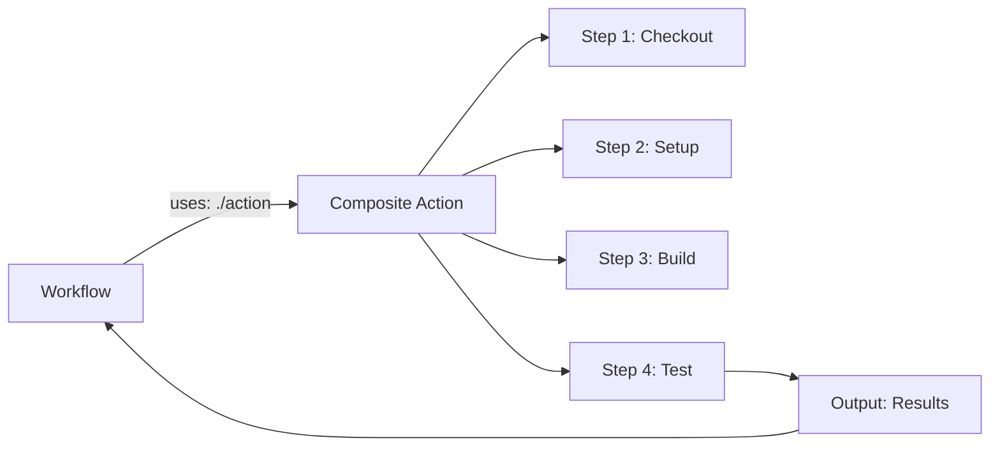

# How to Build Composite Actions in GitHub Actions

Author: [nawazdhandala](https://www.github.com/nawazdhandala)

Tags: GitHub Actions, Composite Actions, Reusability, CI/CD, DevOps, Automation

Description: Learn how to build composite actions in GitHub Actions to encapsulate reusable steps. This guide covers action.yml structure, inputs, outputs, and patterns for creating maintainable action libraries.

---

Composite actions let you bundle multiple steps into a single reusable unit. Unlike JavaScript or Docker actions, composite actions use the same YAML syntax you already know. When you find yourself copying the same five steps across workflows, it is time to create a composite action. This guide shows you how to build and publish effective composite actions.

## Understanding Composite Actions

Composite actions combine multiple workflow steps into one action that can be called with `uses`:



Benefits over copying steps:
- Single point of maintenance
- Versioned and tested independently
- Cleaner workflow files
- Shareable across repositories

## Creating Your First Composite Action

Create an `action.yml` file in a directory:

```yaml
# .github/actions/setup-node-project/action.yml
name: 'Setup Node.js Project'
description: 'Install Node.js and project dependencies with caching'
author: 'Your Team'

inputs:
  node-version:
    description: 'Node.js version to install'
    required: false
    default: '20'

outputs:
  cache-hit:
    description: 'Whether npm cache was hit'
    value: ${{ steps.cache.outputs.cache-hit }}

runs:
  using: 'composite'
  steps:
    # Step 1: Setup Node.js
    - name: Setup Node.js ${{ inputs.node-version }}
      uses: actions/setup-node@v4
      with:
        node-version: ${{ inputs.node-version }}

    # Step 2: Cache npm dependencies
    - name: Cache npm
      id: cache
      uses: actions/cache@v4
      with:
        path: ~/.npm
        key: ${{ runner.os }}-npm-${{ hashFiles('**/package-lock.json') }}
        restore-keys: |
          ${{ runner.os }}-npm-

    # Step 3: Install dependencies
    - name: Install dependencies
      shell: bash
      run: npm ci
```

## Using Composite Actions

Reference the action in your workflow:

```yaml
# .github/workflows/ci.yml
name: CI

on: [push, pull_request]

jobs:
  build:
    runs-on: ubuntu-latest

    steps:
      - uses: actions/checkout@v4

      # Use local composite action
      - name: Setup project
        id: setup
        uses: ./.github/actions/setup-node-project
        with:
          node-version: '20'

      - name: Report cache status
        run: echo "Cache hit: ${{ steps.setup.outputs.cache-hit }}"

      - name: Build
        run: npm run build

      - name: Test
        run: npm test
```

## Action Inputs and Outputs

Define inputs with defaults and validation:

```yaml
# action.yml
name: 'Deploy to S3'
description: 'Deploy static files to S3 bucket'

inputs:
  bucket:
    description: 'S3 bucket name'
    required: true

  source:
    description: 'Source directory to upload'
    required: false
    default: 'dist'

  aws-region:
    description: 'AWS region'
    required: false
    default: 'us-east-1'

  delete-removed:
    description: 'Delete files from S3 that do not exist in source'
    required: false
    default: 'false'

outputs:
  files-uploaded:
    description: 'Number of files uploaded'
    value: ${{ steps.sync.outputs.count }}

  bucket-url:
    description: 'URL to the S3 bucket'
    value: https://${{ inputs.bucket }}.s3.${{ inputs.aws-region }}.amazonaws.com

runs:
  using: 'composite'
  steps:
    - name: Validate inputs
      shell: bash
      run: |
        if [ ! -d "${{ inputs.source }}" ]; then
          echo "Error: Source directory '${{ inputs.source }}' does not exist"
          exit 1
        fi

    - name: Sync to S3
      id: sync
      shell: bash
      run: |
        DELETE_FLAG=""
        if [ "${{ inputs.delete-removed }}" == "true" ]; then
          DELETE_FLAG="--delete"
        fi

        COUNT=$(aws s3 sync ${{ inputs.source }} s3://${{ inputs.bucket }} \
          --region ${{ inputs.aws-region }} \
          $DELETE_FLAG | wc -l)

        echo "count=$COUNT" >> $GITHUB_OUTPUT
```

## Using Other Actions Within Composite Actions

Composite actions can call other actions:

```yaml
# .github/actions/docker-build-push/action.yml
name: 'Build and Push Docker Image'
description: 'Build Docker image with buildx and push to registry'

inputs:
  image-name:
    description: 'Docker image name'
    required: true
  registry:
    description: 'Container registry'
    required: false
    default: 'ghcr.io'
  username:
    description: 'Registry username'
    required: true
  password:
    description: 'Registry password'
    required: true

outputs:
  image-tag:
    description: 'Full image tag'
    value: ${{ steps.meta.outputs.tags }}
  digest:
    description: 'Image digest'
    value: ${{ steps.build.outputs.digest }}

runs:
  using: 'composite'
  steps:
    # Use setup action
    - name: Set up Docker Buildx
      uses: docker/setup-buildx-action@v3

    # Use login action
    - name: Login to registry
      uses: docker/login-action@v3
      with:
        registry: ${{ inputs.registry }}
        username: ${{ inputs.username }}
        password: ${{ inputs.password }}

    # Use metadata action
    - name: Extract metadata
      id: meta
      uses: docker/metadata-action@v5
      with:
        images: ${{ inputs.registry }}/${{ inputs.image-name }}
        tags: |
          type=sha,prefix=
          type=ref,event=branch
          type=semver,pattern={{version}}

    # Use build action
    - name: Build and push
      id: build
      uses: docker/build-push-action@v5
      with:
        context: .
        push: true
        tags: ${{ steps.meta.outputs.tags }}
        labels: ${{ steps.meta.outputs.labels }}
        cache-from: type=gha
        cache-to: type=gha,mode=max
```

## Shell Commands in Composite Actions

Always specify the shell for run steps:

```yaml
runs:
  using: 'composite'
  steps:
    # Bash shell (Linux/macOS)
    - name: Run bash script
      shell: bash
      run: |
        echo "Running on $RUNNER_OS"
        ./scripts/build.sh

    # PowerShell (Windows)
    - name: Run PowerShell
      shell: pwsh
      run: |
        Write-Host "Running on Windows"
        .\scripts\build.ps1

    # Cross-platform with bash
    - name: Cross-platform step
      shell: bash
      run: |
        if [ "$RUNNER_OS" == "Windows" ]; then
          echo "Windows specific"
        else
          echo "Unix specific"
        fi
```

## Conditional Steps

Use `if` conditions in composite actions:

```yaml
runs:
  using: 'composite'
  steps:
    - name: Cache (Linux only)
      if: runner.os == 'Linux'
      uses: actions/cache@v4
      with:
        path: ~/.cache
        key: linux-cache-${{ hashFiles('**/lockfile') }}

    - name: Install Linux deps
      if: runner.os == 'Linux'
      shell: bash
      run: sudo apt-get install -y build-essential

    - name: Install macOS deps
      if: runner.os == 'macOS'
      shell: bash
      run: brew install cmake

    - name: Always run cleanup
      if: always()
      shell: bash
      run: rm -rf temp/
```

## Publishing to GitHub Marketplace

Share your composite action publicly:

1. Create a dedicated repository for the action
2. Add metadata to `action.yml`:

```yaml
name: 'My Awesome Action'
description: 'Does something awesome'
author: 'Your Name'
branding:
  icon: 'zap'
  color: 'blue'

inputs:
  # ... inputs

runs:
  using: 'composite'
  steps:
    # ... steps
```

3. Create a release with semantic versioning:

```bash
git tag -a v1.0.0 -m "Initial release"
git push origin v1.0.0

# Create major version tag for easy referencing
git tag -fa v1 -m "Update v1 to v1.0.0"
git push origin v1 --force
```

4. Publish to Marketplace through GitHub's release UI

## Testing Composite Actions

Test your action before publishing:

```yaml
# .github/workflows/test-action.yml
name: Test Action

on:
  push:
    paths:
      - 'action.yml'
      - '.github/workflows/test-action.yml'

jobs:
  test:
    strategy:
      matrix:
        os: [ubuntu-latest, windows-latest, macos-latest]

    runs-on: ${{ matrix.os }}

    steps:
      - uses: actions/checkout@v4

      - name: Test the action
        id: test
        uses: ./
        with:
          input1: 'test-value'

      - name: Verify outputs
        shell: bash
        run: |
          if [ "${{ steps.test.outputs.result }}" != "expected" ]; then
            echo "Test failed: unexpected output"
            exit 1
          fi
          echo "Test passed!"
```

## Error Handling

Handle errors gracefully:

```yaml
runs:
  using: 'composite'
  steps:
    - name: Attempt operation
      id: attempt
      shell: bash
      continue-on-error: true
      run: |
        ./risky-operation.sh
        echo "success=true" >> $GITHUB_OUTPUT

    - name: Handle failure
      if: steps.attempt.outcome == 'failure'
      shell: bash
      run: |
        echo "Operation failed, running fallback"
        ./fallback-operation.sh

    - name: Report status
      shell: bash
      run: |
        if [ "${{ steps.attempt.outcome }}" == "success" ]; then
          echo "Operation completed successfully"
        else
          echo "Operation failed but fallback executed"
        fi
```

## Composite Action vs Reusable Workflow

Choose the right tool:

| Feature | Composite Action | Reusable Workflow |
|---------|-----------------|-------------------|
| Scope | Steps within a job | Entire jobs |
| Secrets | Inherited automatically | Must be passed explicitly |
| Runners | Uses caller's runner | Can specify own runners |
| Matrix | No direct matrix support | Full matrix support |
| Environments | Uses caller's environment | Can define environments |

Use composite actions for:
- Reusable step sequences
- Setup and teardown procedures
- Common build steps

Use reusable workflows for:
- Complete CI/CD pipelines
- Multi-job workflows
- Complex deployment processes

## Local Action Organization

Structure actions in your repository:

```
.github/
  actions/
    setup-project/
      action.yml
    build-docker/
      action.yml
    deploy/
      action.yml
  workflows/
    ci.yml
    deploy.yml
```

Reference them cleanly:

```yaml
steps:
  - uses: ./.github/actions/setup-project
  - uses: ./.github/actions/build-docker
  - uses: ./.github/actions/deploy
```

---

Composite actions bring software engineering best practices to your CI/CD pipelines. Extract common patterns, version them properly, and document their inputs and outputs. Start with local actions in your repository, then graduate to shared repositories when patterns prove valuable across projects. Well-designed composite actions make workflows readable and maintenance manageable.
