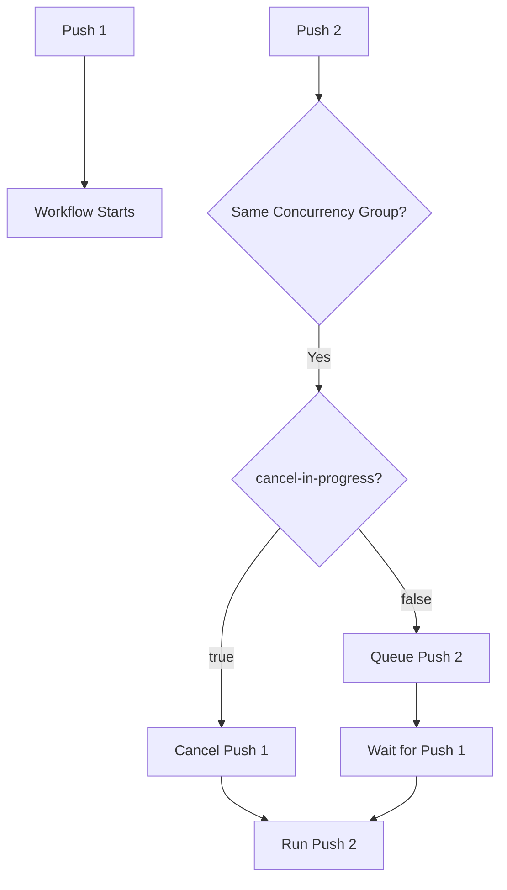

# How to Control Concurrency in GitHub Actions

Author: [nawazdhandala](https://www.github.com/nawazdhandala)

Tags: GitHub Actions, Concurrency, CI/CD, Resource Management, DevOps, Automation

Description: Learn how to control workflow concurrency in GitHub Actions to prevent race conditions, manage resources, and ensure safe deployments. This guide covers concurrency groups, cancellation strategies, and practical patterns.

---

When multiple workflows run simultaneously, things can break. Two deployments targeting the same server, parallel builds overwriting artifacts, or database migrations stepping on each other all cause problems. GitHub Actions concurrency controls help you manage when workflows run and what happens to pending runs. This guide shows you how to use concurrency effectively.

## Understanding Concurrency Groups

Concurrency groups prevent workflows or jobs from running simultaneously. When a new run starts, it either waits for the current run to complete or cancels it.



## Basic Concurrency Configuration

Add concurrency at the workflow level:

```yaml
# .github/workflows/deploy.yml
name: Deploy

on:
  push:
    branches: [main]

# Prevent concurrent deployments
concurrency:
  group: production-deploy
  cancel-in-progress: false

jobs:
  deploy:
    runs-on: ubuntu-latest
    steps:
      - uses: actions/checkout@v4
      - run: ./deploy.sh
```

With this configuration:
- Only one workflow runs at a time in the `production-deploy` group
- New runs wait for the current run to complete
- Runs execute in order (first in, first out)

## Cancel In-Progress Runs

For PR builds, you often want to cancel outdated runs:

```yaml
name: CI

on:
  pull_request:
    branches: [main]

# Cancel previous runs when new commits push
concurrency:
  group: ci-${{ github.ref }}
  cancel-in-progress: true

jobs:
  test:
    runs-on: ubuntu-latest
    steps:
      - uses: actions/checkout@v4
      - run: npm test
```

When a developer pushes new commits to a PR, this:
1. Identifies running workflows for the same branch
2. Cancels them immediately
3. Starts the new workflow

This saves runner time and provides faster feedback on the latest code.

## Dynamic Concurrency Groups

Create groups based on workflow context:

```yaml
# Group by branch - each branch can run concurrently
concurrency:
  group: build-${{ github.ref }}
  cancel-in-progress: true

# Group by PR number - unique per pull request
concurrency:
  group: pr-${{ github.event.pull_request.number }}
  cancel-in-progress: true

# Group by workflow and branch - separate groups per workflow
concurrency:
  group: ${{ github.workflow }}-${{ github.ref }}
  cancel-in-progress: true
```

### Common Group Patterns

```yaml
# For deployments: one at a time per environment
concurrency:
  group: deploy-${{ github.event.inputs.environment }}
  cancel-in-progress: false

# For CI: cancel outdated per branch
concurrency:
  group: ci-${{ github.head_ref || github.ref }}
  cancel-in-progress: true

# For release: never cancel
concurrency:
  group: release-${{ github.ref_name }}
  cancel-in-progress: false
```

## Job-Level Concurrency

Apply concurrency to specific jobs instead of entire workflows:

```yaml
name: Build and Deploy

on:
  push:
    branches: [main]

jobs:
  build:
    runs-on: ubuntu-latest
    # Builds can run in parallel
    steps:
      - uses: actions/checkout@v4
      - run: npm run build

  deploy:
    needs: build
    runs-on: ubuntu-latest
    # Only one deploy at a time
    concurrency:
      group: production
      cancel-in-progress: false

    steps:
      - run: ./deploy.sh
```

This allows multiple builds to run simultaneously while ensuring deployments happen one at a time.

## Deployment Protection with Concurrency

Combine concurrency with environments for safe deployments:

```yaml
name: Deploy

on:
  push:
    branches: [main]

jobs:
  deploy-staging:
    runs-on: ubuntu-latest
    environment: staging
    concurrency:
      group: staging-deploy
      cancel-in-progress: false

    steps:
      - uses: actions/checkout@v4
      - run: ./deploy.sh staging

  deploy-production:
    needs: deploy-staging
    runs-on: ubuntu-latest
    environment: production
    concurrency:
      group: production-deploy
      cancel-in-progress: false

    steps:
      - uses: actions/checkout@v4
      - run: ./deploy.sh production
```

## Handling Cancellation Gracefully

When workflows get cancelled, clean up resources properly:

```yaml
jobs:
  deploy:
    runs-on: ubuntu-latest
    concurrency:
      group: deploy
      cancel-in-progress: true

    steps:
      - uses: actions/checkout@v4

      - name: Start deployment
        id: deploy
        run: |
          ./start-deployment.sh
          echo "deployment_id=dep-123" >> $GITHUB_OUTPUT

      # This runs even if the job is cancelled
      - name: Cleanup on cancellation
        if: cancelled()
        run: |
          ./rollback-deployment.sh ${{ steps.deploy.outputs.deployment_id }}
```

The `if: cancelled()` condition ensures cleanup runs when the workflow is cancelled.

## Matrix Jobs with Concurrency

Control concurrency within matrix builds:

```yaml
jobs:
  test:
    runs-on: ubuntu-latest
    strategy:
      matrix:
        node: [18, 20]
        os: [ubuntu-latest, windows-latest]
      # Limit parallel jobs
      max-parallel: 2

    steps:
      - uses: actions/checkout@v4
      - run: npm test
```

Combine with job-level concurrency:

```yaml
jobs:
  deploy:
    runs-on: ubuntu-latest
    strategy:
      matrix:
        region: [us-east, eu-west, ap-south]
      # Run one region at a time
      max-parallel: 1

    concurrency:
      group: deploy-${{ matrix.region }}
      cancel-in-progress: false

    steps:
      - run: ./deploy.sh ${{ matrix.region }}
```

## Queue Management

When `cancel-in-progress: false`, runs queue up. Manage queue behavior:

```yaml
name: Deploy

on:
  push:
    branches: [main]

concurrency:
  group: deploy
  cancel-in-progress: false

jobs:
  deploy:
    runs-on: ubuntu-latest
    # Timeout prevents runs from waiting forever
    timeout-minutes: 60

    steps:
      - uses: actions/checkout@v4

      - name: Check queue position
        run: |
          echo "Waiting for previous deployment to complete..."

      - name: Deploy
        run: ./deploy.sh
```

## PR vs Main Branch Concurrency

Different strategies for PRs and main branch:

```yaml
name: CI/CD

on:
  push:
    branches: [main]
  pull_request:
    branches: [main]

concurrency:
  # PRs: cancel outdated runs
  # Main: queue runs (don't cancel deployments)
  group: ${{ github.workflow }}-${{ github.event.pull_request.number || github.sha }}
  cancel-in-progress: ${{ github.event_name == 'pull_request' }}

jobs:
  test:
    runs-on: ubuntu-latest
    steps:
      - uses: actions/checkout@v4
      - run: npm test

  deploy:
    if: github.event_name == 'push' && github.ref == 'refs/heads/main'
    needs: test
    runs-on: ubuntu-latest

    steps:
      - uses: actions/checkout@v4
      - run: ./deploy.sh
```

## Preventing Resource Contention

Protect shared resources with concurrency:

```yaml
jobs:
  database-migration:
    runs-on: ubuntu-latest
    # Only one migration at a time across all branches
    concurrency:
      group: database-migration-prod
      cancel-in-progress: false

    steps:
      - uses: actions/checkout@v4

      - name: Acquire lock
        run: |
          # Additional application-level locking if needed
          ./acquire-migration-lock.sh

      - name: Run migration
        run: npm run migrate

      - name: Release lock
        if: always()
        run: ./release-migration-lock.sh
```

## Monitoring Queued Workflows

Check workflow queue status:

```bash
# List queued runs
gh run list --status queued

# List in-progress runs
gh run list --status in_progress

# View specific workflow status
gh run list --workflow deploy.yml --limit 10
```

In workflows, detect if you are running after being queued:

```yaml
- name: Check wait time
  run: |
    START_TIME="${{ github.event.head_commit.timestamp }}"
    CURRENT_TIME=$(date -u +%Y-%m-%dT%H:%M:%SZ)
    echo "Commit time: $START_TIME"
    echo "Run time: $CURRENT_TIME"
```

## Concurrency with Reusable Workflows

Concurrency applies to the calling workflow:

```yaml
# Caller workflow
name: Deploy

on:
  push:
    branches: [main]

concurrency:
  group: deploy
  cancel-in-progress: false

jobs:
  deploy:
    uses: ./.github/workflows/deploy-template.yml
    with:
      environment: production
```

The reusable workflow inherits the caller's concurrency settings.

## Best Practices

### Use Descriptive Group Names

```yaml
# Good: Clear purpose
concurrency:
  group: deploy-production-${{ github.repository }}

# Avoid: Unclear
concurrency:
  group: my-group
```

### Document Concurrency Behavior

```yaml
# Deployment workflow
# Concurrency: Only one deployment runs at a time per environment.
# New deployments wait for current ones to complete.
concurrency:
  group: deploy-${{ inputs.environment }}
  cancel-in-progress: false
```

### Test Concurrency Configuration

Push multiple commits quickly to verify behavior:

```bash
# Trigger multiple runs
for i in {1..5}; do
  echo "Run $i" >> test.txt
  git add test.txt
  git commit -m "Test commit $i"
  git push
  sleep 2
done
```

Watch the Actions tab to confirm runs cancel or queue as expected.

---

Concurrency control prevents the chaos of uncoordinated parallel execution. Use `cancel-in-progress: true` for PR builds where you want fast feedback on the latest code. Use `cancel-in-progress: false` for deployments where you never want to interrupt a release in progress. The right concurrency settings depend on your workflow, so think through what should happen when multiple runs compete for the same resources.
