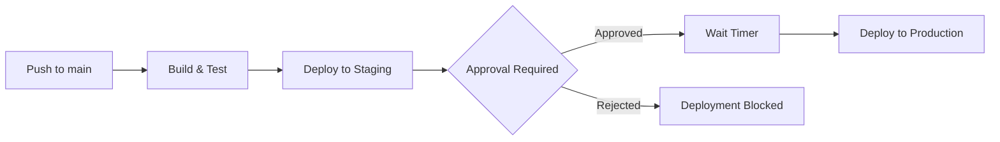

# How to Configure Environment Protection Rules in GitHub Actions

Author: [nawazdhandala](https://www.github.com/nawazdhandala)

Tags: GitHub Actions, Environment Protection, Security, CI/CD, Deployment, DevOps

Description: Learn how to protect production deployments with GitHub Actions environment rules. This guide covers required reviewers, wait timers, branch restrictions, and deployment gates for secure release pipelines.

---

Shipping code to production should not happen by accident. GitHub Actions environments let you define protection rules that control when and how deployments happen. This guide shows you how to configure environments with approval requirements, timing controls, and branch restrictions to build a secure deployment pipeline.

## Understanding Environments

Environments represent deployment targets like staging, production, or preview. Each environment can have:

- Required reviewers who must approve deployments
- Wait timers that delay deployment
- Branch and tag restrictions
- Environment-specific secrets and variables



## Creating Environments

Create environments in your repository settings:

1. Go to Settings > Environments
2. Click "New environment"
3. Name it (e.g., "production", "staging")
4. Configure protection rules

Or use the GitHub CLI:

```bash
# Create an environment
gh api repos/{owner}/{repo}/environments/production -X PUT

# Note: Protection rules must be configured via UI or API with specific payloads
```

## Basic Environment Usage

Reference environments in your workflow:

```yaml
# .github/workflows/deploy.yml
name: Deploy

on:
  push:
    branches: [main]

jobs:
  deploy-staging:
    runs-on: ubuntu-latest
    # Use staging environment
    environment: staging

    steps:
      - uses: actions/checkout@v4

      - name: Deploy to staging
        env:
          # Secrets from staging environment
          API_KEY: ${{ secrets.API_KEY }}
        run: ./deploy.sh staging

  deploy-production:
    runs-on: ubuntu-latest
    needs: deploy-staging
    # Use production environment with URL
    environment:
      name: production
      url: https://example.com

    steps:
      - uses: actions/checkout@v4

      - name: Deploy to production
        env:
          # Secrets from production environment
          API_KEY: ${{ secrets.API_KEY }}
        run: ./deploy.sh production
```

## Required Reviewers

Add approval requirements to prevent unauthorized deployments:

```yaml
jobs:
  deploy:
    runs-on: ubuntu-latest
    # This job will pause waiting for approval
    environment:
      name: production

    steps:
      - uses: actions/checkout@v4
      - run: ./deploy.sh
```

Configure in Settings > Environments > production:
- Enable "Required reviewers"
- Add users or teams who can approve
- Set minimum number of approvals (1-6)

When the workflow reaches this job:
1. It pauses and shows "Waiting for approval"
2. Designated reviewers receive notification
3. Any reviewer can approve or reject
4. Workflow continues only after approval

## Wait Timers

Add a delay before deployment to catch issues:

```yaml
jobs:
  deploy:
    runs-on: ubuntu-latest
    environment:
      name: production
      # URL shown in deployment status
      url: https://example.com

    steps:
      # This step runs after wait timer completes
      - name: Deploy
        run: ./deploy.sh
```

Configure wait timer in environment settings:
- Set delay from 0 to 43200 minutes (30 days)
- Timer starts after all required approvals
- Useful for staged rollouts or allowing time to verify staging

## Branch and Tag Restrictions

Limit which branches can deploy to an environment:

Configure in environment settings:
- "Deployment branches": Choose "Selected branches"
- Add patterns like `main`, `release/*`, `v*`

```yaml
# This workflow only deploys to production from allowed branches
jobs:
  deploy:
    runs-on: ubuntu-latest
    environment: production
    # Job fails if branch doesn't match environment rules

    steps:
      - uses: actions/checkout@v4
      - run: ./deploy.sh
```

Branch patterns support wildcards:
- `main` - exact match
- `release/*` - matches release/v1.0, release/hotfix
- `v*` - matches v1, v2.0, v2.0.1

## Environment Secrets and Variables

Each environment has its own secrets and variables that override repository-level values:

```yaml
jobs:
  deploy-staging:
    runs-on: ubuntu-latest
    environment: staging

    steps:
      - name: Deploy
        env:
          # Resolves to staging-specific value
          DATABASE_URL: ${{ secrets.DATABASE_URL }}
          API_ENDPOINT: ${{ vars.API_ENDPOINT }}
        run: ./deploy.sh

  deploy-production:
    runs-on: ubuntu-latest
    needs: deploy-staging
    environment: production

    steps:
      - name: Deploy
        env:
          # Resolves to production-specific value
          DATABASE_URL: ${{ secrets.DATABASE_URL }}
          API_ENDPOINT: ${{ vars.API_ENDPOINT }}
        run: ./deploy.sh
```

Priority order:
1. Environment secrets/variables (highest)
2. Repository secrets/variables
3. Organization secrets/variables (lowest)

## Custom Deployment Protection Rules

For GitHub Enterprise, create custom protection rules with external services:

```yaml
# The workflow waits for external service approval
jobs:
  deploy:
    runs-on: ubuntu-latest
    environment:
      name: production
      # Custom deployment protection rule checks external system

    steps:
      - uses: actions/checkout@v4
      - run: ./deploy.sh
```

Custom rules can check:
- Change management ticket status
- External approval systems
- Compliance gates
- Security scan results

## Multi-Stage Deployment Pipeline

Build a complete pipeline with multiple environments:

```yaml
name: Release Pipeline

on:
  push:
    branches: [main]

jobs:
  build:
    runs-on: ubuntu-latest
    outputs:
      version: ${{ steps.version.outputs.version }}

    steps:
      - uses: actions/checkout@v4

      - name: Build
        run: npm run build

      - name: Get version
        id: version
        run: echo "version=$(node -p "require('./package.json').version")" >> $GITHUB_OUTPUT

      - name: Upload artifact
        uses: actions/upload-artifact@v4
        with:
          name: build
          path: dist/

  deploy-dev:
    needs: build
    runs-on: ubuntu-latest
    environment:
      name: development
      url: https://dev.example.com

    steps:
      - name: Download artifact
        uses: actions/download-artifact@v4
        with:
          name: build

      - name: Deploy
        run: ./deploy.sh development

  deploy-staging:
    needs: deploy-dev
    runs-on: ubuntu-latest
    environment:
      name: staging
      url: https://staging.example.com

    steps:
      - name: Download artifact
        uses: actions/download-artifact@v4
        with:
          name: build

      - name: Deploy
        run: ./deploy.sh staging

      - name: Run smoke tests
        run: npm run test:smoke -- --url https://staging.example.com

  deploy-production:
    needs: deploy-staging
    runs-on: ubuntu-latest
    environment:
      name: production
      url: https://example.com

    steps:
      - name: Download artifact
        uses: actions/download-artifact@v4
        with:
          name: build

      - name: Deploy
        run: ./deploy.sh production

      - name: Verify deployment
        run: |
          curl -f https://example.com/health || exit 1
```

## Deployment Status and URLs

Show deployment status in pull requests:

```yaml
jobs:
  deploy-preview:
    runs-on: ubuntu-latest
    environment:
      name: preview
      # Dynamic URL shown in PR
      url: ${{ steps.deploy.outputs.url }}

    steps:
      - uses: actions/checkout@v4

      - name: Deploy preview
        id: deploy
        run: |
          # Deploy and capture URL
          URL=$(./deploy-preview.sh)
          echo "url=$URL" >> $GITHUB_OUTPUT

      # PR shows clickable link to preview environment
```

## Conditional Environment Selection

Choose environment based on context:

```yaml
jobs:
  deploy:
    runs-on: ubuntu-latest
    environment:
      # Production for tags, staging for main branch
      name: ${{ github.ref_type == 'tag' && 'production' || 'staging' }}

    steps:
      - uses: actions/checkout@v4
      - run: ./deploy.sh
```

## Bypassing Protection Rules

For emergencies, repository admins can bypass protection rules:

1. Navigate to the pending deployment
2. Click "Review deployments"
3. Select "Approve and deploy" with bypass option

Note: Bypasses are logged in the audit trail. Use sparingly.

## Environment Activity and History

Track deployment history:

```bash
# List deployments using GitHub CLI
gh api repos/{owner}/{repo}/deployments --jq '.[] | {id, environment, ref, created_at}'

# Get deployment status
gh api repos/{owner}/{repo}/deployments/{deployment_id}/statuses
```

View in UI: Code tab > Environments (right sidebar) > Click environment name

## Best Practices

### Use Descriptive Environment Names

```yaml
# Good: Clear purpose
environment: production-us-east
environment: staging-eu-west

# Avoid: Ambiguous
environment: env1
environment: test
```

### Require Reviews for Production

Always require at least one approval for production:
- Add 2+ reviewers for redundancy
- Include both dev and ops team members
- Set up notification channels

### Use Wait Timers Strategically

```yaml
# Staging: No wait (fast feedback)
environment: staging

# Production: 5-minute wait (catch issues)
environment:
  name: production
  # Configure 5-min wait in settings
```

### Document Environment Configuration

Keep a record of environment settings:

```markdown
## Environments

### staging
- Required reviewers: None
- Wait timer: None
- Branches: main, release/*
- Secrets: DATABASE_URL, API_KEY

### production
- Required reviewers: @release-team (2 required)
- Wait timer: 5 minutes
- Branches: main, release/*
- Secrets: DATABASE_URL, API_KEY, SIGNING_KEY
```

---

Environment protection rules add guardrails without slowing down your team. Start with basic approval requirements for production, then add branch restrictions and wait timers as your deployment process matures. The combination of automated checks and human approval creates a deployment pipeline that is both fast and safe.
