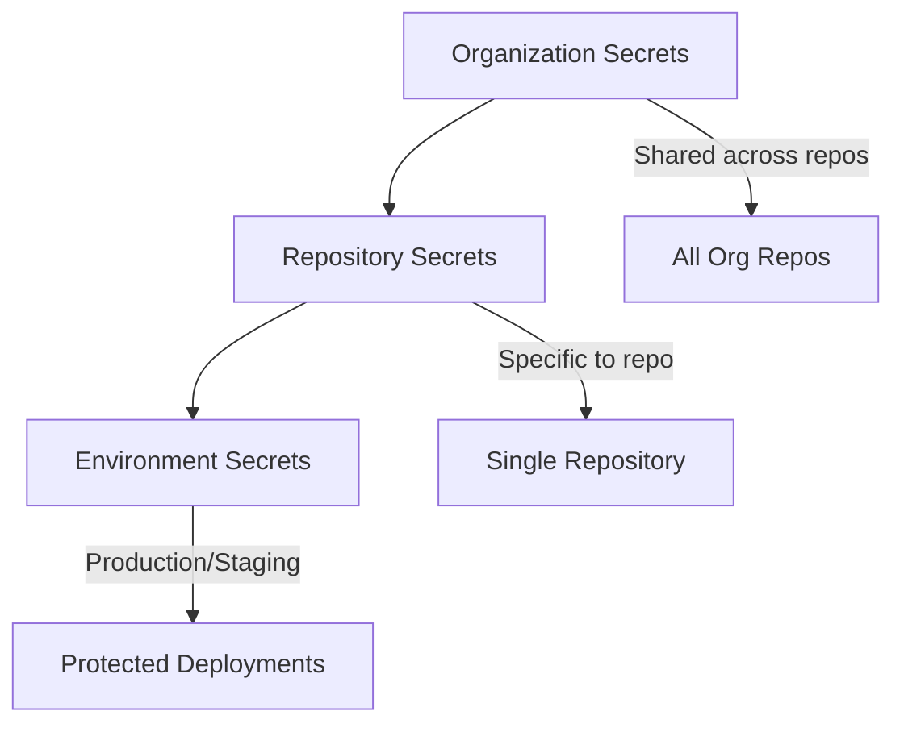

# How to Manage Secrets in GitHub Actions

Author: [nawazdhandala](https://www.github.com/nawazdhandala)

Tags: GitHub Actions, Secrets Management, Security, CI/CD, DevOps, Credentials

Description: Learn how to securely manage secrets in GitHub Actions workflows. This guide covers repository secrets, environment secrets, organization secrets, OIDC authentication, and best practices for keeping credentials safe.

---

Every CI/CD pipeline needs access to sensitive data like API keys, database passwords, and deployment credentials. GitHub Actions provides multiple ways to manage secrets securely. This guide walks through the options and shows you how to use each one effectively without exposing credentials in logs or code.

## Understanding Secret Scopes

GitHub Actions supports secrets at three levels:



- **Organization secrets**: Shared across multiple repositories
- **Repository secrets**: Available to all workflows in one repository
- **Environment secrets**: Scoped to specific deployment environments

## Creating Repository Secrets

Add secrets through the GitHub UI or CLI:

```bash
# Using GitHub CLI
gh secret set API_KEY --body "your-api-key-value"

# From a file
gh secret set DATABASE_URL < db_credentials.txt

# Interactive prompt (recommended for sensitive values)
gh secret set PROD_PASSWORD
```

In the UI: Settings > Secrets and variables > Actions > New repository secret

## Using Secrets in Workflows

Access secrets through the `secrets` context:

```yaml
# .github/workflows/deploy.yml
name: Deploy

on:
  push:
    branches: [main]

jobs:
  deploy:
    runs-on: ubuntu-latest

    steps:
      - uses: actions/checkout@v4

      # Use secret in environment variable
      - name: Deploy to server
        env:
          API_KEY: ${{ secrets.API_KEY }}
          DATABASE_URL: ${{ secrets.DATABASE_URL }}
        run: |
          ./deploy.sh

      # Pass secret to an action
      - name: Login to Docker Registry
        uses: docker/login-action@v3
        with:
          registry: ghcr.io
          username: ${{ github.actor }}
          password: ${{ secrets.GITHUB_TOKEN }}
```

Secrets are automatically masked in logs. If a secret value appears in output, GitHub replaces it with `***`.

## Environment Secrets

Environment secrets provide isolation between deployment targets:

```yaml
name: Deploy to Environment

on:
  push:
    branches: [main, staging]

jobs:
  deploy-staging:
    runs-on: ubuntu-latest
    # Use staging environment
    environment: staging

    steps:
      - uses: actions/checkout@v4

      - name: Deploy
        env:
          # These resolve to staging-specific values
          API_URL: ${{ secrets.API_URL }}
          DB_PASSWORD: ${{ secrets.DB_PASSWORD }}
        run: ./deploy.sh staging

  deploy-production:
    runs-on: ubuntu-latest
    # Use production environment with approval requirement
    environment:
      name: production
      url: https://example.com
    # Only run after staging succeeds
    needs: deploy-staging

    steps:
      - uses: actions/checkout@v4

      - name: Deploy
        env:
          # These resolve to production-specific values
          API_URL: ${{ secrets.API_URL }}
          DB_PASSWORD: ${{ secrets.DB_PASSWORD }}
        run: ./deploy.sh production
```

Configure environments in Settings > Environments. Each environment can have:
- Required reviewers for deployments
- Wait timers before deployment
- Branch restrictions
- Unique secret values

## Organization Secrets

Share secrets across repositories in your organization:

```bash
# Create organization secret
gh secret set ORG_NPM_TOKEN --org your-org --body "npm_token_value"

# Limit to specific repositories
gh secret set ORG_NPM_TOKEN --org your-org \
  --repos "repo1,repo2,repo3" \
  --body "npm_token_value"

# Make visible to all repositories
gh secret set ORG_NPM_TOKEN --org your-org \
  --visibility all \
  --body "npm_token_value"
```

Usage in workflows is identical to repository secrets:

```yaml
- name: Publish package
  env:
    NPM_TOKEN: ${{ secrets.ORG_NPM_TOKEN }}
  run: npm publish
```

## The GITHUB_TOKEN Secret

Every workflow automatically receives a `GITHUB_TOKEN` with permissions scoped to the repository:

```yaml
jobs:
  build:
    runs-on: ubuntu-latest

    # Define permissions explicitly
    permissions:
      contents: read
      packages: write
      pull-requests: write

    steps:
      - uses: actions/checkout@v4

      # Push to GitHub Container Registry
      - name: Login to GHCR
        uses: docker/login-action@v3
        with:
          registry: ghcr.io
          username: ${{ github.actor }}
          password: ${{ secrets.GITHUB_TOKEN }}

      # Comment on PR
      - name: Comment on PR
        if: github.event_name == 'pull_request'
        uses: actions/github-script@v7
        with:
          github-token: ${{ secrets.GITHUB_TOKEN }}
          script: |
            github.rest.issues.createComment({
              issue_number: context.issue.number,
              owner: context.repo.owner,
              repo: context.repo.repo,
              body: 'Build completed successfully!'
            })
```

Set minimum required permissions to follow the principle of least privilege.

## OIDC for Cloud Providers

Instead of storing long-lived credentials, use OpenID Connect to authenticate with cloud providers:

### AWS with OIDC

```yaml
jobs:
  deploy:
    runs-on: ubuntu-latest

    # Required for OIDC
    permissions:
      id-token: write
      contents: read

    steps:
      - uses: actions/checkout@v4

      # Configure AWS credentials via OIDC (no secrets needed)
      - name: Configure AWS credentials
        uses: aws-actions/configure-aws-credentials@v4
        with:
          role-to-assume: arn:aws:iam::123456789:role/github-actions-role
          aws-region: us-east-1

      - name: Deploy to S3
        run: aws s3 sync ./dist s3://my-bucket/
```

### Google Cloud with OIDC

```yaml
jobs:
  deploy:
    runs-on: ubuntu-latest

    permissions:
      id-token: write
      contents: read

    steps:
      - uses: actions/checkout@v4

      - name: Authenticate to Google Cloud
        uses: google-github-actions/auth@v2
        with:
          workload_identity_provider: 'projects/123456/locations/global/workloadIdentityPools/github/providers/github'
          service_account: 'deploy@project.iam.gserviceaccount.com'

      - name: Deploy to Cloud Run
        run: gcloud run deploy my-service --source .
```

## Passing Secrets Between Jobs

Use outputs carefully when passing data between jobs:

```yaml
jobs:
  generate:
    runs-on: ubuntu-latest
    outputs:
      # Never output secret values directly
      config-path: ${{ steps.config.outputs.path }}

    steps:
      - name: Generate config
        id: config
        env:
          API_KEY: ${{ secrets.API_KEY }}
        run: |
          # Write secret to file, not output
          echo "api_key=$API_KEY" > config.env
          echo "path=config.env" >> $GITHUB_OUTPUT

      - name: Upload config
        uses: actions/upload-artifact@v4
        with:
          name: config
          path: config.env
          retention-days: 1

  deploy:
    needs: generate
    runs-on: ubuntu-latest

    steps:
      - name: Download config
        uses: actions/download-artifact@v4
        with:
          name: config

      - name: Deploy with config
        run: |
          source config.env
          ./deploy.sh
```

## Secret Rotation

Rotate secrets regularly and update workflows:

```yaml
# Use versioned secret names for rotation
- name: Deploy
  env:
    # During rotation, both old and new secrets exist
    API_KEY: ${{ secrets.API_KEY_V2 || secrets.API_KEY }}
  run: ./deploy.sh
```

For seamless rotation:
1. Add the new secret (e.g., `API_KEY_V2`)
2. Update workflows to use the new secret
3. Test the deployment
4. Remove the old secret

## Security Best Practices

### Never Echo Secrets

```yaml
# WRONG: Secret may appear in logs
- run: echo "Key is ${{ secrets.API_KEY }}"

# CORRECT: Use environment variable
- name: Deploy
  env:
    API_KEY: ${{ secrets.API_KEY }}
  run: ./deploy.sh
```

### Validate Secrets Exist

```yaml
- name: Check required secrets
  run: |
    if [ -z "$API_KEY" ]; then
      echo "Error: API_KEY secret is not set"
      exit 1
    fi
  env:
    API_KEY: ${{ secrets.API_KEY }}
```

### Limit Secret Access

```yaml
# Only allow secrets on protected branches
on:
  push:
    branches: [main]

# Use environments with approvals for production secrets
jobs:
  deploy:
    environment: production
    # production environment requires reviewer approval
```

### Audit Secret Usage

```bash
# Search your workflows for secret usage
grep -r "secrets\." .github/workflows/

# Review which workflows use which secrets
gh secret list --json name -q '.[].name' | while read secret; do
  echo "=== $secret ==="
  grep -r "secrets.$secret" .github/workflows/ || echo "Not used in workflows"
done
```

## Handling Multi-line Secrets

Store certificates and keys properly:

```bash
# Store a certificate (base64 encode to avoid newline issues)
base64 -i certificate.pem | gh secret set CERTIFICATE

# In workflow, decode the secret
- name: Setup certificate
  run: |
    echo "$CERTIFICATE" | base64 -d > /tmp/cert.pem
  env:
    CERTIFICATE: ${{ secrets.CERTIFICATE }}
```

## Dynamic Secrets from Vault

Integrate with HashiCorp Vault for dynamic secrets:

```yaml
jobs:
  deploy:
    runs-on: ubuntu-latest

    steps:
      - uses: actions/checkout@v4

      - name: Import secrets from Vault
        uses: hashicorp/vault-action@v2
        with:
          url: https://vault.example.com
          method: jwt
          role: github-actions
          secrets: |
            secret/data/myapp/config api_key | API_KEY ;
            secret/data/myapp/db password | DB_PASSWORD

      - name: Deploy
        run: ./deploy.sh
        env:
          API_KEY: ${{ env.API_KEY }}
          DB_PASSWORD: ${{ env.DB_PASSWORD }}
```

---

Proper secrets management protects your systems and your users. Start with repository secrets for simple projects, add environment secrets when you have multiple deployment targets, and consider OIDC for cloud deployments to eliminate long-lived credentials entirely. Regular rotation and access audits keep your pipeline secure as your team and infrastructure grow.
