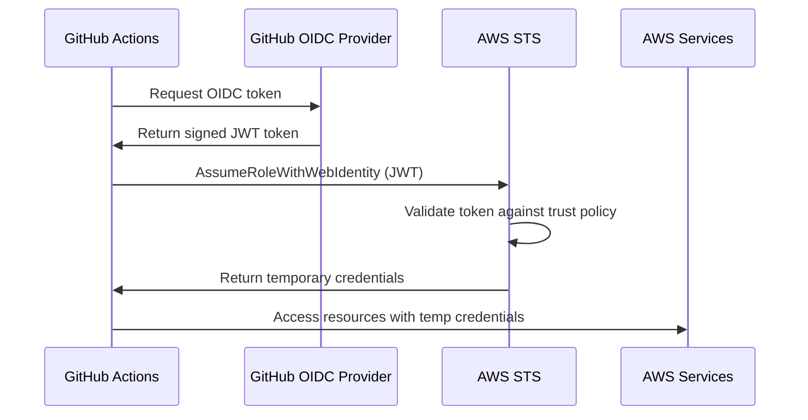

# How to Configure OIDC for AWS in GitHub Actions

Author: [nawazdhandala](https://www.github.com/nawazdhandala)

Tags: GitHub Actions, OIDC, AWS, Security, IAM, Authentication

Description: Learn how to use OpenID Connect (OIDC) to authenticate GitHub Actions with AWS without storing long-lived credentials. This guide covers IAM role configuration, trust policies, and secure deployment patterns.

---

Storing AWS access keys in GitHub Secrets works, but it creates security risks. Keys can be leaked, they do not expire, and rotating them requires manual updates. OpenID Connect (OIDC) eliminates these problems by letting GitHub Actions assume AWS IAM roles directly using short-lived tokens. This guide shows you how to set up OIDC authentication for secure AWS deployments.

## How OIDC Authentication Works

Instead of static credentials, OIDC uses a trust relationship:



Benefits:
- No long-lived secrets to manage
- Credentials automatically expire (default 1 hour)
- Fine-grained access control per repository/branch
- Full audit trail in AWS CloudTrail

## Setting Up the AWS Side

### Step 1: Create the OIDC Identity Provider

Create the GitHub OIDC provider in your AWS account:

```bash
# Using AWS CLI
aws iam create-open-id-connect-provider \
  --url https://token.actions.githubusercontent.com \
  --client-id-list sts.amazonaws.com \
  --thumbprint-list 6938fd4d98bab03faadb97b34396831e3780aea1
```

Or with Terraform:

```hcl
# terraform/oidc.tf
resource "aws_iam_openid_connect_provider" "github" {
  url = "https://token.actions.githubusercontent.com"

  client_id_list = [
    "sts.amazonaws.com"
  ]

  # GitHub's thumbprint - verify this is current
  thumbprint_list = [
    "6938fd4d98bab03faadb97b34396831e3780aea1"
  ]
}
```

### Step 2: Create the IAM Role

Create a role that GitHub Actions can assume:

```bash
# Create trust policy document
cat > trust-policy.json << 'EOF'
{
  "Version": "2012-10-17",
  "Statement": [
    {
      "Effect": "Allow",
      "Principal": {
        "Federated": "arn:aws:iam::123456789012:oidc-provider/token.actions.githubusercontent.com"
      },
      "Action": "sts:AssumeRoleWithWebIdentity",
      "Condition": {
        "StringEquals": {
          "token.actions.githubusercontent.com:aud": "sts.amazonaws.com"
        },
        "StringLike": {
          "token.actions.githubusercontent.com:sub": "repo:your-org/your-repo:*"
        }
      }
    }
  ]
}
EOF

# Create the role
aws iam create-role \
  --role-name github-actions-deploy \
  --assume-role-policy-document file://trust-policy.json
```

### Step 3: Attach Permissions

Attach policies for what the role can do:

```bash
# Attach managed policy for S3 access
aws iam attach-role-policy \
  --role-name github-actions-deploy \
  --policy-arn arn:aws:iam::aws:policy/AmazonS3FullAccess

# Or create a custom policy
cat > permissions.json << 'EOF'
{
  "Version": "2012-10-17",
  "Statement": [
    {
      "Effect": "Allow",
      "Action": [
        "s3:PutObject",
        "s3:GetObject",
        "s3:DeleteObject",
        "s3:ListBucket"
      ],
      "Resource": [
        "arn:aws:s3:::my-deployment-bucket",
        "arn:aws:s3:::my-deployment-bucket/*"
      ]
    },
    {
      "Effect": "Allow",
      "Action": [
        "ecr:GetAuthorizationToken",
        "ecr:BatchCheckLayerAvailability",
        "ecr:GetDownloadUrlForLayer",
        "ecr:BatchGetImage",
        "ecr:PutImage",
        "ecr:InitiateLayerUpload",
        "ecr:UploadLayerPart",
        "ecr:CompleteLayerUpload"
      ],
      "Resource": "*"
    }
  ]
}
EOF

aws iam put-role-policy \
  --role-name github-actions-deploy \
  --policy-name DeploymentPermissions \
  --policy-document file://permissions.json
```

## Using OIDC in GitHub Actions

Configure your workflow to use OIDC:

```yaml
# .github/workflows/deploy.yml
name: Deploy to AWS

on:
  push:
    branches: [main]

jobs:
  deploy:
    runs-on: ubuntu-latest

    # Required permissions for OIDC
    permissions:
      id-token: write   # Required to request the JWT
      contents: read    # Required to checkout code

    steps:
      - uses: actions/checkout@v4

      # Configure AWS credentials using OIDC
      - name: Configure AWS credentials
        uses: aws-actions/configure-aws-credentials@v4
        with:
          role-to-assume: arn:aws:iam::123456789012:role/github-actions-deploy
          aws-region: us-east-1

      # Now you can use AWS CLI and SDKs
      - name: Deploy to S3
        run: |
          aws s3 sync ./dist s3://my-bucket/
```

## Trust Policy Conditions

Control which repositories and branches can assume the role:

### Single Repository

```json
{
  "Condition": {
    "StringEquals": {
      "token.actions.githubusercontent.com:aud": "sts.amazonaws.com",
      "token.actions.githubusercontent.com:sub": "repo:your-org/your-repo:ref:refs/heads/main"
    }
  }
}
```

### Multiple Repositories

```json
{
  "Condition": {
    "StringEquals": {
      "token.actions.githubusercontent.com:aud": "sts.amazonaws.com"
    },
    "StringLike": {
      "token.actions.githubusercontent.com:sub": [
        "repo:your-org/repo-1:*",
        "repo:your-org/repo-2:*",
        "repo:your-org/repo-3:*"
      ]
    }
  }
}
```

### Branch-Specific Access

```json
{
  "Condition": {
    "StringEquals": {
      "token.actions.githubusercontent.com:aud": "sts.amazonaws.com"
    },
    "StringLike": {
      "token.actions.githubusercontent.com:sub": "repo:your-org/your-repo:ref:refs/heads/main"
    }
  }
}
```

### Environment-Specific Access

```json
{
  "Condition": {
    "StringEquals": {
      "token.actions.githubusercontent.com:aud": "sts.amazonaws.com",
      "token.actions.githubusercontent.com:sub": "repo:your-org/your-repo:environment:production"
    }
  }
}
```

## Complete Terraform Configuration

Full infrastructure as code setup:

```hcl
# terraform/github-oidc.tf

# OIDC Provider
resource "aws_iam_openid_connect_provider" "github" {
  url             = "https://token.actions.githubusercontent.com"
  client_id_list  = ["sts.amazonaws.com"]
  thumbprint_list = ["6938fd4d98bab03faadb97b34396831e3780aea1"]
}

# Variables
variable "github_org" {
  description = "GitHub organization name"
  type        = string
}

variable "github_repo" {
  description = "GitHub repository name"
  type        = string
}

# Trust policy
data "aws_iam_policy_document" "github_actions_trust" {
  statement {
    actions = ["sts:AssumeRoleWithWebIdentity"]

    principals {
      type        = "Federated"
      identifiers = [aws_iam_openid_connect_provider.github.arn]
    }

    condition {
      test     = "StringEquals"
      variable = "token.actions.githubusercontent.com:aud"
      values   = ["sts.amazonaws.com"]
    }

    condition {
      test     = "StringLike"
      variable = "token.actions.githubusercontent.com:sub"
      values   = ["repo:${var.github_org}/${var.github_repo}:*"]
    }
  }
}

# IAM Role
resource "aws_iam_role" "github_actions" {
  name               = "github-actions-${var.github_repo}"
  assume_role_policy = data.aws_iam_policy_document.github_actions_trust.json
}

# Permissions policy
data "aws_iam_policy_document" "github_actions_permissions" {
  # S3 access
  statement {
    actions = [
      "s3:PutObject",
      "s3:GetObject",
      "s3:DeleteObject",
      "s3:ListBucket"
    ]
    resources = [
      "arn:aws:s3:::${var.deployment_bucket}",
      "arn:aws:s3:::${var.deployment_bucket}/*"
    ]
  }

  # ECR access
  statement {
    actions = [
      "ecr:GetAuthorizationToken"
    ]
    resources = ["*"]
  }

  statement {
    actions = [
      "ecr:BatchCheckLayerAvailability",
      "ecr:GetDownloadUrlForLayer",
      "ecr:BatchGetImage",
      "ecr:PutImage",
      "ecr:InitiateLayerUpload",
      "ecr:UploadLayerPart",
      "ecr:CompleteLayerUpload"
    ]
    resources = [
      "arn:aws:ecr:*:*:repository/${var.github_repo}"
    ]
  }
}

resource "aws_iam_role_policy" "github_actions" {
  name   = "github-actions-permissions"
  role   = aws_iam_role.github_actions.id
  policy = data.aws_iam_policy_document.github_actions_permissions.json
}

# Output the role ARN for use in workflows
output "role_arn" {
  value = aws_iam_role.github_actions.arn
}
```

## Multiple Roles for Different Environments

Create separate roles for staging and production:

```yaml
# .github/workflows/deploy.yml
name: Deploy

on:
  push:
    branches: [main, staging]

jobs:
  deploy:
    runs-on: ubuntu-latest

    permissions:
      id-token: write
      contents: read

    # Use environments for role selection
    environment: ${{ github.ref_name == 'main' && 'production' || 'staging' }}

    steps:
      - uses: actions/checkout@v4

      - name: Configure AWS credentials
        uses: aws-actions/configure-aws-credentials@v4
        with:
          # Different role per environment (set in environment secrets)
          role-to-assume: ${{ secrets.AWS_ROLE_ARN }}
          aws-region: us-east-1

      - name: Deploy
        run: ./deploy.sh
```

Configure environment secrets:
- `staging` environment: `AWS_ROLE_ARN = arn:aws:iam::123456789012:role/github-actions-staging`
- `production` environment: `AWS_ROLE_ARN = arn:aws:iam::123456789012:role/github-actions-production`

## Session Duration and Tags

Customize the assumed role session:

```yaml
- name: Configure AWS credentials
  uses: aws-actions/configure-aws-credentials@v4
  with:
    role-to-assume: arn:aws:iam::123456789012:role/github-actions-deploy
    aws-region: us-east-1
    # Extend session duration (default: 1 hour, max: 12 hours)
    role-duration-seconds: 3600
    # Add session tags for tracking
    role-session-name: GitHubActions-${{ github.run_id }}
```

## Debugging OIDC Issues

Common problems and solutions:

### Token Not Being Generated

Ensure permissions are set:

```yaml
permissions:
  id-token: write  # This is required
```

### Trust Policy Not Matching

Check the subject claim format:

```yaml
- name: Debug OIDC token
  run: |
    # Print the token claims (without sensitive data)
    OIDC_TOKEN=$(curl -H "Authorization: bearer $ACTIONS_ID_TOKEN_REQUEST_TOKEN" "$ACTIONS_ID_TOKEN_REQUEST_URL" | jq -r '.value')
    echo "Token claims:"
    echo $OIDC_TOKEN | cut -d'.' -f2 | base64 -d 2>/dev/null | jq '.sub, .aud, .iss'
```

### Role Cannot Be Assumed

Verify the trust policy matches exactly:

```bash
# Get the role's trust policy
aws iam get-role --role-name github-actions-deploy --query 'Role.AssumeRolePolicyDocument'
```

## Cross-Account Access

Assume roles in other AWS accounts:

```yaml
- name: Configure credentials for account A
  uses: aws-actions/configure-aws-credentials@v4
  with:
    role-to-assume: arn:aws:iam::111111111111:role/github-actions
    aws-region: us-east-1

- name: Do something in account A
  run: aws s3 ls

# Chain to account B
- name: Configure credentials for account B
  uses: aws-actions/configure-aws-credentials@v4
  with:
    role-to-assume: arn:aws:iam::222222222222:role/deployment-role
    aws-region: us-east-1
    role-chaining: true

- name: Do something in account B
  run: aws s3 ls
```

Account B's role needs to trust account A's role:

```json
{
  "Version": "2012-10-17",
  "Statement": [
    {
      "Effect": "Allow",
      "Principal": {
        "AWS": "arn:aws:iam::111111111111:role/github-actions"
      },
      "Action": "sts:AssumeRole"
    }
  ]
}
```

## Security Best Practices

1. **Use environment-specific roles**: Different roles for staging vs production
2. **Restrict by branch**: Only allow production deployments from main
3. **Minimize permissions**: Grant only required permissions
4. **Use session tags**: Track deployments in CloudTrail
5. **Set short session durations**: Default 1 hour is usually sufficient

```json
{
  "Version": "2012-10-17",
  "Statement": [
    {
      "Effect": "Allow",
      "Principal": {
        "Federated": "arn:aws:iam::123456789012:oidc-provider/token.actions.githubusercontent.com"
      },
      "Action": "sts:AssumeRoleWithWebIdentity",
      "Condition": {
        "StringEquals": {
          "token.actions.githubusercontent.com:aud": "sts.amazonaws.com",
          "token.actions.githubusercontent.com:sub": "repo:your-org/your-repo:environment:production"
        }
      }
    }
  ]
}
```

---

OIDC authentication eliminates the risk of leaked credentials and simplifies secret rotation. The initial setup requires some AWS configuration, but the security benefits are worth it. Once configured, your workflows authenticate seamlessly without managing any secrets, and you get a complete audit trail of every AWS action in CloudTrail.
