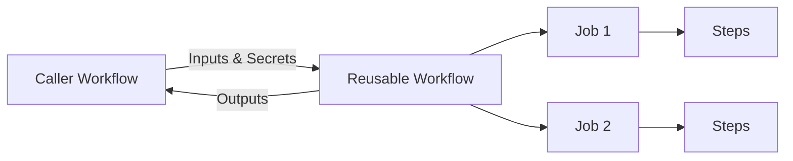

# How to Create Reusable Workflows in GitHub Actions

Author: [nawazdhandala](https://www.github.com/nawazdhandala)

Tags: GitHub Actions, Reusable Workflows, CI/CD, DRY, Automation, DevOps

Description: Learn how to create and use reusable workflows in GitHub Actions to eliminate duplication across repositories. This guide covers workflow inputs, outputs, secrets, and patterns for building a shared CI/CD library.

---

Copying workflow files between repositories creates maintenance nightmares. When you need to update a deployment process, you end up editing dozens of files across different repos. Reusable workflows solve this by letting you define a workflow once and call it from anywhere. This guide shows you how to build and use reusable workflows effectively.

## Understanding Reusable Workflows

A reusable workflow is a complete workflow file that other workflows can call as a job. Think of it as a function that accepts inputs and can return outputs.



Key benefits:
- Single source of truth for common workflows
- Easier maintenance and updates
- Consistent CI/CD across repositories
- Reduced duplication and errors

## Creating a Reusable Workflow

Define a reusable workflow with the `workflow_call` trigger:

```yaml
# .github/workflows/build-and-test.yml
name: Build and Test

on:
  workflow_call:
    # Define inputs the caller can provide
    inputs:
      node-version:
        description: 'Node.js version to use'
        required: false
        default: '20'
        type: string

      run-coverage:
        description: 'Generate coverage report'
        required: false
        default: true
        type: boolean

    # Define outputs to return to caller
    outputs:
      coverage-percent:
        description: 'Test coverage percentage'
        value: ${{ jobs.test.outputs.coverage }}

    # Define secrets the workflow needs
    secrets:
      NPM_TOKEN:
        required: false
        description: 'NPM token for private packages'

jobs:
  build:
    runs-on: ubuntu-latest

    steps:
      - uses: actions/checkout@v4

      - name: Setup Node.js
        uses: actions/setup-node@v4
        with:
          node-version: ${{ inputs.node-version }}
          cache: 'npm'

      - name: Install dependencies
        run: npm ci
        env:
          NPM_TOKEN: ${{ secrets.NPM_TOKEN }}

      - name: Build
        run: npm run build

  test:
    runs-on: ubuntu-latest
    needs: build

    outputs:
      coverage: ${{ steps.coverage.outputs.percent }}

    steps:
      - uses: actions/checkout@v4

      - name: Setup Node.js
        uses: actions/setup-node@v4
        with:
          node-version: ${{ inputs.node-version }}
          cache: 'npm'

      - name: Install dependencies
        run: npm ci

      - name: Run tests
        run: npm test -- --coverage=${{ inputs.run-coverage }}

      - name: Extract coverage
        id: coverage
        if: inputs.run-coverage
        run: |
          COVERAGE=$(grep -oP 'All files[^|]*\|\s*\K[\d.]+' coverage/coverage-summary.txt || echo "0")
          echo "percent=$COVERAGE" >> $GITHUB_OUTPUT
```

## Calling a Reusable Workflow

Call reusable workflows from the same repository or external repositories:

```yaml
# .github/workflows/ci.yml
name: CI

on:
  push:
    branches: [main]
  pull_request:
    branches: [main]

jobs:
  # Call reusable workflow from same repository
  build-test:
    uses: ./.github/workflows/build-and-test.yml
    with:
      node-version: '20'
      run-coverage: true
    secrets:
      NPM_TOKEN: ${{ secrets.NPM_TOKEN }}

  # Use the outputs
  report:
    needs: build-test
    runs-on: ubuntu-latest

    steps:
      - name: Report coverage
        run: |
          echo "Coverage: ${{ needs.build-test.outputs.coverage-percent }}%"
```

### Calling from External Repository

```yaml
jobs:
  build:
    # Reference workflow from another repository
    uses: your-org/shared-workflows/.github/workflows/build-and-test.yml@main
    with:
      node-version: '20'
    secrets: inherit  # Pass all secrets to the called workflow
```

## Input Types and Validation

Reusable workflows support these input types:

```yaml
on:
  workflow_call:
    inputs:
      # String input
      environment:
        type: string
        required: true

      # Boolean input
      dry-run:
        type: boolean
        default: false

      # Number input
      timeout:
        type: number
        default: 30

      # JSON input for complex data
      config:
        type: string
        description: 'JSON configuration object'
```

Use JSON for complex inputs:

```yaml
# Caller
jobs:
  deploy:
    uses: ./.github/workflows/deploy.yml
    with:
      config: '{"region": "us-east-1", "replicas": 3}'

# Reusable workflow
jobs:
  deploy:
    runs-on: ubuntu-latest
    steps:
      - name: Parse config
        run: |
          REGION=$(echo '${{ inputs.config }}' | jq -r '.region')
          REPLICAS=$(echo '${{ inputs.config }}' | jq -r '.replicas')
          echo "Deploying to $REGION with $REPLICAS replicas"
```

## Handling Secrets

Pass secrets explicitly or inherit all:

```yaml
# Option 1: Pass specific secrets
jobs:
  build:
    uses: ./.github/workflows/build.yml
    secrets:
      DEPLOY_KEY: ${{ secrets.DEPLOY_KEY }}
      API_TOKEN: ${{ secrets.API_TOKEN }}

# Option 2: Inherit all secrets (simpler but less explicit)
jobs:
  build:
    uses: ./.github/workflows/build.yml
    secrets: inherit
```

In the reusable workflow, declare expected secrets:

```yaml
on:
  workflow_call:
    secrets:
      DEPLOY_KEY:
        required: true
        description: 'SSH key for deployment'
      API_TOKEN:
        required: false
```

## Workflow Outputs

Return data from reusable workflows:

```yaml
# Reusable workflow with outputs
on:
  workflow_call:
    outputs:
      image-tag:
        description: 'Docker image tag'
        value: ${{ jobs.build.outputs.tag }}
      artifact-url:
        description: 'URL to build artifact'
        value: ${{ jobs.build.outputs.url }}

jobs:
  build:
    runs-on: ubuntu-latest
    outputs:
      tag: ${{ steps.docker.outputs.tag }}
      url: ${{ steps.upload.outputs.url }}

    steps:
      - name: Build Docker image
        id: docker
        run: |
          TAG="v1.0.${{ github.run_number }}"
          docker build -t myapp:$TAG .
          echo "tag=$TAG" >> $GITHUB_OUTPUT

      - name: Upload artifact
        id: upload
        run: |
          # Upload and get URL
          echo "url=https://artifacts.example.com/build-${{ github.run_id }}" >> $GITHUB_OUTPUT
```

```yaml
# Caller using outputs
jobs:
  build:
    uses: ./.github/workflows/build.yml

  deploy:
    needs: build
    runs-on: ubuntu-latest
    steps:
      - name: Deploy image
        run: |
          echo "Deploying ${{ needs.build.outputs.image-tag }}"
          echo "Artifact at ${{ needs.build.outputs.artifact-url }}"
```

## Composing Multiple Reusable Workflows

Chain reusable workflows for complex pipelines:

```yaml
# .github/workflows/release.yml
name: Release Pipeline

on:
  push:
    tags: ['v*']

jobs:
  # First: build and test
  build:
    uses: ./.github/workflows/build-and-test.yml
    with:
      node-version: '20'

  # Second: build Docker image
  docker:
    needs: build
    uses: ./.github/workflows/docker-build.yml
    with:
      tag: ${{ github.ref_name }}
    secrets: inherit

  # Third: deploy to staging
  staging:
    needs: docker
    uses: ./.github/workflows/deploy.yml
    with:
      environment: staging
      image-tag: ${{ needs.docker.outputs.image-tag }}
    secrets: inherit

  # Fourth: deploy to production
  production:
    needs: staging
    uses: ./.github/workflows/deploy.yml
    with:
      environment: production
      image-tag: ${{ needs.docker.outputs.image-tag }}
    secrets: inherit
```

## Organization Workflow Templates

Create starter templates for your organization:

```
your-org/.github/
  workflow-templates/
    ci-nodejs.yml
    ci-nodejs.properties.json
    deploy-kubernetes.yml
    deploy-kubernetes.properties.json
```

Template file:

```yaml
# workflow-templates/ci-nodejs.yml
name: Node.js CI

on:
  push:
    branches: [$default-branch]
  pull_request:
    branches: [$default-branch]

jobs:
  build:
    uses: your-org/shared-workflows/.github/workflows/nodejs-ci.yml@v1
    secrets: inherit
```

Properties file:

```json
{
  "name": "Node.js CI",
  "description": "Build and test Node.js projects",
  "iconName": "nodejs",
  "categories": ["JavaScript", "Node.js"]
}
```

## Versioning Reusable Workflows

Use tags or branches to version your shared workflows:

```yaml
# Pin to specific version (recommended for stability)
jobs:
  build:
    uses: your-org/shared-workflows/.github/workflows/build.yml@v1.2.0

# Pin to major version (gets minor/patch updates)
jobs:
  build:
    uses: your-org/shared-workflows/.github/workflows/build.yml@v1

# Use main branch (latest, less stable)
jobs:
  build:
    uses: your-org/shared-workflows/.github/workflows/build.yml@main
```

Create releases with semantic versioning:

```bash
# Tag a release
git tag -a v1.2.0 -m "Release 1.2.0"
git push origin v1.2.0

# Update major version tag
git tag -fa v1 -m "Update v1 to v1.2.0"
git push origin v1 --force
```

## Handling Permissions

Reusable workflows inherit permissions from the caller, but you can restrict them:

```yaml
# Reusable workflow with restricted permissions
on:
  workflow_call:

# Explicitly limit permissions
permissions:
  contents: read
  packages: write

jobs:
  build:
    runs-on: ubuntu-latest
    steps:
      - uses: actions/checkout@v4
```

## Debugging Reusable Workflows

Enable debug logging when calling:

```yaml
jobs:
  build:
    uses: ./.github/workflows/build.yml
    with:
      node-version: '20'
    # Add environment variable for debugging
```

In the reusable workflow:

```yaml
- name: Debug info
  run: |
    echo "Inputs: ${{ toJson(inputs) }}"
    echo "GitHub context: ${{ toJson(github) }}"
```

## Limitations to Know

1. **Nesting depth**: Reusable workflows can call other reusable workflows up to 4 levels deep
2. **Same organization**: Private reusable workflows are only accessible within the same organization
3. **No env at workflow level**: Environment variables must be set at job or step level
4. **Matrix with reusable workflows**: You cannot use matrix directly with reusable workflow calls

Workaround for matrix:

```yaml
jobs:
  setup:
    runs-on: ubuntu-latest
    outputs:
      matrix: ${{ steps.set.outputs.matrix }}
    steps:
      - id: set
        run: echo 'matrix=["18", "20"]' >> $GITHUB_OUTPUT

  build:
    needs: setup
    strategy:
      matrix:
        node: ${{ fromJson(needs.setup.outputs.matrix) }}
    uses: ./.github/workflows/build.yml
    with:
      node-version: ${{ matrix.node }}
```

---

Reusable workflows bring software engineering principles to your CI/CD pipelines. Start by extracting common patterns into shared workflows, version them carefully, and document their inputs and outputs. Your team will spend less time maintaining duplicate YAML and more time shipping features.
