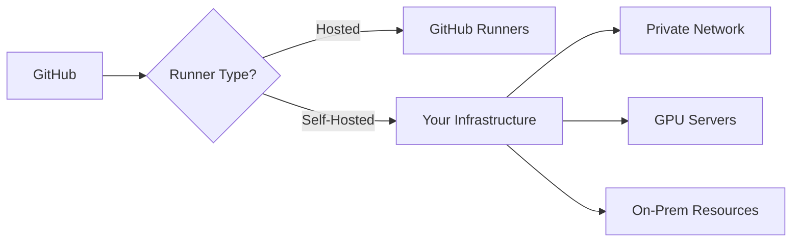

# How to Configure Self-Hosted Runners in GitHub Actions

Author: [nawazdhandala](https://www.github.com/nawazdhandala)

Tags: GitHub Actions, Self-Hosted Runners, CI/CD, DevOps, Infrastructure, Security

Description: Learn how to set up and manage self-hosted runners for GitHub Actions. This guide covers installation, configuration, security hardening, autoscaling, and best practices for running CI/CD on your own infrastructure.

---

GitHub-hosted runners work great for most projects, but sometimes you need more control. Self-hosted runners let you run workflows on your own machines with custom hardware, specific software configurations, or access to private networks. This guide walks you through setting up production-ready self-hosted runners.

## Why Use Self-Hosted Runners?

Self-hosted runners make sense when you need:

- Access to private networks or on-premises resources
- Specific hardware (GPUs, ARM processors, high memory)
- Custom software that takes too long to install each run
- Lower latency to your infrastructure
- Cost savings for high-volume CI/CD



## Installing a Self-Hosted Runner

Start by adding a runner to your repository or organization.

### Repository-Level Runner

Navigate to Settings > Actions > Runners > New self-hosted runner in your repository. GitHub provides download and configuration commands:

```bash
# Create a directory for the runner
mkdir actions-runner && cd actions-runner

# Download the runner package (Linux x64 example)
curl -o actions-runner-linux-x64-2.311.0.tar.gz -L \
  https://github.com/actions/runner/releases/download/v2.311.0/actions-runner-linux-x64-2.311.0.tar.gz

# Extract the package
tar xzf ./actions-runner-linux-x64-2.311.0.tar.gz

# Configure the runner with your repository
# Replace TOKEN with the token from GitHub UI
./config.sh --url https://github.com/your-org/your-repo \
  --token YOUR_TOKEN \
  --name "build-server-01" \
  --labels "linux,x64,gpu" \
  --work "_work"

# Run the runner
./run.sh
```

### Organization-Level Runner

For runners shared across repositories, configure at the organization level:

```bash
# Configure for organization
./config.sh --url https://github.com/your-org \
  --token YOUR_ORG_TOKEN \
  --name "shared-runner-01" \
  --labels "linux,x64,docker" \
  --runnergroup "production"
```

## Running as a Service

For production use, run the runner as a system service:

```bash
# Install the service (Linux with systemd)
sudo ./svc.sh install

# Start the service
sudo ./svc.sh start

# Check status
sudo ./svc.sh status

# View logs
journalctl -u actions.runner.your-org-your-repo.build-server-01.service -f
```

On Windows, use the built-in service installation:

```powershell
# Install as Windows service
.\config.cmd --url https://github.com/your-org/your-repo `
  --token YOUR_TOKEN `
  --name "windows-runner-01" `
  --runasservice
```

## Using Labels for Runner Selection

Labels help workflows target specific runners:

```yaml
# .github/workflows/gpu-build.yml
name: GPU Build

on: push

jobs:
  train-model:
    # Target runners with these labels
    runs-on: [self-hosted, linux, gpu]

    steps:
      - uses: actions/checkout@v4

      - name: Train ML model
        run: python train.py --use-gpu

  standard-tests:
    # Fall back to GitHub-hosted for regular tests
    runs-on: ubuntu-latest

    steps:
      - uses: actions/checkout@v4
      - run: npm test
```

The `runs-on` array requires all labels to match. A runner with labels `[self-hosted, linux, gpu, x64]` matches the job above.

## Runner Groups

Organize runners into groups for access control (requires GitHub Enterprise or organization):

```yaml
jobs:
  deploy-prod:
    # Use a runner from the production group
    runs-on:
      group: production-runners
      labels: [linux, x64]

    environment: production

    steps:
      - uses: actions/checkout@v4
      - run: ./deploy.sh
```

Configure runner groups in Organization Settings > Actions > Runner groups. You can restrict which repositories can use each group.

## Security Hardening

Self-hosted runners require careful security configuration:

### Dedicated User Account

```bash
# Create a dedicated user for the runner
sudo useradd -m -s /bin/bash github-runner

# Set up the runner under this user
sudo -u github-runner ./config.sh --url https://github.com/your-org \
  --token YOUR_TOKEN \
  --name "secure-runner"

# Install service to run as this user
sudo ./svc.sh install github-runner
```

### Ephemeral Runners

Configure runners to exit after one job, preventing state leakage:

```bash
# Configure as ephemeral (single use)
./config.sh --url https://github.com/your-org \
  --token YOUR_TOKEN \
  --ephemeral

# The runner will unregister after completing one job
# Use with autoscaling to create new runners on demand
```

### Network Isolation

```bash
# Example: Run in a Docker container with limited network access
docker run -d \
  --name github-runner \
  --network internal-only \
  -e RUNNER_TOKEN=YOUR_TOKEN \
  -e RUNNER_REPOSITORY_URL=https://github.com/your-org/your-repo \
  myorg/github-runner:latest
```

## Autoscaling Runners

For dynamic workloads, autoscale runners based on job queue depth.

### Using Actions Runner Controller (Kubernetes)

Install the Actions Runner Controller on your Kubernetes cluster:

```yaml
# runner-deployment.yaml
apiVersion: actions.summerwind.dev/v1alpha1
kind: RunnerDeployment
metadata:
  name: example-runners
spec:
  replicas: 2
  template:
    spec:
      repository: your-org/your-repo
      labels:
        - linux
        - x64
        - k8s
---
apiVersion: actions.summerwind.dev/v1alpha1
kind: HorizontalRunnerAutoscaler
metadata:
  name: example-autoscaler
spec:
  scaleTargetRef:
    name: example-runners
  minReplicas: 1
  maxReplicas: 10
  metrics:
    - type: TotalNumberOfQueuedAndInProgressWorkflowRuns
      repositoryNames:
        - your-org/your-repo
```

### Using AWS Auto Scaling

Create a launch template and Auto Scaling group for EC2-based runners:

```bash
# User data script for EC2 instances
#!/bin/bash
set -e

# Install runner
mkdir /home/ec2-user/actions-runner && cd /home/ec2-user/actions-runner
curl -o runner.tar.gz -L https://github.com/actions/runner/releases/download/v2.311.0/actions-runner-linux-x64-2.311.0.tar.gz
tar xzf runner.tar.gz

# Get registration token from your API
TOKEN=$(curl -s https://your-api/get-runner-token)

# Configure as ephemeral
./config.sh --url https://github.com/your-org \
  --token $TOKEN \
  --ephemeral \
  --name "aws-$(hostname)" \
  --unattended

# Run
./run.sh
```

## Monitoring Runner Health

Track runner availability and job execution:

```yaml
# .github/workflows/runner-health.yml
name: Runner Health Check

on:
  schedule:
    # Check every 15 minutes
    - cron: '*/15 * * * *'

jobs:
  check-self-hosted:
    runs-on: [self-hosted, linux]
    timeout-minutes: 5

    steps:
      - name: Report health
        run: |
          echo "Runner $(hostname) is healthy"
          echo "Free disk: $(df -h / | tail -1 | awk '{print $4}')"
          echo "Free memory: $(free -h | grep Mem | awk '{print $4}')"

      - name: Send metrics
        run: |
          curl -X POST https://your-monitoring/metrics \
            -d "runner=$(hostname)&status=healthy&time=$(date +%s)"
```

## Maintenance and Updates

Keep runners updated and clean:

```bash
#!/bin/bash
# maintenance.sh - Run periodically on each runner

# Stop the runner service
sudo ./svc.sh stop

# Clean up work directory
rm -rf _work/*

# Update the runner
LATEST=$(curl -s https://api.github.com/repos/actions/runner/releases/latest | jq -r .tag_name)
curl -o runner.tar.gz -L "https://github.com/actions/runner/releases/download/${LATEST}/actions-runner-linux-x64-${LATEST#v}.tar.gz"
tar xzf runner.tar.gz --overwrite

# Restart
sudo ./svc.sh start
```

## Docker-in-Docker Setup

Many workflows need Docker. Configure your runner to support it:

```bash
# Install Docker on the runner machine
curl -fsSL https://get.docker.com | sh

# Add the runner user to the docker group
sudo usermod -aG docker github-runner

# For rootless Docker (more secure)
dockerd-rootless-setuptool.sh install
```

Workflow using Docker:

```yaml
jobs:
  build:
    runs-on: [self-hosted, linux, docker]

    steps:
      - uses: actions/checkout@v4

      - name: Build image
        run: docker build -t myapp:${{ github.sha }} .

      - name: Run tests in container
        run: docker run --rm myapp:${{ github.sha }} npm test
```

## Troubleshooting Common Issues

### Runner Not Picking Up Jobs

Check the runner status and logs:

```bash
# Check if runner is connected
./run.sh --check

# View detailed logs
journalctl -u actions.runner.your-org.runner-name -n 100

# Verify labels match workflow
# Ensure runs-on labels are all present on the runner
```

### Disk Space Issues

Clean up after builds:

```yaml
jobs:
  build:
    runs-on: [self-hosted, linux]

    steps:
      - uses: actions/checkout@v4

      - name: Build
        run: npm run build

      # Clean up to prevent disk fill
      - name: Cleanup
        if: always()
        run: |
          docker system prune -af --volumes
          rm -rf node_modules dist
```

### Permission Errors

Ensure proper ownership:

```bash
# Fix permissions on runner directory
sudo chown -R github-runner:github-runner /home/github-runner/actions-runner

# For Docker socket access
sudo chmod 666 /var/run/docker.sock
# Or better: use rootless Docker
```

---

Self-hosted runners give you control over your CI/CD infrastructure while keeping the convenience of GitHub Actions workflows. Start with a single runner to test your setup, then scale with autoscaling solutions as your team grows. Remember to treat runners as cattle, not pets. Ephemeral runners and infrastructure-as-code make maintenance straightforward.
