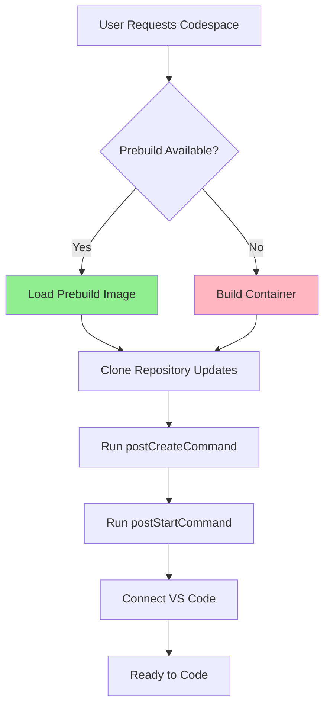

# How to Configure GitHub Codespaces for Projects

Author: [nawazdhandala](https://www.github.com/nawazdhandala)

Tags: GitHub Codespaces, Cloud Development, DevOps, Remote Development, Developer Experience

Description: A practical guide to configuring GitHub Codespaces for your projects, including machine types, prebuilds, secrets management, and optimizing startup times for team productivity.

---

GitHub Codespaces provides cloud-hosted development environments that spin up in seconds. Instead of cloning repositories and configuring local environments, developers get instant access to fully configured workspaces running on powerful cloud machines. This guide covers everything you need to configure Codespaces effectively for your team.

## Understanding Codespaces Architecture

When you launch a Codespace, GitHub provisions a virtual machine in the cloud, builds your development container, clones your repository, and connects your browser or local VS Code to this remote environment. Your code runs entirely in the cloud, with changes synced back to the repository through normal Git workflows.

The key components are:

- **Dev Container Configuration**: Defines the development environment
- **Prebuilds**: Pre-configured images that speed up startup
- **Machine Types**: Different VM sizes for varying workloads
- **Secrets**: Secure storage for API keys and credentials

## Basic Configuration

Codespaces uses the Dev Container specification. Create a `.devcontainer/devcontainer.json` file:

```json
{
  // Name shown in the Codespaces dashboard
  "name": "Production API Development",

  // Use a pre-built image for faster startup
  // Microsoft maintains images for common language stacks
  "image": "mcr.microsoft.com/devcontainers/python:3.11",

  // Features add tools without custom Dockerfiles
  "features": {
    // Add Docker CLI for container operations
    "ghcr.io/devcontainers/features/docker-in-docker:2": {},
    // Add AWS CLI for deployment
    "ghcr.io/devcontainers/features/aws-cli:1": {},
    // Add PostgreSQL client for database access
    "ghcr.io/devcontainers/features/postgresql:1": {}
  },

  // VS Code configuration applied automatically
  "customizations": {
    "vscode": {
      "extensions": [
        "ms-python.python",
        "ms-python.vscode-pylance",
        "charliermarsh.ruff"
      ],
      "settings": {
        "python.defaultInterpreterPath": "/usr/local/bin/python",
        "python.linting.enabled": true
      }
    }
  },

  // Commands executed during Codespace lifecycle
  "postCreateCommand": "pip install -r requirements.txt",
  "postStartCommand": "echo 'Environment ready!'",

  // Ports to forward automatically
  "forwardPorts": [8000, 5432],

  // Port attributes for better UX
  "portsAttributes": {
    "8000": {
      "label": "API Server",
      "onAutoForward": "notify"
    },
    "5432": {
      "label": "PostgreSQL",
      "onAutoForward": "silent"
    }
  }
}
```

## Configuring Machine Types

Different projects need different resources. Configure minimum requirements:

```json
{
  "name": "Resource-Intensive Project",
  "image": "mcr.microsoft.com/devcontainers/base:ubuntu",

  // Specify minimum machine requirements
  // Users can still choose larger machines
  "hostRequirements": {
    // Minimum CPU cores (2, 4, 8, 16, or 32)
    "cpus": 4,
    // Minimum RAM in GB
    "memory": "8gb",
    // Minimum storage in GB
    "storage": "64gb"
  },

  "features": {
    "ghcr.io/devcontainers/features/node:1": {
      "version": "20"
    }
  },

  "postCreateCommand": "npm install && npm run build"
}
```

## Setting Up Prebuilds

Prebuilds dramatically reduce Codespace startup time by building images ahead of time. Configure them in your repository settings or through the configuration file:

```json
{
  "name": "Prebuild-Optimized Project",
  "image": "mcr.microsoft.com/devcontainers/javascript-node:20",

  // Prebuild configuration
  "updateContentCommand": "npm ci",
  "postCreateCommand": "npm run setup",

  // Cache node_modules between prebuilds
  "mounts": [
    "source=node-modules-cache,target=/workspace/node_modules,type=volume"
  ],

  "customizations": {
    "vscode": {
      "extensions": [
        "dbaeumer.vscode-eslint",
        "esbenp.prettier-vscode"
      ]
    }
  }
}
```

Enable prebuilds through the repository settings:

1. Navigate to repository Settings
2. Select Codespaces in the sidebar
3. Click "Set up prebuild"
4. Choose trigger events (push to main, pull requests)
5. Select regions for prebuild availability

## Multi-Container Environments

For applications requiring databases and other services, use Docker Compose:

```yaml
# .devcontainer/docker-compose.yml
version: '3.8'

services:
  app:
    build:
      context: ..
      dockerfile: .devcontainer/Dockerfile
    volumes:
      - ..:/workspace:cached
    command: sleep infinity
    environment:
      - DATABASE_URL=postgresql://dev:dev@db:5432/appdb
      - REDIS_URL=redis://cache:6379
    depends_on:
      - db
      - cache

  db:
    image: postgres:15
    restart: unless-stopped
    environment:
      POSTGRES_USER: dev
      POSTGRES_PASSWORD: dev
      POSTGRES_DB: appdb
    volumes:
      - postgres-data:/var/lib/postgresql/data
      # Initialize database with seed data
      - ./init.sql:/docker-entrypoint-initdb.d/init.sql

  cache:
    image: redis:7-alpine
    restart: unless-stopped

volumes:
  postgres-data:
```

Reference the compose file in your configuration:

```json
{
  "name": "Full Stack Application",
  "dockerComposeFile": "docker-compose.yml",
  "service": "app",
  "workspaceFolder": "/workspace",

  "customizations": {
    "vscode": {
      "extensions": [
        "ms-python.python",
        "cweijan.vscode-postgresql-client2",
        "cweijan.vscode-redis-client"
      ]
    }
  },

  // Wait for services to be healthy before running commands
  "postCreateCommand": "sleep 5 && python manage.py migrate"
}
```

## Managing Secrets

Codespaces can access secrets stored at the user, repository, or organization level. Configure which secrets are available:

```json
{
  "name": "Project with Secrets",
  "image": "mcr.microsoft.com/devcontainers/python:3.11",

  // Secrets are automatically available as environment variables
  // Configure them through GitHub's Codespaces settings, not here
  // This comment documents which secrets the project needs:
  // - API_KEY: Third-party service authentication
  // - DATABASE_URL: Production database (read-only)
  // - AWS_ACCESS_KEY_ID: AWS deployment credentials
  // - AWS_SECRET_ACCESS_KEY: AWS deployment credentials

  "postCreateCommand": "pip install -r requirements.txt"
}
```

Add secrets through the GitHub UI:

1. Go to repository Settings > Secrets and variables > Codespaces
2. Click "New repository secret"
3. Enter the name and value
4. Select which repositories can access the secret

## Optimizing Startup Performance

Fast Codespace startup improves developer productivity. Here is a diagram of the startup flow:



Optimization strategies:

```json
{
  "name": "Optimized Startup",

  // Use specific image tags instead of :latest
  // This enables better caching
  "image": "mcr.microsoft.com/devcontainers/javascript-node:20-bullseye",

  // Use features sparingly - each adds build time
  "features": {
    "ghcr.io/devcontainers/features/git:1": {}
  },

  // Split commands by lifecycle stage
  // updateContentCommand runs during prebuild
  "updateContentCommand": "npm ci --frozen-lockfile",

  // postCreateCommand runs after clone
  "postCreateCommand": "npm run setup:local",

  // postStartCommand runs on every start
  "postStartCommand": "npm run dev &",

  // Cache package manager directories
  "mounts": [
    "source=${localWorkspaceFolderBasename}-node_modules,target=${containerWorkspaceFolder}/node_modules,type=volume"
  ]
}
```

## Dotfiles Integration

Codespaces can automatically apply your personal dotfiles for a consistent experience:

1. Create a public dotfiles repository (e.g., `github.com/username/dotfiles`)
2. Include an install script or symlink configuration
3. Enable in your GitHub settings under Codespaces

Example dotfiles structure:

```
dotfiles/
├── install.sh         # Script that runs automatically
├── .bashrc           # Shell configuration
├── .gitconfig        # Git preferences
└── .vimrc            # Editor configuration
```

The install script:

```bash
#!/bin/bash
# install.sh - Configure Codespace with personal preferences

# Create symlinks for dotfiles
ln -sf ~/dotfiles/.bashrc ~/.bashrc
ln -sf ~/dotfiles/.gitconfig ~/.gitconfig

# Install additional tools
sudo apt-get update
sudo apt-get install -y ripgrep fzf

# Configure shell
echo 'source ~/.bashrc' >> ~/.bash_profile

echo "Dotfiles installed successfully!"
```

## Repository Templates

Create Codespaces-ready templates for new projects:

```json
{
  "name": "Organization Template",
  "image": "mcr.microsoft.com/devcontainers/base:ubuntu",

  "features": {
    "ghcr.io/devcontainers/features/node:1": { "version": "20" },
    "ghcr.io/devcontainers/features/python:1": { "version": "3.11" },
    "ghcr.io/devcontainers/features/docker-in-docker:2": {}
  },

  "customizations": {
    "vscode": {
      "extensions": [
        "editorconfig.editorconfig",
        "streetsidesoftware.code-spell-checker",
        "github.copilot"
      ],
      "settings": {
        "files.autoSave": "afterDelay",
        "editor.formatOnSave": true
      }
    }
  },

  // Default environment variables for the organization
  "containerEnv": {
    "TZ": "UTC",
    "LANG": "en_US.UTF-8"
  },

  "postCreateCommand": "echo 'Template ready - customize for your project!'"
}
```

## Billing and Resource Management

Codespaces usage counts against your GitHub billing. Control costs with these settings:

- **Default idle timeout**: Set to 30 minutes to stop unused Codespaces
- **Retention period**: Configure how long stopped Codespaces persist
- **Machine type limits**: Restrict which machine types are available
- **Spending limits**: Set monthly spending caps

Configure organization policies through GitHub organization settings to enforce these limits across all repositories.

## Best Practices

1. **Use prebuilds for active repositories**: The time investment pays off quickly when multiple developers use the repository daily.

2. **Keep containers lightweight**: Only include tools that developers use regularly. Let them install specialized tools as needed.

3. **Document secrets requirements**: List required secrets in your README so developers know what to configure before starting.

4. **Test configurations regularly**: Codespace configurations can break when base images update. Include configuration testing in your CI pipeline.

5. **Provide local fallback**: Some developers prefer local development. Ensure your project works outside Codespaces too.

GitHub Codespaces removes the friction between wanting to contribute and actually contributing. With proper configuration, developers can go from repository URL to productive coding in under a minute.
