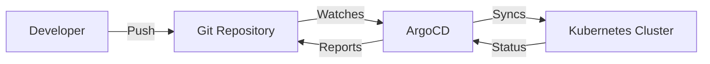

# How to Set Up GitOps with ArgoCD on Kubernetes

Author: [nawazdhandala](https://www.github.com/nawazdhandala)

Tags: Kubernetes, ArgoCD, GitOps, DevOps, Continuous Deployment

Description: Learn how to implement GitOps workflows with ArgoCD on Kubernetes, including installation, application configuration, sync strategies, and best practices for declarative infrastructure management.

---

GitOps is an operational framework that uses Git as the single source of truth for declarative infrastructure. ArgoCD is one of the most popular GitOps tools for Kubernetes, continuously monitoring your Git repositories and ensuring your cluster state matches the desired configuration. This guide walks through setting up ArgoCD and implementing effective GitOps workflows.

## Understanding GitOps Principles

GitOps follows these core principles:



1. **Declarative configuration**: All infrastructure is defined as code
2. **Version controlled**: Git serves as the source of truth
3. **Automated deployment**: Changes are automatically applied
4. **Continuous reconciliation**: Drift from desired state is corrected

## Installing ArgoCD

Deploy ArgoCD to your cluster:

```bash
# Create namespace
kubectl create namespace argocd

# Install ArgoCD
kubectl apply -n argocd -f https://raw.githubusercontent.com/argoproj/argo-cd/stable/manifests/install.yaml

# Wait for pods to be ready
kubectl wait --for=condition=Ready pods --all -n argocd --timeout=300s

# Get the initial admin password
kubectl -n argocd get secret argocd-initial-admin-secret -o jsonpath="{.data.password}" | base64 -d

# Access the UI via port-forward
kubectl port-forward svc/argocd-server -n argocd 8080:443
# Open https://localhost:8080 (username: admin)
```

Install the ArgoCD CLI:

```bash
# macOS
brew install argocd

# Linux
curl -sSL -o argocd-linux-amd64 https://github.com/argoproj/argo-cd/releases/latest/download/argocd-linux-amd64
sudo install -m 555 argocd-linux-amd64 /usr/local/bin/argocd

# Login to ArgoCD
argocd login localhost:8080
```

## Creating Your First Application

Define an application that ArgoCD will manage:

```yaml
# application.yaml
apiVersion: argoproj.io/v1alpha1
kind: Application
metadata:
  name: web-app
  namespace: argocd
  # Optional: Add finalizer to handle deletion properly
  finalizers:
    - resources-finalizer.argocd.argoproj.io
spec:
  # Project the application belongs to
  project: default

  # Source repository
  source:
    repoURL: https://github.com/org/k8s-manifests.git
    targetRevision: main
    path: apps/web-app

  # Destination cluster and namespace
  destination:
    server: https://kubernetes.default.svc
    namespace: production

  # Sync policy
  syncPolicy:
    automated:
      # Automatically delete resources that are removed from Git
      prune: true
      # Automatically sync when cluster state differs from Git
      selfHeal: true
      # Allow empty resources
      allowEmpty: false
    syncOptions:
      - CreateNamespace=true
      - PrunePropagationPolicy=foreground
      - PruneLast=true
    retry:
      limit: 5
      backoff:
        duration: 5s
        factor: 2
        maxDuration: 3m
```

Apply the application:

```bash
kubectl apply -f application.yaml

# Or use the CLI
argocd app create web-app \
  --repo https://github.com/org/k8s-manifests.git \
  --path apps/web-app \
  --dest-server https://kubernetes.default.svc \
  --dest-namespace production \
  --sync-policy automated \
  --auto-prune \
  --self-heal
```

## Repository Structure

Organize your GitOps repository:

```
k8s-manifests/
├── apps/
│   ├── web-app/
│   │   ├── deployment.yaml
│   │   ├── service.yaml
│   │   ├── ingress.yaml
│   │   └── configmap.yaml
│   ├── api-server/
│   │   ├── deployment.yaml
│   │   ├── service.yaml
│   │   └── secrets.yaml
│   └── database/
│       ├── statefulset.yaml
│       ├── service.yaml
│       └── pvc.yaml
├── infrastructure/
│   ├── monitoring/
│   │   └── prometheus/
│   └── ingress/
│       └── nginx-ingress/
└── projects/
    ├── production.yaml
    └── staging.yaml
```

## Using Helm with ArgoCD

ArgoCD natively supports Helm charts:

```yaml
# helm-application.yaml
apiVersion: argoproj.io/v1alpha1
kind: Application
metadata:
  name: prometheus
  namespace: argocd
spec:
  project: default
  source:
    # Helm repository
    repoURL: https://prometheus-community.github.io/helm-charts
    chart: kube-prometheus-stack
    targetRevision: 55.0.0
    helm:
      # Values file from a Git repo
      valueFiles:
        - values-production.yaml
      # Inline values
      values: |
        prometheus:
          prometheusSpec:
            retention: 15d
            storageSpec:
              volumeClaimTemplate:
                spec:
                  resources:
                    requests:
                      storage: 50Gi
      # Individual parameter overrides
      parameters:
        - name: grafana.enabled
          value: "true"
        - name: alertmanager.enabled
          value: "true"

  destination:
    server: https://kubernetes.default.svc
    namespace: monitoring

  syncPolicy:
    automated:
      prune: true
      selfHeal: true
    syncOptions:
      - CreateNamespace=true
```

## Kustomize Integration

Use Kustomize for environment-specific configurations:

```yaml
# kustomize-application.yaml
apiVersion: argoproj.io/v1alpha1
kind: Application
metadata:
  name: web-app-production
  namespace: argocd
spec:
  project: default
  source:
    repoURL: https://github.com/org/k8s-manifests.git
    targetRevision: main
    path: apps/web-app/overlays/production
    # ArgoCD automatically detects kustomization.yaml
  destination:
    server: https://kubernetes.default.svc
    namespace: production
```

Repository structure for Kustomize:

```
apps/web-app/
├── base/
│   ├── deployment.yaml
│   ├── service.yaml
│   └── kustomization.yaml
└── overlays/
    ├── production/
    │   ├── kustomization.yaml
    │   ├── replicas-patch.yaml
    │   └── resources-patch.yaml
    └── staging/
        ├── kustomization.yaml
        └── replicas-patch.yaml
```

## Application Projects

Organize applications with projects:

```yaml
# project.yaml
apiVersion: argoproj.io/v1alpha1
kind: AppProject
metadata:
  name: production
  namespace: argocd
spec:
  description: "Production applications"

  # Allowed source repositories
  sourceRepos:
    - https://github.com/org/k8s-manifests.git
    - https://charts.helm.sh/stable

  # Allowed destination clusters and namespaces
  destinations:
    - namespace: production
      server: https://kubernetes.default.svc
    - namespace: production-*
      server: https://kubernetes.default.svc

  # Deny resources that should not be in this project
  namespaceResourceBlacklist:
    - group: ''
      kind: ResourceQuota
    - group: ''
      kind: LimitRange
    - group: ''
      kind: NetworkPolicy

  # Allow specific cluster-scoped resources
  clusterResourceWhitelist:
    - group: ''
      kind: Namespace

  # RBAC roles for the project
  roles:
    - name: developer
      description: "Developer access"
      policies:
        - p, proj:production:developer, applications, get, production/*, allow
        - p, proj:production:developer, applications, sync, production/*, allow
      groups:
        - developers
```

## Sync Strategies

Configure how ArgoCD applies changes:

```yaml
# Manual sync (default)
syncPolicy: {}

# Automated sync with options
syncPolicy:
  automated:
    prune: true      # Delete resources removed from Git
    selfHeal: true   # Revert manual changes in cluster
    allowEmpty: false # Fail if manifests produce no resources

  syncOptions:
    # Create namespace if it does not exist
    - CreateNamespace=true
    # Apply manifests in specific order
    - ApplyOutOfSyncOnly=true
    # Use server-side apply
    - ServerSideApply=true
    # Respect resource hooks
    - RespectIgnoreDifferences=true
```

## Sync Waves and Hooks

Control deployment order:

```yaml
# namespace.yaml - Create namespace first
apiVersion: v1
kind: Namespace
metadata:
  name: production
  annotations:
    argocd.argoproj.io/sync-wave: "-1"
---
# configmap.yaml - Then config
apiVersion: v1
kind: ConfigMap
metadata:
  name: app-config
  annotations:
    argocd.argoproj.io/sync-wave: "0"
---
# deployment.yaml - Then deployment
apiVersion: apps/v1
kind: Deployment
metadata:
  name: web-app
  annotations:
    argocd.argoproj.io/sync-wave: "1"
---
# Run database migration before deployment
apiVersion: batch/v1
kind: Job
metadata:
  name: db-migrate
  annotations:
    argocd.argoproj.io/hook: PreSync
    argocd.argoproj.io/hook-delete-policy: HookSucceeded
spec:
  template:
    spec:
      containers:
        - name: migrate
          image: myapp/migrations:1.0.0
          command: ["./migrate.sh"]
      restartPolicy: Never
```

## ApplicationSets for Multiple Environments

Generate applications dynamically:

```yaml
# applicationset.yaml
apiVersion: argoproj.io/v1alpha1
kind: ApplicationSet
metadata:
  name: web-app
  namespace: argocd
spec:
  generators:
    # Generate applications for each environment
    - list:
        elements:
          - environment: staging
            namespace: staging
            replicas: "2"
          - environment: production
            namespace: production
            replicas: "5"

  template:
    metadata:
      name: 'web-app-{{environment}}'
    spec:
      project: default
      source:
        repoURL: https://github.com/org/k8s-manifests.git
        targetRevision: main
        path: 'apps/web-app/overlays/{{environment}}'
      destination:
        server: https://kubernetes.default.svc
        namespace: '{{namespace}}'
      syncPolicy:
        automated:
          prune: true
          selfHeal: true
```

## Secrets Management

Handle secrets securely with ArgoCD:

```yaml
# Using Sealed Secrets
apiVersion: bitnami.com/v1alpha1
kind: SealedSecret
metadata:
  name: db-credentials
  namespace: production
spec:
  encryptedData:
    password: AgBc7...encrypted...
---
# Using External Secrets Operator
apiVersion: external-secrets.io/v1beta1
kind: ExternalSecret
metadata:
  name: db-credentials
  namespace: production
spec:
  refreshInterval: 1h
  secretStoreRef:
    name: aws-secrets-manager
    kind: ClusterSecretStore
  target:
    name: db-credentials
  data:
    - secretKey: password
      remoteRef:
        key: production/database
        property: password
```

## Monitoring ArgoCD

Set up notifications and monitoring:

```yaml
# notifications-configmap.yaml
apiVersion: v1
kind: ConfigMap
metadata:
  name: argocd-notifications-cm
  namespace: argocd
data:
  service.slack: |
    token: $slack-token
  template.app-sync-status: |
    message: |
      Application {{.app.metadata.name}} sync status is {{.app.status.sync.status}}
  trigger.on-sync-succeeded: |
    - when: app.status.sync.status == 'Synced'
      send: [app-sync-status]
  subscriptions: |
    - recipients:
        - slack:deployments
      triggers:
        - on-sync-succeeded
        - on-sync-failed
```

## Best Practices

1. **Use App of Apps pattern**: Manage multiple applications with a parent application.

```yaml
# apps-of-apps.yaml
apiVersion: argoproj.io/v1alpha1
kind: Application
metadata:
  name: applications
  namespace: argocd
spec:
  project: default
  source:
    repoURL: https://github.com/org/k8s-manifests.git
    path: argocd-apps
    targetRevision: main
  destination:
    server: https://kubernetes.default.svc
    namespace: argocd
  syncPolicy:
    automated:
      prune: true
```

2. **Separate config from code**: Keep application code and Kubernetes manifests in different repositories.

3. **Use branch protection**: Require pull request reviews for main branch changes.

4. **Implement progressive delivery**: Use tools like Argo Rollouts for canary deployments.

5. **Monitor drift**: Set up alerts when cluster state differs from Git.

```bash
# Check application sync status
argocd app list

# Get sync status details
argocd app get web-app

# View application diff
argocd app diff web-app
```

---

GitOps with ArgoCD transforms Kubernetes deployments into a predictable, auditable, and automated process. Your Git repository becomes the definitive source of truth, with ArgoCD ensuring your cluster always reflects the desired state. Start simple with basic applications, then adopt advanced patterns like ApplicationSets and sync waves as your needs grow. With proper setup, GitOps provides the foundation for reliable, scalable Kubernetes operations.
