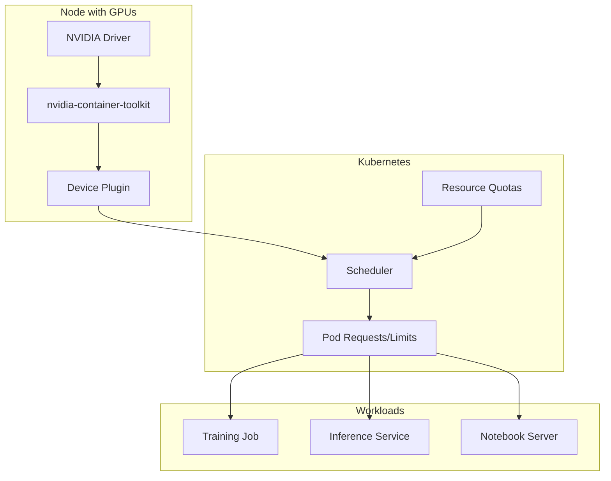

# How to Configure GPU Resource Management

Author: [nawazdhandala](https://www.github.com/nawazdhandala)

Tags: MLOps, GPU, Kubernetes, NVIDIA, Resource Management, Machine Learning, Infrastructure

Description: Learn how to manage GPU resources effectively for ML workloads, covering Kubernetes GPU scheduling, memory management, multi-tenancy, and monitoring GPU utilization in production environments.

---

GPU resources are expensive and often in short supply. Effective GPU management ensures your ML workloads get the compute they need while maximizing utilization across teams. This guide covers practical techniques for managing GPUs in Kubernetes environments and standalone servers.

## GPU Architecture in Kubernetes



## Setting Up NVIDIA Device Plugin

The NVIDIA device plugin exposes GPUs to Kubernetes.

```yaml
# kubernetes/nvidia-device-plugin.yaml
apiVersion: apps/v1
kind: DaemonSet
metadata:
  name: nvidia-device-plugin-daemonset
  namespace: kube-system
spec:
  selector:
    matchLabels:
      name: nvidia-device-plugin-ds
  template:
    metadata:
      labels:
        name: nvidia-device-plugin-ds
    spec:
      tolerations:
        - key: nvidia.com/gpu
          operator: Exists
          effect: NoSchedule
      priorityClassName: system-node-critical
      containers:
        - name: nvidia-device-plugin-ctr
          image: nvcr.io/nvidia/k8s-device-plugin:v0.14.3
          env:
            - name: FAIL_ON_INIT_ERROR
              value: "false"
            # Enable time-slicing for GPU sharing
            - name: NVIDIA_MIG_MONITOR_DEVICES
              value: "all"
          securityContext:
            allowPrivilegeEscalation: false
            capabilities:
              drop: ["ALL"]
          volumeMounts:
            - name: device-plugin
              mountPath: /var/lib/kubelet/device-plugins
      volumes:
        - name: device-plugin
          hostPath:
            path: /var/lib/kubelet/device-plugins
```

### GPU Time-Slicing Configuration

Allow multiple pods to share a single GPU.

```yaml
# kubernetes/time-slicing-config.yaml
apiVersion: v1
kind: ConfigMap
metadata:
  name: time-slicing-config
  namespace: kube-system
data:
  any: |-
    version: v1
    flags:
      migStrategy: none
    sharing:
      timeSlicing:
        renameByDefault: false
        failRequestsGreaterThanOne: false
        resources:
          - name: nvidia.com/gpu
            replicas: 4  # Each GPU appears as 4 virtual GPUs
```

## GPU Resource Allocation

### Basic GPU Request

```yaml
# kubernetes/gpu-pod.yaml
apiVersion: v1
kind: Pod
metadata:
  name: gpu-training-job
spec:
  restartPolicy: Never
  containers:
    - name: training
      image: pytorch/pytorch:2.1.0-cuda12.1-cudnn8-runtime
      resources:
        limits:
          nvidia.com/gpu: 1  # Request 1 GPU
        requests:
          memory: "16Gi"
          cpu: "4"
      command: ["python", "train.py"]
      env:
        # Control which GPU devices are visible
        - name: NVIDIA_VISIBLE_DEVICES
          value: "all"
        # Memory growth allows multiple processes
        - name: TF_FORCE_GPU_ALLOW_GROWTH
          value: "true"
```

### Multi-GPU Training Job

```yaml
# kubernetes/multi-gpu-job.yaml
apiVersion: batch/v1
kind: Job
metadata:
  name: distributed-training
spec:
  parallelism: 2  # Number of workers
  completions: 2
  template:
    spec:
      containers:
        - name: trainer
          image: training-image:latest
          resources:
            limits:
              nvidia.com/gpu: 4  # 4 GPUs per worker
              memory: "64Gi"
              cpu: "16"
          env:
            - name: WORLD_SIZE
              value: "8"  # Total GPUs across all workers
            - name: MASTER_ADDR
              value: "distributed-training-0"
            - name: MASTER_PORT
              value: "29500"
          command:
            - python
            - -m
            - torch.distributed.launch
            - --nproc_per_node=4
            - --nnodes=2
            - train.py
      restartPolicy: Never
  backoffLimit: 2
```

## GPU Memory Management

### Python Memory Management

```python
# training/gpu_memory.py
import torch
import gc
from typing import Optional
from contextlib import contextmanager

class GPUMemoryManager:
    """
    Manage GPU memory to prevent OOM errors.

    Provides utilities for monitoring, clearing, and limiting
    GPU memory usage.
    """

    def __init__(self, device_id: int = 0):
        self.device = torch.device(f"cuda:{device_id}")
        self.device_id = device_id

    def get_memory_info(self) -> dict:
        """Get current GPU memory usage."""
        if not torch.cuda.is_available():
            return {"error": "CUDA not available"}

        props = torch.cuda.get_device_properties(self.device_id)

        return {
            "device_name": props.name,
            "total_memory_gb": props.total_memory / (1024**3),
            "allocated_gb": torch.cuda.memory_allocated(self.device_id) / (1024**3),
            "reserved_gb": torch.cuda.memory_reserved(self.device_id) / (1024**3),
            "free_gb": (props.total_memory - torch.cuda.memory_allocated(self.device_id)) / (1024**3)
        }

    def clear_memory(self):
        """Clear GPU memory cache."""
        gc.collect()
        torch.cuda.empty_cache()
        torch.cuda.synchronize(self.device)

    def set_memory_fraction(self, fraction: float):
        """
        Limit GPU memory usage to a fraction of total.

        Must be called before any CUDA operations.
        """
        torch.cuda.set_per_process_memory_fraction(fraction, self.device_id)

    @contextmanager
    def memory_tracking(self, label: str = "operation"):
        """
        Context manager to track memory usage of an operation.

        Usage:
            with memory_manager.memory_tracking("model_forward"):
                output = model(input)
        """
        torch.cuda.reset_peak_memory_stats(self.device_id)
        start_allocated = torch.cuda.memory_allocated(self.device_id)

        yield

        torch.cuda.synchronize(self.device)
        end_allocated = torch.cuda.memory_allocated(self.device_id)
        peak_allocated = torch.cuda.max_memory_allocated(self.device_id)

        print(f"[{label}] Memory delta: {(end_allocated - start_allocated) / 1024**2:.2f} MB")
        print(f"[{label}] Peak memory: {peak_allocated / 1024**2:.2f} MB")

# Gradient checkpointing for large models
def enable_gradient_checkpointing(model: torch.nn.Module):
    """
    Enable gradient checkpointing to reduce memory usage.

    Trades compute for memory by recomputing activations
    during backward pass instead of storing them.
    """
    if hasattr(model, 'gradient_checkpointing_enable'):
        model.gradient_checkpointing_enable()
    else:
        # Manual implementation for custom models
        for module in model.modules():
            if hasattr(module, 'checkpoint'):
                module.checkpoint = True

# Mixed precision training for memory efficiency
class MixedPrecisionTrainer:
    """
    Train with automatic mixed precision (AMP).

    Uses FP16 for forward/backward passes, FP32 for optimizer.
    Reduces memory usage by ~50% for activations.
    """

    def __init__(self, model, optimizer, device):
        self.model = model.to(device)
        self.optimizer = optimizer
        self.device = device
        self.scaler = torch.cuda.amp.GradScaler()

    def train_step(self, inputs, targets):
        """Perform a single training step with AMP."""
        self.optimizer.zero_grad()

        # Automatic mixed precision context
        with torch.cuda.amp.autocast():
            outputs = self.model(inputs)
            loss = torch.nn.functional.cross_entropy(outputs, targets)

        # Scale loss and backward
        self.scaler.scale(loss).backward()

        # Unscale and step
        self.scaler.step(self.optimizer)
        self.scaler.update()

        return loss.item()
```

## Multi-Tenancy and Quotas

### Resource Quotas per Namespace

```yaml
# kubernetes/gpu-quota.yaml
apiVersion: v1
kind: ResourceQuota
metadata:
  name: gpu-quota
  namespace: ml-team-a
spec:
  hard:
    # Limit total GPU requests in this namespace
    requests.nvidia.com/gpu: "8"
    limits.nvidia.com/gpu: "8"
    # Also limit other resources
    requests.memory: "128Gi"
    requests.cpu: "32"
---
# Priority class for training jobs
apiVersion: scheduling.k8s.io/v1
kind: PriorityClass
metadata:
  name: training-priority
value: 100
globalDefault: false
description: "Priority for training jobs"
---
# Priority class for inference (higher priority)
apiVersion: scheduling.k8s.io/v1
kind: PriorityClass
metadata:
  name: inference-priority
value: 1000
globalDefault: false
description: "High priority for inference workloads"
```

### GPU Scheduling with Node Affinity

```yaml
# kubernetes/gpu-scheduling.yaml
apiVersion: v1
kind: Pod
metadata:
  name: a100-training
spec:
  affinity:
    nodeAffinity:
      requiredDuringSchedulingIgnoredDuringExecution:
        nodeSelectorTerms:
          - matchExpressions:
              # Target specific GPU type
              - key: nvidia.com/gpu.product
                operator: In
                values:
                  - NVIDIA-A100-SXM4-80GB
                  - NVIDIA-A100-SXM4-40GB
    # Spread training pods across nodes
    podAntiAffinity:
      preferredDuringSchedulingIgnoredDuringExecution:
        - weight: 100
          podAffinityTerm:
            labelSelector:
              matchLabels:
                workload-type: training
            topologyKey: kubernetes.io/hostname
  containers:
    - name: trainer
      image: training:latest
      resources:
        limits:
          nvidia.com/gpu: 8
```

## GPU Monitoring

### Prometheus Metrics with DCGM

```yaml
# kubernetes/dcgm-exporter.yaml
apiVersion: apps/v1
kind: DaemonSet
metadata:
  name: dcgm-exporter
  namespace: monitoring
spec:
  selector:
    matchLabels:
      app: dcgm-exporter
  template:
    metadata:
      labels:
        app: dcgm-exporter
    spec:
      tolerations:
        - key: nvidia.com/gpu
          operator: Exists
          effect: NoSchedule
      containers:
        - name: dcgm-exporter
          image: nvcr.io/nvidia/k8s/dcgm-exporter:3.3.0-3.2.0-ubuntu22.04
          ports:
            - containerPort: 9400
              name: metrics
          env:
            - name: DCGM_EXPORTER_LISTEN
              value: ":9400"
            - name: DCGM_EXPORTER_KUBERNETES
              value: "true"
          securityContext:
            runAsNonRoot: false
            runAsUser: 0
          volumeMounts:
            - name: pod-resources
              mountPath: /var/lib/kubelet/pod-resources
      volumes:
        - name: pod-resources
          hostPath:
            path: /var/lib/kubelet/pod-resources
---
apiVersion: v1
kind: Service
metadata:
  name: dcgm-exporter
  namespace: monitoring
  labels:
    app: dcgm-exporter
spec:
  ports:
    - port: 9400
      name: metrics
  selector:
    app: dcgm-exporter
```

### Python GPU Monitor

```python
# monitoring/gpu_monitor.py
import subprocess
import json
from dataclasses import dataclass
from typing import List, Optional
import time

@dataclass
class GPUMetrics:
    index: int
    name: str
    temperature_c: float
    utilization_percent: float
    memory_used_mb: float
    memory_total_mb: float
    power_draw_w: float
    power_limit_w: float

class GPUMonitor:
    """
    Monitor GPU metrics using nvidia-smi.

    Provides real-time GPU utilization and health information.
    """

    def get_metrics(self) -> List[GPUMetrics]:
        """Get current metrics for all GPUs."""
        cmd = [
            "nvidia-smi",
            "--query-gpu=index,name,temperature.gpu,utilization.gpu,"
            "memory.used,memory.total,power.draw,power.limit",
            "--format=csv,noheader,nounits"
        ]

        try:
            result = subprocess.run(cmd, capture_output=True, text=True, check=True)
        except (subprocess.CalledProcessError, FileNotFoundError):
            return []

        metrics = []
        for line in result.stdout.strip().split('\n'):
            if not line:
                continue

            parts = [p.strip() for p in line.split(',')]

            metrics.append(GPUMetrics(
                index=int(parts[0]),
                name=parts[1],
                temperature_c=float(parts[2]),
                utilization_percent=float(parts[3]),
                memory_used_mb=float(parts[4]),
                memory_total_mb=float(parts[5]),
                power_draw_w=float(parts[6]) if parts[6] != '[N/A]' else 0,
                power_limit_w=float(parts[7]) if parts[7] != '[N/A]' else 0
            ))

        return metrics

    def get_processes(self) -> List[dict]:
        """Get processes using GPUs."""
        cmd = [
            "nvidia-smi",
            "--query-compute-apps=pid,gpu_uuid,used_memory,process_name",
            "--format=csv,noheader,nounits"
        ]

        try:
            result = subprocess.run(cmd, capture_output=True, text=True, check=True)
        except (subprocess.CalledProcessError, FileNotFoundError):
            return []

        processes = []
        for line in result.stdout.strip().split('\n'):
            if not line:
                continue

            parts = [p.strip() for p in line.split(',')]
            processes.append({
                "pid": int(parts[0]),
                "gpu_uuid": parts[1],
                "memory_mb": float(parts[2]),
                "process_name": parts[3]
            })

        return processes

    def check_health(self) -> dict:
        """Check GPU health status."""
        metrics = self.get_metrics()

        issues = []
        for gpu in metrics:
            # Temperature check
            if gpu.temperature_c > 85:
                issues.append(f"GPU {gpu.index}: High temperature ({gpu.temperature_c}C)")

            # Memory check
            memory_pct = (gpu.memory_used_mb / gpu.memory_total_mb) * 100
            if memory_pct > 95:
                issues.append(f"GPU {gpu.index}: Memory nearly full ({memory_pct:.1f}%)")

            # Power check
            if gpu.power_limit_w > 0:
                power_pct = (gpu.power_draw_w / gpu.power_limit_w) * 100
                if power_pct > 95:
                    issues.append(f"GPU {gpu.index}: Near power limit ({power_pct:.1f}%)")

        return {
            "healthy": len(issues) == 0,
            "gpu_count": len(metrics),
            "issues": issues
        }

# Prometheus metrics export
from prometheus_client import Gauge, start_http_server

gpu_utilization = Gauge(
    'gpu_utilization_percent',
    'GPU utilization percentage',
    ['gpu_index', 'gpu_name']
)

gpu_memory_used = Gauge(
    'gpu_memory_used_bytes',
    'GPU memory used in bytes',
    ['gpu_index', 'gpu_name']
)

gpu_temperature = Gauge(
    'gpu_temperature_celsius',
    'GPU temperature in Celsius',
    ['gpu_index', 'gpu_name']
)

def export_gpu_metrics():
    """Export GPU metrics to Prometheus."""
    monitor = GPUMonitor()

    while True:
        metrics = monitor.get_metrics()

        for gpu in metrics:
            labels = {
                'gpu_index': str(gpu.index),
                'gpu_name': gpu.name
            }

            gpu_utilization.labels(**labels).set(gpu.utilization_percent)
            gpu_memory_used.labels(**labels).set(gpu.memory_used_mb * 1024 * 1024)
            gpu_temperature.labels(**labels).set(gpu.temperature_c)

        time.sleep(15)

if __name__ == "__main__":
    start_http_server(9401)
    export_gpu_metrics()
```

## GPU Autoscaling

```yaml
# kubernetes/gpu-autoscaler.yaml
apiVersion: keda.sh/v1alpha1
kind: ScaledObject
metadata:
  name: gpu-inference-scaler
spec:
  scaleTargetRef:
    name: inference-deployment
  minReplicaCount: 1
  maxReplicaCount: 10
  triggers:
    - type: prometheus
      metadata:
        serverAddress: http://prometheus:9090
        metricName: gpu_utilization_percent
        threshold: "80"
        query: |
          avg(DCGM_FI_DEV_GPU_UTIL{kubernetes_pod_name=~"inference-.*"})
```

## Summary

| Component | Purpose |
|-----------|---------|
| **Device Plugin** | Expose GPUs to Kubernetes |
| **Time-Slicing** | Share GPUs between pods |
| **Memory Management** | Prevent OOM, optimize usage |
| **Resource Quotas** | Control team allocations |
| **DCGM Exporter** | Monitor GPU metrics |
| **Autoscaling** | Scale based on utilization |

Effective GPU management balances utilization against reliability. Time-slicing enables sharing for development workloads, while dedicated GPUs ensure production inference meets latency requirements. Monitoring provides visibility into actual usage patterns, informing capacity planning and cost optimization.
