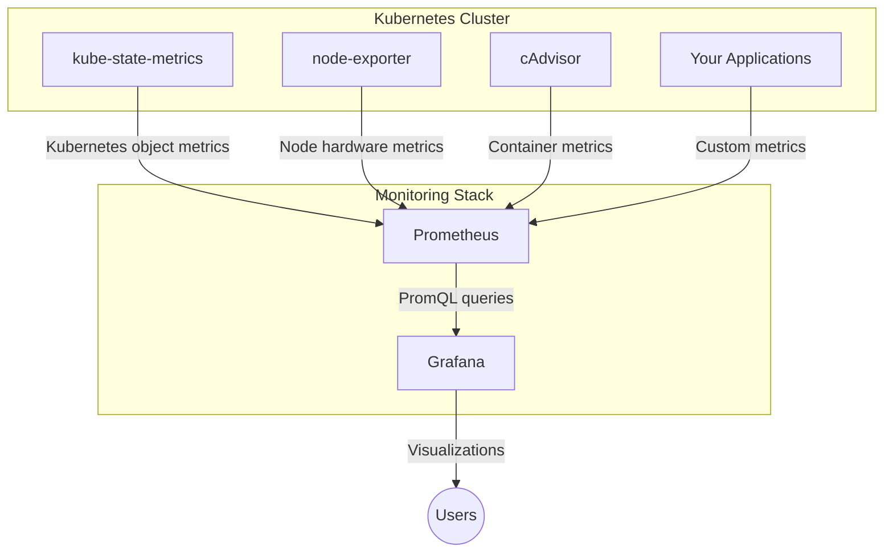

# How to Set Up Grafana for Kubernetes Dashboards

Author: [nawazdhandala](https://www.github.com/nawazdhandala)

Tags: Grafana, Kubernetes, Dashboards, Monitoring, Prometheus, Observability

Description: A hands-on guide to deploying Grafana on Kubernetes and configuring dashboards that give you visibility into cluster health, pod performance, and resource utilization.

---

Kubernetes clusters generate a massive amount of metrics. Without proper visualization, you are flying blind. Grafana provides the dashboard layer that transforms raw Prometheus metrics into actionable insights. This guide walks you through deploying Grafana on Kubernetes and building dashboards that actually help you operate your cluster.

## Why Grafana for Kubernetes?

Prometheus handles metric collection and storage. Grafana handles visualization and alerting presentation. Together they form the de facto monitoring stack for Kubernetes environments. Grafana offers:

- Pre-built dashboards for common Kubernetes metrics
- Support for multiple data sources in a single dashboard
- Flexible alerting with multiple notification channels
- Role-based access control for team collaboration

## Prerequisites

Before starting, ensure you have:

- A running Kubernetes cluster (minikube, kind, EKS, GKE, or similar)
- kubectl configured to access your cluster
- Helm 3 installed
- Prometheus already deployed (we will use kube-prometheus-stack)

## Deploying Grafana with Helm

The kube-prometheus-stack Helm chart bundles Prometheus, Grafana, and essential exporters. This is the fastest path to a working setup.

```bash
# Add the prometheus-community Helm repository
helm repo add prometheus-community https://prometheus-community.github.io/helm-charts
helm repo update

# Create a namespace for monitoring
kubectl create namespace monitoring

# Install the kube-prometheus-stack
helm install prometheus-stack prometheus-community/kube-prometheus-stack \
  --namespace monitoring \
  --set grafana.adminPassword=your-secure-password \
  --set prometheus.prometheusSpec.retention=15d \
  --set prometheus.prometheusSpec.storageSpec.volumeClaimTemplate.spec.resources.requests.storage=50Gi
```

This command deploys Prometheus, Grafana, Alertmanager, and several exporters including node-exporter and kube-state-metrics.

## Accessing Grafana

After deployment, access Grafana through port-forwarding:

```bash
# Forward Grafana port to localhost
kubectl port-forward svc/prometheus-stack-grafana 3000:80 -n monitoring
```

Open http://localhost:3000 in your browser. Log in with username `admin` and the password you set during installation.

For production environments, configure an Ingress instead:

```yaml
# grafana-ingress.yaml
apiVersion: networking.k8s.io/v1
kind: Ingress
metadata:
  name: grafana-ingress
  namespace: monitoring
  annotations:
    kubernetes.io/ingress.class: nginx
    cert-manager.io/cluster-issuer: letsencrypt-prod
spec:
  tls:
    - hosts:
        - grafana.yourdomain.com
      secretName: grafana-tls
  rules:
    - host: grafana.yourdomain.com
      http:
        paths:
          - path: /
            pathType: Prefix
            backend:
              service:
                name: prometheus-stack-grafana
                port:
                  number: 80
```

Apply the Ingress:

```bash
kubectl apply -f grafana-ingress.yaml
```

## Understanding the Default Dashboards

The kube-prometheus-stack includes several pre-configured dashboards. Navigate to Dashboards > Browse to see them:

- **Kubernetes / Compute Resources / Cluster**: Overview of cluster-wide CPU and memory usage
- **Kubernetes / Compute Resources / Namespace (Pods)**: Per-namespace resource consumption
- **Kubernetes / Compute Resources / Node (Pods)**: Per-node breakdown of pod resource usage
- **Node Exporter / Nodes**: Host-level metrics including disk I/O and network traffic

These dashboards pull data from Prometheus using PromQL queries. Understanding these queries helps you customize dashboards later.

## Building a Custom Kubernetes Dashboard

Let us create a dashboard focused on deployment health. This dashboard will show:

- Deployment replica status
- Pod restart counts
- Container resource usage vs requests

### Step 1: Create a New Dashboard

1. Click the **+** icon in the left sidebar
2. Select **Dashboard**
3. Click **Add a new panel**

### Step 2: Add Deployment Replica Panel

In the query editor, enter this PromQL query:

```promql
# Shows available replicas vs desired replicas for each deployment
kube_deployment_status_replicas_available / kube_deployment_spec_replicas
```

Configure the panel:
- **Title**: Deployment Replica Availability
- **Visualization**: Stat
- **Unit**: Percent (0.0-1.0)
- **Thresholds**: Green > 0.9, Yellow > 0.5, Red <= 0.5

### Step 3: Add Pod Restart Counter

Add another panel with this query:

```promql
# Sum of container restarts per pod in the last hour
sum by (pod, namespace) (
  increase(kube_pod_container_status_restarts_total[1h])
)
```

Configure:
- **Title**: Pod Restarts (Last Hour)
- **Visualization**: Table
- **Sort**: Descending by value

### Step 4: Add Memory Usage vs Request

This panel helps identify pods that need their resource requests adjusted:

```promql
# Memory usage divided by memory request
sum by (pod, namespace) (container_memory_working_set_bytes{container!=""})
/
sum by (pod, namespace) (kube_pod_container_resource_requests{resource="memory"})
```

Configure:
- **Title**: Memory Usage vs Request
- **Visualization**: Time series
- **Unit**: Percent (0.0-1.0)

## Setting Up Dashboard Variables

Variables make dashboards reusable across namespaces and clusters. Add a namespace variable:

1. Go to Dashboard Settings (gear icon)
2. Click **Variables** > **Add variable**
3. Configure:
   - **Name**: namespace
   - **Type**: Query
   - **Data source**: Prometheus
   - **Query**: `label_values(kube_pod_info, namespace)`

Now update your queries to use the variable:

```promql
# Filter by selected namespace
kube_deployment_status_replicas_available{namespace="$namespace"}
/
kube_deployment_spec_replicas{namespace="$namespace"}
```

## Dashboard Architecture Overview

Here is how the components interact:



## Configuring Persistent Storage

By default, Grafana stores dashboards in an ephemeral volume. For production, configure persistent storage:

```yaml
# grafana-values.yaml
grafana:
  persistence:
    enabled: true
    size: 10Gi
    storageClassName: standard

  # Enable dashboard provisioning from ConfigMaps
  sidecar:
    dashboards:
      enabled: true
      label: grafana_dashboard
```

Upgrade the Helm release:

```bash
helm upgrade prometheus-stack prometheus-community/kube-prometheus-stack \
  --namespace monitoring \
  -f grafana-values.yaml
```

## Importing Community Dashboards

The Grafana community maintains thousands of dashboards. Import them by ID:

1. Click **+** > **Import**
2. Enter the dashboard ID
3. Select your Prometheus data source
4. Click **Import**

Recommended dashboards for Kubernetes:

- **315**: Kubernetes cluster monitoring
- **6417**: Kubernetes Pods
- **13770**: kube-state-metrics v2

## Practical Tips

**Organize dashboards into folders**: Create folders for different teams or environments. Navigate to Dashboards > Browse > New Folder.

**Set appropriate refresh intervals**: Dashboard auto-refresh consumes resources. Set refresh to 30 seconds or longer for overview dashboards.

**Use dashboard links**: Add links between related dashboards. For example, link from a cluster overview to namespace-specific dashboards.

**Export dashboards as JSON**: Back up your custom dashboards by exporting them. Dashboard Settings > JSON Model > Copy to clipboard.

## Troubleshooting Common Issues

**No data in panels**: Check that Prometheus is scraping the expected targets. Navigate to Prometheus UI > Status > Targets.

**Missing metrics**: Ensure kube-state-metrics and node-exporter pods are running:

```bash
kubectl get pods -n monitoring | grep -E "kube-state|node-exporter"
```

**Dashboard loads slowly**: Reduce the time range or add more specific label filters to your queries.

## Next Steps

With Grafana deployed and configured, you now have visibility into your Kubernetes cluster. Consider these next steps:

- Set up alerting rules for critical metrics
- Configure Grafana to send alerts to Slack or PagerDuty
- Build dashboards for your application-specific metrics
- Implement Loki for log aggregation alongside your metrics

Grafana transforms your Kubernetes metrics from raw numbers into operational intelligence. Combined with good alerting practices, you will catch issues before they affect users.
