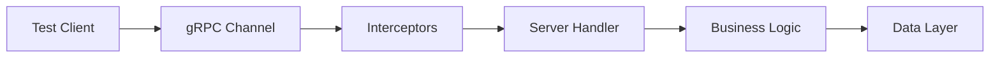

# How to Configure gRPC Service Testing

Author: [nawazdhandala](https://github.com/nawazdhandala)

Tags: gRPC, Testing, Protocol Buffers, Microservices, DevOps

Description: Learn to test gRPC services effectively, including unary calls, streaming, error handling, interceptors, and load testing with proper Protocol Buffer validation.

---

gRPC services require specialized testing approaches. Protocol Buffers provide type safety, but you still need to test business logic, streaming behavior, and error handling. This guide covers testing strategies for gRPC services in various programming languages.

## gRPC Testing Components



## Protocol Buffer Definitions

Start with well-defined service contracts:

```protobuf
// user_service.proto
syntax = "proto3";

package user.v1;

option go_package = "github.com/example/user/v1";

service UserService {
    // Unary RPC
    rpc GetUser(GetUserRequest) returns (GetUserResponse);
    rpc CreateUser(CreateUserRequest) returns (CreateUserResponse);

    // Server streaming
    rpc ListUsers(ListUsersRequest) returns (stream User);

    // Client streaming
    rpc BatchCreateUsers(stream CreateUserRequest) returns (BatchCreateResponse);

    // Bidirectional streaming
    rpc UserChat(stream ChatMessage) returns (stream ChatMessage);
}

message GetUserRequest {
    string user_id = 1;
}

message GetUserResponse {
    User user = 1;
}

message User {
    string id = 1;
    string email = 2;
    string name = 3;
    int64 created_at = 4;
}

message CreateUserRequest {
    string email = 1;
    string name = 2;
    string password = 3;
}

message CreateUserResponse {
    User user = 1;
}

message ListUsersRequest {
    int32 page_size = 1;
    string page_token = 2;
}

message BatchCreateResponse {
    int32 created_count = 1;
    repeated string user_ids = 2;
}

message ChatMessage {
    string user_id = 1;
    string content = 2;
    int64 timestamp = 3;
}
```

## Go Test Setup

Set up gRPC testing infrastructure in Go:

```go
// server_test.go
package user

import (
    "context"
    "net"
    "testing"

    "google.golang.org/grpc"
    "google.golang.org/grpc/credentials/insecure"
    "google.golang.org/grpc/test/bufconn"

    pb "github.com/example/user/v1"
)

const bufSize = 1024 * 1024

var lis *bufconn.Listener

func init() {
    // Create in-memory listener for testing
    lis = bufconn.Listen(bufSize)

    // Create and start server
    s := grpc.NewServer()
    pb.RegisterUserServiceServer(s, NewUserServiceServer())

    go func() {
        if err := s.Serve(lis); err != nil {
            panic(err)
        }
    }()
}

func bufDialer(context.Context, string) (net.Conn, error) {
    return lis.Dial()
}

func getTestClient(t *testing.T) (pb.UserServiceClient, func()) {
    ctx := context.Background()
    conn, err := grpc.DialContext(ctx, "bufnet",
        grpc.WithContextDialer(bufDialer),
        grpc.WithTransportCredentials(insecure.NewCredentials()),
    )
    if err != nil {
        t.Fatalf("Failed to dial bufnet: %v", err)
    }

    client := pb.NewUserServiceClient(conn)

    return client, func() { conn.Close() }
}
```

## Unary RPC Testing

Test simple request-response calls:

```go
// unary_test.go
package user

import (
    "context"
    "testing"
    "time"

    "github.com/stretchr/testify/assert"
    "github.com/stretchr/testify/require"
    "google.golang.org/grpc/codes"
    "google.golang.org/grpc/status"

    pb "github.com/example/user/v1"
)

func TestGetUser_Success(t *testing.T) {
    client, cleanup := getTestClient(t)
    defer cleanup()

    ctx, cancel := context.WithTimeout(context.Background(), 5*time.Second)
    defer cancel()

    // Create user first
    createResp, err := client.CreateUser(ctx, &pb.CreateUserRequest{
        Email: "test@example.com",
        Name:  "Test User",
    })
    require.NoError(t, err)

    // Get the created user
    resp, err := client.GetUser(ctx, &pb.GetUserRequest{
        UserId: createResp.User.Id,
    })

    require.NoError(t, err)
    assert.Equal(t, "test@example.com", resp.User.Email)
    assert.Equal(t, "Test User", resp.User.Name)
    assert.NotZero(t, resp.User.CreatedAt)
}

func TestGetUser_NotFound(t *testing.T) {
    client, cleanup := getTestClient(t)
    defer cleanup()

    ctx, cancel := context.WithTimeout(context.Background(), 5*time.Second)
    defer cancel()

    _, err := client.GetUser(ctx, &pb.GetUserRequest{
        UserId: "non-existent-id",
    })

    require.Error(t, err)

    // Verify gRPC status code
    st, ok := status.FromError(err)
    require.True(t, ok)
    assert.Equal(t, codes.NotFound, st.Code())
    assert.Contains(t, st.Message(), "user not found")
}

func TestCreateUser_Validation(t *testing.T) {
    client, cleanup := getTestClient(t)
    defer cleanup()

    tests := []struct {
        name    string
        request *pb.CreateUserRequest
        wantErr codes.Code
    }{
        {
            name: "missing email",
            request: &pb.CreateUserRequest{
                Name: "Test User",
            },
            wantErr: codes.InvalidArgument,
        },
        {
            name: "invalid email format",
            request: &pb.CreateUserRequest{
                Email: "not-an-email",
                Name:  "Test User",
            },
            wantErr: codes.InvalidArgument,
        },
        {
            name: "missing name",
            request: &pb.CreateUserRequest{
                Email: "test@example.com",
            },
            wantErr: codes.InvalidArgument,
        },
    }

    for _, tt := range tests {
        t.Run(tt.name, func(t *testing.T) {
            ctx, cancel := context.WithTimeout(context.Background(), 5*time.Second)
            defer cancel()

            _, err := client.CreateUser(ctx, tt.request)

            require.Error(t, err)
            st, ok := status.FromError(err)
            require.True(t, ok)
            assert.Equal(t, tt.wantErr, st.Code())
        })
    }
}
```

## Streaming RPC Testing

Test server and client streaming:

```go
// streaming_test.go
package user

import (
    "context"
    "io"
    "testing"
    "time"

    "github.com/stretchr/testify/assert"
    "github.com/stretchr/testify/require"

    pb "github.com/example/user/v1"
)

func TestListUsers_ServerStreaming(t *testing.T) {
    client, cleanup := getTestClient(t)
    defer cleanup()

    ctx, cancel := context.WithTimeout(context.Background(), 30*time.Second)
    defer cancel()

    // Create test users
    for i := 0; i < 5; i++ {
        _, err := client.CreateUser(ctx, &pb.CreateUserRequest{
            Email: fmt.Sprintf("user%d@example.com", i),
            Name:  fmt.Sprintf("User %d", i),
        })
        require.NoError(t, err)
    }

    // Stream users
    stream, err := client.ListUsers(ctx, &pb.ListUsersRequest{
        PageSize: 10,
    })
    require.NoError(t, err)

    var users []*pb.User
    for {
        user, err := stream.Recv()
        if err == io.EOF {
            break
        }
        require.NoError(t, err)
        users = append(users, user)
    }

    assert.GreaterOrEqual(t, len(users), 5)
}

func TestBatchCreateUsers_ClientStreaming(t *testing.T) {
    client, cleanup := getTestClient(t)
    defer cleanup()

    ctx, cancel := context.WithTimeout(context.Background(), 30*time.Second)
    defer cancel()

    stream, err := client.BatchCreateUsers(ctx)
    require.NoError(t, err)

    // Send multiple create requests
    users := []struct {
        email string
        name  string
    }{
        {"batch1@example.com", "Batch User 1"},
        {"batch2@example.com", "Batch User 2"},
        {"batch3@example.com", "Batch User 3"},
    }

    for _, u := range users {
        err := stream.Send(&pb.CreateUserRequest{
            Email: u.email,
            Name:  u.name,
        })
        require.NoError(t, err)
    }

    // Close and receive response
    resp, err := stream.CloseAndRecv()
    require.NoError(t, err)

    assert.Equal(t, int32(3), resp.CreatedCount)
    assert.Len(t, resp.UserIds, 3)
}

func TestUserChat_BidirectionalStreaming(t *testing.T) {
    client, cleanup := getTestClient(t)
    defer cleanup()

    ctx, cancel := context.WithTimeout(context.Background(), 30*time.Second)
    defer cancel()

    stream, err := client.UserChat(ctx)
    require.NoError(t, err)

    // Send messages in goroutine
    go func() {
        messages := []string{"Hello", "How are you?", "Goodbye"}
        for _, msg := range messages {
            err := stream.Send(&pb.ChatMessage{
                UserId:    "user-1",
                Content:   msg,
                Timestamp: time.Now().Unix(),
            })
            if err != nil {
                return
            }
            time.Sleep(100 * time.Millisecond)
        }
        stream.CloseSend()
    }()

    // Receive responses
    var received []*pb.ChatMessage
    for {
        msg, err := stream.Recv()
        if err == io.EOF {
            break
        }
        if err != nil {
            t.Fatalf("Recv error: %v", err)
        }
        received = append(received, msg)
    }

    // Server should echo or respond to messages
    assert.NotEmpty(t, received)
}
```

## Node.js gRPC Testing

Test gRPC services in Node.js:

```typescript
// user.test.ts
import * as grpc from '@grpc/grpc-js';
import * as protoLoader from '@grpc/proto-loader';
import { promisify } from 'util';

const PROTO_PATH = './protos/user_service.proto';

describe('UserService gRPC Tests', () => {
    let client: any;
    let server: grpc.Server;

    beforeAll(async () => {
        // Load proto
        const packageDefinition = protoLoader.loadSync(PROTO_PATH, {
            keepCase: true,
            longs: String,
            enums: String,
            defaults: true,
            oneofs: true,
        });

        const proto = grpc.loadPackageDefinition(packageDefinition) as any;

        // Start server
        server = new grpc.Server();
        server.addService(proto.user.v1.UserService.service, {
            GetUser: getUserHandler,
            CreateUser: createUserHandler,
            ListUsers: listUsersHandler,
        });

        await new Promise<void>((resolve, reject) => {
            server.bindAsync(
                '0.0.0.0:50051',
                grpc.ServerCredentials.createInsecure(),
                (err) => {
                    if (err) reject(err);
                    else {
                        server.start();
                        resolve();
                    }
                }
            );
        });

        // Create client
        client = new proto.user.v1.UserService(
            'localhost:50051',
            grpc.credentials.createInsecure()
        );
    });

    afterAll(() => {
        server.forceShutdown();
    });

    test('GetUser returns user', async () => {
        const getUser = promisify(client.GetUser.bind(client));

        const response = await getUser({ user_id: 'user-123' });

        expect(response.user).toBeDefined();
        expect(response.user.id).toBe('user-123');
    });

    test('CreateUser validates input', async () => {
        const createUser = promisify(client.CreateUser.bind(client));

        try {
            await createUser({ email: '', name: '' });
            fail('Should have thrown');
        } catch (error: any) {
            expect(error.code).toBe(grpc.status.INVALID_ARGUMENT);
        }
    });

    test('ListUsers streams results', async () => {
        const users: any[] = [];

        const stream = client.ListUsers({ page_size: 10 });

        await new Promise<void>((resolve, reject) => {
            stream.on('data', (user: any) => {
                users.push(user);
            });
            stream.on('end', resolve);
            stream.on('error', reject);
        });

        expect(users.length).toBeGreaterThan(0);
    });
});
```

## Interceptor Testing

Test gRPC interceptors:

```go
// interceptor_test.go
package user

import (
    "context"
    "testing"
    "time"

    "github.com/stretchr/testify/assert"
    "github.com/stretchr/testify/require"
    "google.golang.org/grpc"
    "google.golang.org/grpc/codes"
    "google.golang.org/grpc/metadata"
    "google.golang.org/grpc/status"

    pb "github.com/example/user/v1"
)

func TestAuthInterceptor(t *testing.T) {
    // Create server with auth interceptor
    authInterceptor := func(
        ctx context.Context,
        req interface{},
        info *grpc.UnaryServerInfo,
        handler grpc.UnaryHandler,
    ) (interface{}, error) {
        md, ok := metadata.FromIncomingContext(ctx)
        if !ok {
            return nil, status.Error(codes.Unauthenticated, "missing metadata")
        }

        tokens := md.Get("authorization")
        if len(tokens) == 0 || tokens[0] != "Bearer valid-token" {
            return nil, status.Error(codes.Unauthenticated, "invalid token")
        }

        return handler(ctx, req)
    }

    server := grpc.NewServer(grpc.UnaryInterceptor(authInterceptor))
    pb.RegisterUserServiceServer(server, NewUserServiceServer())

    // Test without token
    t.Run("missing token", func(t *testing.T) {
        client, cleanup := getTestClientWithServer(t, server)
        defer cleanup()

        ctx, cancel := context.WithTimeout(context.Background(), 5*time.Second)
        defer cancel()

        _, err := client.GetUser(ctx, &pb.GetUserRequest{UserId: "123"})

        require.Error(t, err)
        st, _ := status.FromError(err)
        assert.Equal(t, codes.Unauthenticated, st.Code())
    })

    // Test with valid token
    t.Run("valid token", func(t *testing.T) {
        client, cleanup := getTestClientWithServer(t, server)
        defer cleanup()

        ctx, cancel := context.WithTimeout(context.Background(), 5*time.Second)
        defer cancel()

        // Add auth header
        ctx = metadata.AppendToOutgoingContext(ctx, "authorization", "Bearer valid-token")

        _, err := client.GetUser(ctx, &pb.GetUserRequest{UserId: "123"})

        // Should not fail on auth (might fail on not found, which is fine)
        if err != nil {
            st, _ := status.FromError(err)
            assert.NotEqual(t, codes.Unauthenticated, st.Code())
        }
    })
}

func TestLoggingInterceptor(t *testing.T) {
    var loggedCalls []string

    loggingInterceptor := func(
        ctx context.Context,
        req interface{},
        info *grpc.UnaryServerInfo,
        handler grpc.UnaryHandler,
    ) (interface{}, error) {
        loggedCalls = append(loggedCalls, info.FullMethod)
        return handler(ctx, req)
    }

    server := grpc.NewServer(grpc.UnaryInterceptor(loggingInterceptor))
    pb.RegisterUserServiceServer(server, NewUserServiceServer())

    client, cleanup := getTestClientWithServer(t, server)
    defer cleanup()

    ctx, cancel := context.WithTimeout(context.Background(), 5*time.Second)
    defer cancel()

    client.GetUser(ctx, &pb.GetUserRequest{UserId: "123"})

    assert.Contains(t, loggedCalls, "/user.v1.UserService/GetUser")
}
```

## Load Testing with ghz

Use ghz for gRPC load testing:

```bash
# Install ghz
go install github.com/bojand/ghz/cmd/ghz@latest

# Run load test
ghz --insecure \
    --proto ./protos/user_service.proto \
    --call user.v1.UserService.GetUser \
    --data '{"user_id": "user-123"}' \
    --total 10000 \
    --concurrency 50 \
    --connections 10 \
    localhost:50051
```

Create automated load test script:

```go
// load_test.go
package user

import (
    "testing"

    "github.com/bojand/ghz/runner"
    "github.com/stretchr/testify/assert"
)

func TestLoadPerformance(t *testing.T) {
    if testing.Short() {
        t.Skip("Skipping load test in short mode")
    }

    report, err := runner.Run(
        "user.v1.UserService.GetUser",
        "localhost:50051",
        runner.WithProtoFile("./protos/user_service.proto", []string{}),
        runner.WithData(map[string]interface{}{
            "user_id": "user-123",
        }),
        runner.WithInsecure(true),
        runner.WithConcurrency(50),
        runner.WithTotalRequests(10000),
    )

    assert.NoError(t, err)

    // Assert performance thresholds
    assert.Less(t, report.Average.Milliseconds(), int64(50))
    assert.Less(t, report.Latencies.P99.Milliseconds(), int64(200))
    assert.Zero(t, report.ErrorDist)
}
```

## CI Pipeline Integration

```yaml
# .github/workflows/grpc-tests.yaml
name: gRPC Tests

on: [push, pull_request]

jobs:
  test:
    runs-on: ubuntu-latest
    steps:
      - uses: actions/checkout@v4

      - name: Setup Go
        uses: actions/setup-go@v5
        with:
          go-version: '1.21'

      - name: Install protoc
        run: |
          sudo apt-get install -y protobuf-compiler
          go install google.golang.org/protobuf/cmd/protoc-gen-go@latest
          go install google.golang.org/grpc/cmd/protoc-gen-go-grpc@latest

      - name: Generate proto
        run: make proto

      - name: Run tests
        run: go test -v ./...

      - name: Run load tests
        run: go test -v -run TestLoad ./... -timeout 5m
```

## Summary

| Test Type | Purpose | Tools |
|-----------|---------|-------|
| **Unary tests** | Request-response validation | Built-in test client |
| **Streaming tests** | Stream handling | io.EOF handling |
| **Interceptor tests** | Middleware behavior | Custom interceptors |
| **Load tests** | Performance validation | ghz, k6 |

gRPC testing benefits from strong typing through Protocol Buffers. Focus on error code handling and streaming edge cases to build reliable gRPC services.
