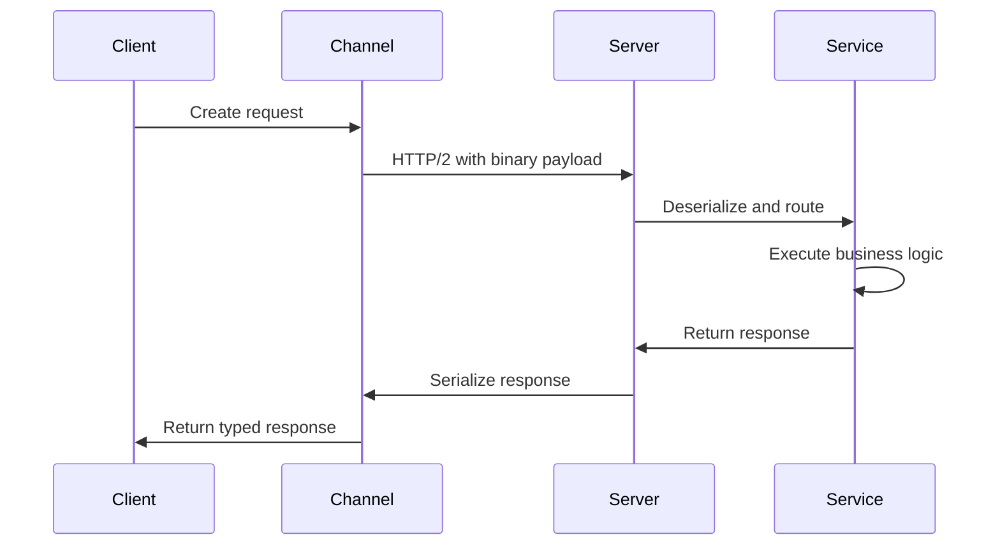

# How to Build gRPC Services in .NET

Author: [nawazdhandala](https://www.github.com/nawazdhandala)

Tags: .NET, C#, gRPC, Microservices, API, Protocol Buffers

Description: Learn how to build high-performance gRPC services in .NET. This guide covers service definitions, server implementation, client creation, streaming patterns, and best practices for production deployments.

---

gRPC is a high-performance RPC framework that uses HTTP/2 for transport and Protocol Buffers for serialization. It is particularly well-suited for microservices communication where performance matters. Unlike REST APIs that serialize to JSON, gRPC uses binary serialization which results in smaller message sizes and faster processing.

## Why gRPC?

Before diving into implementation, here's why you might choose gRPC:

- **Performance**: Binary serialization is faster than JSON
- **Strongly typed contracts**: Proto files define the API contract
- **HTTP/2 features**: Multiplexing, header compression, bidirectional streaming
- **Code generation**: Client and server code generated from proto files
- **Cross-platform**: Works across different languages and platforms

## Project Setup

Create a new gRPC service project:

```bash
dotnet new grpc -n ProductService
cd ProductService
```

This creates a project with the necessary packages already configured. For existing projects, add:

```bash
dotnet add package Grpc.AspNetCore
```

## Defining the Service with Protocol Buffers

Proto files define your service contract. Create `Protos/product.proto`:

```protobuf
syntax = "proto3";

option csharp_namespace = "ProductService";

package product;

// The product service definition
service ProductCatalog {
  // Unary RPC - single request, single response
  rpc GetProduct (GetProductRequest) returns (ProductResponse);

  // Unary RPC - create a product
  rpc CreateProduct (CreateProductRequest) returns (ProductResponse);

  // Server streaming - get multiple products
  rpc GetProducts (GetProductsRequest) returns (stream ProductResponse);

  // Client streaming - bulk create products
  rpc BulkCreateProducts (stream CreateProductRequest) returns (BulkCreateResponse);

  // Bidirectional streaming - real-time price updates
  rpc PriceUpdates (stream PriceUpdateRequest) returns (stream PriceUpdateResponse);
}

message GetProductRequest {
  string product_id = 1;
}

message GetProductsRequest {
  string category = 1;
  int32 page_size = 2;
  string page_token = 3;
}

message CreateProductRequest {
  string name = 1;
  string description = 2;
  double price = 3;
  string category = 4;
  int32 stock_quantity = 5;
}

message ProductResponse {
  string id = 1;
  string name = 2;
  string description = 3;
  double price = 4;
  string category = 5;
  int32 stock_quantity = 6;
  int64 created_at = 7;
  int64 updated_at = 8;
}

message BulkCreateResponse {
  int32 created_count = 1;
  repeated string product_ids = 2;
  repeated string errors = 3;
}

message PriceUpdateRequest {
  string product_id = 1;
}

message PriceUpdateResponse {
  string product_id = 1;
  double old_price = 2;
  double new_price = 3;
  int64 timestamp = 4;
}
```

Update your `.csproj` to include the proto file:

```xml
<ItemGroup>
  <Protobuf Include="Protos\product.proto" GrpcServices="Server" />
</ItemGroup>
```

## Implementing the gRPC Service

Create the service implementation:

```csharp
// Services/ProductCatalogService.cs
using Grpc.Core;
using ProductService;

public class ProductCatalogService : ProductCatalog.ProductCatalogBase
{
    private readonly IProductRepository _repository;
    private readonly ILogger<ProductCatalogService> _logger;

    public ProductCatalogService(
        IProductRepository repository,
        ILogger<ProductCatalogService> logger)
    {
        _repository = repository;
        _logger = logger;
    }

    // Unary RPC - Get a single product
    public override async Task<ProductResponse> GetProduct(
        GetProductRequest request,
        ServerCallContext context)
    {
        _logger.LogInformation("Getting product {ProductId}", request.ProductId);

        var product = await _repository.GetByIdAsync(request.ProductId);

        if (product == null)
        {
            // Throw RpcException with appropriate status code
            throw new RpcException(new Status(
                StatusCode.NotFound,
                $"Product with ID {request.ProductId} not found"));
        }

        return MapToResponse(product);
    }

    // Unary RPC - Create a product
    public override async Task<ProductResponse> CreateProduct(
        CreateProductRequest request,
        ServerCallContext context)
    {
        _logger.LogInformation("Creating product {Name}", request.Name);

        // Validate the request
        if (string.IsNullOrWhiteSpace(request.Name))
        {
            throw new RpcException(new Status(
                StatusCode.InvalidArgument,
                "Product name is required"));
        }

        if (request.Price <= 0)
        {
            throw new RpcException(new Status(
                StatusCode.InvalidArgument,
                "Price must be greater than zero"));
        }

        var product = new Product
        {
            Id = Guid.NewGuid().ToString(),
            Name = request.Name,
            Description = request.Description,
            Price = request.Price,
            Category = request.Category,
            StockQuantity = request.StockQuantity,
            CreatedAt = DateTime.UtcNow
        };

        await _repository.AddAsync(product);

        return MapToResponse(product);
    }

    // Server streaming - Stream multiple products to client
    public override async Task GetProducts(
        GetProductsRequest request,
        IServerStreamWriter<ProductResponse> responseStream,
        ServerCallContext context)
    {
        _logger.LogInformation("Streaming products for category {Category}", request.Category);

        var products = _repository.GetByCategoryAsync(
            request.Category,
            request.PageSize,
            request.PageToken);

        await foreach (var product in products)
        {
            // Check if client has cancelled the request
            if (context.CancellationToken.IsCancellationRequested)
            {
                _logger.LogInformation("Client cancelled the stream");
                break;
            }

            await responseStream.WriteAsync(MapToResponse(product));

            // Small delay to simulate real-world scenario
            await Task.Delay(100);
        }
    }

    // Client streaming - Receive multiple products from client
    public override async Task<BulkCreateResponse> BulkCreateProducts(
        IAsyncStreamReader<CreateProductRequest> requestStream,
        ServerCallContext context)
    {
        var createdIds = new List<string>();
        var errors = new List<string>();

        await foreach (var request in requestStream.ReadAllAsync())
        {
            try
            {
                var product = new Product
                {
                    Id = Guid.NewGuid().ToString(),
                    Name = request.Name,
                    Description = request.Description,
                    Price = request.Price,
                    Category = request.Category,
                    StockQuantity = request.StockQuantity,
                    CreatedAt = DateTime.UtcNow
                };

                await _repository.AddAsync(product);
                createdIds.Add(product.Id);
            }
            catch (Exception ex)
            {
                errors.Add($"Failed to create {request.Name}: {ex.Message}");
            }
        }

        return new BulkCreateResponse
        {
            CreatedCount = createdIds.Count,
            ProductIds = { createdIds },
            Errors = { errors }
        };
    }

    // Bidirectional streaming - Real-time price updates
    public override async Task PriceUpdates(
        IAsyncStreamReader<PriceUpdateRequest> requestStream,
        IServerStreamWriter<PriceUpdateResponse> responseStream,
        ServerCallContext context)
    {
        // Read subscriptions from client and send updates
        await foreach (var request in requestStream.ReadAllAsync())
        {
            _logger.LogInformation("Client subscribed to price updates for {ProductId}",
                request.ProductId);

            // Simulate price changes (in real app, this would be event-driven)
            var product = await _repository.GetByIdAsync(request.ProductId);
            if (product != null)
            {
                var random = new Random();
                var priceChange = (random.NextDouble() - 0.5) * 10;
                var newPrice = Math.Max(1, product.Price + priceChange);

                var response = new PriceUpdateResponse
                {
                    ProductId = product.Id,
                    OldPrice = product.Price,
                    NewPrice = newPrice,
                    Timestamp = DateTimeOffset.UtcNow.ToUnixTimeSeconds()
                };

                await responseStream.WriteAsync(response);
            }
        }
    }

    private static ProductResponse MapToResponse(Product product)
    {
        return new ProductResponse
        {
            Id = product.Id,
            Name = product.Name,
            Description = product.Description ?? "",
            Price = product.Price,
            Category = product.Category ?? "",
            StockQuantity = product.StockQuantity,
            CreatedAt = new DateTimeOffset(product.CreatedAt).ToUnixTimeSeconds(),
            UpdatedAt = product.UpdatedAt.HasValue
                ? new DateTimeOffset(product.UpdatedAt.Value).ToUnixTimeSeconds()
                : 0
        };
    }
}
```

## Configuring the gRPC Server

In `Program.cs`:

```csharp
var builder = WebApplication.CreateBuilder(args);

// Add gRPC services
builder.Services.AddGrpc(options =>
{
    // Enable detailed error messages in development
    options.EnableDetailedErrors = builder.Environment.IsDevelopment();

    // Set max message sizes
    options.MaxReceiveMessageSize = 16 * 1024 * 1024; // 16 MB
    options.MaxSendMessageSize = 16 * 1024 * 1024;
});

// Register repository
builder.Services.AddSingleton<IProductRepository, InMemoryProductRepository>();

var app = builder.Build();

// Map gRPC service
app.MapGrpcService<ProductCatalogService>();

// Optional: Add gRPC reflection for tools like grpcurl
app.MapGrpcReflectionService();

app.Run();
```

## Building the gRPC Client

Create a client project and add the proto file:

```xml
<!-- Client.csproj -->
<ItemGroup>
  <PackageReference Include="Grpc.Net.Client" Version="2.59.0" />
  <PackageReference Include="Google.Protobuf" Version="3.25.0" />
  <PackageReference Include="Grpc.Tools" Version="2.59.0" PrivateAssets="All" />
</ItemGroup>

<ItemGroup>
  <Protobuf Include="Protos\product.proto" GrpcServices="Client" />
</ItemGroup>
```

Implement the client:

```csharp
// ProductServiceClient.cs
using Grpc.Core;
using Grpc.Net.Client;
using ProductService;

public class ProductServiceClient : IDisposable
{
    private readonly GrpcChannel _channel;
    private readonly ProductCatalog.ProductCatalogClient _client;

    public ProductServiceClient(string address)
    {
        _channel = GrpcChannel.ForAddress(address);
        _client = new ProductCatalog.ProductCatalogClient(_channel);
    }

    // Unary call - Get a product
    public async Task<ProductResponse> GetProductAsync(string productId)
    {
        var request = new GetProductRequest { ProductId = productId };
        return await _client.GetProductAsync(request);
    }

    // Unary call - Create a product
    public async Task<ProductResponse> CreateProductAsync(
        string name,
        string description,
        double price,
        string category,
        int stockQuantity)
    {
        var request = new CreateProductRequest
        {
            Name = name,
            Description = description,
            Price = price,
            Category = category,
            StockQuantity = stockQuantity
        };

        return await _client.CreateProductAsync(request);
    }

    // Server streaming - Get products
    public async IAsyncEnumerable<ProductResponse> GetProductsAsync(
        string category,
        int pageSize = 10,
        [EnumeratorCancellation] CancellationToken cancellationToken = default)
    {
        var request = new GetProductsRequest
        {
            Category = category,
            PageSize = pageSize
        };

        using var call = _client.GetProducts(request);

        await foreach (var product in call.ResponseStream.ReadAllAsync(cancellationToken))
        {
            yield return product;
        }
    }

    // Client streaming - Bulk create products
    public async Task<BulkCreateResponse> BulkCreateProductsAsync(
        IEnumerable<CreateProductRequest> products)
    {
        using var call = _client.BulkCreateProducts();

        foreach (var product in products)
        {
            await call.RequestStream.WriteAsync(product);
        }

        // Signal that we're done sending
        await call.RequestStream.CompleteAsync();

        return await call.ResponseAsync;
    }

    // Bidirectional streaming - Subscribe to price updates
    public async Task SubscribeToPriceUpdates(
        IEnumerable<string> productIds,
        Action<PriceUpdateResponse> onUpdate,
        CancellationToken cancellationToken)
    {
        using var call = _client.PriceUpdates();

        // Start reading responses in background
        var readTask = Task.Run(async () =>
        {
            await foreach (var update in call.ResponseStream.ReadAllAsync(cancellationToken))
            {
                onUpdate(update);
            }
        }, cancellationToken);

        // Send subscription requests
        foreach (var productId in productIds)
        {
            await call.RequestStream.WriteAsync(new PriceUpdateRequest
            {
                ProductId = productId
            });
        }

        await call.RequestStream.CompleteAsync();
        await readTask;
    }

    public void Dispose()
    {
        _channel?.Dispose();
    }
}
```

## Using the Client

```csharp
// Program.cs (Client application)
using var client = new ProductServiceClient("https://localhost:5001");

// Create a product
var product = await client.CreateProductAsync(
    name: "Wireless Mouse",
    description: "Ergonomic wireless mouse",
    price: 29.99,
    category: "Electronics",
    stockQuantity: 100);

Console.WriteLine($"Created product: {product.Id}");

// Get a product
var retrieved = await client.GetProductAsync(product.Id);
Console.WriteLine($"Retrieved: {retrieved.Name} - ${retrieved.Price}");

// Stream products by category
Console.WriteLine("\nProducts in Electronics:");
await foreach (var p in client.GetProductsAsync("Electronics"))
{
    Console.WriteLine($"  - {p.Name}: ${p.Price}");
}

// Bulk create
var bulkResult = await client.BulkCreateProductsAsync(new[]
{
    new CreateProductRequest { Name = "Keyboard", Price = 49.99, Category = "Electronics" },
    new CreateProductRequest { Name = "Monitor", Price = 299.99, Category = "Electronics" },
    new CreateProductRequest { Name = "USB Cable", Price = 9.99, Category = "Electronics" }
});

Console.WriteLine($"\nBulk created {bulkResult.CreatedCount} products");
```

## Error Handling

Handle gRPC errors properly on the client:

```csharp
public async Task<ProductResponse?> GetProductSafeAsync(string productId)
{
    try
    {
        return await _client.GetProductAsync(new GetProductRequest { ProductId = productId });
    }
    catch (RpcException ex) when (ex.StatusCode == StatusCode.NotFound)
    {
        Console.WriteLine($"Product {productId} not found");
        return null;
    }
    catch (RpcException ex) when (ex.StatusCode == StatusCode.Unavailable)
    {
        Console.WriteLine("Service is unavailable, retrying...");
        // Implement retry logic
        throw;
    }
    catch (RpcException ex)
    {
        Console.WriteLine($"gRPC error: {ex.Status.StatusCode} - {ex.Status.Detail}");
        throw;
    }
}
```

## Adding Interceptors

Interceptors let you add cross-cutting concerns like logging and authentication:

```csharp
// Server interceptor
public class LoggingInterceptor : Interceptor
{
    private readonly ILogger<LoggingInterceptor> _logger;

    public LoggingInterceptor(ILogger<LoggingInterceptor> logger)
    {
        _logger = logger;
    }

    public override async Task<TResponse> UnaryServerHandler<TRequest, TResponse>(
        TRequest request,
        ServerCallContext context,
        UnaryServerMethod<TRequest, TResponse> continuation)
    {
        var stopwatch = Stopwatch.StartNew();

        _logger.LogInformation("Starting {Method}", context.Method);

        try
        {
            var response = await continuation(request, context);

            stopwatch.Stop();
            _logger.LogInformation("{Method} completed in {Elapsed}ms",
                context.Method, stopwatch.ElapsedMilliseconds);

            return response;
        }
        catch (Exception ex)
        {
            _logger.LogError(ex, "{Method} failed", context.Method);
            throw;
        }
    }
}

// Register in Program.cs
builder.Services.AddGrpc(options =>
{
    options.Interceptors.Add<LoggingInterceptor>();
});
```

## gRPC Request Flow



## Summary

gRPC provides a modern, high-performance alternative to REST APIs for service-to-service communication:

| Pattern | Use Case |
|---------|----------|
| **Unary** | Simple request-response (most common) |
| **Server streaming** | Large datasets, real-time updates |
| **Client streaming** | Bulk uploads, aggregations |
| **Bidirectional** | Chat, live feeds, real-time sync |

The strongly-typed contracts from Protocol Buffers catch errors at compile time, and the binary serialization keeps your services fast. While gRPC is not ideal for browser clients (you would need gRPC-Web), it excels in microservices architectures where performance and type safety matter.
