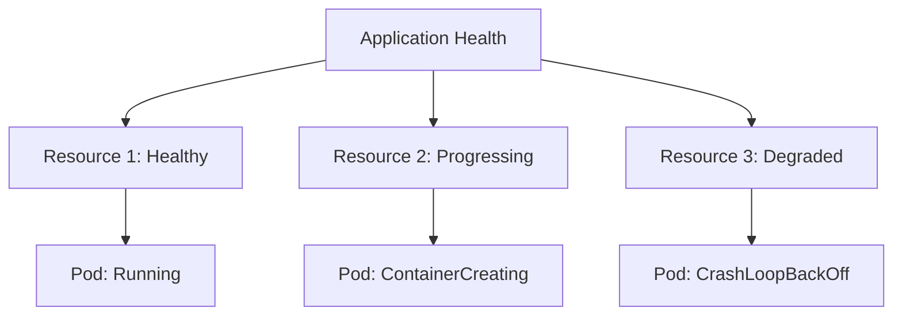

# How to Implement Health Checks in ArgoCD

Author: [nawazdhandala](https://www.github.com/nawazdhandala)

Tags: ArgoCD, Health Checks, Kubernetes, Monitoring, GitOps, Custom Resources

Description: Learn how to configure and customize health checks in ArgoCD to accurately assess application health, including built-in checks, custom health scripts, and integration with custom resources.

---

ArgoCD does not just deploy your applications. It also monitors their health. A green checkmark means everything is running correctly. A red X means something is wrong. But what counts as healthy? This guide explains how ArgoCD health checks work and how to customize them for your needs.

## Understanding Health Status

ArgoCD reports health status at multiple levels:



Health statuses:

| Status | Meaning |
|--------|---------|
| Healthy | Resource is fully operational |
| Progressing | Resource is updating or starting |
| Degraded | Resource has errors |
| Suspended | Resource is paused |
| Missing | Resource does not exist |
| Unknown | Health cannot be determined |

## Built-in Health Checks

ArgoCD has built-in health checks for common Kubernetes resources.

### Deployment Health

A Deployment is healthy when:
- The desired number of replicas are available
- All pods are running and ready
- No rollout is in progress

```yaml
apiVersion: apps/v1
kind: Deployment
metadata:
  name: myapp
spec:
  replicas: 3
  selector:
    matchLabels:
      app: myapp
  template:
    metadata:
      labels:
        app: myapp
    spec:
      containers:
        - name: myapp
          image: myapp:latest
          # Readiness probe affects ArgoCD health
          readinessProbe:
            httpGet:
              path: /health
              port: 8080
            initialDelaySeconds: 5
            periodSeconds: 10
          # Liveness probe affects pod restarts
          livenessProbe:
            httpGet:
              path: /health
              port: 8080
            initialDelaySeconds: 15
            periodSeconds: 20
```

### StatefulSet Health

Similar to Deployments, but considers ordinal index during rolling updates:

```yaml
apiVersion: apps/v1
kind: StatefulSet
metadata:
  name: postgres
spec:
  replicas: 3
  serviceName: postgres
  selector:
    matchLabels:
      app: postgres
  template:
    metadata:
      labels:
        app: postgres
    spec:
      containers:
        - name: postgres
          image: postgres:15
          readinessProbe:
            exec:
              command:
                - pg_isready
                - -U
                - postgres
            initialDelaySeconds: 5
            periodSeconds: 5
```

### Service Health

Services are healthy when they have endpoints:

```yaml
apiVersion: v1
kind: Service
metadata:
  name: myapp
spec:
  selector:
    app: myapp
  ports:
    - port: 80
      targetPort: 8080
```

If no pods match the selector, the service shows as Degraded.

### Job Health

Jobs are healthy when completed successfully:

```yaml
apiVersion: batch/v1
kind: Job
metadata:
  name: db-migrate
spec:
  template:
    spec:
      containers:
        - name: migrate
          image: myapp:latest
          command: ["./migrate.sh"]
      restartPolicy: Never
  backoffLimit: 3
```

| Job State | ArgoCD Health |
|-----------|---------------|
| Running | Progressing |
| Complete | Healthy |
| Failed | Degraded |

## Custom Health Checks

For custom resources or special requirements, define custom health checks in the ArgoCD ConfigMap.

### Health Check Configuration

```yaml
apiVersion: v1
kind: ConfigMap
metadata:
  name: argocd-cm
  namespace: argocd
data:
  # Custom health checks in Lua
  resource.customizations.health.argoproj.io_Rollout: |
    hs = {}
    if obj.status ~= nil then
      if obj.status.phase == "Healthy" then
        hs.status = "Healthy"
        hs.message = "Rollout is healthy"
      elseif obj.status.phase == "Paused" then
        hs.status = "Suspended"
        hs.message = obj.status.message
      elseif obj.status.phase == "Progressing" then
        hs.status = "Progressing"
        hs.message = "Rollout is progressing"
      else
        hs.status = "Degraded"
        hs.message = obj.status.message
      end
    end
    return hs
```

### Custom Resource Health Check

Add health checks for custom resources:

```yaml
apiVersion: v1
kind: ConfigMap
metadata:
  name: argocd-cm
  namespace: argocd
data:
  # Health check for cert-manager Certificate
  resource.customizations.health.cert-manager.io_Certificate: |
    hs = {}
    if obj.status ~= nil then
      if obj.status.conditions ~= nil then
        for i, condition in ipairs(obj.status.conditions) do
          if condition.type == "Ready" and condition.status == "False" then
            hs.status = "Degraded"
            hs.message = condition.message
            return hs
          end
          if condition.type == "Ready" and condition.status == "True" then
            hs.status = "Healthy"
            hs.message = "Certificate is ready"
            return hs
          end
        end
      end
    end
    hs.status = "Progressing"
    hs.message = "Waiting for certificate"
    return hs
```

### External Secrets Health Check

```yaml
data:
  resource.customizations.health.external-secrets.io_ExternalSecret: |
    hs = {}
    if obj.status ~= nil then
      if obj.status.conditions ~= nil then
        for i, condition in ipairs(obj.status.conditions) do
          if condition.type == "Ready" then
            if condition.status == "True" then
              hs.status = "Healthy"
              hs.message = "Secret synced successfully"
            else
              hs.status = "Degraded"
              hs.message = condition.message
            end
            return hs
          end
        end
      end
    end
    hs.status = "Progressing"
    hs.message = "Waiting for secret sync"
    return hs
```

### Knative Service Health Check

```yaml
data:
  resource.customizations.health.serving.knative.dev_Service: |
    hs = {}
    if obj.status ~= nil then
      if obj.status.conditions ~= nil then
        for i, condition in ipairs(obj.status.conditions) do
          if condition.type == "Ready" then
            if condition.status == "True" then
              hs.status = "Healthy"
              hs.message = "Service is ready"
            elseif condition.status == "Unknown" then
              hs.status = "Progressing"
              hs.message = condition.message
            else
              hs.status = "Degraded"
              hs.message = condition.message
            end
            return hs
          end
        end
      end
    end
    hs.status = "Progressing"
    hs.message = "Waiting for service"
    return hs
```

## Overriding Built-in Health Checks

Override the default behavior for standard resources:

```yaml
data:
  # Custom Deployment health that considers HPA
  resource.customizations.health.apps_Deployment: |
    hs = {}
    if obj.status ~= nil then
      if obj.status.availableReplicas ~= nil then
        if obj.status.availableReplicas >= 1 then
          hs.status = "Healthy"
          hs.message = "At least one replica available"
          return hs
        end
      end
      if obj.status.conditions ~= nil then
        for i, condition in ipairs(obj.status.conditions) do
          if condition.type == "Available" and condition.status == "False" then
            hs.status = "Degraded"
            hs.message = condition.message
            return hs
          end
          if condition.type == "Progressing" and condition.reason == "ProgressDeadlineExceeded" then
            hs.status = "Degraded"
            hs.message = "Progress deadline exceeded"
            return hs
          end
        end
      end
    end
    hs.status = "Progressing"
    hs.message = "Waiting for deployment"
    return hs
```

## Ignoring Resources from Health

Some resources should not affect overall health:

```yaml
apiVersion: argoproj.io/v1alpha1
kind: Application
metadata:
  name: myapp
spec:
  source:
    repoURL: https://github.com/myorg/myapp.git
    path: k8s
  destination:
    server: https://kubernetes.default.svc
    namespace: myapp
  # Ignore specific resources in health assessment
  ignoreDifferences:
    - group: ""
      kind: ConfigMap
      name: cache-config
      jsonPointers:
        - /data
```

Or exclude entire resource types:

```yaml
apiVersion: v1
kind: ConfigMap
metadata:
  name: argocd-cm
  namespace: argocd
data:
  # Exclude PodDisruptionBudget from health
  resource.exclusions: |
    - apiGroups:
        - policy
      kinds:
        - PodDisruptionBudget
      clusters:
        - "*"
```

## Health Assessment Timeout

Configure how long ArgoCD waits for health:

```yaml
apiVersion: argoproj.io/v1alpha1
kind: Application
metadata:
  name: myapp
spec:
  syncPolicy:
    syncOptions:
      # Wait up to 5 minutes for health
      - HealthCheckTimeout=300
```

## Debugging Health Issues

### Check Resource Health

```bash
# Get detailed health status
argocd app get myapp

# List resources with health
argocd app resources myapp

# Get specific resource health
kubectl get deployment myapp -n myapp -o yaml | grep -A 20 status:
```

### Test Custom Health Scripts

Use the ArgoCD API to test health scripts:

```bash
# Get the raw health assessment
argocd app get myapp --output json | jq '.status.health'

# Check individual resource health
argocd app resources myapp --output json | jq '.[] | select(.kind == "Deployment") | .health'
```

### Common Health Issues

**Deployment stuck Progressing:**
```bash
# Check for failed pods
kubectl get pods -n myapp
kubectl describe deployment myapp -n myapp

# Check events
kubectl get events -n myapp --sort-by='.lastTimestamp'
```

**Service shows Degraded:**
```bash
# Verify endpoints exist
kubectl get endpoints myapp -n myapp

# Check selector matches
kubectl get pods -n myapp --show-labels
```

**Custom resource Unknown:**
- Verify the health check is configured
- Check for Lua syntax errors in ConfigMap
- Ensure the resource has a status field

```bash
# Check ArgoCD logs for health check errors
kubectl logs -n argocd deployment/argocd-application-controller | grep health
```

## Best Practices

### Always Define Readiness Probes

```yaml
containers:
  - name: myapp
    readinessProbe:
      httpGet:
        path: /ready
        port: 8080
      initialDelaySeconds: 5
      periodSeconds: 5
      failureThreshold: 3
```

### Use Meaningful Health Endpoints

```go
// In your application
http.HandleFunc("/health", func(w http.ResponseWriter, r *http.Request) {
    // Check database connection
    if err := db.Ping(); err != nil {
        w.WriteHeader(http.StatusServiceUnavailable)
        return
    }
    // Check cache connection
    if err := cache.Ping(); err != nil {
        w.WriteHeader(http.StatusServiceUnavailable)
        return
    }
    w.WriteHeader(http.StatusOK)
})
```

### Document Custom Health Checks

Add comments explaining your health logic:

```yaml
data:
  resource.customizations.health.myorg.io_MyResource: |
    -- Custom health check for MyResource
    -- Healthy: status.phase == "Running" and all conditions are True
    -- Degraded: any condition is False
    -- Progressing: otherwise
    hs = {}
    -- ... implementation
```

---

Health checks are how ArgoCD knows your deployment succeeded. The built-in checks handle standard Kubernetes resources well. For custom resources, write Lua health scripts that accurately reflect your application state. Good health checks mean confident deployments and faster incident detection.
