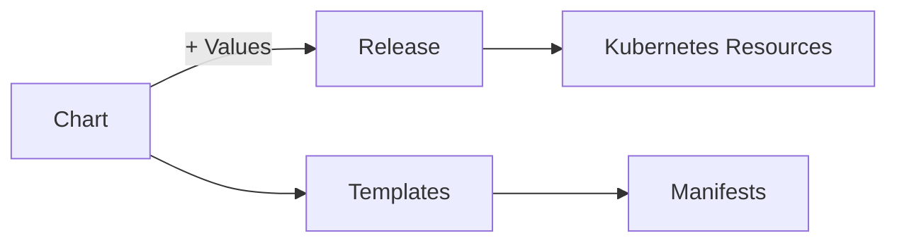

# How to Use Helm for Kubernetes Package Management

Author: [nawazdhandala](https://www.github.com/nawazdhandala)

Tags: Kubernetes, Helm, DevOps, Package Management, Deployment

Description: Learn how to use Helm for managing Kubernetes applications, including chart creation, values customization, release management, and best practices for production deployments.

---

Helm is the package manager for Kubernetes. It simplifies deploying complex applications by bundling Kubernetes manifests into charts that can be versioned, shared, and customized. This guide covers using Helm effectively from basic deployments to creating your own charts.

## Understanding Helm Concepts

Helm uses three main concepts:



- **Chart**: A package containing Kubernetes resource templates
- **Values**: Configuration that customizes the chart
- **Release**: A deployed instance of a chart with specific values

## Installing Helm

Install the Helm CLI:

```bash
# macOS
brew install helm

# Linux
curl https://raw.githubusercontent.com/helm/helm/main/scripts/get-helm-3 | bash

# Verify installation
helm version
```

## Working with Helm Repositories

Add repositories to access charts:

```bash
# Add popular repositories
helm repo add stable https://charts.helm.sh/stable
helm repo add bitnami https://charts.bitnami.com/bitnami
helm repo add prometheus-community https://prometheus-community.github.io/helm-charts

# Update repository cache
helm repo update

# Search for charts
helm search repo nginx
helm search repo prometheus

# Search with versions
helm search repo nginx --versions
```

## Installing Charts

Deploy an application using Helm:

```bash
# Install a chart with default values
helm install my-nginx bitnami/nginx -n web --create-namespace

# Install with custom values file
helm install my-nginx bitnami/nginx -n web -f values.yaml

# Install with inline value overrides
helm install my-nginx bitnami/nginx -n web \
  --set replicaCount=3 \
  --set service.type=ClusterIP

# Install a specific chart version
helm install my-nginx bitnami/nginx -n web --version 15.0.0

# Dry run to see what would be deployed
helm install my-nginx bitnami/nginx -n web --dry-run
```

## Customizing with Values

Inspect and customize chart values:

```bash
# View all configurable values
helm show values bitnami/nginx > default-values.yaml

# View chart information
helm show chart bitnami/nginx
helm show readme bitnami/nginx
```

Create a custom values file:

```yaml
# nginx-values.yaml
# Customize the Bitnami NGINX chart

replicaCount: 3

image:
  registry: docker.io
  repository: bitnami/nginx
  tag: 1.24.0

service:
  type: ClusterIP
  port: 80

resources:
  requests:
    memory: "128Mi"
    cpu: "100m"
  limits:
    memory: "256Mi"
    cpu: "500m"

# Enable autoscaling
autoscaling:
  enabled: true
  minReplicas: 2
  maxReplicas: 10
  targetCPU: 80

# Configure ingress
ingress:
  enabled: true
  hostname: nginx.example.com
  annotations:
    kubernetes.io/ingress.class: nginx
  tls: true

# Pod security context
podSecurityContext:
  fsGroup: 1001

containerSecurityContext:
  runAsUser: 1001
  runAsNonRoot: true
```

Install with custom values:

```bash
helm install my-nginx bitnami/nginx -n web -f nginx-values.yaml
```

## Managing Releases

Work with deployed releases:

```bash
# List all releases
helm list -A

# List releases in a namespace
helm list -n web

# Get release status
helm status my-nginx -n web

# Get release history
helm history my-nginx -n web

# Get deployed manifest
helm get manifest my-nginx -n web

# Get values used for a release
helm get values my-nginx -n web
helm get values my-nginx -n web --all  # Include defaults
```

## Upgrading Releases

Update a deployed application:

```bash
# Upgrade with new values
helm upgrade my-nginx bitnami/nginx -n web -f nginx-values.yaml

# Upgrade and install if not exists
helm upgrade --install my-nginx bitnami/nginx -n web -f nginx-values.yaml

# Upgrade to a new chart version
helm upgrade my-nginx bitnami/nginx -n web --version 16.0.0

# Rollback to previous release
helm rollback my-nginx 1 -n web

# Rollback to specific revision
helm rollback my-nginx 3 -n web
```

## Creating Your Own Chart

Create a chart for your application:

```bash
# Create chart scaffolding
helm create my-app

# This creates:
# my-app/
#   Chart.yaml        # Chart metadata
#   values.yaml       # Default values
#   charts/           # Dependencies
#   templates/        # Kubernetes manifests
#   templates/NOTES.txt
```

Customize the chart:

```yaml
# my-app/Chart.yaml
apiVersion: v2
name: my-app
description: My application Helm chart
type: application
version: 1.0.0
appVersion: "2.5.0"

dependencies:
  - name: postgresql
    version: "12.x.x"
    repository: https://charts.bitnami.com/bitnami
    condition: postgresql.enabled
```

```yaml
# my-app/values.yaml
replicaCount: 2

image:
  repository: myregistry/my-app
  tag: ""  # Defaults to appVersion
  pullPolicy: IfNotPresent

service:
  type: ClusterIP
  port: 80

ingress:
  enabled: false
  className: nginx
  hosts:
    - host: my-app.local
      paths:
        - path: /
          pathType: Prefix

resources:
  requests:
    cpu: 100m
    memory: 128Mi
  limits:
    cpu: 500m
    memory: 512Mi

postgresql:
  enabled: true
  auth:
    database: myapp
    username: myapp
```

Create a template:

```yaml
# my-app/templates/deployment.yaml
apiVersion: apps/v1
kind: Deployment
metadata:
  name: {{ include "my-app.fullname" . }}
  labels:
    {{- include "my-app.labels" . | nindent 4 }}
spec:
  replicas: {{ .Values.replicaCount }}
  selector:
    matchLabels:
      {{- include "my-app.selectorLabels" . | nindent 6 }}
  template:
    metadata:
      labels:
        {{- include "my-app.selectorLabels" . | nindent 8 }}
    spec:
      containers:
        - name: {{ .Chart.Name }}
          image: "{{ .Values.image.repository }}:{{ .Values.image.tag | default .Chart.AppVersion }}"
          imagePullPolicy: {{ .Values.image.pullPolicy }}
          ports:
            - name: http
              containerPort: 8080
              protocol: TCP
          livenessProbe:
            httpGet:
              path: /health
              port: http
          readinessProbe:
            httpGet:
              path: /ready
              port: http
          resources:
            {{- toYaml .Values.resources | nindent 12 }}
          env:
            - name: DATABASE_URL
              valueFrom:
                secretKeyRef:
                  name: {{ include "my-app.fullname" . }}-db
                  key: url
```

## Testing and Linting Charts

Validate your chart before deployment:

```bash
# Lint the chart
helm lint my-app/

# Template locally to see generated manifests
helm template my-app my-app/ -f custom-values.yaml

# Test with dry-run against cluster
helm install my-app my-app/ --dry-run --debug

# Run chart tests (if defined)
helm test my-app -n production
```

## Packaging and Sharing Charts

Distribute your charts:

```bash
# Package the chart
helm package my-app/

# This creates my-app-1.0.0.tgz

# Generate index for repository
helm repo index . --url https://charts.example.com

# Install from local package
helm install my-app ./my-app-1.0.0.tgz -n production
```

## Helm in CI/CD Pipelines

Use Helm in automated deployments:

```yaml
# .github/workflows/deploy.yaml
name: Deploy to Kubernetes

on:
  push:
    branches: [main]

jobs:
  deploy:
    runs-on: ubuntu-latest
    steps:
      - uses: actions/checkout@v4

      - name: Install Helm
        uses: azure/setup-helm@v3

      - name: Configure kubectl
        uses: azure/k8s-set-context@v3
        with:
          kubeconfig: ${{ secrets.KUBECONFIG }}

      - name: Deploy with Helm
        run: |
          helm upgrade --install my-app ./charts/my-app \
            --namespace production \
            --set image.tag=${{ github.sha }} \
            --wait \
            --timeout 5m
```

## Best Practices

1. **Version your charts**: Use semantic versioning for both chart version and appVersion.

2. **Use values schema**: Define a JSON schema for values validation.

```yaml
# my-app/values.schema.json
{
  "$schema": "http://json-schema.org/draft-07/schema#",
  "type": "object",
  "required": ["image", "replicaCount"],
  "properties": {
    "replicaCount": {
      "type": "integer",
      "minimum": 1
    },
    "image": {
      "type": "object",
      "required": ["repository"],
      "properties": {
        "repository": {"type": "string"},
        "tag": {"type": "string"}
      }
    }
  }
}
```

3. **Document your values**: Add comments explaining each value.

4. **Use hooks for migrations**: Run database migrations before upgrades.

```yaml
# templates/migration-job.yaml
apiVersion: batch/v1
kind: Job
metadata:
  name: {{ include "my-app.fullname" . }}-migrate
  annotations:
    "helm.sh/hook": pre-upgrade
    "helm.sh/hook-weight": "-5"
    "helm.sh/hook-delete-policy": hook-succeeded
```

5. **Set resource limits**: Always define resources in your templates.

---

Helm transforms Kubernetes deployments from error-prone manual processes into repeatable, version-controlled operations. Start by using community charts for common applications, then create your own charts for internal services. With proper values customization and CI/CD integration, Helm becomes the foundation of reliable Kubernetes deployments.
