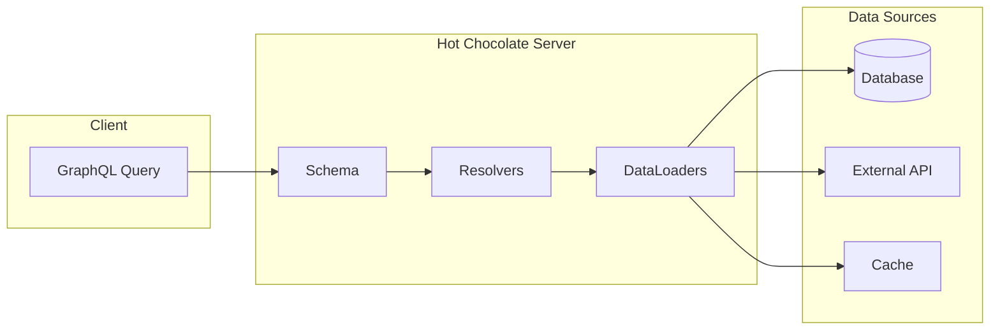

# How to Build GraphQL APIs with Hot Chocolate in .NET

Author: [nawazdhandala](https://www.github.com/nawazdhandala)

Tags: .NET, GraphQL, Hot Chocolate, C#, API Development, ASP.NET Core, Query, Mutation

Description: Learn how to build GraphQL APIs in .NET using Hot Chocolate. This guide covers schema design, queries, mutations, subscriptions, filtering, pagination, and DataLoader patterns for efficient data fetching.

---

GraphQL provides a flexible alternative to REST APIs, allowing clients to request exactly the data they need. Hot Chocolate is a mature GraphQL server implementation for .NET that makes building GraphQL APIs straightforward and efficient.

## Why GraphQL with Hot Chocolate?



| Feature | Benefit |
|---------|---------|
| Single endpoint | All operations through one URL |
| Type safety | Strong typing with code-first or schema-first |
| Efficient fetching | DataLoaders prevent N+1 queries |
| Real-time | Built-in subscription support |
| Introspection | Self-documenting API |

## Getting Started

Install the required NuGet packages:

```bash
dotnet add package HotChocolate.AspNetCore
dotnet add package HotChocolate.Data
dotnet add package HotChocolate.Data.EntityFramework
```

Set up a basic GraphQL server:

```csharp
// Program.cs
var builder = WebApplication.CreateBuilder(args);

// Add GraphQL services
builder.Services
    .AddGraphQLServer()
    .AddQueryType<Query>();

var app = builder.Build();

app.MapGraphQL();

app.Run();
```

## Defining Types

Create your domain models and GraphQL types:

```csharp
// Models/Product.cs
public class Product
{
    public int Id { get; set; }
    public string Name { get; set; } = string.Empty;
    public string Description { get; set; } = string.Empty;
    public decimal Price { get; set; }
    public int CategoryId { get; set; }
    public Category? Category { get; set; }
    public List<Review> Reviews { get; set; } = new();
    public DateTime CreatedAt { get; set; }
    public bool IsActive { get; set; }
}

// Models/Category.cs
public class Category
{
    public int Id { get; set; }
    public string Name { get; set; } = string.Empty;
    public List<Product> Products { get; set; } = new();
}

// Models/Review.cs
public class Review
{
    public int Id { get; set; }
    public int ProductId { get; set; }
    public Product? Product { get; set; }
    public string AuthorName { get; set; } = string.Empty;
    public string Content { get; set; } = string.Empty;
    public int Rating { get; set; }
    public DateTime CreatedAt { get; set; }
}
```

## Building Queries

Create query resolvers to fetch data:

```csharp
// GraphQL/Query.cs
public class Query
{
    // Simple query - returns all products
    [UseDbContext(typeof(ApplicationDbContext))]
    [UseProjection]
    [UseFiltering]
    [UseSorting]
    public IQueryable<Product> GetProducts([ScopedService] ApplicationDbContext context)
    {
        return context.Products;
    }

    // Query with parameter
    [UseDbContext(typeof(ApplicationDbContext))]
    public async Task<Product?> GetProductById(
        [ScopedService] ApplicationDbContext context,
        int id)
    {
        return await context.Products
            .Include(p => p.Category)
            .FirstOrDefaultAsync(p => p.Id == id);
    }

    // Query with complex filtering
    [UseDbContext(typeof(ApplicationDbContext))]
    public async Task<List<Product>> GetProductsByCategory(
        [ScopedService] ApplicationDbContext context,
        int categoryId,
        decimal? minPrice = null,
        decimal? maxPrice = null)
    {
        var query = context.Products
            .Where(p => p.CategoryId == categoryId && p.IsActive);

        if (minPrice.HasValue)
            query = query.Where(p => p.Price >= minPrice.Value);

        if (maxPrice.HasValue)
            query = query.Where(p => p.Price <= maxPrice.Value);

        return await query.ToListAsync();
    }

    // Query with search
    [UseDbContext(typeof(ApplicationDbContext))]
    [UseFiltering]
    [UseSorting]
    public IQueryable<Product> SearchProducts(
        [ScopedService] ApplicationDbContext context,
        string searchTerm)
    {
        return context.Products
            .Where(p => p.Name.Contains(searchTerm) ||
                       p.Description.Contains(searchTerm));
    }
}
```

## Implementing Mutations

Handle create, update, and delete operations:

```csharp
// GraphQL/Mutation.cs
public class Mutation
{
    // Create operation
    [UseDbContext(typeof(ApplicationDbContext))]
    public async Task<AddProductPayload> AddProduct(
        [ScopedService] ApplicationDbContext context,
        AddProductInput input)
    {
        // Validate input
        var errors = new List<UserError>();

        if (string.IsNullOrWhiteSpace(input.Name))
        {
            errors.Add(new UserError("Name is required", "NAME_REQUIRED"));
        }

        if (input.Price <= 0)
        {
            errors.Add(new UserError("Price must be positive", "INVALID_PRICE"));
        }

        if (errors.Any())
        {
            return new AddProductPayload(null, errors);
        }

        var product = new Product
        {
            Name = input.Name,
            Description = input.Description ?? string.Empty,
            Price = input.Price,
            CategoryId = input.CategoryId,
            CreatedAt = DateTime.UtcNow,
            IsActive = true
        };

        context.Products.Add(product);
        await context.SaveChangesAsync();

        return new AddProductPayload(product, null);
    }

    // Update operation
    [UseDbContext(typeof(ApplicationDbContext))]
    public async Task<UpdateProductPayload> UpdateProduct(
        [ScopedService] ApplicationDbContext context,
        UpdateProductInput input)
    {
        var product = await context.Products.FindAsync(input.Id);

        if (product == null)
        {
            return new UpdateProductPayload(
                null,
                new[] { new UserError("Product not found", "NOT_FOUND") });
        }

        if (input.Name != null)
            product.Name = input.Name;

        if (input.Description != null)
            product.Description = input.Description;

        if (input.Price.HasValue)
            product.Price = input.Price.Value;

        if (input.CategoryId.HasValue)
            product.CategoryId = input.CategoryId.Value;

        await context.SaveChangesAsync();

        return new UpdateProductPayload(product, null);
    }

    // Delete operation
    [UseDbContext(typeof(ApplicationDbContext))]
    public async Task<DeleteProductPayload> DeleteProduct(
        [ScopedService] ApplicationDbContext context,
        int id)
    {
        var product = await context.Products.FindAsync(id);

        if (product == null)
        {
            return new DeleteProductPayload(
                false,
                new[] { new UserError("Product not found", "NOT_FOUND") });
        }

        context.Products.Remove(product);
        await context.SaveChangesAsync();

        return new DeleteProductPayload(true, null);
    }
}

// GraphQL/Inputs/AddProductInput.cs
public record AddProductInput(
    string Name,
    string? Description,
    decimal Price,
    int CategoryId);

// GraphQL/Inputs/UpdateProductInput.cs
public record UpdateProductInput(
    int Id,
    string? Name,
    string? Description,
    decimal? Price,
    int? CategoryId);

// GraphQL/Payloads/AddProductPayload.cs
public record AddProductPayload(Product? Product, IReadOnlyList<UserError>? Errors);

public record UpdateProductPayload(Product? Product, IReadOnlyList<UserError>? Errors);

public record DeleteProductPayload(bool Success, IReadOnlyList<UserError>? Errors);

public record UserError(string Message, string Code);
```

## DataLoaders for Efficient Fetching

Prevent N+1 query problems with DataLoaders:

```csharp
// GraphQL/DataLoaders/CategoryDataLoader.cs
public class CategoryBatchDataLoader : BatchDataLoader<int, Category>
{
    private readonly IDbContextFactory<ApplicationDbContext> _contextFactory;

    public CategoryBatchDataLoader(
        IDbContextFactory<ApplicationDbContext> contextFactory,
        IBatchScheduler batchScheduler,
        DataLoaderOptions? options = null)
        : base(batchScheduler, options)
    {
        _contextFactory = contextFactory;
    }

    protected override async Task<IReadOnlyDictionary<int, Category>> LoadBatchAsync(
        IReadOnlyList<int> keys,
        CancellationToken cancellationToken)
    {
        await using var context = await _contextFactory.CreateDbContextAsync(cancellationToken);

        // Fetch all categories in a single query
        return await context.Categories
            .Where(c => keys.Contains(c.Id))
            .ToDictionaryAsync(c => c.Id, cancellationToken);
    }
}

// GraphQL/DataLoaders/ReviewDataLoader.cs
public class ReviewsByProductDataLoader : GroupedDataLoader<int, Review>
{
    private readonly IDbContextFactory<ApplicationDbContext> _contextFactory;

    public ReviewsByProductDataLoader(
        IDbContextFactory<ApplicationDbContext> contextFactory,
        IBatchScheduler batchScheduler,
        DataLoaderOptions? options = null)
        : base(batchScheduler, options)
    {
        _contextFactory = contextFactory;
    }

    protected override async Task<ILookup<int, Review>> LoadGroupedBatchAsync(
        IReadOnlyList<int> keys,
        CancellationToken cancellationToken)
    {
        await using var context = await _contextFactory.CreateDbContextAsync(cancellationToken);

        var reviews = await context.Reviews
            .Where(r => keys.Contains(r.ProductId))
            .ToListAsync(cancellationToken);

        return reviews.ToLookup(r => r.ProductId);
    }
}
```

Use DataLoaders in type extensions:

```csharp
// GraphQL/Types/ProductType.cs
[ExtendObjectType(typeof(Product))]
public class ProductTypeExtensions
{
    // Use DataLoader to fetch category
    public async Task<Category?> GetCategory(
        [Parent] Product product,
        CategoryBatchDataLoader dataLoader)
    {
        return await dataLoader.LoadAsync(product.CategoryId);
    }

    // Use DataLoader to fetch reviews
    public async Task<IEnumerable<Review>> GetReviews(
        [Parent] Product product,
        ReviewsByProductDataLoader dataLoader)
    {
        return await dataLoader.LoadAsync(product.Id) ?? Enumerable.Empty<Review>();
    }

    // Computed field
    public decimal GetDiscountedPrice(
        [Parent] Product product,
        decimal discountPercent = 0)
    {
        return product.Price * (1 - discountPercent / 100);
    }
}
```

## Filtering, Sorting, and Pagination

Enable advanced data operations:

```csharp
// Program.cs
builder.Services
    .AddGraphQLServer()
    .AddQueryType<Query>()
    .AddMutationType<Mutation>()
    .AddTypeExtension<ProductTypeExtensions>()
    .AddFiltering()
    .AddSorting()
    .AddProjections()
    .RegisterDbContext<ApplicationDbContext>(DbContextKind.Pooled);
```

```csharp
// GraphQL/Query.cs
public class Query
{
    // Cursor-based pagination
    [UseDbContext(typeof(ApplicationDbContext))]
    [UsePaging(IncludeTotalCount = true)]
    [UseFiltering]
    [UseSorting]
    public IQueryable<Product> GetProductsPaged([ScopedService] ApplicationDbContext context)
    {
        return context.Products.Where(p => p.IsActive);
    }

    // Offset-based pagination
    [UseDbContext(typeof(ApplicationDbContext))]
    [UseOffsetPaging(IncludeTotalCount = true)]
    [UseFiltering]
    [UseSorting]
    public IQueryable<Product> GetProductsOffset([ScopedService] ApplicationDbContext context)
    {
        return context.Products.Where(p => p.IsActive);
    }
}
```

Example queries:

```graphql
# Cursor-based pagination with filtering
query {
  productsPaged(
    first: 10
    after: "Y3Vyc29yMQ=="
    where: { price: { gte: 100 } }
    order: { price: DESC }
  ) {
    totalCount
    pageInfo {
      hasNextPage
      endCursor
    }
    nodes {
      id
      name
      price
    }
  }
}

# Offset-based pagination
query {
  productsOffset(skip: 0, take: 10) {
    totalCount
    items {
      id
      name
      price
    }
  }
}
```

## Subscriptions for Real-Time Data

Implement GraphQL subscriptions for real-time updates:

```csharp
// GraphQL/Subscription.cs
public class Subscription
{
    [Subscribe]
    [Topic("ProductAdded")]
    public Product OnProductAdded([EventMessage] Product product)
    {
        return product;
    }

    [Subscribe]
    [Topic("ProductUpdated_{productId}")]
    public Product OnProductUpdated(
        int productId,
        [EventMessage] Product product)
    {
        return product;
    }

    [Subscribe]
    [Topic("OrderCreated")]
    public Order OnOrderCreated([EventMessage] Order order)
    {
        return order;
    }
}
```

Publish events from mutations:

```csharp
// GraphQL/Mutation.cs
public class Mutation
{
    [UseDbContext(typeof(ApplicationDbContext))]
    public async Task<AddProductPayload> AddProduct(
        [ScopedService] ApplicationDbContext context,
        [Service] ITopicEventSender eventSender,
        AddProductInput input)
    {
        var product = new Product
        {
            Name = input.Name,
            Description = input.Description ?? string.Empty,
            Price = input.Price,
            CategoryId = input.CategoryId,
            CreatedAt = DateTime.UtcNow,
            IsActive = true
        };

        context.Products.Add(product);
        await context.SaveChangesAsync();

        // Publish event for subscribers
        await eventSender.SendAsync("ProductAdded", product);

        return new AddProductPayload(product, null);
    }
}
```

Configure subscriptions in Program.cs:

```csharp
// Program.cs
builder.Services
    .AddGraphQLServer()
    .AddQueryType<Query>()
    .AddMutationType<Mutation>()
    .AddSubscriptionType<Subscription>()
    .AddInMemorySubscriptions();

var app = builder.Build();

app.UseWebSockets();
app.MapGraphQL();
```

## Error Handling

Implement proper error handling:

```csharp
// GraphQL/Errors/ProductErrors.cs
public class ProductNotFoundException : Exception
{
    public ProductNotFoundException(int productId)
        : base($"Product with ID {productId} was not found.")
    {
        ProductId = productId;
    }

    public int ProductId { get; }
}

// Configure error filter
builder.Services
    .AddGraphQLServer()
    .AddErrorFilter<GraphQLErrorFilter>();

// GraphQL/Errors/GraphQLErrorFilter.cs
public class GraphQLErrorFilter : IErrorFilter
{
    private readonly ILogger<GraphQLErrorFilter> _logger;

    public GraphQLErrorFilter(ILogger<GraphQLErrorFilter> logger)
    {
        _logger = logger;
    }

    public IError OnError(IError error)
    {
        _logger.LogError(error.Exception, "GraphQL Error: {Message}", error.Message);

        // Map known exceptions to user-friendly errors
        if (error.Exception is ProductNotFoundException notFound)
        {
            return error
                .WithMessage(notFound.Message)
                .WithCode("PRODUCT_NOT_FOUND")
                .RemoveException();
        }

        if (error.Exception is UnauthorizedAccessException)
        {
            return error
                .WithMessage("You are not authorized to perform this action")
                .WithCode("UNAUTHORIZED")
                .RemoveException();
        }

        // In production, hide internal errors
        return error.WithMessage("An unexpected error occurred")
            .WithCode("INTERNAL_ERROR")
            .RemoveException();
    }
}
```

## Authentication and Authorization

Secure your GraphQL API:

```csharp
// Program.cs
builder.Services
    .AddGraphQLServer()
    .AddAuthorization()
    .AddQueryType<Query>();

// GraphQL/Query.cs
public class Query
{
    // Public query
    public string GetPublicData() => "This is public";

    // Requires authentication
    [Authorize]
    public string GetProtectedData() => "This requires authentication";

    // Requires specific role
    [Authorize(Roles = new[] { "Admin" })]
    public async Task<List<User>> GetAllUsers(
        [Service] IUserService userService)
    {
        return await userService.GetAllAsync();
    }

    // Requires specific policy
    [Authorize(Policy = "CanManageProducts")]
    public async Task<Product> UpdateProductStatus(
        [Service] IProductService productService,
        int productId,
        bool isActive)
    {
        return await productService.UpdateStatusAsync(productId, isActive);
    }
}
```

## Performance Optimization

Configure caching and optimization:

```csharp
// Program.cs
builder.Services
    .AddGraphQLServer()
    .AddQueryType<Query>()
    // Enable query complexity analysis
    .AddMaxExecutionDepthRule(10)
    .AddQueryableCursorPagingProvider()
    // Add persisted queries for performance
    .UsePersistedQueryPipeline()
    .AddReadOnlyFileSystemQueryStorage("./persisted-queries")
    // Enable response caching
    .UseQueryCachePipeline();
```

## Complete Registration

```csharp
// Program.cs
var builder = WebApplication.CreateBuilder(args);

// Database
builder.Services.AddPooledDbContextFactory<ApplicationDbContext>(options =>
    options.UseSqlServer(builder.Configuration.GetConnectionString("Default")));

// GraphQL
builder.Services
    .AddGraphQLServer()
    .AddQueryType<Query>()
    .AddMutationType<Mutation>()
    .AddSubscriptionType<Subscription>()
    .AddTypeExtension<ProductTypeExtensions>()
    .AddDataLoader<CategoryBatchDataLoader>()
    .AddDataLoader<ReviewsByProductDataLoader>()
    .AddFiltering()
    .AddSorting()
    .AddProjections()
    .AddAuthorization()
    .AddErrorFilter<GraphQLErrorFilter>()
    .AddInMemorySubscriptions()
    .RegisterDbContext<ApplicationDbContext>(DbContextKind.Pooled);

var app = builder.Build();

app.UseWebSockets();
app.UseAuthentication();
app.UseAuthorization();

app.MapGraphQL();

app.Run();
```

## Best Practices

| Practice | Description |
|----------|-------------|
| Use DataLoaders | Prevent N+1 queries with batching |
| Enable projections | Fetch only requested fields from database |
| Implement pagination | Use cursor-based pagination for large datasets |
| Validate inputs | Validate mutation inputs before processing |
| Handle errors | Return user-friendly error messages |
| Secure endpoints | Use authentication and authorization |

## Summary

Hot Chocolate makes building GraphQL APIs in .NET straightforward:

- Use code-first approach for type definitions
- Implement DataLoaders to prevent N+1 queries
- Enable filtering, sorting, and pagination with attributes
- Use subscriptions for real-time updates
- Implement proper error handling and authorization
- Optimize performance with caching and query analysis

---

*Need to monitor your GraphQL APIs? [OneUptime](https://oneuptime.com) provides comprehensive API monitoring and observability for GraphQL services built with Hot Chocolate.*

**Related Reading:**
- [How to Implement Rate Limiting in ASP.NET Core 8](https://oneuptime.com/blog/post/2026-01-25-aspnet-core-rate-limiting/view) - Protect your API
- [How to Build Health Probes with ASP.NET Core Health Checks](https://oneuptime.com/blog/post/2026-01-25-aspnet-core-health-checks/view) - Monitor API health
