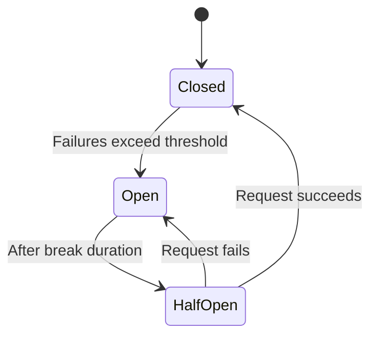

# How to Build HTTP Clients with Polly Retry in .NET

Author: [nawazdhandala](https://www.github.com/nawazdhandala)

Tags: .NET, C#, Polly, HTTP Client, Retry, Resilience, Circuit Breaker, API

Description: Learn how to build resilient HTTP clients in .NET using Polly for retry policies, circuit breakers, and timeout handling. This guide covers practical patterns for handling transient failures in microservices.

---

Network requests fail. Services go down temporarily. Timeouts happen. Building resilient HTTP clients that can handle these transient failures is essential for production applications. Polly is the go-to library in .NET for implementing retry policies, circuit breakers, and other resilience patterns.

This guide covers how to configure `HttpClient` with Polly policies to build HTTP clients that gracefully handle failures and recover automatically.

## Setting Up Polly

First, add the required packages:

```bash
dotnet add package Microsoft.Extensions.Http.Polly
dotnet add package Polly.Extensions.Http
```

The `Microsoft.Extensions.Http.Polly` package integrates Polly with `IHttpClientFactory`, which is the recommended way to manage HTTP clients in .NET.

## Basic Retry Policy

Start with a simple retry policy that retries failed requests:

```csharp
// Program.cs
using Polly;
using Polly.Extensions.Http;

var builder = WebApplication.CreateBuilder(args);

// Configure HttpClient with retry policy
builder.Services.AddHttpClient("ExternalApi", client =>
{
    client.BaseAddress = new Uri("https://api.example.com");
    client.DefaultRequestHeaders.Add("Accept", "application/json");
    client.Timeout = TimeSpan.FromSeconds(30);
})
.AddTransientHttpErrorPolicy(policy =>
    policy.WaitAndRetryAsync(
        retryCount: 3,
        sleepDurationProvider: attempt => TimeSpan.FromSeconds(Math.Pow(2, attempt)),
        onRetry: (outcome, timespan, attempt, context) =>
        {
            Console.WriteLine($"Retry {attempt} after {timespan.TotalSeconds}s due to {outcome.Exception?.Message ?? outcome.Result.StatusCode.ToString()}");
        }));
```

The `AddTransientHttpErrorPolicy` method automatically handles:
- Network failures (HttpRequestException)
- HTTP 5xx server errors
- HTTP 408 Request Timeout

## Exponential Backoff with Jitter

Exponential backoff prevents overwhelming a recovering service. Adding jitter prevents the "thundering herd" problem where all clients retry at the same time:

```csharp
// Create a policy with exponential backoff and jitter
static IAsyncPolicy<HttpResponseMessage> GetRetryPolicy()
{
    // Use jitter to spread out retry attempts from multiple clients
    var jitter = new Random();

    return HttpPolicyExtensions
        .HandleTransientHttpError()
        .OrResult(msg => msg.StatusCode == System.Net.HttpStatusCode.TooManyRequests)
        .WaitAndRetryAsync(
            retryCount: 5,
            sleepDurationProvider: (attempt, outcome, context) =>
            {
                // Exponential backoff: 1s, 2s, 4s, 8s, 16s
                var baseDelay = TimeSpan.FromSeconds(Math.Pow(2, attempt - 1));

                // Add jitter: +/- 20% of the base delay
                var jitterMs = jitter.Next(0, (int)(baseDelay.TotalMilliseconds * 0.4))
                              - (baseDelay.TotalMilliseconds * 0.2);

                return baseDelay + TimeSpan.FromMilliseconds(jitterMs);
            },
            onRetryAsync: async (outcome, timespan, attempt, context) =>
            {
                // Log the retry attempt
                Console.WriteLine($"Retry {attempt}: waiting {timespan.TotalSeconds:F2}s");
                await Task.CompletedTask;
            });
}

// Register with HttpClient
builder.Services.AddHttpClient("ExternalApi")
    .AddPolicyHandler(GetRetryPolicy());
```

## Circuit Breaker Pattern

The circuit breaker prevents an application from repeatedly trying to execute an operation that is likely to fail:



Implement a circuit breaker:

```csharp
static IAsyncPolicy<HttpResponseMessage> GetCircuitBreakerPolicy()
{
    return HttpPolicyExtensions
        .HandleTransientHttpError()
        .CircuitBreakerAsync(
            handledEventsAllowedBeforeBreaking: 5,  // Open after 5 failures
            durationOfBreak: TimeSpan.FromSeconds(30),  // Stay open for 30s
            onBreak: (outcome, duration) =>
            {
                Console.WriteLine($"Circuit breaker opened for {duration.TotalSeconds}s");
            },
            onReset: () =>
            {
                Console.WriteLine("Circuit breaker reset");
            },
            onHalfOpen: () =>
            {
                Console.WriteLine("Circuit breaker half-open, testing...");
            });
}
```

## Combining Policies

Combine multiple policies using `PolicyWrap`. The order matters - policies wrap from right to left:

```csharp
public static class PollyPolicies
{
    public static IAsyncPolicy<HttpResponseMessage> GetCombinedPolicy(ILogger logger)
    {
        // Timeout policy - times out individual requests
        var timeoutPolicy = Policy.TimeoutAsync<HttpResponseMessage>(
            TimeSpan.FromSeconds(10),
            (context, timeout, task) =>
            {
                logger.LogWarning("Request timed out after {Timeout}s", timeout.TotalSeconds);
                return Task.CompletedTask;
            });

        // Retry policy with exponential backoff
        var retryPolicy = HttpPolicyExtensions
            .HandleTransientHttpError()
            .Or<TimeoutRejectedException>()  // Handle timeout as retryable
            .WaitAndRetryAsync(
                retryCount: 3,
                sleepDurationProvider: attempt => TimeSpan.FromSeconds(Math.Pow(2, attempt)),
                onRetry: (outcome, delay, attempt, context) =>
                {
                    logger.LogWarning(
                        "Retry {Attempt} after {Delay}s due to {Error}",
                        attempt, delay.TotalSeconds,
                        outcome.Exception?.Message ?? outcome.Result.StatusCode.ToString());
                });

        // Circuit breaker
        var circuitBreaker = HttpPolicyExtensions
            .HandleTransientHttpError()
            .Or<TimeoutRejectedException>()
            .CircuitBreakerAsync(
                handledEventsAllowedBeforeBreaking: 5,
                durationOfBreak: TimeSpan.FromSeconds(30),
                onBreak: (outcome, duration) =>
                {
                    logger.LogError("Circuit opened for {Duration}s", duration.TotalSeconds);
                },
                onReset: () => logger.LogInformation("Circuit reset"));

        // Combine: Timeout -> Retry -> Circuit Breaker
        // Execution order: Circuit Breaker checks first, then Retry, then Timeout
        return Policy.WrapAsync(circuitBreaker, retryPolicy, timeoutPolicy);
    }
}
```

Register the combined policy:

```csharp
builder.Services.AddHttpClient("ResilientApi", client =>
{
    client.BaseAddress = new Uri("https://api.example.com");
})
.AddPolicyHandler((services, request) =>
{
    var logger = services.GetRequiredService<ILogger<Program>>();
    return PollyPolicies.GetCombinedPolicy(logger);
});
```

## Typed HTTP Client with Polly

Create a strongly-typed HTTP client for cleaner code:

```csharp
public class ExternalApiClient
{
    private readonly HttpClient _httpClient;
    private readonly ILogger<ExternalApiClient> _logger;

    public ExternalApiClient(HttpClient httpClient, ILogger<ExternalApiClient> logger)
    {
        _httpClient = httpClient;
        _logger = logger;
    }

    public async Task<Product?> GetProductAsync(int id, CancellationToken cancellationToken = default)
    {
        try
        {
            var response = await _httpClient.GetAsync($"/products/{id}", cancellationToken);
            response.EnsureSuccessStatusCode();

            return await response.Content.ReadFromJsonAsync<Product>(cancellationToken: cancellationToken);
        }
        catch (HttpRequestException ex)
        {
            _logger.LogError(ex, "Failed to fetch product {ProductId}", id);
            throw;
        }
    }

    public async Task<IEnumerable<Product>> GetProductsAsync(CancellationToken cancellationToken = default)
    {
        var response = await _httpClient.GetAsync("/products", cancellationToken);
        response.EnsureSuccessStatusCode();

        return await response.Content.ReadFromJsonAsync<IEnumerable<Product>>(cancellationToken: cancellationToken)
               ?? Enumerable.Empty<Product>();
    }

    public async Task<Product> CreateProductAsync(ProductDto dto, CancellationToken cancellationToken = default)
    {
        var response = await _httpClient.PostAsJsonAsync("/products", dto, cancellationToken);
        response.EnsureSuccessStatusCode();

        return (await response.Content.ReadFromJsonAsync<Product>(cancellationToken: cancellationToken))!;
    }
}
```

Register the typed client with policies:

```csharp
builder.Services.AddHttpClient<ExternalApiClient>(client =>
{
    client.BaseAddress = new Uri(builder.Configuration["ExternalApi:BaseUrl"]!);
    client.DefaultRequestHeaders.Add("X-Api-Key", builder.Configuration["ExternalApi:ApiKey"]);
})
.AddTransientHttpErrorPolicy(p => p.WaitAndRetryAsync(3, attempt => TimeSpan.FromSeconds(Math.Pow(2, attempt))))
.AddTransientHttpErrorPolicy(p => p.CircuitBreakerAsync(5, TimeSpan.FromSeconds(30)));
```

## Handling Specific Status Codes

Sometimes you need to retry on specific status codes beyond the standard transient errors:

```csharp
static IAsyncPolicy<HttpResponseMessage> GetCustomRetryPolicy()
{
    return Policy
        .HandleResult<HttpResponseMessage>(response =>
        {
            // Retry on these status codes
            return response.StatusCode switch
            {
                HttpStatusCode.RequestTimeout => true,
                HttpStatusCode.BadGateway => true,
                HttpStatusCode.ServiceUnavailable => true,
                HttpStatusCode.GatewayTimeout => true,
                HttpStatusCode.TooManyRequests => true,  // Rate limiting
                _ => false
            };
        })
        .Or<HttpRequestException>()
        .WaitAndRetryAsync(
            retryCount: 3,
            sleepDurationProvider: (attempt, response, context) =>
            {
                // Check for Retry-After header
                if (response.Result?.Headers.RetryAfter?.Delta != null)
                {
                    return response.Result.Headers.RetryAfter.Delta.Value;
                }

                // Default exponential backoff
                return TimeSpan.FromSeconds(Math.Pow(2, attempt));
            },
            onRetryAsync: async (outcome, delay, attempt, context) =>
            {
                Console.WriteLine($"Retry {attempt}: waiting {delay.TotalSeconds}s");
                await Task.CompletedTask;
            });
}
```

## Bulkhead Isolation

The bulkhead pattern limits the number of concurrent requests to prevent resource exhaustion:

```csharp
public static class PollyPolicies
{
    public static IAsyncPolicy<HttpResponseMessage> GetBulkheadPolicy()
    {
        return Policy.BulkheadAsync<HttpResponseMessage>(
            maxParallelization: 10,  // Max concurrent executions
            maxQueuingActions: 20,   // Max queued requests
            onBulkheadRejectedAsync: context =>
            {
                Console.WriteLine("Bulkhead rejected request - too many concurrent calls");
                return Task.CompletedTask;
            });
    }

    public static IAsyncPolicy<HttpResponseMessage> GetFullResiliencePolicy(ILogger logger)
    {
        var bulkhead = GetBulkheadPolicy();
        var circuitBreaker = GetCircuitBreakerPolicy();
        var retry = GetRetryPolicy();
        var timeout = Policy.TimeoutAsync<HttpResponseMessage>(TimeSpan.FromSeconds(10));

        // Order: Bulkhead -> Circuit Breaker -> Retry -> Timeout
        return Policy.WrapAsync(bulkhead, circuitBreaker, retry, timeout);
    }
}
```

## Testing Policies

Test your policies to ensure they behave correctly:

```csharp
public class PollyPoliciesTests
{
    [Fact]
    public async Task RetryPolicy_RetriesOnTransientError()
    {
        // Arrange
        var retryCount = 0;
        var policy = HttpPolicyExtensions
            .HandleTransientHttpError()
            .RetryAsync(3, (_, _) => retryCount++);

        var mockHandler = new MockHttpMessageHandler(request =>
        {
            // Fail first 2 attempts, succeed on 3rd
            if (retryCount < 2)
                return new HttpResponseMessage(HttpStatusCode.ServiceUnavailable);

            return new HttpResponseMessage(HttpStatusCode.OK);
        });

        var client = new HttpClient(mockHandler);

        // Act
        var response = await policy.ExecuteAsync(() =>
            client.GetAsync("http://test.com"));

        // Assert
        Assert.Equal(HttpStatusCode.OK, response.StatusCode);
        Assert.Equal(2, retryCount);
    }

    [Fact]
    public async Task CircuitBreaker_OpensAfterFailures()
    {
        // Arrange
        var circuitBreaker = HttpPolicyExtensions
            .HandleTransientHttpError()
            .CircuitBreakerAsync(2, TimeSpan.FromSeconds(30));

        var mockHandler = new MockHttpMessageHandler(_ =>
            new HttpResponseMessage(HttpStatusCode.ServiceUnavailable));

        var client = new HttpClient(mockHandler);

        // Act & Assert
        // First two failures should be allowed
        await Assert.ThrowsAsync<HttpRequestException>(() =>
            circuitBreaker.ExecuteAsync(() => client.GetAsync("http://test.com")));

        await Assert.ThrowsAsync<HttpRequestException>(() =>
            circuitBreaker.ExecuteAsync(() => client.GetAsync("http://test.com")));

        // Third attempt should throw BrokenCircuitException
        await Assert.ThrowsAsync<BrokenCircuitException>(() =>
            circuitBreaker.ExecuteAsync(() => client.GetAsync("http://test.com")));
    }
}

// Simple mock handler for testing
public class MockHttpMessageHandler : HttpMessageHandler
{
    private readonly Func<HttpRequestMessage, HttpResponseMessage> _handler;

    public MockHttpMessageHandler(Func<HttpRequestMessage, HttpResponseMessage> handler)
    {
        _handler = handler;
    }

    protected override Task<HttpResponseMessage> SendAsync(
        HttpRequestMessage request, CancellationToken cancellationToken)
    {
        return Task.FromResult(_handler(request));
    }
}
```

## Monitoring and Observability

Add telemetry to track policy behavior:

```csharp
public class PolicyMetrics
{
    private readonly ILogger<PolicyMetrics> _logger;
    private int _retryCount;
    private int _circuitBreakerOpenCount;
    private int _bulkheadRejectionCount;

    public PolicyMetrics(ILogger<PolicyMetrics> logger)
    {
        _logger = logger;
    }

    public void RecordRetry(string clientName, int attempt, TimeSpan delay)
    {
        Interlocked.Increment(ref _retryCount);
        _logger.LogWarning(
            "HTTP client {Client} retry {Attempt}, delay {Delay}ms",
            clientName, attempt, delay.TotalMilliseconds);
    }

    public void RecordCircuitBreakerOpen(string clientName, TimeSpan duration)
    {
        Interlocked.Increment(ref _circuitBreakerOpenCount);
        _logger.LogError(
            "HTTP client {Client} circuit breaker opened for {Duration}s",
            clientName, duration.TotalSeconds);
    }

    public void RecordBulkheadRejection(string clientName)
    {
        Interlocked.Increment(ref _bulkheadRejectionCount);
        _logger.LogWarning("HTTP client {Client} bulkhead rejected request", clientName);
    }

    public (int Retries, int CircuitOpens, int BulkheadRejections) GetMetrics()
    {
        return (_retryCount, _circuitBreakerOpenCount, _bulkheadRejectionCount);
    }
}
```

## Best Practices

When implementing Polly policies, follow these guidelines:

1. **Start simple** - Begin with basic retry and add complexity as needed
2. **Always use circuit breakers** - Prevent cascading failures in distributed systems
3. **Add jitter to retries** - Avoid thundering herd problems
4. **Respect Retry-After headers** - Follow server guidance on when to retry
5. **Set reasonable timeouts** - Prevent requests from hanging indefinitely
6. **Monitor policy behavior** - Track retry counts and circuit breaker states
7. **Test failure scenarios** - Verify policies work as expected

## Summary

| Policy | Purpose | When to Use |
|--------|---------|-------------|
| **Retry** | Retry failed requests | Transient network errors |
| **Circuit Breaker** | Stop requests to failing services | Prevent cascading failures |
| **Timeout** | Limit request duration | Prevent hanging requests |
| **Bulkhead** | Limit concurrent requests | Prevent resource exhaustion |

Polly makes it straightforward to build resilient HTTP clients in .NET. By combining retry policies, circuit breakers, and timeouts, you can build applications that gracefully handle transient failures and recover automatically when services become available again.

Start with the basics - a retry policy with exponential backoff and a circuit breaker. Add bulkheads and more advanced patterns as your system grows and you better understand your failure modes.
