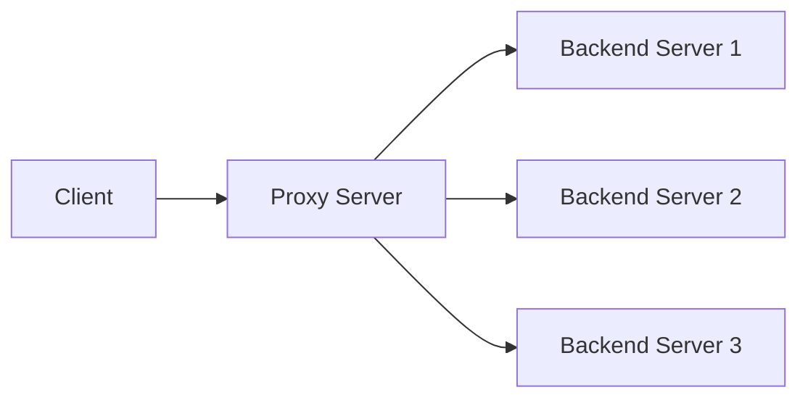

# How to Build an HTTP Proxy with aiohttp in Python

Author: [nawazdhandala](https://www.github.com/nawazdhandala)

Tags: Python, aiohttp, HTTP Proxy, Reverse Proxy, Networking, asyncio, API Gateway

Description: Learn how to build an HTTP proxy server in Python using aiohttp. This guide covers forward proxies, reverse proxies, request modification, caching, and patterns for building API gateways.

---

> HTTP proxies sit between clients and servers, intercepting and forwarding requests. They enable caching, load balancing, security filtering, and request transformation. Building your own proxy gives you complete control over how traffic flows through your system.

aiohttp provides both client and server capabilities, making it perfect for building proxies. Its async nature handles thousands of concurrent connections efficiently.

---

## Proxy Architecture



The proxy receives requests from clients, optionally modifies them, forwards them to backend servers, and returns the responses. This simple concept enables powerful patterns.

---

## Basic Forward Proxy

A forward proxy forwards client requests to any destination server. Here is a minimal implementation:

```python
# forward_proxy.py
from aiohttp import web, ClientSession, ClientTimeout
import logging

logging.basicConfig(level=logging.INFO)
logger = logging.getLogger(__name__)

# Headers that should not be forwarded
HOP_BY_HOP_HEADERS = {
    'connection',
    'keep-alive',
    'proxy-authenticate',
    'proxy-authorization',
    'te',
    'trailers',
    'transfer-encoding',
    'upgrade',
}


class ForwardProxy:
    """Simple HTTP forward proxy"""

    def __init__(self, timeout: float = 30.0):
        self.timeout = ClientTimeout(total=timeout)
        self.session: ClientSession = None

    async def start(self, app: web.Application) -> None:
        """Initialize client session on startup"""
        self.session = ClientSession(timeout=self.timeout)

    async def stop(self, app: web.Application) -> None:
        """Close client session on shutdown"""
        if self.session:
            await self.session.close()

    async def handle_request(self, request: web.Request) -> web.Response:
        """Forward request to target server"""
        # Get target URL from the request
        target_url = request.query.get('url')

        if not target_url:
            return web.json_response(
                {'error': 'Missing url parameter'},
                status=400
            )

        logger.info(f"Proxying request to: {target_url}")

        # Build headers, filtering out hop-by-hop headers
        headers = {
            key: value
            for key, value in request.headers.items()
            if key.lower() not in HOP_BY_HOP_HEADERS
        }

        # Read request body if present
        body = await request.read() if request.body_exists else None

        try:
            # Forward the request
            async with self.session.request(
                method=request.method,
                url=target_url,
                headers=headers,
                data=body,
                allow_redirects=False  # Let client handle redirects
            ) as response:
                # Build response headers
                response_headers = {
                    key: value
                    for key, value in response.headers.items()
                    if key.lower() not in HOP_BY_HOP_HEADERS
                }

                # Read response body
                response_body = await response.read()

                return web.Response(
                    status=response.status,
                    headers=response_headers,
                    body=response_body
                )

        except Exception as e:
            logger.error(f"Proxy error: {e}")
            return web.json_response(
                {'error': str(e)},
                status=502  # Bad Gateway
            )


def create_app() -> web.Application:
    """Create the proxy application"""
    proxy = ForwardProxy()

    app = web.Application()
    app.on_startup.append(proxy.start)
    app.on_cleanup.append(proxy.stop)

    # Handle all methods on all paths
    app.router.add_route('*', '/{path:.*}', proxy.handle_request)

    return app


if __name__ == '__main__':
    app = create_app()
    web.run_app(app, host='0.0.0.0', port=8080)
```

---

## Reverse Proxy with Load Balancing

A reverse proxy hides backend servers from clients. Add load balancing to distribute traffic:

```python
# reverse_proxy.py
from aiohttp import web, ClientSession, ClientTimeout
from dataclasses import dataclass, field
from typing import List, Dict, Optional
import asyncio
import random
import logging

logger = logging.getLogger(__name__)


@dataclass
class Backend:
    """Represents a backend server"""
    url: str
    weight: int = 1
    healthy: bool = True
    consecutive_failures: int = 0
    max_failures: int = 3


class LoadBalancer:
    """Load balancer for backend selection"""

    def __init__(self, backends: List[Backend]):
        self.backends = backends
        self._lock = asyncio.Lock()

    def get_healthy_backends(self) -> List[Backend]:
        """Get list of healthy backends"""
        return [b for b in self.backends if b.healthy]

    def select_backend(self) -> Optional[Backend]:
        """Select a backend using weighted random selection"""
        healthy = self.get_healthy_backends()
        if not healthy:
            return None

        # Weighted random selection
        total_weight = sum(b.weight for b in healthy)
        r = random.uniform(0, total_weight)

        current = 0
        for backend in healthy:
            current += backend.weight
            if r <= current:
                return backend

        return healthy[-1]  # Fallback

    async def mark_unhealthy(self, backend: Backend) -> None:
        """Mark a backend as unhealthy after failures"""
        async with self._lock:
            backend.consecutive_failures += 1
            if backend.consecutive_failures >= backend.max_failures:
                backend.healthy = False
                logger.warning(f"Backend {backend.url} marked unhealthy")

    async def mark_healthy(self, backend: Backend) -> None:
        """Mark a backend as healthy after success"""
        async with self._lock:
            backend.consecutive_failures = 0
            if not backend.healthy:
                backend.healthy = True
                logger.info(f"Backend {backend.url} recovered")


class ReverseProxy:
    """Reverse proxy with load balancing and health checking"""

    def __init__(
        self,
        backends: List[str],
        timeout: float = 30.0,
        health_check_interval: float = 10.0
    ):
        self.load_balancer = LoadBalancer([
            Backend(url=url) for url in backends
        ])
        self.timeout = ClientTimeout(total=timeout)
        self.health_check_interval = health_check_interval
        self.session: ClientSession = None
        self._health_check_task: asyncio.Task = None

    async def start(self, app: web.Application) -> None:
        """Initialize proxy on startup"""
        self.session = ClientSession(timeout=self.timeout)
        # Start health checking
        self._health_check_task = asyncio.create_task(
            self._health_check_loop()
        )

    async def stop(self, app: web.Application) -> None:
        """Cleanup on shutdown"""
        if self._health_check_task:
            self._health_check_task.cancel()
            try:
                await self._health_check_task
            except asyncio.CancelledError:
                pass
        if self.session:
            await self.session.close()

    async def _health_check_loop(self) -> None:
        """Periodically check backend health"""
        while True:
            try:
                await asyncio.sleep(self.health_check_interval)
                await self._check_all_backends()
            except asyncio.CancelledError:
                break
            except Exception as e:
                logger.error(f"Health check error: {e}")

    async def _check_all_backends(self) -> None:
        """Check health of all backends"""
        for backend in self.load_balancer.backends:
            try:
                async with self.session.get(
                    f"{backend.url}/health",
                    timeout=ClientTimeout(total=5.0)
                ) as response:
                    if response.status == 200:
                        await self.load_balancer.mark_healthy(backend)
                    else:
                        await self.load_balancer.mark_unhealthy(backend)
            except Exception:
                await self.load_balancer.mark_unhealthy(backend)

    async def handle_request(self, request: web.Request) -> web.Response:
        """Forward request to a backend server"""
        backend = self.load_balancer.select_backend()

        if not backend:
            return web.json_response(
                {'error': 'No healthy backends available'},
                status=503
            )

        # Build target URL
        target_url = f"{backend.url}{request.path}"
        if request.query_string:
            target_url += f"?{request.query_string}"

        logger.info(f"Forwarding to {target_url}")

        # Filter headers
        headers = {
            key: value
            for key, value in request.headers.items()
            if key.lower() not in HOP_BY_HOP_HEADERS
        }
        # Add forwarding headers
        headers['X-Forwarded-For'] = request.remote or ''
        headers['X-Forwarded-Proto'] = request.scheme
        headers['X-Forwarded-Host'] = request.host

        body = await request.read() if request.body_exists else None

        try:
            async with self.session.request(
                method=request.method,
                url=target_url,
                headers=headers,
                data=body,
                allow_redirects=False
            ) as response:
                await self.load_balancer.mark_healthy(backend)

                response_headers = {
                    key: value
                    for key, value in response.headers.items()
                    if key.lower() not in HOP_BY_HOP_HEADERS
                }
                response_body = await response.read()

                return web.Response(
                    status=response.status,
                    headers=response_headers,
                    body=response_body
                )

        except Exception as e:
            await self.load_balancer.mark_unhealthy(backend)
            logger.error(f"Backend error: {e}")
            return web.json_response(
                {'error': 'Backend unavailable'},
                status=502
            )


HOP_BY_HOP_HEADERS = {
    'connection', 'keep-alive', 'proxy-authenticate',
    'proxy-authorization', 'te', 'trailers',
    'transfer-encoding', 'upgrade'
}


def create_reverse_proxy(backends: List[str]) -> web.Application:
    """Create reverse proxy application"""
    proxy = ReverseProxy(backends)

    app = web.Application()
    app.on_startup.append(proxy.start)
    app.on_cleanup.append(proxy.stop)
    app.router.add_route('*', '/{path:.*}', proxy.handle_request)

    return app


if __name__ == '__main__':
    backends = [
        'http://localhost:8001',
        'http://localhost:8002',
        'http://localhost:8003',
    ]
    app = create_reverse_proxy(backends)
    web.run_app(app, host='0.0.0.0', port=8080)
```

---

## Request and Response Modification

Proxies often need to modify requests and responses. Here is a middleware pattern:

```python
# middleware_proxy.py
from aiohttp import web, ClientSession
from typing import Callable, Awaitable, Dict, Any
from dataclasses import dataclass
import json
import logging

logger = logging.getLogger(__name__)

# Type alias for middleware functions
RequestMiddleware = Callable[[web.Request, Dict], Awaitable[Dict]]
ResponseMiddleware = Callable[[web.Response, Dict], Awaitable[web.Response]]


@dataclass
class ProxyConfig:
    """Configuration for the proxy"""
    target_url: str
    timeout: float = 30.0
    add_request_headers: Dict[str, str] = None
    add_response_headers: Dict[str, str] = None
    strip_request_headers: List[str] = None
    strip_response_headers: List[str] = None


class MiddlewareProxy:
    """Proxy with request/response middleware support"""

    def __init__(self, config: ProxyConfig):
        self.config = config
        self.session: ClientSession = None
        self._request_middlewares: List[RequestMiddleware] = []
        self._response_middlewares: List[ResponseMiddleware] = []

    def add_request_middleware(self, middleware: RequestMiddleware) -> None:
        """Add a request modification middleware"""
        self._request_middlewares.append(middleware)

    def add_response_middleware(self, middleware: ResponseMiddleware) -> None:
        """Add a response modification middleware"""
        self._response_middlewares.append(middleware)

    async def start(self, app: web.Application) -> None:
        self.session = ClientSession()

    async def stop(self, app: web.Application) -> None:
        if self.session:
            await self.session.close()

    async def handle_request(self, request: web.Request) -> web.Response:
        """Process request through middleware chain and forward"""
        # Build initial request context
        context = {
            'method': request.method,
            'path': request.path,
            'query_string': request.query_string,
            'headers': dict(request.headers),
            'body': await request.read() if request.body_exists else None,
        }

        # Apply request middlewares
        for middleware in self._request_middlewares:
            context = await middleware(request, context)

        # Strip configured headers
        if self.config.strip_request_headers:
            for header in self.config.strip_request_headers:
                context['headers'].pop(header, None)

        # Add configured headers
        if self.config.add_request_headers:
            context['headers'].update(self.config.add_request_headers)

        # Build target URL
        target_url = f"{self.config.target_url}{context['path']}"
        if context['query_string']:
            target_url += f"?{context['query_string']}"

        try:
            async with self.session.request(
                method=context['method'],
                url=target_url,
                headers=context['headers'],
                data=context['body']
            ) as response:
                # Build response
                response_headers = dict(response.headers)
                response_body = await response.read()

                # Strip configured response headers
                if self.config.strip_response_headers:
                    for header in self.config.strip_response_headers:
                        response_headers.pop(header, None)

                # Add configured response headers
                if self.config.add_response_headers:
                    response_headers.update(self.config.add_response_headers)

                result = web.Response(
                    status=response.status,
                    headers=response_headers,
                    body=response_body
                )

                # Apply response middlewares
                for middleware in self._response_middlewares:
                    result = await middleware(result, context)

                return result

        except Exception as e:
            logger.error(f"Proxy error: {e}")
            return web.json_response({'error': str(e)}, status=502)


# Example middleware functions
async def add_correlation_id(request: web.Request, context: Dict) -> Dict:
    """Add a correlation ID to requests"""
    import uuid
    correlation_id = str(uuid.uuid4())
    context['headers']['X-Correlation-ID'] = correlation_id
    context['correlation_id'] = correlation_id
    return context


async def log_request(request: web.Request, context: Dict) -> Dict:
    """Log incoming requests"""
    logger.info(f"Request: {context['method']} {context['path']}")
    return context


async def transform_json_response(response: web.Response, context: Dict) -> web.Response:
    """Transform JSON responses by wrapping in envelope"""
    content_type = response.headers.get('Content-Type', '')

    if 'application/json' in content_type:
        try:
            body = json.loads(response.body)
            wrapped = {
                'data': body,
                'correlation_id': context.get('correlation_id'),
                'timestamp': datetime.utcnow().isoformat()
            }
            response.body = json.dumps(wrapped).encode()
        except json.JSONDecodeError:
            pass

    return response


# Usage
def create_middleware_proxy() -> web.Application:
    config = ProxyConfig(
        target_url='http://api.example.com',
        add_request_headers={'X-API-Key': 'secret-key'},
        add_response_headers={'X-Proxy': 'my-proxy'},
        strip_response_headers=['Server', 'X-Powered-By']
    )

    proxy = MiddlewareProxy(config)
    proxy.add_request_middleware(add_correlation_id)
    proxy.add_request_middleware(log_request)
    proxy.add_response_middleware(transform_json_response)

    app = web.Application()
    app.on_startup.append(proxy.start)
    app.on_cleanup.append(proxy.stop)
    app.router.add_route('*', '/{path:.*}', proxy.handle_request)

    return app
```

---

## Caching Proxy

Add caching to reduce backend load:

```python
# caching_proxy.py
from aiohttp import web, ClientSession
from dataclasses import dataclass
from typing import Optional, Dict
import hashlib
import time
import asyncio
import logging

logger = logging.getLogger(__name__)


@dataclass
class CacheEntry:
    """Cached response entry"""
    status: int
    headers: Dict[str, str]
    body: bytes
    created_at: float
    ttl: float

    def is_expired(self) -> bool:
        """Check if cache entry has expired"""
        return time.time() > (self.created_at + self.ttl)


class ResponseCache:
    """Simple in-memory response cache"""

    def __init__(self, max_size: int = 1000, default_ttl: float = 300.0):
        self._cache: Dict[str, CacheEntry] = {}
        self._max_size = max_size
        self._default_ttl = default_ttl
        self._lock = asyncio.Lock()

    def _make_key(self, method: str, url: str, headers: Dict) -> str:
        """Generate cache key from request"""
        # Include relevant headers in cache key
        vary_headers = ['Accept', 'Accept-Encoding', 'Authorization']
        header_str = '|'.join(
            f"{h}:{headers.get(h, '')}"
            for h in sorted(vary_headers)
        )
        key_str = f"{method}|{url}|{header_str}"
        return hashlib.sha256(key_str.encode()).hexdigest()

    async def get(
        self,
        method: str,
        url: str,
        headers: Dict
    ) -> Optional[CacheEntry]:
        """Get cached response if available and not expired"""
        key = self._make_key(method, url, headers)

        async with self._lock:
            entry = self._cache.get(key)
            if entry and not entry.is_expired():
                logger.debug(f"Cache hit: {url}")
                return entry
            elif entry:
                # Remove expired entry
                del self._cache[key]

        return None

    async def set(
        self,
        method: str,
        url: str,
        headers: Dict,
        response: CacheEntry
    ) -> None:
        """Cache a response"""
        key = self._make_key(method, url, headers)

        async with self._lock:
            # Evict oldest entries if at capacity
            if len(self._cache) >= self._max_size:
                oldest_key = min(
                    self._cache.keys(),
                    key=lambda k: self._cache[k].created_at
                )
                del self._cache[oldest_key]

            self._cache[key] = response
            logger.debug(f"Cached: {url}")

    async def clear(self) -> int:
        """Clear all cache entries"""
        async with self._lock:
            count = len(self._cache)
            self._cache.clear()
            return count


class CachingProxy:
    """HTTP proxy with response caching"""

    def __init__(
        self,
        target_url: str,
        cache_ttl: float = 300.0,
        cacheable_methods: set = None
    ):
        self.target_url = target_url
        self.cache = ResponseCache(default_ttl=cache_ttl)
        self.cacheable_methods = cacheable_methods or {'GET', 'HEAD'}
        self.session: ClientSession = None

    async def start(self, app: web.Application) -> None:
        self.session = ClientSession()

    async def stop(self, app: web.Application) -> None:
        if self.session:
            await self.session.close()

    def _is_cacheable(self, method: str, status: int, headers: Dict) -> bool:
        """Determine if response can be cached"""
        if method not in self.cacheable_methods:
            return False
        if status not in (200, 203, 204, 206, 300, 301, 404, 405, 410, 414, 501):
            return False
        # Respect Cache-Control headers
        cache_control = headers.get('Cache-Control', '')
        if 'no-store' in cache_control or 'private' in cache_control:
            return False
        return True

    def _get_ttl(self, headers: Dict) -> float:
        """Extract TTL from Cache-Control or use default"""
        cache_control = headers.get('Cache-Control', '')

        # Look for max-age directive
        for directive in cache_control.split(','):
            directive = directive.strip()
            if directive.startswith('max-age='):
                try:
                    return float(directive.split('=')[1])
                except (ValueError, IndexError):
                    pass

        return self.cache._default_ttl

    async def handle_request(self, request: web.Request) -> web.Response:
        """Handle request with caching"""
        target_url = f"{self.target_url}{request.path}"
        if request.query_string:
            target_url += f"?{request.query_string}"

        # Check cache for cacheable requests
        if request.method in self.cacheable_methods:
            cached = await self.cache.get(
                request.method,
                target_url,
                dict(request.headers)
            )
            if cached:
                return web.Response(
                    status=cached.status,
                    headers=cached.headers,
                    body=cached.body
                )

        # Forward request
        headers = dict(request.headers)
        body = await request.read() if request.body_exists else None

        try:
            async with self.session.request(
                method=request.method,
                url=target_url,
                headers=headers,
                data=body
            ) as response:
                response_headers = dict(response.headers)
                response_body = await response.read()

                # Cache if appropriate
                if self._is_cacheable(
                    request.method,
                    response.status,
                    response_headers
                ):
                    ttl = self._get_ttl(response_headers)
                    entry = CacheEntry(
                        status=response.status,
                        headers=response_headers,
                        body=response_body,
                        created_at=time.time(),
                        ttl=ttl
                    )
                    await self.cache.set(
                        request.method,
                        target_url,
                        dict(request.headers),
                        entry
                    )

                return web.Response(
                    status=response.status,
                    headers=response_headers,
                    body=response_body
                )

        except Exception as e:
            logger.error(f"Proxy error: {e}")
            return web.json_response({'error': str(e)}, status=502)
```

---

## Rate Limiting

Protect backends from excessive traffic:

```python
# rate_limiting.py
from aiohttp import web
from dataclasses import dataclass
from typing import Dict
import time
import asyncio

@dataclass
class RateLimitState:
    """Track rate limit state for a client"""
    tokens: float
    last_update: float


class RateLimiter:
    """Token bucket rate limiter"""

    def __init__(
        self,
        rate: float = 10.0,  # Requests per second
        burst: int = 20      # Max burst size
    ):
        self.rate = rate
        self.burst = burst
        self._state: Dict[str, RateLimitState] = {}
        self._lock = asyncio.Lock()

    async def is_allowed(self, client_id: str) -> bool:
        """Check if request is allowed under rate limit"""
        async with self._lock:
            now = time.time()

            if client_id not in self._state:
                self._state[client_id] = RateLimitState(
                    tokens=self.burst,
                    last_update=now
                )

            state = self._state[client_id]

            # Refill tokens based on elapsed time
            elapsed = now - state.last_update
            state.tokens = min(
                self.burst,
                state.tokens + (elapsed * self.rate)
            )
            state.last_update = now

            if state.tokens >= 1.0:
                state.tokens -= 1.0
                return True

            return False

    def get_retry_after(self, client_id: str) -> float:
        """Get seconds until next request is allowed"""
        state = self._state.get(client_id)
        if not state:
            return 0
        tokens_needed = 1.0 - state.tokens
        return tokens_needed / self.rate


@web.middleware
async def rate_limit_middleware(request: web.Request, handler):
    """Middleware to enforce rate limits"""
    limiter: RateLimiter = request.app['rate_limiter']

    # Use client IP as identifier
    client_id = request.remote or 'unknown'

    if not await limiter.is_allowed(client_id):
        retry_after = limiter.get_retry_after(client_id)
        return web.json_response(
            {'error': 'Rate limit exceeded'},
            status=429,
            headers={'Retry-After': str(int(retry_after) + 1)}
        )

    return await handler(request)
```

---

## Conclusion

Building an HTTP proxy with aiohttp gives you fine-grained control over traffic flow. Key capabilities include:

- **Forward proxy**: Route client requests to external servers
- **Reverse proxy**: Hide and load balance backend servers
- **Request/response modification**: Transform traffic as it passes through
- **Caching**: Reduce backend load by caching responses
- **Rate limiting**: Protect backends from traffic spikes

These patterns form the foundation of API gateways and service meshes. For production deployments, consider adding TLS termination, circuit breakers, and metrics collection.

---

*Need to monitor your proxy and API gateway? [OneUptime](https://oneuptime.com) provides request tracing, latency monitoring, and error tracking to help you understand traffic patterns.*

**Related Reading:**
- [How to Implement Retry Logic with Exponential Backoff in Python](https://oneuptime.com/blog/post/2025-01-06-python-retry-exponential-backoff/view)
