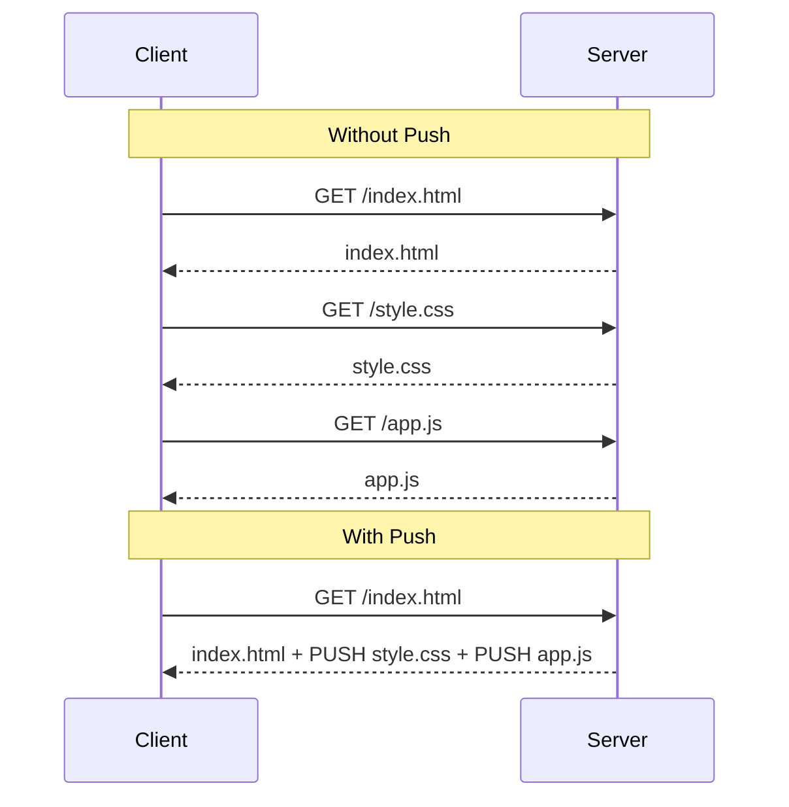
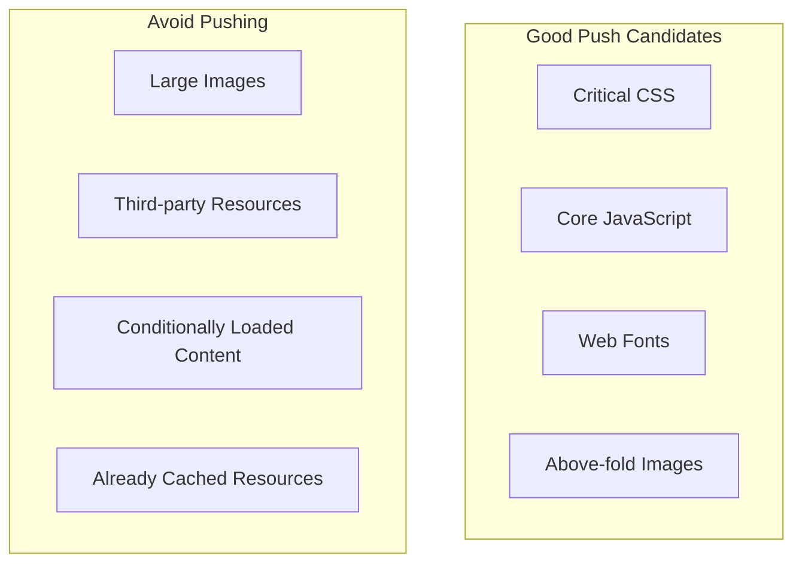

# How to Configure HTTP/2 Server Push

Author: [nawazdhandala](https://www.github.com/nawazdhandala)

Tags: HTTP/2, Performance, Web, Nginx, Networking, Server Push

Description: A practical guide to implementing HTTP/2 Server Push for improved web performance, covering configuration in Nginx, Node.js, and best practices for pushing critical resources.

---

HTTP/2 Server Push allows servers to send resources to clients before they request them. When the server knows the client will need certain files, it can push them proactively, eliminating round-trip latency. This guide covers how to implement server push effectively.

## Understanding HTTP/2 Push



## Nginx HTTP/2 Push Configuration

### Basic Push Setup

```nginx
# /etc/nginx/sites-available/example.conf

server {
    listen 443 ssl http2;
    server_name example.com;

    ssl_certificate /etc/ssl/certs/example.com.crt;
    ssl_certificate_key /etc/ssl/private/example.com.key;

    root /var/www/html;

    location = / {
        # Push critical resources when serving index.html
        http2_push /css/critical.css;
        http2_push /js/app.js;
        http2_push /fonts/main.woff2;

        try_files /index.html =404;
    }

    # Serve pushed resources normally
    location /css/ {
        expires 1y;
        add_header Cache-Control "public, immutable";
    }

    location /js/ {
        expires 1y;
        add_header Cache-Control "public, immutable";
    }
}
```

### Conditional Push Based on Cookies

Avoid pushing resources that are already cached in the browser.

```nginx
server {
    listen 443 ssl http2;
    server_name example.com;

    # Map to check if resources were already pushed
    map $http_cookie $push_resources {
        "~*resources_loaded=1"  "";
        default                 "yes";
    }

    location = / {
        # Only push if cookie indicates first visit
        if ($push_resources = "yes") {
            http2_push /css/critical.css;
            http2_push /js/vendor.js;
            http2_push /js/app.js;
        }

        # Set cookie after first load
        add_header Set-Cookie "resources_loaded=1; Path=/; Max-Age=86400";

        try_files /index.html =404;
    }
}
```

### Push Preload Directives

Use Link headers to trigger push from upstream applications.

```nginx
server {
    listen 443 ssl http2;
    server_name api.example.com;

    location / {
        proxy_pass http://backend;

        # Automatically push resources specified in Link headers
        http2_push_preload on;
    }
}
```

## Node.js HTTP/2 Push

### Native HTTP/2 Server with Push

```javascript
const http2 = require('http2');
const fs = require('fs');
const path = require('path');
const mime = require('mime-types');

const server = http2.createSecureServer({
    key: fs.readFileSync('server.key'),
    cert: fs.readFileSync('server.crt')
});

// Resources to push with the main page
const PUSH_RESOURCES = [
    '/css/critical.css',
    '/js/app.js',
    '/images/logo.png'
];

server.on('stream', (stream, headers) => {
    const reqPath = headers[':path'];

    if (reqPath === '/' || reqPath === '/index.html') {
        // Push critical resources first
        PUSH_RESOURCES.forEach(resource => {
            pushResource(stream, resource);
        });

        // Then send the main page
        sendFile(stream, '/index.html');
    } else {
        sendFile(stream, reqPath);
    }
});

function pushResource(parentStream, filePath) {
    const fullPath = path.join(__dirname, 'public', filePath);

    // Check if file exists before pushing
    if (!fs.existsSync(fullPath)) {
        console.warn(`Push resource not found: ${filePath}`);
        return;
    }

    // Initiate server push
    parentStream.pushStream({ ':path': filePath }, (err, pushStream) => {
        if (err) {
            console.error(`Push failed for ${filePath}:`, err);
            return;
        }

        const contentType = mime.lookup(filePath) || 'application/octet-stream';
        const fileContent = fs.readFileSync(fullPath);

        pushStream.respond({
            ':status': 200,
            'content-type': contentType,
            'content-length': fileContent.length,
            'cache-control': 'public, max-age=31536000'
        });

        pushStream.end(fileContent);
        console.log(`Pushed: ${filePath}`);
    });
}

function sendFile(stream, filePath) {
    const fullPath = path.join(__dirname, 'public',
        filePath === '/' ? '/index.html' : filePath);

    if (!fs.existsSync(fullPath)) {
        stream.respond({ ':status': 404 });
        stream.end('Not Found');
        return;
    }

    const contentType = mime.lookup(filePath) || 'text/html';
    const fileContent = fs.readFileSync(fullPath);

    stream.respond({
        ':status': 200,
        'content-type': contentType,
        'content-length': fileContent.length
    });

    stream.end(fileContent);
}

server.listen(443, () => {
    console.log('HTTP/2 server running on https://localhost:443');
});
```

### Express with HTTP/2 Push

```javascript
const express = require('express');
const spdy = require('spdy');  // HTTP/2 support for Express
const fs = require('fs');
const path = require('path');

const app = express();

// Middleware to handle server push
app.use((req, res, next) => {
    // Store push function on response object
    res.push = (filePath, options = {}) => {
        if (!res.push || typeof res.push !== 'function') {
            return;  // Push not supported
        }

        const stream = res.push(filePath, {
            request: { accept: '*/*' },
            response: {
                'content-type': options.contentType || 'text/plain',
                'cache-control': 'public, max-age=31536000'
            }
        });

        stream.on('error', err => {
            console.warn(`Push error for ${filePath}:`, err.message);
        });

        const fullPath = path.join(__dirname, 'public', filePath);
        fs.createReadStream(fullPath).pipe(stream);
    };

    next();
});

// Main route with push
app.get('/', (req, res) => {
    // Check for push support and avoid re-pushing
    const acceptPush = !req.cookies?.resourcesPushed;

    if (acceptPush && res.push) {
        res.push('/css/styles.css', { contentType: 'text/css' });
        res.push('/js/main.js', { contentType: 'application/javascript' });
        res.push('/images/hero.webp', { contentType: 'image/webp' });

        res.cookie('resourcesPushed', '1', { maxAge: 86400000 });
    }

    res.sendFile(path.join(__dirname, 'public', 'index.html'));
});

// Static files
app.use(express.static('public'));

// Start HTTP/2 server
const options = {
    key: fs.readFileSync('server.key'),
    cert: fs.readFileSync('server.crt')
};

spdy.createServer(options, app).listen(443, () => {
    console.log('Server running on https://localhost:443');
});
```

## Go HTTP/2 Push

```go
package main

import (
    "log"
    "net/http"
    "path/filepath"
)

var pushResources = []string{
    "/css/styles.css",
    "/js/app.js",
    "/images/logo.svg",
}

func indexHandler(w http.ResponseWriter, r *http.Request) {
    // Check if push is supported
    pusher, ok := w.(http.Pusher)
    if ok {
        // Push critical resources
        for _, resource := range pushResources {
            opts := &http.PushOptions{
                Header: http.Header{
                    "Cache-Control": []string{"public, max-age=31536000"},
                },
            }

            if err := pusher.Push(resource, opts); err != nil {
                log.Printf("Push failed for %s: %v", resource, err)
            } else {
                log.Printf("Pushed: %s", resource)
            }
        }
    }

    // Serve the main page
    http.ServeFile(w, r, filepath.Join("public", "index.html"))
}

func main() {
    // Serve static files
    fs := http.FileServer(http.Dir("public"))
    http.Handle("/css/", fs)
    http.Handle("/js/", fs)
    http.Handle("/images/", fs)

    // Main page with push
    http.HandleFunc("/", indexHandler)

    // Start HTTPS server (HTTP/2 requires TLS)
    log.Println("Server starting on https://localhost:443")
    err := http.ListenAndServeTLS(":443", "server.crt", "server.key", nil)
    if err != nil {
        log.Fatal(err)
    }
}
```

## Best Practices for HTTP/2 Push

### What to Push



### Push Budget Calculation

```javascript
// Calculate optimal push budget
const PUSH_BUDGET_KB = 50;  // Conservative limit

const resources = [
    { path: '/css/critical.css', size: 15 },
    { path: '/js/runtime.js', size: 8 },
    { path: '/js/vendor.js', size: 45 },
    { path: '/js/app.js', size: 25 },
    { path: '/fonts/main.woff2', size: 18 }
];

function selectResourcesToPush(resources, budgetKb) {
    let totalSize = 0;
    const selected = [];

    // Sort by priority (CSS first, then JS, then fonts)
    const sorted = resources.sort((a, b) => {
        const priority = { css: 0, js: 1, fonts: 2 };
        const getType = path => {
            if (path.includes('/css/')) return 'css';
            if (path.includes('/js/')) return 'js';
            return 'fonts';
        };
        return priority[getType(a.path)] - priority[getType(b.path)];
    });

    for (const resource of sorted) {
        if (totalSize + resource.size <= budgetKb) {
            selected.push(resource.path);
            totalSize += resource.size;
        }
    }

    console.log(`Pushing ${selected.length} resources (${totalSize}KB)`);
    return selected;
}

const toPush = selectResourcesToPush(resources, PUSH_BUDGET_KB);
// Output: Pushing 3 resources (41KB)
// ['/css/critical.css', '/js/runtime.js', '/fonts/main.woff2']
```

## Using Link Headers for Push

Instead of hardcoding push resources, use Link headers for flexibility.

### Application Sending Link Headers

```python
# Flask example
from flask import Flask, make_response

app = Flask(__name__)

@app.route('/')
def index():
    response = make_response(render_template('index.html'))

    # Add Link headers for resources to push
    push_resources = [
        '</css/critical.css>; rel=preload; as=style',
        '</js/app.js>; rel=preload; as=script',
        '</fonts/main.woff2>; rel=preload; as=font; crossorigin'
    ]

    response.headers['Link'] = ', '.join(push_resources)
    return response
```

### Nginx Processing Link Headers

```nginx
server {
    listen 443 ssl http2;

    location / {
        proxy_pass http://backend;

        # Parse Link headers and push resources
        http2_push_preload on;
    }
}
```

## Monitoring Push Effectiveness

```javascript
// Browser-side monitoring of pushed resources
if ('performance' in window) {
    window.addEventListener('load', () => {
        const entries = performance.getEntriesByType('resource');

        entries.forEach(entry => {
            // Check if resource was pushed
            const wasPushed = entry.transferSize === 0 &&
                              entry.encodedBodySize > 0 &&
                              entry.deliveryType === 'cache';

            console.log({
                name: entry.name,
                initiatorType: entry.initiatorType,
                transferSize: entry.transferSize,
                wasPushed: wasPushed,
                startTime: entry.startTime
            });
        });
    });
}
```

## Caveats and Considerations

### When Push Can Hurt Performance

1. **Already cached resources**: Wasted bandwidth
2. **Resources on different origins**: Cannot push cross-origin
3. **Large resources**: Blocks more important content
4. **Slow connections**: May delay critical content

### Push vs Preload

```html
<!-- Preload hint (client requests, not server push) -->
<link rel="preload" href="/css/styles.css" as="style">

<!-- Early hints (103 response, different from push) -->
<!-- Server sends 103 Early Hints before 200 response -->
```

### Testing Push

```bash
# Check if resources are being pushed using nghttp
nghttp -v https://example.com 2>&1 | grep "push"

# Using curl with HTTP/2
curl -v --http2 https://example.com 2>&1 | grep -i push

# Chrome DevTools
# Network tab > Protocol column > Look for "h2"
# Initiator column shows "Push" for pushed resources
```

## Deprecation Notice

HTTP/2 Push has been deprecated in Chrome (removed in Chrome 106) due to low adoption and complexity. Modern alternatives include:

- **103 Early Hints**: Sends preload hints before main response
- **Preload headers**: Client-initiated but still eliminates discovery delay
- **Service Workers**: Cache resources proactively

Consider these alternatives for new projects while maintaining push support for legacy clients.

---

HTTP/2 Push can improve performance when used correctly, but it requires careful consideration of what to push and when. Monitor your push effectiveness and be ready to fall back to preload hints for browsers that have deprecated push support.
