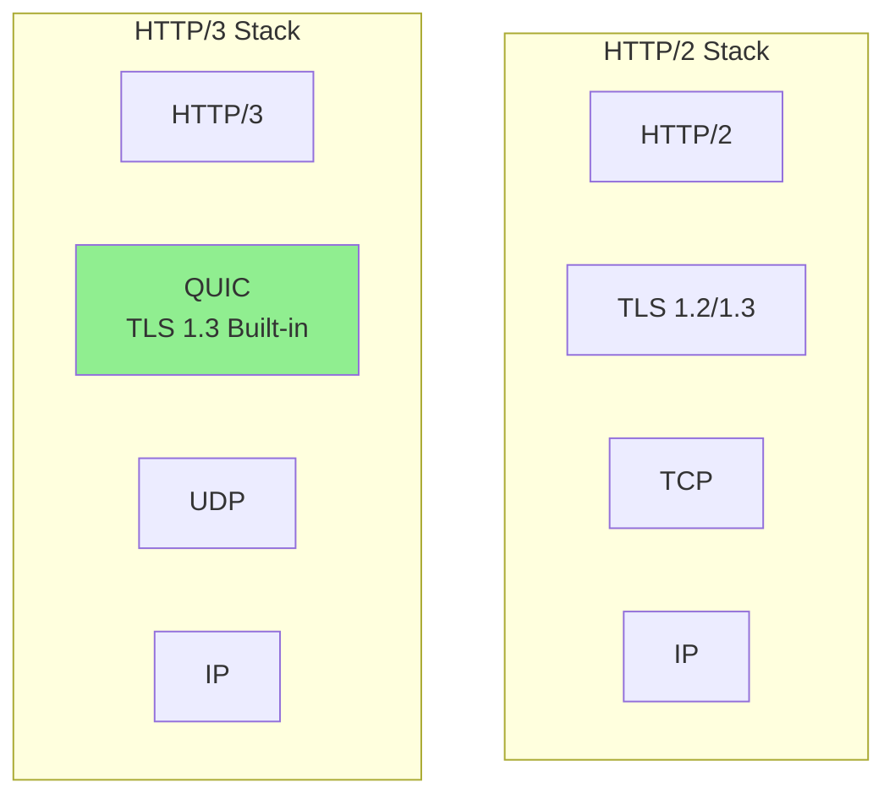
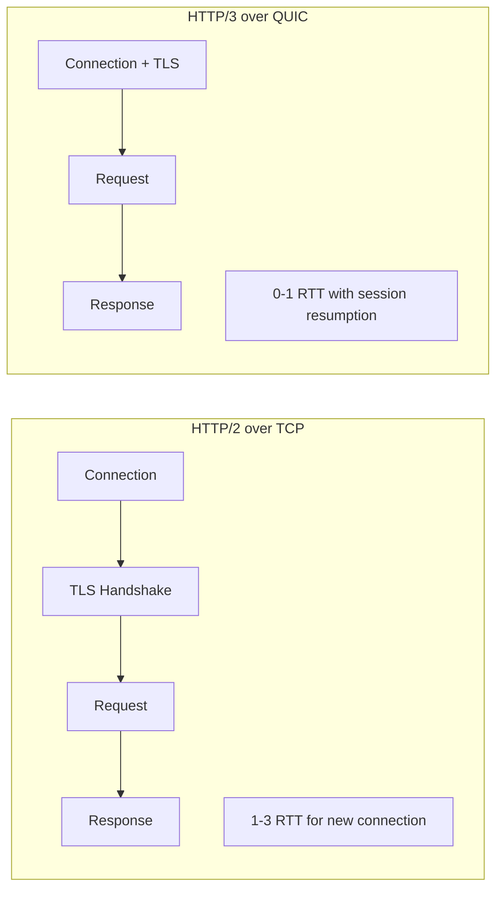

# How to Implement HTTP/3 QUIC Protocol

Author: [nawazdhandala](https://www.github.com/nawazdhandala)

Tags: HTTP/3, QUIC, Networking, Performance, TLS, Web

Description: A comprehensive guide to implementing HTTP/3 with QUIC protocol, covering server configuration, client support, performance benefits, and migration strategies from HTTP/2.

---

HTTP/3 replaces TCP with QUIC, a UDP-based transport protocol that eliminates head-of-line blocking, reduces connection latency, and handles network changes gracefully. This guide walks through implementing HTTP/3 in production environments.

## Understanding QUIC and HTTP/3



### Key Benefits of QUIC

- **0-RTT connection establishment**: Resuming connections without round trips
- **No head-of-line blocking**: Packet loss affects only that stream
- **Connection migration**: Survive network changes (WiFi to cellular)
- **Always encrypted**: TLS 1.3 integrated into the protocol

## Nginx HTTP/3 Configuration

Nginx added HTTP/3 support in version 1.25. Here's how to configure it.

### Install Nginx with HTTP/3 Support

```bash
# Ubuntu/Debian - Install mainline with QUIC
apt install nginx-mainline

# Or compile from source with quic support
./configure \
    --with-http_v3_module \
    --with-stream_quic_module \
    --with-cc-opt="-I/usr/local/include" \
    --with-ld-opt="-L/usr/local/lib"

make && make install
```

### Basic HTTP/3 Configuration

```nginx
# /etc/nginx/nginx.conf

http {
    # Enable QUIC and HTTP/3
    server {
        # Listen on 443 for HTTP/2 over TCP
        listen 443 ssl http2;

        # Listen on 443 for HTTP/3 over QUIC (UDP)
        listen 443 quic reuseport;

        server_name example.com;

        # TLS configuration (required for both HTTP/2 and HTTP/3)
        ssl_certificate /etc/ssl/certs/example.com.crt;
        ssl_certificate_key /etc/ssl/private/example.com.key;

        # TLS 1.3 required for HTTP/3
        ssl_protocols TLSv1.3;

        # Advertise HTTP/3 support via Alt-Svc header
        add_header Alt-Svc 'h3=":443"; ma=86400';

        # QUIC-specific settings
        quic_retry on;
        ssl_early_data on;

        location / {
            root /var/www/html;
            index index.html;
        }
    }
}
```

### Advanced HTTP/3 Settings

```nginx
server {
    listen 443 ssl http2;
    listen 443 quic reuseport;

    server_name example.com;

    ssl_certificate /etc/ssl/certs/example.com.crt;
    ssl_certificate_key /etc/ssl/private/example.com.key;
    ssl_protocols TLSv1.3;

    # HTTP/3 specific settings
    http3 on;
    http3_hq on;  # Enable HTTP/3 over raw QUIC

    # QUIC settings
    quic_active_connection_id_limit 5;
    quic_retry on;

    # 0-RTT (early data) - be careful with non-idempotent requests
    ssl_early_data on;
    proxy_set_header Early-Data $ssl_early_data;

    # Connection settings
    quic_gso on;  # Generic Segmentation Offload

    # Advertise HTTP/3 with extended max-age
    add_header Alt-Svc 'h3=":443"; ma=2592000; persist=1';

    # Add QUIC transport header for debugging
    add_header X-Quic-Status $quic;

    location / {
        root /var/www/html;

        # Reject early data for state-changing requests
        if ($ssl_early_data = 1) {
            return 425;  # Too Early
        }
    }

    location /api/ {
        proxy_pass http://backend;
        proxy_http_version 1.1;

        # Pass early data info to backend
        proxy_set_header Early-Data $ssl_early_data;
    }
}
```

## Caddy HTTP/3 Configuration

Caddy has built-in HTTP/3 support enabled by default.

```
# Caddyfile
example.com {
    # HTTP/3 is enabled automatically with HTTPS

    # Explicitly configure protocols
    protocols h1 h2 h3

    root * /var/www/html
    file_server

    # Backend proxy
    handle /api/* {
        reverse_proxy backend:8080
    }
}
```

## Node.js HTTP/3 Server

Using the experimental quic module or third-party libraries.

```javascript
// Using the node-quic library
const { createQuicSocket } = require('net');
const fs = require('fs');

const options = {
    key: fs.readFileSync('server.key'),
    cert: fs.readFileSync('server.crt'),
    alpn: 'h3'  // HTTP/3 over QUIC
};

const socket = createQuicSocket({
    endpoint: { port: 443 },
    server: options
});

socket.on('session', (session) => {
    console.log('New QUIC session established');

    session.on('stream', (stream, headers) => {
        const path = headers[':path'];
        console.log(`Request: ${path}`);

        // Respond with HTTP/3
        stream.respond({
            ':status': 200,
            'content-type': 'text/html'
        });

        stream.end('<html><body>Hello HTTP/3!</body></html>');
    });

    session.on('close', () => {
        console.log('Session closed');
    });
});

socket.listen();
console.log('HTTP/3 server listening on port 443');
```

### Using aioquic with Python

```python
import asyncio
from aioquic.asyncio import serve
from aioquic.quic.configuration import QuicConfiguration
from aioquic.h3.connection import H3Connection
from aioquic.h3.events import HeadersReceived, DataReceived

class HttpServerProtocol:
    def __init__(self, *args, **kwargs):
        self._http = None

    def quic_event_received(self, event):
        if self._http is None:
            self._http = H3Connection(self._quic)

        for http_event in self._http.handle_event(event):
            self.http_event_received(http_event)

    def http_event_received(self, event):
        if isinstance(event, HeadersReceived):
            # Parse request headers
            headers = dict(event.headers)
            path = headers.get(b':path', b'/').decode()
            method = headers.get(b':method', b'GET').decode()

            print(f"{method} {path}")

            # Send response
            self._http.send_headers(
                stream_id=event.stream_id,
                headers=[
                    (b':status', b'200'),
                    (b'content-type', b'text/html'),
                ],
            )

            self._http.send_data(
                stream_id=event.stream_id,
                data=b'<html><body>Hello HTTP/3!</body></html>',
                end_stream=True,
            )

async def main():
    configuration = QuicConfiguration(
        is_client=False,
        certificate_chain='server.crt',
        private_key='server.key',
        alpn_protocols=['h3'],
    )

    await serve(
        host='0.0.0.0',
        port=443,
        configuration=configuration,
        create_protocol=HttpServerProtocol,
    )

    print('HTTP/3 server running on port 443')
    await asyncio.Future()  # Run forever

asyncio.run(main())
```

## Go HTTP/3 Server with quic-go

```go
package main

import (
    "fmt"
    "log"
    "net/http"

    "github.com/quic-go/quic-go/http3"
)

func main() {
    mux := http.NewServeMux()

    mux.HandleFunc("/", func(w http.ResponseWriter, r *http.Request) {
        // Log protocol used
        fmt.Printf("Request via %s\n", r.Proto)

        w.Header().Set("Content-Type", "text/html")
        w.Write([]byte("<html><body>Hello HTTP/3!</body></html>"))
    })

    // Serve HTTP/3 over QUIC
    server := &http3.Server{
        Handler: mux,
        Addr:    ":443",
    }

    // Also serve HTTP/2 for fallback
    go func() {
        log.Printf("Starting HTTP/2 server on :443")
        http.ListenAndServeTLS(":443", "server.crt", "server.key",
            http.HandlerFunc(func(w http.ResponseWriter, r *http.Request) {
                // Add Alt-Svc header to advertise HTTP/3
                w.Header().Set("Alt-Svc", `h3=":443"; ma=86400`)
                mux.ServeHTTP(w, r)
            }))
    }()

    log.Printf("Starting HTTP/3 server on :443")
    err := server.ListenAndServeTLS("server.crt", "server.key")
    if err != nil {
        log.Fatal(err)
    }
}
```

## Client-Side HTTP/3

### curl with HTTP/3

```bash
# Check if curl has HTTP/3 support
curl --version | grep HTTP3

# Make HTTP/3 request
curl --http3 https://example.com

# Force HTTP/3 only (fail if not available)
curl --http3-only https://example.com

# Verbose output to see protocol negotiation
curl -v --http3 https://example.com 2>&1 | grep -i "using http"
```

### Go HTTP/3 Client

```go
package main

import (
    "crypto/tls"
    "fmt"
    "io"
    "log"
    "net/http"

    "github.com/quic-go/quic-go/http3"
)

func main() {
    // Create HTTP/3 transport
    transport := &http3.RoundTripper{
        TLSClientConfig: &tls.Config{
            InsecureSkipVerify: false,
        },
    }
    defer transport.Close()

    client := &http.Client{
        Transport: transport,
    }

    resp, err := client.Get("https://example.com")
    if err != nil {
        log.Fatal(err)
    }
    defer resp.Body.Close()

    fmt.Printf("Protocol: %s\n", resp.Proto)
    fmt.Printf("Status: %s\n", resp.Status)

    body, _ := io.ReadAll(resp.Body)
    fmt.Printf("Body: %s\n", body[:100])
}
```

## Firewall and Network Configuration

QUIC uses UDP, which requires specific firewall rules.

```bash
# Allow QUIC/UDP traffic on port 443
iptables -A INPUT -p udp --dport 443 -j ACCEPT
iptables -A OUTPUT -p udp --sport 443 -j ACCEPT

# For nftables
nft add rule inet filter input udp dport 443 accept
nft add rule inet filter output udp sport 443 accept

# UFW
ufw allow 443/udp
```

### Cloud Provider Configuration

```yaml
# AWS Security Group (Terraform)
resource "aws_security_group_rule" "quic_ingress" {
  type              = "ingress"
  from_port         = 443
  to_port           = 443
  protocol          = "udp"
  cidr_blocks       = ["0.0.0.0/0"]
  security_group_id = aws_security_group.web.id
  description       = "QUIC/HTTP3 traffic"
}
```

## Testing HTTP/3 Support

```bash
#!/bin/bash
# test-http3.sh - Test HTTP/3 availability

DOMAIN=$1

echo "Testing HTTP/3 support for $DOMAIN"

# Check Alt-Svc header
echo "=== Alt-Svc Header ==="
curl -sI https://$DOMAIN | grep -i alt-svc

# Test with HTTP/3
echo -e "\n=== HTTP/3 Request ==="
if curl --http3 -sI https://$DOMAIN 2>/dev/null | head -5; then
    echo "HTTP/3 is working"
else
    echo "HTTP/3 not available or curl lacks support"
fi

# Use online tools
echo -e "\n=== Check online tools ==="
echo "https://http3check.net/?host=$DOMAIN"
echo "https://www.http3check.net/"
```

## Performance Comparison



### Benchmarking Script

```python
#!/usr/bin/env python3
"""Compare HTTP/2 vs HTTP/3 performance"""

import subprocess
import time
import statistics

def benchmark_protocol(url, protocol_flag, iterations=10):
    times = []

    for i in range(iterations):
        start = time.time()
        result = subprocess.run(
            ['curl', '-s', '-o', '/dev/null', '-w', '%{time_total}',
             protocol_flag, url],
            capture_output=True, text=True
        )
        elapsed = float(result.stdout)
        times.append(elapsed)

    return {
        'mean': statistics.mean(times),
        'median': statistics.median(times),
        'stdev': statistics.stdev(times) if len(times) > 1 else 0,
        'min': min(times),
        'max': max(times)
    }

url = "https://example.com/large-file.bin"

print("Benchmarking HTTP/2...")
http2_results = benchmark_protocol(url, '--http2')

print("Benchmarking HTTP/3...")
http3_results = benchmark_protocol(url, '--http3')

print(f"\nHTTP/2: mean={http2_results['mean']:.3f}s, "
      f"median={http2_results['median']:.3f}s")
print(f"HTTP/3: mean={http3_results['mean']:.3f}s, "
      f"median={http3_results['median']:.3f}s")

improvement = (http2_results['mean'] - http3_results['mean']) / http2_results['mean'] * 100
print(f"\nHTTP/3 is {improvement:.1f}% faster on average")
```

## Migration Strategy

1. **Enable HTTP/3 alongside HTTP/2**: Both can coexist on port 443
2. **Add Alt-Svc headers**: Browsers discover HTTP/3 via this header
3. **Monitor adoption**: Track what percentage of traffic uses HTTP/3
4. **Tune settings**: Adjust based on your traffic patterns

```nginx
# Gradual rollout with feature flags
map $request_uri $enable_h3 {
    ~^/api/  0;     # Disable for API initially
    default  1;      # Enable for static content
}

server {
    listen 443 ssl http2;
    listen 443 quic reuseport;

    # Conditionally advertise HTTP/3
    set $alt_svc "";
    if ($enable_h3) {
        set $alt_svc 'h3=":443"; ma=86400';
    }
    add_header Alt-Svc $alt_svc;
}
```

---

HTTP/3 and QUIC represent a significant step forward in web performance, especially for mobile users and high-latency connections. Start with a dual-stack approach serving both HTTP/2 and HTTP/3, and let clients choose the best protocol for their network conditions.
