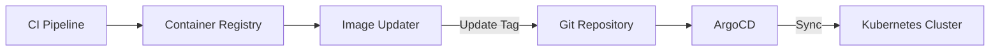

# How to Implement Image Updater in ArgoCD

Author: [nawazdhandala](https://www.github.com/nawazdhandala)

Tags: ArgoCD, Image Updater, Kubernetes, Container Registry, Automation, GitOps

Description: Learn how to use ArgoCD Image Updater to automatically update container image versions in your Git repository when new images are pushed to your registry.

---

Keeping container images up to date is tedious. Every time you push a new image, you need to update the tag in your Git repository. ArgoCD Image Updater automates this by watching your container registry and updating your Git repo when new images appear.

## How Image Updater Works



The flow:
1. CI builds and pushes new image to registry
2. Image Updater polls the registry for new tags
3. When found, it commits the update to Git
4. ArgoCD detects the change and syncs

## Installing Image Updater

Install using kubectl:

```bash
kubectl apply -n argocd -f https://raw.githubusercontent.com/argoproj-labs/argocd-image-updater/stable/manifests/install.yaml
```

Or using Helm:

```bash
helm repo add argo https://argoproj.github.io/argo-helm
helm install argocd-image-updater argo/argocd-image-updater -n argocd
```

Verify installation:

```bash
kubectl get pods -n argocd | grep image-updater
```

## Basic Configuration

Enable Image Updater on an Application using annotations:

```yaml
apiVersion: argoproj.io/v1alpha1
kind: Application
metadata:
  name: myapp
  namespace: argocd
  annotations:
    # Enable image updater for this application
    argocd-image-updater.argoproj.io/image-list: myapp=myregistry.io/myapp
    # Update strategy: use the latest semver tag
    argocd-image-updater.argoproj.io/myapp.update-strategy: semver
spec:
  project: default
  source:
    repoURL: https://github.com/myorg/myapp-config.git
    path: k8s
    targetRevision: HEAD
  destination:
    server: https://kubernetes.default.svc
    namespace: myapp
```

## Update Strategies

### Semver Strategy

Use semantic versioning to find the latest compatible version:

```yaml
annotations:
  argocd-image-updater.argoproj.io/image-list: myapp=myregistry.io/myapp
  # Get latest version matching semver
  argocd-image-updater.argoproj.io/myapp.update-strategy: semver
  # Optional: constrain to specific version range
  argocd-image-updater.argoproj.io/myapp.allow-tags: "regexp:^v?[0-9]+\\.[0-9]+\\.[0-9]+$"
```

### Latest Strategy

Always use the most recently pushed image:

```yaml
annotations:
  argocd-image-updater.argoproj.io/image-list: myapp=myregistry.io/myapp
  argocd-image-updater.argoproj.io/myapp.update-strategy: latest
```

### Name Strategy

Sort tags alphabetically and use the last one:

```yaml
annotations:
  argocd-image-updater.argoproj.io/image-list: myapp=myregistry.io/myapp
  argocd-image-updater.argoproj.io/myapp.update-strategy: name
```

### Digest Strategy

Track a specific tag but update when its digest changes:

```yaml
annotations:
  argocd-image-updater.argoproj.io/image-list: myapp=myregistry.io/myapp:latest
  argocd-image-updater.argoproj.io/myapp.update-strategy: digest
```

## Tag Filtering

Control which tags are considered for updates:

### Allow Specific Tags

```yaml
annotations:
  argocd-image-updater.argoproj.io/image-list: myapp=myregistry.io/myapp
  # Only consider tags matching this regex
  argocd-image-updater.argoproj.io/myapp.allow-tags: "regexp:^v[0-9]+\\.[0-9]+\\.[0-9]+$"
```

### Ignore Tags

```yaml
annotations:
  argocd-image-updater.argoproj.io/image-list: myapp=myregistry.io/myapp
  # Ignore specific tags
  argocd-image-updater.argoproj.io/myapp.ignore-tags: "latest, develop, *-rc*"
```

### Platform-Specific Images

```yaml
annotations:
  argocd-image-updater.argoproj.io/image-list: myapp=myregistry.io/myapp
  # Specify target platform
  argocd-image-updater.argoproj.io/myapp.platforms: "linux/amd64"
```

## Write-Back Methods

Image Updater can update images in different ways:

### Git Write-Back (Recommended)

Updates the Git repository directly:

```yaml
annotations:
  argocd-image-updater.argoproj.io/image-list: myapp=myregistry.io/myapp
  argocd-image-updater.argoproj.io/write-back-method: git
  # Branch to write updates to
  argocd-image-updater.argoproj.io/git-branch: main
```

Configure Git credentials:

```yaml
apiVersion: v1
kind: Secret
metadata:
  name: git-creds
  namespace: argocd
type: Opaque
stringData:
  # For HTTPS
  username: argocd-image-updater
  password: ghp_xxxxxxxxxxxx
```

Reference in annotations:

```yaml
annotations:
  argocd-image-updater.argoproj.io/write-back-method: git:secret:argocd/git-creds
```

### ArgoCD Write-Back

Updates the Application parameter directly (changes not persisted in Git):

```yaml
annotations:
  argocd-image-updater.argoproj.io/write-back-method: argocd
```

## Registry Authentication

### Docker Hub

```yaml
apiVersion: v1
kind: Secret
metadata:
  name: dockerhub-creds
  namespace: argocd
  labels:
    argocd-image-updater.argoproj.io/secret-type: pullsecret
type: kubernetes.io/dockerconfigjson
stringData:
  .dockerconfigjson: |
    {
      "auths": {
        "https://index.docker.io/v1/": {
          "username": "myuser",
          "password": "mypassword"
        }
      }
    }
```

Reference in the Application:

```yaml
annotations:
  argocd-image-updater.argoproj.io/image-list: myapp=docker.io/myuser/myapp
  argocd-image-updater.argoproj.io/myapp.pull-secret: argocd/dockerhub-creds
```

### GitHub Container Registry

```yaml
apiVersion: v1
kind: Secret
metadata:
  name: ghcr-creds
  namespace: argocd
  labels:
    argocd-image-updater.argoproj.io/secret-type: pullsecret
type: kubernetes.io/dockerconfigjson
stringData:
  .dockerconfigjson: |
    {
      "auths": {
        "ghcr.io": {
          "username": "USERNAME",
          "password": "ghp_xxxxxxxxxxxx"
        }
      }
    }
```

### AWS ECR

```yaml
apiVersion: v1
kind: Secret
metadata:
  name: ecr-creds
  namespace: argocd
  labels:
    argocd-image-updater.argoproj.io/secret-type: pullsecret
type: kubernetes.io/dockerconfigjson
stringData:
  .dockerconfigjson: |
    {
      "auths": {
        "123456789012.dkr.ecr.us-east-1.amazonaws.com": {
          "username": "AWS",
          "password": "<ecr-token>"
        }
      }
    }
```

For automatic ECR token refresh, use the ECR credentials helper in the Image Updater config:

```yaml
# argocd-image-updater-config ConfigMap
data:
  registries.conf: |
    registries:
      - name: ECR
        api_url: https://123456789012.dkr.ecr.us-east-1.amazonaws.com
        prefix: 123456789012.dkr.ecr.us-east-1.amazonaws.com
        credentials: ext:/scripts/ecr-login.sh
        credsexpire: 10h
```

### Google Container Registry / Artifact Registry

```yaml
apiVersion: v1
kind: Secret
metadata:
  name: gcr-creds
  namespace: argocd
  labels:
    argocd-image-updater.argoproj.io/secret-type: pullsecret
type: kubernetes.io/dockerconfigjson
stringData:
  .dockerconfigjson: |
    {
      "auths": {
        "gcr.io": {
          "username": "_json_key",
          "password": "<service-account-json>"
        }
      }
    }
```

## Helm Value Updates

For Helm-based applications, specify which values to update:

```yaml
annotations:
  argocd-image-updater.argoproj.io/image-list: myapp=myregistry.io/myapp
  # Update this Helm value path
  argocd-image-updater.argoproj.io/myapp.helm.image-name: image.repository
  argocd-image-updater.argoproj.io/myapp.helm.image-tag: image.tag
```

## Kustomize Updates

For Kustomize-based applications:

```yaml
annotations:
  argocd-image-updater.argoproj.io/image-list: myapp=myregistry.io/myapp
  argocd-image-updater.argoproj.io/write-back-method: git
  # Use Kustomize image transformer
  argocd-image-updater.argoproj.io/write-back-target: kustomization
```

This updates the `kustomization.yaml`:

```yaml
images:
  - name: myregistry.io/myapp
    newTag: v1.2.3
```

## Multiple Images

Update multiple images in one application:

```yaml
annotations:
  argocd-image-updater.argoproj.io/image-list: |
    frontend=myregistry.io/frontend,
    backend=myregistry.io/backend,
    worker=myregistry.io/worker
  argocd-image-updater.argoproj.io/frontend.update-strategy: semver
  argocd-image-updater.argoproj.io/backend.update-strategy: semver
  argocd-image-updater.argoproj.io/worker.update-strategy: latest
```

## Commit Message Customization

Customize the Git commit message:

```yaml
annotations:
  argocd-image-updater.argoproj.io/git-commit-message: |
    chore: update image {{range .Updated}}{{.Name}}={{.NewTag}} {{end}}

    Signed-off-by: ArgoCD Image Updater <argocd-image-updater@example.com>
```

## Monitoring Image Updater

### Logs

```bash
kubectl logs -n argocd deployment/argocd-image-updater -f
```

### Metrics

Image Updater exposes Prometheus metrics:

```yaml
# ServiceMonitor for Prometheus
apiVersion: monitoring.coreos.com/v1
kind: ServiceMonitor
metadata:
  name: argocd-image-updater
  namespace: argocd
spec:
  selector:
    matchLabels:
      app.kubernetes.io/name: argocd-image-updater
  endpoints:
    - port: metrics
```

## Troubleshooting

### Image Not Updating

```bash
# Check Image Updater logs
kubectl logs -n argocd deployment/argocd-image-updater

# Verify annotations are correct
kubectl get application myapp -n argocd -o yaml | grep -A 20 annotations

# Test registry access
kubectl run test --image=myregistry.io/myapp:latest --dry-run=client
```

### Git Write-Back Failing

```bash
# Check git credentials
kubectl get secret git-creds -n argocd -o yaml

# Verify branch permissions
# Ensure the service account can push to the branch
```

### Common Issues

**No new tags found:**
- Verify tag regex pattern matches your tags
- Check registry credentials
- Ensure the image exists in the registry

**Permission denied:**
- Check Git write-back credentials
- Verify branch protection rules

**Wrong image being selected:**
- Review update strategy
- Check allow-tags and ignore-tags patterns

## Best Practices

### Use Semver Tags

```bash
# Good: semantic versions
v1.2.3, 1.2.3

# Avoid: ambiguous tags
latest, develop, commit-sha
```

### Separate Config Repository

Keep image tags in a dedicated config repo:

```
app-code/          # Application source code
app-config/        # Kubernetes manifests with image tags
```

### Branch Strategy

Use a dedicated branch for automated updates:

```yaml
annotations:
  argocd-image-updater.argoproj.io/git-branch: image-updates
```

Then merge to main through PR.

### Rate Limiting

Configure polling interval to avoid hitting rate limits:

```yaml
# argocd-image-updater-config ConfigMap
data:
  registries.conf: |
    registries:
      - name: Docker Hub
        prefix: docker.io
        api_url: https://registry-1.docker.io
        default: true
        # Check every 5 minutes
        interval: 5m
```

ArgoCD Image Updater bridges the gap between CI and GitOps. It keeps your deployments current without manual intervention while maintaining the Git-as-source-of-truth principle. Start with semver strategy for predictable updates, then explore digest tracking for mutable tags like latest.
