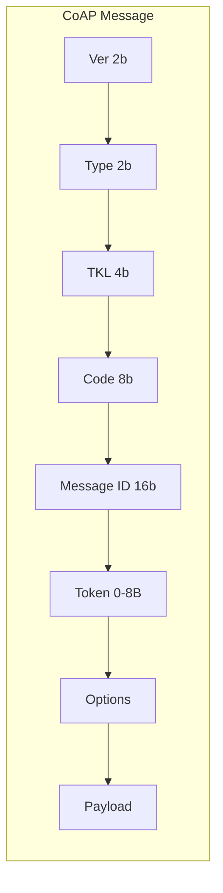

# How to Implement CoAP Protocol for IoT

Author: [nawazdhandala](https://www.github.com/nawazdhandala)

Tags: CoAP, IoT, Protocol, UDP, Constrained Devices, REST, Embedded

Description: Learn how to implement the Constrained Application Protocol (CoAP) for IoT devices. Understand CoAP vs HTTP, message formats, observe pattern, and build lightweight RESTful services for resource-constrained environments.

---

> CoAP (Constrained Application Protocol) is a specialized web transfer protocol designed for constrained nodes and networks in the Internet of Things. It provides a REST-like interface over UDP, reducing overhead compared to HTTP while maintaining familiar semantics.

While MQTT excels at publish/subscribe messaging, CoAP shines when you need request/response patterns with minimal overhead. It is perfect for battery-powered devices that need to sleep between interactions and wake only to serve requests or push observations.

---

## CoAP vs HTTP Comparison

Understanding when to use CoAP:

| Feature | CoAP | HTTP |
|---------|------|------|
| Transport | UDP | TCP |
| Header Size | 4 bytes | ~100+ bytes |
| Reliability | Optional (Confirmable) | TCP guaranteed |
| Caching | Built-in | Via headers |
| Observe | Native support | WebSocket/SSE |
| Security | DTLS | TLS |
| Discovery | Built-in | Requires external |

CoAP message structure:



---

## Setting Up a CoAP Server in Python

### Installation

```bash
# Install aiocoap for Python CoAP support
pip install aiocoap

# For DTLS support (security)
pip install aiocoap[dtls]
```

### Basic CoAP Server

```python
# coap_server.py
# CoAP server for IoT device endpoints

import asyncio
import aiocoap
import aiocoap.resource as resource
from datetime import datetime
import json
import logging

# Configure logging
logging.basicConfig(level=logging.INFO)
logger = logging.getLogger(__name__)

class TemperatureResource(resource.Resource):
    """CoAP resource for temperature sensor"""

    def __init__(self):
        super().__init__()
        self.temperature = 22.5

    async def render_get(self, request):
        """Handle GET requests for temperature"""
        logger.info(f"GET /temperature from {request.remote}")

        # Read current temperature
        payload = json.dumps({
            "value": self.temperature,
            "unit": "celsius",
            "timestamp": datetime.utcnow().isoformat()
        })

        return aiocoap.Message(
            code=aiocoap.CONTENT,
            payload=payload.encode()
        )

    async def render_put(self, request):
        """Handle PUT requests to set temperature (thermostat)"""
        logger.info(f"PUT /temperature from {request.remote}")

        try:
            data = json.loads(request.payload.decode())
            new_temp = data.get("value")

            if new_temp is not None:
                self.temperature = float(new_temp)
                logger.info(f"Temperature set to {self.temperature}")
                return aiocoap.Message(code=aiocoap.CHANGED)

        except (json.JSONDecodeError, ValueError) as e:
            return aiocoap.Message(
                code=aiocoap.BAD_REQUEST,
                payload=f"Invalid request: {e}".encode()
            )


class SensorInfoResource(resource.Resource):
    """Device information resource"""

    def __init__(self, device_id: str):
        super().__init__()
        self.device_id = device_id
        self.firmware_version = "1.2.0"
        self.uptime_start = datetime.utcnow()

    async def render_get(self, request):
        """Return device information"""
        uptime = (datetime.utcnow() - self.uptime_start).total_seconds()

        payload = json.dumps({
            "device_id": self.device_id,
            "firmware": self.firmware_version,
            "uptime_seconds": int(uptime),
            "protocol": "CoAP",
            "endpoints": ["/temperature", "/humidity", "/led"]
        })

        return aiocoap.Message(
            code=aiocoap.CONTENT,
            payload=payload.encode()
        )


class LEDResource(resource.Resource):
    """Control LED on the device"""

    def __init__(self):
        super().__init__()
        self.state = False

    async def render_get(self, request):
        """Get LED state"""
        payload = json.dumps({"state": "on" if self.state else "off"})
        return aiocoap.Message(code=aiocoap.CONTENT, payload=payload.encode())

    async def render_put(self, request):
        """Set LED state"""
        try:
            data = json.loads(request.payload.decode())
            state = data.get("state", "").lower()

            if state == "on":
                self.state = True
            elif state == "off":
                self.state = False
            else:
                return aiocoap.Message(
                    code=aiocoap.BAD_REQUEST,
                    payload=b"State must be 'on' or 'off'"
                )

            logger.info(f"LED state changed to: {self.state}")
            return aiocoap.Message(code=aiocoap.CHANGED)

        except json.JSONDecodeError:
            return aiocoap.Message(
                code=aiocoap.BAD_REQUEST,
                payload=b"Invalid JSON"
            )

    async def render_post(self, request):
        """Toggle LED state"""
        self.state = not self.state
        logger.info(f"LED toggled to: {self.state}")

        payload = json.dumps({"state": "on" if self.state else "off"})
        return aiocoap.Message(code=aiocoap.CHANGED, payload=payload.encode())


class WellKnownCoreResource(resource.Resource):
    """CoAP discovery endpoint (/.well-known/core)"""

    def __init__(self, root):
        super().__init__()
        self.root = root

    async def render_get(self, request):
        """Return link format resource directory"""
        # Build link-format response for CoAP discovery
        links = []
        links.append('</temperature>;rt="sensor";ct=50')
        links.append('</humidity>;rt="sensor";ct=50')
        links.append('</led>;rt="actuator";ct=50')
        links.append('</info>;rt="device";ct=50')

        payload = ",".join(links)
        response = aiocoap.Message(code=aiocoap.CONTENT, payload=payload.encode())
        response.opt.content_format = 40  # application/link-format
        return response


async def main():
    # Create the resource tree
    root = resource.Site()

    # Add resources
    root.add_resource(['.well-known', 'core'], WellKnownCoreResource(root))
    root.add_resource(['temperature'], TemperatureResource())
    root.add_resource(['humidity'], HumidityResource())
    root.add_resource(['led'], LEDResource())
    root.add_resource(['info'], SensorInfoResource("sensor-001"))

    # Create CoAP context and start server
    # Bind to all interfaces on default CoAP port (5683)
    await aiocoap.Context.create_server_context(root, bind=('::', 5683))

    logger.info("CoAP server started on port 5683")
    logger.info("Resources: /temperature, /humidity, /led, /info")

    # Keep server running
    await asyncio.get_running_loop().create_future()


class HumidityResource(resource.Resource):
    """CoAP resource for humidity sensor"""

    def __init__(self):
        super().__init__()
        self.humidity = 55.0

    async def render_get(self, request):
        """Handle GET requests for humidity"""
        payload = json.dumps({
            "value": self.humidity,
            "unit": "percent",
            "timestamp": datetime.utcnow().isoformat()
        })
        return aiocoap.Message(code=aiocoap.CONTENT, payload=payload.encode())


if __name__ == "__main__":
    asyncio.run(main())
```

---

## CoAP Client Implementation

### Python Client

```python
# coap_client.py
# CoAP client for interacting with IoT devices

import asyncio
import aiocoap
import json
import logging

logging.basicConfig(level=logging.INFO)
logger = logging.getLogger(__name__)

class CoAPClient:
    """Client for CoAP device communication"""

    def __init__(self, host: str, port: int = 5683):
        self.host = host
        self.port = port
        self.protocol = None

    async def connect(self):
        """Initialize CoAP protocol context"""
        self.protocol = await aiocoap.Context.create_client_context()
        logger.info(f"CoAP client ready for {self.host}:{self.port}")

    async def get(self, path: str) -> dict:
        """Perform CoAP GET request"""
        uri = f"coap://{self.host}:{self.port}/{path}"
        request = aiocoap.Message(code=aiocoap.GET, uri=uri)

        try:
            response = await self.protocol.request(request).response
            logger.info(f"GET {path}: {response.code}")

            if response.code.is_successful():
                return json.loads(response.payload.decode())
            else:
                return {"error": str(response.code)}

        except Exception as e:
            logger.error(f"GET error: {e}")
            return {"error": str(e)}

    async def put(self, path: str, data: dict) -> dict:
        """Perform CoAP PUT request"""
        uri = f"coap://{self.host}:{self.port}/{path}"
        payload = json.dumps(data).encode()

        request = aiocoap.Message(
            code=aiocoap.PUT,
            uri=uri,
            payload=payload
        )
        request.opt.content_format = 50  # application/json

        try:
            response = await self.protocol.request(request).response
            logger.info(f"PUT {path}: {response.code}")

            if response.payload:
                return json.loads(response.payload.decode())
            return {"status": str(response.code)}

        except Exception as e:
            logger.error(f"PUT error: {e}")
            return {"error": str(e)}

    async def post(self, path: str, data: dict = None) -> dict:
        """Perform CoAP POST request"""
        uri = f"coap://{self.host}:{self.port}/{path}"
        payload = json.dumps(data).encode() if data else b""

        request = aiocoap.Message(
            code=aiocoap.POST,
            uri=uri,
            payload=payload
        )
        if data:
            request.opt.content_format = 50

        try:
            response = await self.protocol.request(request).response
            logger.info(f"POST {path}: {response.code}")

            if response.payload:
                return json.loads(response.payload.decode())
            return {"status": str(response.code)}

        except Exception as e:
            logger.error(f"POST error: {e}")
            return {"error": str(e)}

    async def discover(self) -> list:
        """Discover available resources"""
        uri = f"coap://{self.host}:{self.port}/.well-known/core"
        request = aiocoap.Message(code=aiocoap.GET, uri=uri)

        try:
            response = await self.protocol.request(request).response

            if response.code.is_successful():
                # Parse link-format response
                links = response.payload.decode().split(",")
                resources = []
                for link in links:
                    # Extract path from <path>;attributes
                    path = link.split(";")[0].strip("<>")
                    resources.append(path)
                return resources

        except Exception as e:
            logger.error(f"Discovery error: {e}")
            return []


async def main():
    # Connect to CoAP server
    client = CoAPClient("192.168.1.100")
    await client.connect()

    # Discover resources
    print("Discovering resources...")
    resources = await client.discover()
    print(f"Available resources: {resources}")

    # Get temperature
    print("\nGetting temperature...")
    temp = await client.get("temperature")
    print(f"Temperature: {temp}")

    # Get device info
    print("\nGetting device info...")
    info = await client.get("info")
    print(f"Device info: {json.dumps(info, indent=2)}")

    # Control LED
    print("\nTurning LED on...")
    result = await client.put("led", {"state": "on"})
    print(f"LED result: {result}")

    # Toggle LED
    print("\nToggling LED...")
    result = await client.post("led")
    print(f"Toggle result: {result}")


if __name__ == "__main__":
    asyncio.run(main())
```

---

## CoAP Observe Pattern

The observe pattern allows clients to subscribe to resource changes:

```python
# coap_observe.py
# CoAP observe pattern for real-time updates

import asyncio
import aiocoap
import aiocoap.resource as resource
import json
from datetime import datetime
import random
import logging

logging.basicConfig(level=logging.INFO)
logger = logging.getLogger(__name__)


class ObservableTemperature(resource.ObservableResource):
    """Observable temperature resource that notifies subscribers"""

    def __init__(self):
        super().__init__()
        self.temperature = 22.5
        # Start background task to update temperature
        self.handle = None

    def start_updates(self):
        """Start periodic temperature updates"""
        asyncio.get_event_loop().create_task(self._update_loop())

    async def _update_loop(self):
        """Periodically update temperature and notify observers"""
        while True:
            await asyncio.sleep(5)  # Update every 5 seconds

            # Simulate temperature change
            self.temperature += random.uniform(-0.5, 0.5)
            self.temperature = round(self.temperature, 2)

            logger.info(f"Temperature updated to {self.temperature}")

            # Notify all observers
            # This triggers render_get for each observer
            self.updated_state()

    async def render_get(self, request):
        """Handle GET requests and observations"""
        payload = json.dumps({
            "value": self.temperature,
            "unit": "celsius",
            "timestamp": datetime.utcnow().isoformat()
        })

        response = aiocoap.Message(
            code=aiocoap.CONTENT,
            payload=payload.encode()
        )

        # Set Max-Age to hint when the next update will occur
        response.opt.max_age = 5

        return response


class ObserveClient:
    """Client that observes CoAP resources"""

    def __init__(self, host: str, port: int = 5683):
        self.host = host
        self.port = port
        self.protocol = None
        self.observation = None

    async def connect(self):
        """Initialize client context"""
        self.protocol = await aiocoap.Context.create_client_context()

    async def observe(self, path: str, callback):
        """Start observing a resource"""
        uri = f"coap://{self.host}:{self.port}/{path}"

        request = aiocoap.Message(code=aiocoap.GET, uri=uri, observe=0)

        observation_request = self.protocol.request(request)

        # Handle the initial response
        response = await observation_request.response
        callback(response)

        # Handle subsequent notifications
        async for notification in observation_request.observation:
            callback(notification)

    async def stop_observation(self):
        """Stop observing"""
        if self.observation:
            self.observation.cancel()


async def observe_example():
    """Example of observing a CoAP resource"""

    def notification_handler(response):
        """Handle observation notifications"""
        if response.code.is_successful():
            data = json.loads(response.payload.decode())
            print(f"Notification: Temperature = {data['value']}C at {data['timestamp']}")
        else:
            print(f"Notification error: {response.code}")

    client = ObserveClient("192.168.1.100")
    await client.connect()

    print("Starting observation of /temperature...")
    print("Press Ctrl+C to stop")

    try:
        await client.observe("temperature", notification_handler)
    except asyncio.CancelledError:
        print("Observation stopped")


async def main():
    # Start observable server
    root = resource.Site()

    temp_resource = ObservableTemperature()
    root.add_resource(['temperature'], temp_resource)

    await aiocoap.Context.create_server_context(root, bind=('::', 5683))

    logger.info("Observable CoAP server started")
    temp_resource.start_updates()

    # Keep running
    await asyncio.get_running_loop().create_future()


if __name__ == "__main__":
    asyncio.run(main())
```

---

## CoAP with DTLS Security

```python
# coap_secure.py
# CoAP with DTLS security

import asyncio
import aiocoap
from aiocoap import credentials

# DTLS credentials configuration
DEVICE_IDENTITY = b"device-001"
PRE_SHARED_KEY = b"super-secret-key-12345"

async def secure_client():
    """CoAP client with DTLS-PSK"""

    # Create client context with credentials
    client_credentials = credentials.CredentialsMap()

    # Add pre-shared key credentials
    client_credentials.load_from_dict({
        "coaps://192.168.1.100/*": {
            "dtls": {
                "psk": {
                    "identity": DEVICE_IDENTITY.decode(),
                    "key": PRE_SHARED_KEY.hex()
                }
            }
        }
    })

    protocol = await aiocoap.Context.create_client_context()
    protocol.client_credentials = client_credentials

    # Make secure request
    uri = "coaps://192.168.1.100:5684/temperature"
    request = aiocoap.Message(code=aiocoap.GET, uri=uri)

    response = await protocol.request(request).response
    print(f"Secure response: {response.payload.decode()}")


def setup_secure_server():
    """Configure CoAP server with DTLS"""
    # Server credentials
    server_credentials = credentials.CredentialsMap()

    server_credentials.load_from_dict({
        ":client": {
            "dtls": {
                "psk": {
                    DEVICE_IDENTITY.decode(): PRE_SHARED_KEY.hex()
                }
            }
        }
    })

    return server_credentials
```

---

## Block-wise Transfers

For large payloads that exceed the maximum CoAP message size:

```python
# coap_blockwise.py
# Block-wise transfer for large payloads

import asyncio
import aiocoap
import aiocoap.resource as resource

class LargeResource(resource.Resource):
    """Resource that returns large payload using block-wise transfer"""

    def __init__(self):
        super().__init__()
        # Generate large data (e.g., firmware, logs)
        self.data = b"x" * 10000  # 10KB payload

    async def render_get(self, request):
        """Return large payload - aiocoap handles block-wise automatically"""
        return aiocoap.Message(
            code=aiocoap.CONTENT,
            payload=self.data
        )

    async def render_put(self, request):
        """Accept large payload upload"""
        # aiocoap reassembles block-wise uploads automatically
        received_data = request.payload
        print(f"Received {len(received_data)} bytes")

        # Process the complete payload
        self.data = received_data

        return aiocoap.Message(code=aiocoap.CHANGED)


async def upload_large_file(client_protocol, uri: str, data: bytes):
    """Upload large file using block-wise transfer"""
    request = aiocoap.Message(
        code=aiocoap.PUT,
        uri=uri,
        payload=data
    )

    # aiocoap automatically splits into blocks if needed
    response = await client_protocol.request(request).response
    return response.code.is_successful()
```

---

## CoAP Gateway

Bridge CoAP devices to HTTP/REST APIs:

```python
# coap_gateway.py
# HTTP to CoAP gateway

from fastapi import FastAPI, HTTPException
from pydantic import BaseModel
import asyncio
import aiocoap
import json

app = FastAPI(title="CoAP Gateway")

# CoAP client context
coap_context = None

class DeviceRequest(BaseModel):
    value: float = None
    state: str = None

@app.on_event("startup")
async def startup():
    global coap_context
    coap_context = await aiocoap.Context.create_client_context()

@app.get("/devices/{device_ip}/temperature")
async def get_temperature(device_ip: str):
    """Proxy GET request to CoAP device"""
    uri = f"coap://{device_ip}:5683/temperature"
    request = aiocoap.Message(code=aiocoap.GET, uri=uri)

    try:
        response = await asyncio.wait_for(
            coap_context.request(request).response,
            timeout=10.0
        )

        if response.code.is_successful():
            return json.loads(response.payload.decode())
        else:
            raise HTTPException(status_code=502, detail=f"CoAP error: {response.code}")

    except asyncio.TimeoutError:
        raise HTTPException(status_code=504, detail="Device timeout")

@app.put("/devices/{device_ip}/led")
async def set_led(device_ip: str, data: DeviceRequest):
    """Proxy PUT request to CoAP device"""
    uri = f"coap://{device_ip}:5683/led"
    payload = json.dumps({"state": data.state}).encode()

    request = aiocoap.Message(code=aiocoap.PUT, uri=uri, payload=payload)
    request.opt.content_format = 50

    try:
        response = await asyncio.wait_for(
            coap_context.request(request).response,
            timeout=10.0
        )

        if response.code.is_successful():
            return {"status": "success"}
        else:
            raise HTTPException(status_code=502, detail=f"CoAP error: {response.code}")

    except asyncio.TimeoutError:
        raise HTTPException(status_code=504, detail="Device timeout")
```

---

## Conclusion

CoAP provides an efficient REST-like protocol for constrained IoT devices. Its UDP-based transport, compact headers, and native observation support make it ideal for battery-powered sensors and low-bandwidth networks.

Key takeaways:
- Use CoAP for request/response patterns on constrained devices
- Implement the observe pattern for real-time data streaming
- Enable DTLS for secure communication
- Build gateways to bridge CoAP devices to HTTP APIs
- Consider block-wise transfers for payloads over 1KB

CoAP complements MQTT well. Use MQTT for pub/sub messaging patterns and CoAP for direct device queries and control.

---

*Building CoAP-based IoT systems? [OneUptime](https://oneuptime.com) monitors your IoT infrastructure end-to-end. Track device availability, response times, and message delivery across your CoAP and MQTT networks.*
