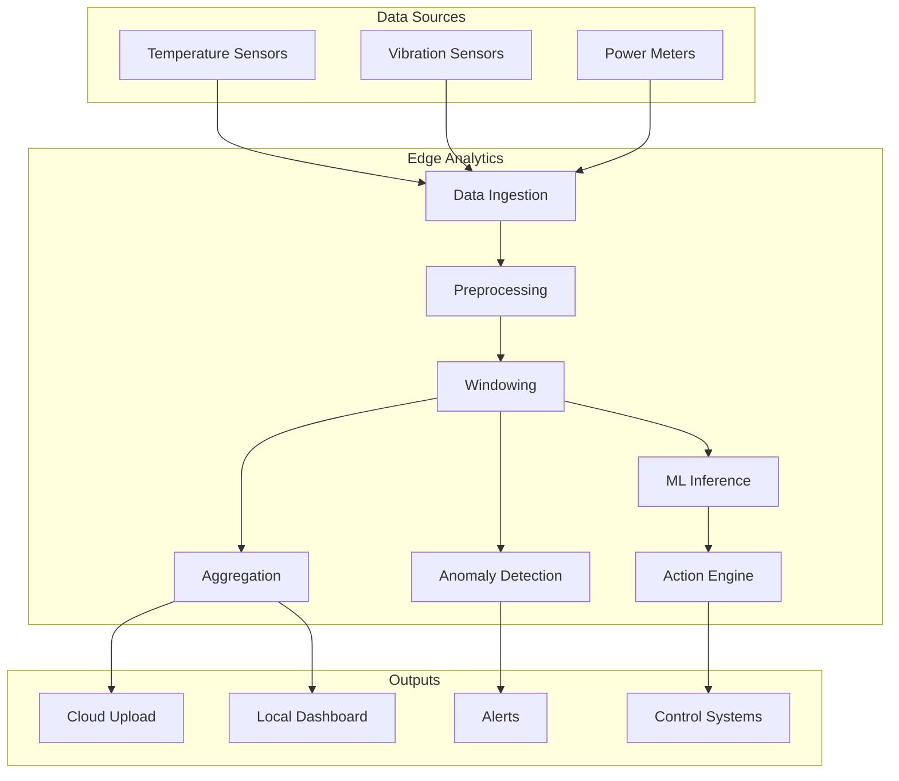

# How to Implement Edge Analytics

Author: [nawazdhandala](https://www.github.com/nawazdhandala)

Tags: Edge Analytics, IoT, Stream Processing, Real-time, Machine Learning, Time Series

Description: Learn how to implement edge analytics for IoT deployments. Build real-time data processing pipelines, implement anomaly detection, create aggregations, and generate insights directly on edge devices.

---

> Edge analytics processes data locally on edge devices before sending results to the cloud. This approach reduces bandwidth costs, enables real-time decision making, and provides insights even when connectivity is unavailable.

Moving analytics to the edge transforms raw sensor data into actionable intelligence at the source. Instead of sending gigabytes of telemetry to the cloud, edge analytics extracts patterns, detects anomalies, and triggers actions locally.

---

## Edge Analytics Architecture



---

## Stream Processing Engine

### Core Processing Framework

```python
# stream_processor.py
# Lightweight stream processing for edge analytics

from dataclasses import dataclass, field
from datetime import datetime, timedelta
from typing import List, Dict, Any, Callable, Optional
from collections import deque
import threading
import time
from abc import ABC, abstractmethod

@dataclass
class DataPoint:
    """Single data point in the stream"""
    timestamp: datetime
    device_id: str
    metric: str
    value: float
    tags: Dict[str, str] = field(default_factory=dict)

class Window(ABC):
    """Base class for windowing strategies"""

    @abstractmethod
    def add(self, point: DataPoint) -> Optional[List[DataPoint]]:
        """Add point and return completed window if ready"""
        pass

class TumblingWindow(Window):
    """Fixed-size non-overlapping time window"""

    def __init__(self, size: timedelta, key_fn: Callable[[DataPoint], str] = None):
        self.size = size
        self.key_fn = key_fn or (lambda p: f"{p.device_id}:{p.metric}")
        self.windows: Dict[str, List[DataPoint]] = {}
        self.window_starts: Dict[str, datetime] = {}

    def add(self, point: DataPoint) -> Optional[List[DataPoint]]:
        key = self.key_fn(point)

        # Initialize window if needed
        if key not in self.windows:
            self.windows[key] = []
            self.window_starts[key] = point.timestamp

        # Check if window should close
        window_start = self.window_starts[key]
        if point.timestamp >= window_start + self.size:
            # Return completed window
            completed = self.windows[key]

            # Start new window
            self.windows[key] = [point]
            self.window_starts[key] = point.timestamp

            return completed if completed else None

        # Add to current window
        self.windows[key].append(point)
        return None

class SlidingWindow(Window):
    """Sliding time window with specified slide interval"""

    def __init__(
        self,
        size: timedelta,
        slide: timedelta,
        key_fn: Callable[[DataPoint], str] = None
    ):
        self.size = size
        self.slide = slide
        self.key_fn = key_fn or (lambda p: f"{p.device_id}:{p.metric}")
        self.buffers: Dict[str, deque] = {}
        self.last_emit: Dict[str, datetime] = {}

    def add(self, point: DataPoint) -> Optional[List[DataPoint]]:
        key = self.key_fn(point)

        # Initialize buffer
        if key not in self.buffers:
            self.buffers[key] = deque()
            self.last_emit[key] = point.timestamp

        # Add point to buffer
        self.buffers[key].append(point)

        # Remove old points outside window
        cutoff = point.timestamp - self.size
        while self.buffers[key] and self.buffers[key][0].timestamp < cutoff:
            self.buffers[key].popleft()

        # Check if we should emit
        if point.timestamp >= self.last_emit[key] + self.slide:
            self.last_emit[key] = point.timestamp
            return list(self.buffers[key])

        return None

class CountWindow(Window):
    """Fixed count window"""

    def __init__(self, count: int, key_fn: Callable[[DataPoint], str] = None):
        self.count = count
        self.key_fn = key_fn or (lambda p: f"{p.device_id}:{p.metric}")
        self.buffers: Dict[str, List[DataPoint]] = {}

    def add(self, point: DataPoint) -> Optional[List[DataPoint]]:
        key = self.key_fn(point)

        if key not in self.buffers:
            self.buffers[key] = []

        self.buffers[key].append(point)

        if len(self.buffers[key]) >= self.count:
            completed = self.buffers[key]
            self.buffers[key] = []
            return completed

        return None
```

### Aggregation Functions

```python
# aggregations.py
# Aggregation functions for edge analytics

import statistics
from typing import List, Dict, Any, Callable
from dataclasses import dataclass
from datetime import datetime

@dataclass
class AggregationResult:
    """Result of an aggregation"""
    device_id: str
    metric: str
    window_start: datetime
    window_end: datetime
    aggregations: Dict[str, float]
    point_count: int

class Aggregator:
    """Performs aggregations over windowed data"""

    def __init__(self):
        self.functions: Dict[str, Callable[[List[float]], float]] = {
            "count": lambda values: len(values),
            "sum": sum,
            "min": min,
            "max": max,
            "avg": statistics.mean,
            "median": statistics.median,
            "std": lambda v: statistics.stdev(v) if len(v) > 1 else 0,
            "variance": lambda v: statistics.variance(v) if len(v) > 1 else 0,
            "range": lambda v: max(v) - min(v),
            "first": lambda v: v[0] if v else None,
            "last": lambda v: v[-1] if v else None,
            "p50": lambda v: statistics.quantiles(v, n=100)[49] if len(v) > 1 else v[0],
            "p90": lambda v: statistics.quantiles(v, n=100)[89] if len(v) > 1 else v[0],
            "p99": lambda v: statistics.quantiles(v, n=100)[98] if len(v) > 1 else v[0],
        }

    def aggregate(
        self,
        points: List[DataPoint],
        aggregations: List[str] = None
    ) -> AggregationResult:
        """Aggregate a list of data points"""
        if not points:
            return None

        aggregations = aggregations or ["count", "avg", "min", "max"]
        values = [p.value for p in points]

        results = {}
        for agg_name in aggregations:
            if agg_name in self.functions:
                try:
                    results[agg_name] = self.functions[agg_name](values)
                except Exception:
                    results[agg_name] = None

        return AggregationResult(
            device_id=points[0].device_id,
            metric=points[0].metric,
            window_start=points[0].timestamp,
            window_end=points[-1].timestamp,
            aggregations=results,
            point_count=len(points)
        )

    def register_function(self, name: str, func: Callable[[List[float]], float]):
        """Register a custom aggregation function"""
        self.functions[name] = func


class RollingAggregator:
    """Memory-efficient rolling aggregations without storing all points"""

    def __init__(self):
        self.states: Dict[str, Dict] = {}

    def update(self, key: str, value: float) -> Dict[str, float]:
        """Update rolling aggregations with new value"""
        if key not in self.states:
            self.states[key] = {
                "count": 0,
                "sum": 0.0,
                "sum_sq": 0.0,  # For variance calculation
                "min": float("inf"),
                "max": float("-inf"),
            }

        state = self.states[key]
        state["count"] += 1
        state["sum"] += value
        state["sum_sq"] += value ** 2
        state["min"] = min(state["min"], value)
        state["max"] = max(state["max"], value)

        # Calculate derived metrics
        n = state["count"]
        mean = state["sum"] / n
        variance = (state["sum_sq"] / n) - (mean ** 2) if n > 1 else 0

        return {
            "count": n,
            "sum": state["sum"],
            "avg": mean,
            "min": state["min"],
            "max": state["max"],
            "variance": max(0, variance),  # Numerical stability
            "std": variance ** 0.5 if variance > 0 else 0,
        }

    def reset(self, key: str):
        """Reset state for a key"""
        if key in self.states:
            del self.states[key]
```

### Anomaly Detection

```python
# anomaly_detection.py
# Real-time anomaly detection for edge analytics

from dataclasses import dataclass
from datetime import datetime
from typing import Dict, List, Optional, Tuple
import math
from collections import deque

@dataclass
class Anomaly:
    """Detected anomaly"""
    timestamp: datetime
    device_id: str
    metric: str
    value: float
    expected_value: float
    score: float  # How anomalous (higher = more anomalous)
    anomaly_type: str
    context: Dict

class ZScoreDetector:
    """Z-score based anomaly detection"""

    def __init__(
        self,
        window_size: int = 100,
        threshold: float = 3.0
    ):
        self.window_size = window_size
        self.threshold = threshold
        self.windows: Dict[str, deque] = {}
        self.stats: Dict[str, Dict] = {}

    def check(
        self,
        device_id: str,
        metric: str,
        value: float,
        timestamp: datetime = None
    ) -> Optional[Anomaly]:
        """Check if value is anomalous"""
        key = f"{device_id}:{metric}"
        timestamp = timestamp or datetime.utcnow()

        # Initialize
        if key not in self.windows:
            self.windows[key] = deque(maxlen=self.window_size)
            self.stats[key] = {"sum": 0, "sum_sq": 0}

        window = self.windows[key]
        stats = self.stats[key]

        # Need minimum samples
        if len(window) < 30:
            self._update_window(key, value)
            return None

        # Calculate z-score
        n = len(window)
        mean = stats["sum"] / n
        variance = (stats["sum_sq"] / n) - (mean ** 2)
        std = math.sqrt(max(0, variance))

        if std == 0:
            self._update_window(key, value)
            return None

        z_score = abs(value - mean) / std

        # Check threshold
        anomaly = None
        if z_score > self.threshold:
            anomaly_type = "spike" if value > mean else "drop"
            anomaly = Anomaly(
                timestamp=timestamp,
                device_id=device_id,
                metric=metric,
                value=value,
                expected_value=mean,
                score=z_score,
                anomaly_type=anomaly_type,
                context={
                    "mean": mean,
                    "std": std,
                    "threshold": self.threshold,
                    "window_size": n
                }
            )

        # Update window
        self._update_window(key, value)

        return anomaly

    def _update_window(self, key: str, value: float):
        """Update sliding window statistics"""
        window = self.windows[key]
        stats = self.stats[key]

        # Remove oldest value from stats if window full
        if len(window) == self.window_size:
            old_value = window[0]
            stats["sum"] -= old_value
            stats["sum_sq"] -= old_value ** 2

        # Add new value
        window.append(value)
        stats["sum"] += value
        stats["sum_sq"] += value ** 2


class IQRDetector:
    """Interquartile range based anomaly detection"""

    def __init__(self, window_size: int = 100, multiplier: float = 1.5):
        self.window_size = window_size
        self.multiplier = multiplier
        self.windows: Dict[str, deque] = {}

    def check(
        self,
        device_id: str,
        metric: str,
        value: float,
        timestamp: datetime = None
    ) -> Optional[Anomaly]:
        """Check if value is anomalous using IQR method"""
        key = f"{device_id}:{metric}"
        timestamp = timestamp or datetime.utcnow()

        if key not in self.windows:
            self.windows[key] = deque(maxlen=self.window_size)

        window = self.windows[key]

        if len(window) < 30:
            window.append(value)
            return None

        # Calculate IQR
        sorted_values = sorted(window)
        n = len(sorted_values)
        q1 = sorted_values[n // 4]
        q3 = sorted_values[3 * n // 4]
        iqr = q3 - q1

        lower_bound = q1 - self.multiplier * iqr
        upper_bound = q3 + self.multiplier * iqr

        anomaly = None
        if value < lower_bound or value > upper_bound:
            median = sorted_values[n // 2]
            score = abs(value - median) / iqr if iqr > 0 else 0

            anomaly = Anomaly(
                timestamp=timestamp,
                device_id=device_id,
                metric=metric,
                value=value,
                expected_value=median,
                score=score,
                anomaly_type="outlier",
                context={
                    "lower_bound": lower_bound,
                    "upper_bound": upper_bound,
                    "q1": q1,
                    "q3": q3,
                    "iqr": iqr
                }
            )

        window.append(value)
        return anomaly


class ChangePointDetector:
    """Detect sudden changes in data distribution"""

    def __init__(self, window_size: int = 50, threshold: float = 2.0):
        self.window_size = window_size
        self.threshold = threshold
        self.history: Dict[str, deque] = {}

    def check(
        self,
        device_id: str,
        metric: str,
        value: float,
        timestamp: datetime = None
    ) -> Optional[Anomaly]:
        """Detect change points in the data"""
        key = f"{device_id}:{metric}"
        timestamp = timestamp or datetime.utcnow()

        if key not in self.history:
            self.history[key] = deque(maxlen=self.window_size * 2)

        history = self.history[key]
        history.append(value)

        if len(history) < self.window_size * 2:
            return None

        # Split into two halves
        half = len(history) // 2
        first_half = list(history)[:half]
        second_half = list(history)[half:]

        # Compare means
        mean1 = sum(first_half) / len(first_half)
        mean2 = sum(second_half) / len(second_half)

        # Calculate pooled standard deviation
        var1 = sum((x - mean1) ** 2 for x in first_half) / len(first_half)
        var2 = sum((x - mean2) ** 2 for x in second_half) / len(second_half)
        pooled_std = math.sqrt((var1 + var2) / 2)

        if pooled_std == 0:
            return None

        # t-statistic
        t_stat = abs(mean2 - mean1) / (pooled_std * math.sqrt(2 / half))

        if t_stat > self.threshold:
            return Anomaly(
                timestamp=timestamp,
                device_id=device_id,
                metric=metric,
                value=value,
                expected_value=mean1,
                score=t_stat,
                anomaly_type="change_point",
                context={
                    "mean_before": mean1,
                    "mean_after": mean2,
                    "t_statistic": t_stat
                }
            )

        return None
```

---

## Complete Analytics Pipeline

```python
# analytics_pipeline.py
# Complete edge analytics pipeline

import asyncio
from datetime import datetime, timedelta
from typing import List, Callable, Dict, Any
import logging

from stream_processor import DataPoint, TumblingWindow, SlidingWindow
from aggregations import Aggregator, AggregationResult
from anomaly_detection import ZScoreDetector, Anomaly

logger = logging.getLogger(__name__)

class AnalyticsPipeline:
    """Complete edge analytics pipeline"""

    def __init__(self):
        # Windows for different time granularities
        self.minute_window = TumblingWindow(timedelta(minutes=1))
        self.five_minute_window = TumblingWindow(timedelta(minutes=5))
        self.hour_window = SlidingWindow(timedelta(hours=1), timedelta(minutes=5))

        # Aggregator
        self.aggregator = Aggregator()

        # Anomaly detectors
        self.zscore_detector = ZScoreDetector(window_size=100, threshold=3.0)

        # Output handlers
        self.on_aggregation: List[Callable[[AggregationResult], None]] = []
        self.on_anomaly: List[Callable[[Anomaly], None]] = []

        # Statistics
        self.stats = {
            "points_processed": 0,
            "aggregations_generated": 0,
            "anomalies_detected": 0
        }

    def register_aggregation_handler(self, handler: Callable[[AggregationResult], None]):
        """Register handler for aggregation results"""
        self.on_aggregation.append(handler)

    def register_anomaly_handler(self, handler: Callable[[Anomaly], None]):
        """Register handler for detected anomalies"""
        self.on_anomaly.append(handler)

    async def process(self, point: DataPoint):
        """Process a single data point through the pipeline"""
        self.stats["points_processed"] += 1

        # Check for anomalies
        anomaly = self.zscore_detector.check(
            point.device_id,
            point.metric,
            point.value,
            point.timestamp
        )

        if anomaly:
            self.stats["anomalies_detected"] += 1
            logger.warning(f"Anomaly detected: {anomaly}")
            for handler in self.on_anomaly:
                await self._safe_call(handler, anomaly)

        # Process through windows
        await self._process_window(self.minute_window, point, ["avg", "min", "max", "count"])
        await self._process_window(self.five_minute_window, point, ["avg", "min", "max", "std", "p90"])
        await self._process_window(self.hour_window, point, ["avg", "min", "max", "std", "p50", "p90", "p99"])

    async def _process_window(
        self,
        window,
        point: DataPoint,
        aggregations: List[str]
    ):
        """Process point through a window"""
        completed = window.add(point)

        if completed:
            result = self.aggregator.aggregate(completed, aggregations)
            if result:
                self.stats["aggregations_generated"] += 1
                for handler in self.on_aggregation:
                    await self._safe_call(handler, result)

    async def _safe_call(self, handler, data):
        """Safely call handler with error handling"""
        try:
            if asyncio.iscoroutinefunction(handler):
                await handler(data)
            else:
                handler(data)
        except Exception as e:
            logger.error(f"Handler error: {e}")

    def get_stats(self) -> Dict:
        """Get pipeline statistics"""
        return self.stats.copy()


async def main():
    """Example usage of analytics pipeline"""

    # Initialize pipeline
    pipeline = AnalyticsPipeline()

    # Register handlers
    def handle_aggregation(result: AggregationResult):
        print(f"Aggregation: {result.metric} "
              f"avg={result.aggregations.get('avg', 0):.2f} "
              f"min={result.aggregations.get('min', 0):.2f} "
              f"max={result.aggregations.get('max', 0):.2f}")

    def handle_anomaly(anomaly: Anomaly):
        print(f"ANOMALY: {anomaly.device_id}/{anomaly.metric} "
              f"value={anomaly.value:.2f} expected={anomaly.expected_value:.2f} "
              f"type={anomaly.anomaly_type}")

    pipeline.register_aggregation_handler(handle_aggregation)
    pipeline.register_anomaly_handler(handle_anomaly)

    # Simulate data
    import random
    device_id = "sensor-001"

    for i in range(1000):
        # Generate value with occasional anomaly
        if random.random() < 0.02:
            value = random.uniform(50, 60)  # Anomalous
        else:
            value = random.gauss(22, 2)  # Normal

        point = DataPoint(
            timestamp=datetime.utcnow(),
            device_id=device_id,
            metric="temperature",
            value=value
        )

        await pipeline.process(point)
        await asyncio.sleep(0.1)

    print(f"\nPipeline stats: {pipeline.get_stats()}")


if __name__ == "__main__":
    asyncio.run(main())
```

---

## Pattern Detection

```python
# pattern_detection.py
# Pattern detection for edge analytics

from dataclasses import dataclass
from datetime import datetime, timedelta
from typing import List, Dict, Optional
from collections import deque
import numpy as np

@dataclass
class Pattern:
    """Detected pattern"""
    pattern_type: str
    device_id: str
    metric: str
    start_time: datetime
    end_time: datetime
    confidence: float
    details: Dict

class TrendDetector:
    """Detect trends in time series data"""

    def __init__(self, window_size: int = 30, min_trend_strength: float = 0.7):
        self.window_size = window_size
        self.min_trend_strength = min_trend_strength
        self.windows: Dict[str, deque] = {}

    def check(
        self,
        device_id: str,
        metric: str,
        value: float,
        timestamp: datetime
    ) -> Optional[Pattern]:
        """Check for trend pattern"""
        key = f"{device_id}:{metric}"

        if key not in self.windows:
            self.windows[key] = deque(maxlen=self.window_size)

        self.windows[key].append((timestamp, value))

        if len(self.windows[key]) < self.window_size:
            return None

        # Calculate linear regression
        points = list(self.windows[key])
        x = np.array([i for i in range(len(points))])
        y = np.array([p[1] for p in points])

        # Linear regression
        n = len(x)
        slope = (n * np.sum(x * y) - np.sum(x) * np.sum(y)) / (n * np.sum(x**2) - np.sum(x)**2)
        intercept = (np.sum(y) - slope * np.sum(x)) / n

        # Calculate R-squared
        y_pred = slope * x + intercept
        ss_res = np.sum((y - y_pred) ** 2)
        ss_tot = np.sum((y - np.mean(y)) ** 2)
        r_squared = 1 - (ss_res / ss_tot) if ss_tot > 0 else 0

        # Determine trend direction
        if abs(r_squared) >= self.min_trend_strength:
            if slope > 0:
                trend_type = "increasing"
            else:
                trend_type = "decreasing"

            return Pattern(
                pattern_type=f"trend_{trend_type}",
                device_id=device_id,
                metric=metric,
                start_time=points[0][0],
                end_time=points[-1][0],
                confidence=abs(r_squared),
                details={
                    "slope": float(slope),
                    "r_squared": float(r_squared),
                    "start_value": points[0][1],
                    "end_value": points[-1][1]
                }
            )

        return None


class SeasonalityDetector:
    """Detect seasonal patterns"""

    def __init__(self, periods: List[int] = None):
        # Common periods: hourly (60), daily (1440 for minute data)
        self.periods = periods or [60, 1440]
        self.history: Dict[str, deque] = {}

    def check(
        self,
        device_id: str,
        metric: str,
        values: List[float]
    ) -> Optional[Pattern]:
        """Check for seasonality in data"""
        if len(values) < max(self.periods) * 2:
            return None

        for period in self.periods:
            if len(values) < period * 2:
                continue

            # Calculate autocorrelation at this period
            correlation = self._autocorrelation(values, period)

            if correlation > 0.7:
                return Pattern(
                    pattern_type=f"seasonal_period_{period}",
                    device_id=device_id,
                    metric=metric,
                    start_time=datetime.utcnow(),
                    end_time=datetime.utcnow(),
                    confidence=correlation,
                    details={
                        "period": period,
                        "autocorrelation": correlation
                    }
                )

        return None

    def _autocorrelation(self, values: List[float], lag: int) -> float:
        """Calculate autocorrelation at given lag"""
        n = len(values)
        mean = sum(values) / n
        var = sum((v - mean) ** 2 for v in values) / n

        if var == 0:
            return 0

        covar = sum(
            (values[i] - mean) * (values[i + lag] - mean)
            for i in range(n - lag)
        ) / (n - lag)

        return covar / var
```

---

## Conclusion

Edge analytics transforms raw IoT data into actionable insights at the source. By implementing windowing, aggregation, anomaly detection, and pattern recognition locally, you can reduce bandwidth, enable real-time responses, and maintain functionality during connectivity outages.

Key components:
- Stream processing with configurable windows
- Flexible aggregation functions
- Multiple anomaly detection algorithms
- Pattern and trend detection
- Composable pipeline architecture

Start with basic aggregations and anomaly detection, then add sophisticated pattern recognition as your requirements grow.

---

*Running edge analytics? [OneUptime](https://oneuptime.com) monitors your analytics pipelines and tracks processing metrics. Visualize anomaly detection rates, aggregation throughput, and pattern discoveries across your edge fleet.*
