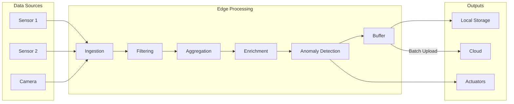

# How to Implement Edge Data Processing

Author: [nawazdhandala](https://www.github.com/nawazdhandala)

Tags: Edge Computing, Data Processing, Stream Processing, IoT, Apache Flink, Time Series, Filtering

Description: Learn how to implement edge data processing to filter, aggregate, and transform IoT data locally before sending it to the cloud. Reduce bandwidth, lower latency, and enable real-time decision making at the edge.

---

> Edge data processing transforms raw sensor data into actionable insights directly on edge devices, reducing cloud bandwidth requirements by up to 90% while enabling millisecond response times for time-critical applications.

Processing data at the edge is not just about reducing costs. It enables use cases impossible with cloud-only architectures: autonomous vehicles making split-second decisions, industrial systems detecting anomalies before equipment fails, and smart cities managing traffic in real time.

---

## Edge Processing Architecture

A typical edge processing pipeline:



---

## Basic Data Pipeline in Python

Start with a simple pipeline for filtering and aggregating sensor data.

### Pipeline Framework

```python
# edge_pipeline.py
# Lightweight edge data processing pipeline

from abc import ABC, abstractmethod
from dataclasses import dataclass, field
from typing import List, Dict, Any, Optional, Callable
from collections import deque
from datetime import datetime, timedelta
import threading
import time
import json

@dataclass
class DataPoint:
    """Represents a single data point from a sensor"""
    device_id: str
    metric: str
    value: float
    timestamp: datetime
    metadata: Dict[str, Any] = field(default_factory=dict)

    def to_dict(self) -> Dict[str, Any]:
        return {
            "device_id": self.device_id,
            "metric": self.metric,
            "value": self.value,
            "timestamp": self.timestamp.isoformat(),
            "metadata": self.metadata
        }

class Processor(ABC):
    """Base class for pipeline processors"""

    @abstractmethod
    def process(self, data: DataPoint) -> Optional[DataPoint]:
        """Process a single data point, return None to filter out"""
        pass

class FilterProcessor(Processor):
    """Filter data points based on conditions"""

    def __init__(self, condition: Callable[[DataPoint], bool]):
        self.condition = condition

    def process(self, data: DataPoint) -> Optional[DataPoint]:
        # Return data only if condition is met
        if self.condition(data):
            return data
        return None

class ThresholdFilter(Processor):
    """Filter values outside acceptable range"""

    def __init__(self, min_value: float = None, max_value: float = None):
        self.min_value = min_value
        self.max_value = max_value

    def process(self, data: DataPoint) -> Optional[DataPoint]:
        # Check minimum threshold
        if self.min_value is not None and data.value < self.min_value:
            return None

        # Check maximum threshold
        if self.max_value is not None and data.value > self.max_value:
            return None

        return data

class DeduplicationProcessor(Processor):
    """Remove duplicate readings within a time window"""

    def __init__(self, window_seconds: int = 60, threshold: float = 0.01):
        self.window_seconds = window_seconds
        self.threshold = threshold
        self.last_values: Dict[str, tuple] = {}

    def process(self, data: DataPoint) -> Optional[DataPoint]:
        key = f"{data.device_id}:{data.metric}"
        now = data.timestamp

        if key in self.last_values:
            last_value, last_time = self.last_values[key]

            # Check if within time window and value is similar
            if (now - last_time).total_seconds() < self.window_seconds:
                if abs(data.value - last_value) <= self.threshold:
                    return None  # Duplicate, filter out

        # Update last value
        self.last_values[key] = (data.value, now)
        return data

class EnrichmentProcessor(Processor):
    """Add metadata and computed fields"""

    def __init__(self, enrichments: Dict[str, Callable[[DataPoint], Any]]):
        self.enrichments = enrichments

    def process(self, data: DataPoint) -> Optional[DataPoint]:
        # Add each enrichment to metadata
        for key, func in self.enrichments.items():
            data.metadata[key] = func(data)
        return data

class Pipeline:
    """Chain of processors for data transformation"""

    def __init__(self, name: str):
        self.name = name
        self.processors: List[Processor] = []
        self.output_handlers: List[Callable[[DataPoint], None]] = []
        self.stats = {"processed": 0, "filtered": 0, "errors": 0}

    def add_processor(self, processor: Processor) -> 'Pipeline':
        """Add a processor to the pipeline"""
        self.processors.append(processor)
        return self

    def add_output(self, handler: Callable[[DataPoint], None]) -> 'Pipeline':
        """Add an output handler"""
        self.output_handlers.append(handler)
        return self

    def process(self, data: DataPoint) -> Optional[DataPoint]:
        """Run data through all processors"""
        try:
            current = data
            for processor in self.processors:
                if current is None:
                    self.stats["filtered"] += 1
                    return None
                current = processor.process(current)

            self.stats["processed"] += 1

            # Send to output handlers
            if current is not None:
                for handler in self.output_handlers:
                    handler(current)

            return current

        except Exception as e:
            self.stats["errors"] += 1
            print(f"Pipeline error: {e}")
            return None
```

### Aggregation Processor

```python
# aggregation.py
# Time-window aggregation for edge processing

from collections import defaultdict
from datetime import datetime, timedelta
from typing import Dict, List, Optional, Callable
from dataclasses import dataclass
import statistics

@dataclass
class AggregatedData:
    """Aggregated metrics over a time window"""
    device_id: str
    metric: str
    window_start: datetime
    window_end: datetime
    count: int
    min_value: float
    max_value: float
    avg_value: float
    sum_value: float
    std_dev: Optional[float] = None

    def to_dict(self) -> Dict:
        return {
            "device_id": self.device_id,
            "metric": self.metric,
            "window_start": self.window_start.isoformat(),
            "window_end": self.window_end.isoformat(),
            "count": self.count,
            "min": self.min_value,
            "max": self.max_value,
            "avg": self.avg_value,
            "sum": self.sum_value,
            "std_dev": self.std_dev
        }

class WindowAggregator:
    """Aggregate data over sliding time windows"""

    def __init__(
        self,
        window_size: timedelta,
        slide_interval: timedelta = None,
        on_window_complete: Callable[[AggregatedData], None] = None
    ):
        self.window_size = window_size
        self.slide_interval = slide_interval or window_size
        self.on_window_complete = on_window_complete

        # Store values per device/metric combination
        # Key: (device_id, metric), Value: list of (timestamp, value)
        self.windows: Dict[tuple, List[tuple]] = defaultdict(list)
        self.last_emit: Dict[tuple, datetime] = {}

    def add(self, device_id: str, metric: str, value: float, timestamp: datetime):
        """Add a data point to the aggregator"""
        key = (device_id, metric)
        self.windows[key].append((timestamp, value))

        # Clean old data outside window
        cutoff = timestamp - self.window_size
        self.windows[key] = [
            (ts, val) for ts, val in self.windows[key]
            if ts >= cutoff
        ]

        # Check if we should emit a window
        if key not in self.last_emit:
            self.last_emit[key] = timestamp

        if timestamp - self.last_emit[key] >= self.slide_interval:
            self._emit_window(key, timestamp)
            self.last_emit[key] = timestamp

    def _emit_window(self, key: tuple, current_time: datetime):
        """Emit aggregated data for a completed window"""
        device_id, metric = key
        values = [val for _, val in self.windows[key]]

        if not values:
            return

        window_start = current_time - self.window_size
        window_end = current_time

        # Calculate aggregations
        aggregated = AggregatedData(
            device_id=device_id,
            metric=metric,
            window_start=window_start,
            window_end=window_end,
            count=len(values),
            min_value=min(values),
            max_value=max(values),
            avg_value=statistics.mean(values),
            sum_value=sum(values),
            std_dev=statistics.stdev(values) if len(values) > 1 else None
        )

        # Call handler if registered
        if self.on_window_complete:
            self.on_window_complete(aggregated)

        return aggregated

    def flush_all(self) -> List[AggregatedData]:
        """Flush all current windows"""
        results = []
        now = datetime.utcnow()
        for key in list(self.windows.keys()):
            result = self._emit_window(key, now)
            if result:
                results.append(result)
        return results


class RollingStatistics:
    """Calculate rolling statistics without storing all values"""

    def __init__(self, window_size: int = 100):
        self.window_size = window_size
        self.values = deque(maxlen=window_size)
        self.sum = 0.0
        self.sum_sq = 0.0

    def add(self, value: float):
        """Add a value and update statistics"""
        # If window is full, remove oldest value from sums
        if len(self.values) == self.window_size:
            old_value = self.values[0]
            self.sum -= old_value
            self.sum_sq -= old_value ** 2

        # Add new value
        self.values.append(value)
        self.sum += value
        self.sum_sq += value ** 2

    @property
    def mean(self) -> float:
        """Calculate current mean"""
        if not self.values:
            return 0.0
        return self.sum / len(self.values)

    @property
    def variance(self) -> float:
        """Calculate current variance"""
        n = len(self.values)
        if n < 2:
            return 0.0
        return (self.sum_sq - (self.sum ** 2) / n) / (n - 1)

    @property
    def std_dev(self) -> float:
        """Calculate current standard deviation"""
        return self.variance ** 0.5

    @property
    def min(self) -> float:
        """Get minimum value in window"""
        return min(self.values) if self.values else 0.0

    @property
    def max(self) -> float:
        """Get maximum value in window"""
        return max(self.values) if self.values else 0.0
```

### Anomaly Detection at the Edge

```python
# anomaly_detection.py
# Real-time anomaly detection for edge processing

from typing import Dict, Optional, Tuple
from dataclasses import dataclass
from datetime import datetime
import math

@dataclass
class AnomalyEvent:
    """Represents a detected anomaly"""
    device_id: str
    metric: str
    value: float
    expected_value: float
    deviation: float
    anomaly_type: str
    severity: str
    timestamp: datetime

class StatisticalAnomalyDetector:
    """Detect anomalies using statistical methods"""

    def __init__(
        self,
        threshold_std: float = 3.0,  # Number of standard deviations
        min_samples: int = 30,        # Minimum samples before detection
        learning_rate: float = 0.01   # Rate of adaptation to new data
    ):
        self.threshold_std = threshold_std
        self.min_samples = min_samples
        self.learning_rate = learning_rate

        # Store statistics per metric
        # Key: (device_id, metric)
        self.stats: Dict[tuple, Dict] = {}

    def _get_stats(self, key: tuple) -> Dict:
        """Get or initialize statistics for a key"""
        if key not in self.stats:
            self.stats[key] = {
                "count": 0,
                "mean": 0.0,
                "m2": 0.0,  # For Welford's algorithm
                "min": float("inf"),
                "max": float("-inf")
            }
        return self.stats[key]

    def _update_stats(self, key: tuple, value: float):
        """Update running statistics using Welford's algorithm"""
        stats = self._get_stats(key)
        stats["count"] += 1
        n = stats["count"]

        # Welford's online algorithm for mean and variance
        delta = value - stats["mean"]
        stats["mean"] += delta / n
        delta2 = value - stats["mean"]
        stats["m2"] += delta * delta2

        # Update min/max
        stats["min"] = min(stats["min"], value)
        stats["max"] = max(stats["max"], value)

    def _get_std_dev(self, key: tuple) -> float:
        """Calculate standard deviation from running stats"""
        stats = self._get_stats(key)
        if stats["count"] < 2:
            return 0.0
        variance = stats["m2"] / (stats["count"] - 1)
        return math.sqrt(variance)

    def check(
        self,
        device_id: str,
        metric: str,
        value: float,
        timestamp: datetime = None
    ) -> Optional[AnomalyEvent]:
        """Check if a value is anomalous"""
        key = (device_id, metric)
        stats = self._get_stats(key)
        timestamp = timestamp or datetime.utcnow()

        # Need minimum samples before detection
        if stats["count"] < self.min_samples:
            self._update_stats(key, value)
            return None

        # Calculate z-score
        std_dev = self._get_std_dev(key)
        if std_dev == 0:
            self._update_stats(key, value)
            return None

        z_score = abs(value - stats["mean"]) / std_dev

        # Check for anomaly
        anomaly = None
        if z_score > self.threshold_std:
            # Determine anomaly type and severity
            if value > stats["mean"]:
                anomaly_type = "spike"
            else:
                anomaly_type = "drop"

            if z_score > self.threshold_std * 2:
                severity = "critical"
            elif z_score > self.threshold_std * 1.5:
                severity = "high"
            else:
                severity = "medium"

            anomaly = AnomalyEvent(
                device_id=device_id,
                metric=metric,
                value=value,
                expected_value=stats["mean"],
                deviation=z_score,
                anomaly_type=anomaly_type,
                severity=severity,
                timestamp=timestamp
            )

        # Update statistics with new value
        # Use exponential moving average for adaptation
        self._update_stats(key, value)

        return anomaly


class ThresholdAnomalyDetector:
    """Simple threshold-based anomaly detection"""

    def __init__(self, thresholds: Dict[str, Tuple[float, float]]):
        # thresholds: metric -> (min, max)
        self.thresholds = thresholds

    def check(
        self,
        device_id: str,
        metric: str,
        value: float,
        timestamp: datetime = None
    ) -> Optional[AnomalyEvent]:
        """Check if value exceeds thresholds"""
        if metric not in self.thresholds:
            return None

        min_val, max_val = self.thresholds[metric]
        timestamp = timestamp or datetime.utcnow()

        if value < min_val:
            return AnomalyEvent(
                device_id=device_id,
                metric=metric,
                value=value,
                expected_value=(min_val + max_val) / 2,
                deviation=min_val - value,
                anomaly_type="below_threshold",
                severity="high" if value < min_val * 0.5 else "medium",
                timestamp=timestamp
            )

        if value > max_val:
            return AnomalyEvent(
                device_id=device_id,
                metric=metric,
                value=value,
                expected_value=(min_val + max_val) / 2,
                deviation=value - max_val,
                anomaly_type="above_threshold",
                severity="high" if value > max_val * 1.5 else "medium",
                timestamp=timestamp
            )

        return None
```

### Complete Edge Processing Example

```python
# main.py
# Complete edge data processing application

import json
import time
from datetime import datetime, timedelta
from queue import Queue
import threading

# Import our modules
from edge_pipeline import Pipeline, FilterProcessor, ThresholdFilter
from edge_pipeline import DeduplicationProcessor, EnrichmentProcessor, DataPoint
from aggregation import WindowAggregator
from anomaly_detection import StatisticalAnomalyDetector, ThresholdAnomalyDetector

# Configuration
DEVICE_ID = "edge-sensor-001"
UPLOAD_INTERVAL = 60  # Seconds between cloud uploads

# Queues for inter-component communication
anomaly_queue = Queue()
upload_queue = Queue()

# Initialize anomaly detectors
stat_detector = StatisticalAnomalyDetector(threshold_std=3.0)
threshold_detector = ThresholdAnomalyDetector({
    "temperature": (-10, 50),
    "humidity": (0, 100),
    "pressure": (900, 1100)
})

def on_aggregation_complete(aggregated):
    """Handler for completed aggregation windows"""
    print(f"Aggregated: {aggregated.metric} "
          f"avg={aggregated.avg_value:.2f} "
          f"min={aggregated.min_value:.2f} "
          f"max={aggregated.max_value:.2f}")

    # Queue for cloud upload
    upload_queue.put(aggregated.to_dict())

# Initialize aggregator
aggregator = WindowAggregator(
    window_size=timedelta(minutes=5),
    slide_interval=timedelta(minutes=1),
    on_window_complete=on_aggregation_complete
)

def check_anomalies(data: DataPoint):
    """Check for anomalies and queue alerts"""
    # Statistical anomaly check
    stat_anomaly = stat_detector.check(
        data.device_id, data.metric, data.value, data.timestamp
    )
    if stat_anomaly:
        print(f"ANOMALY (stat): {stat_anomaly.metric} = {stat_anomaly.value} "
              f"({stat_anomaly.severity})")
        anomaly_queue.put(stat_anomaly)

    # Threshold check
    threshold_anomaly = threshold_detector.check(
        data.device_id, data.metric, data.value, data.timestamp
    )
    if threshold_anomaly:
        print(f"ANOMALY (threshold): {threshold_anomaly.metric} = "
              f"{threshold_anomaly.value} ({threshold_anomaly.severity})")
        anomaly_queue.put(threshold_anomaly)

def process_output(data: DataPoint):
    """Handle processed data"""
    # Add to aggregator
    aggregator.add(data.device_id, data.metric, data.value, data.timestamp)

    # Check for anomalies
    check_anomalies(data)

# Build the processing pipeline
pipeline = Pipeline("sensor-pipeline")
pipeline.add_processor(ThresholdFilter(min_value=-50, max_value=100))
pipeline.add_processor(DeduplicationProcessor(window_seconds=5, threshold=0.1))
pipeline.add_processor(EnrichmentProcessor({
    "processed_at": lambda d: datetime.utcnow().isoformat(),
    "edge_node": lambda d: DEVICE_ID
}))
pipeline.add_output(process_output)

def cloud_uploader():
    """Background thread for uploading to cloud"""
    batch = []
    last_upload = time.time()

    while True:
        try:
            # Collect data for batch
            while not upload_queue.empty():
                batch.append(upload_queue.get_nowait())

            # Upload if batch is ready or interval elapsed
            if batch and (len(batch) >= 100 or
                         time.time() - last_upload >= UPLOAD_INTERVAL):
                upload_to_cloud(batch)
                batch = []
                last_upload = time.time()

            time.sleep(1)

        except Exception as e:
            print(f"Upload error: {e}")

def upload_to_cloud(batch):
    """Upload batch to cloud (implement your cloud connection)"""
    print(f"Uploading {len(batch)} records to cloud")
    # Example: HTTP POST, MQTT publish, etc.
    # In production, implement retry logic and local buffering

def simulate_sensor():
    """Simulate sensor readings"""
    import random
    metrics = ["temperature", "humidity", "pressure"]

    while True:
        for metric in metrics:
            # Generate realistic values with occasional anomalies
            if random.random() < 0.02:  # 2% chance of anomaly
                value = random.uniform(60, 80)  # Anomalous temperature
            else:
                value = {
                    "temperature": random.gauss(22, 2),
                    "humidity": random.gauss(50, 5),
                    "pressure": random.gauss(1013, 10)
                }[metric]

            data_point = DataPoint(
                device_id=DEVICE_ID,
                metric=metric,
                value=round(value, 2),
                timestamp=datetime.utcnow()
            )

            # Process through pipeline
            pipeline.process(data_point)

        time.sleep(1)

if __name__ == "__main__":
    # Start cloud uploader in background
    uploader_thread = threading.Thread(target=cloud_uploader, daemon=True)
    uploader_thread.start()

    print("Edge data processing started")
    print(f"Pipeline stats: {pipeline.stats}")

    # Start sensor simulation
    try:
        simulate_sensor()
    except KeyboardInterrupt:
        print("\nShutting down...")
        print(f"Final stats: {pipeline.stats}")
```

---

## Conclusion

Edge data processing reduces cloud bandwidth and enables real-time responses. By filtering noise, aggregating metrics, and detecting anomalies locally, you can build IoT systems that are faster, more reliable, and more cost-effective.

Key implementation patterns:
- Filter invalid and duplicate data early in the pipeline
- Aggregate time-series data into windows before upload
- Use statistical methods for adaptive anomaly detection
- Buffer data locally for intermittent connectivity
- Keep processing logic modular for easy updates

Start with simple filtering and aggregation, then add sophisticated processing as your requirements evolve.

---

*Processing data at the edge? [OneUptime](https://oneuptime.com) helps you monitor edge processing pipelines with distributed tracing and metrics. Track data flow from sensors through edge processors to the cloud with end-to-end visibility.*
