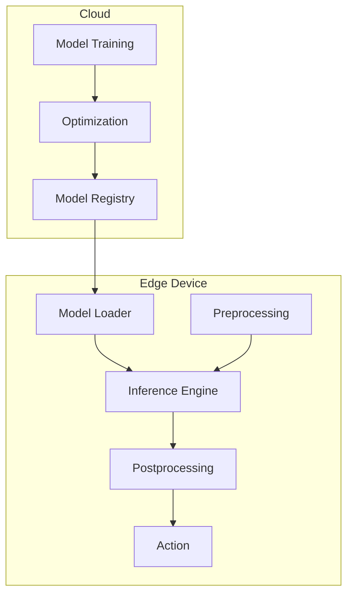

# How to Implement Edge Machine Learning

Author: [nawazdhandala](https://www.github.com/nawazdhandala)

Tags: Edge ML, Machine Learning, TensorFlow Lite, ONNX, IoT, Inference, Model Optimization

Description: Learn how to deploy machine learning models on edge devices for real-time inference. Cover model optimization, TensorFlow Lite, ONNX Runtime, and practical patterns for running ML at the edge.

---

> Edge machine learning brings inference directly to IoT devices, enabling real-time decisions without cloud latency. By running optimized models locally, devices can detect anomalies, classify images, and predict failures in milliseconds.

This guide covers practical techniques for deploying ML models on resource-constrained edge devices.

---

## Edge ML Architecture



---

## TensorFlow Lite on Edge

### Model Conversion

```python
# model_conversion.py
# Convert TensorFlow models to TensorFlow Lite

import tensorflow as tf
import numpy as np

def convert_to_tflite(
    saved_model_path: str,
    output_path: str,
    quantize: bool = True,
    representative_dataset = None
):
    """Convert TensorFlow model to TensorFlow Lite"""

    # Load model
    converter = tf.lite.TFLiteConverter.from_saved_model(saved_model_path)

    if quantize:
        # Enable optimization
        converter.optimizations = [tf.lite.Optimize.DEFAULT]

        if representative_dataset:
            # Full integer quantization (smallest size, fastest inference)
            converter.representative_dataset = representative_dataset
            converter.target_spec.supported_ops = [tf.lite.OpsSet.TFLITE_BUILTINS_INT8]
            converter.inference_input_type = tf.int8
            converter.inference_output_type = tf.int8
        else:
            # Dynamic range quantization
            converter.target_spec.supported_types = [tf.float16]

    # Convert
    tflite_model = converter.convert()

    # Save
    with open(output_path, 'wb') as f:
        f.write(tflite_model)

    # Print size comparison
    import os
    original_size = get_dir_size(saved_model_path)
    tflite_size = os.path.getsize(output_path)
    print(f"Original model: {original_size / 1024 / 1024:.2f} MB")
    print(f"TFLite model: {tflite_size / 1024 / 1024:.2f} MB")
    print(f"Compression: {(1 - tflite_size / original_size) * 100:.1f}%")

    return output_path

def get_dir_size(path):
    total = 0
    for entry in os.scandir(path):
        if entry.is_file():
            total += entry.stat().st_size
        elif entry.is_dir():
            total += get_dir_size(entry.path)
    return total

def create_representative_dataset(data_samples):
    """Create representative dataset for quantization"""
    def representative_data_gen():
        for sample in data_samples[:100]:  # Use 100 samples
            yield [sample.astype(np.float32)]
    return representative_data_gen


# Example: Convert anomaly detection model
if __name__ == "__main__":
    # Generate sample data for quantization
    sample_data = np.random.randn(100, 10).astype(np.float32)
    rep_dataset = create_representative_dataset(sample_data)

    convert_to_tflite(
        saved_model_path="./models/anomaly_detector",
        output_path="./models/anomaly_detector.tflite",
        quantize=True,
        representative_dataset=rep_dataset
    )
```

### TFLite Inference

```python
# tflite_inference.py
# TensorFlow Lite inference on edge devices

import numpy as np
from typing import List, Dict, Any
import logging

logger = logging.getLogger(__name__)

class TFLiteModel:
    """TensorFlow Lite model for edge inference"""

    def __init__(self, model_path: str):
        import tflite_runtime.interpreter as tflite

        self.interpreter = tflite.Interpreter(model_path=model_path)
        self.interpreter.allocate_tensors()

        # Get input/output details
        self.input_details = self.interpreter.get_input_details()
        self.output_details = self.interpreter.get_output_details()

        # Get quantization parameters if available
        self.input_scale = self.input_details[0].get('quantization', (1.0, 0))[0]
        self.input_zero_point = self.input_details[0].get('quantization', (1.0, 0))[1]

        logger.info(f"Loaded TFLite model: {model_path}")
        logger.info(f"Input shape: {self.input_details[0]['shape']}")
        logger.info(f"Input dtype: {self.input_details[0]['dtype']}")

    def predict(self, input_data: np.ndarray) -> np.ndarray:
        """Run inference on input data"""
        # Ensure correct shape
        if len(input_data.shape) == 1:
            input_data = np.expand_dims(input_data, axis=0)

        # Quantize input if needed
        if self.input_details[0]['dtype'] == np.int8:
            input_data = (input_data / self.input_scale + self.input_zero_point).astype(np.int8)
        else:
            input_data = input_data.astype(self.input_details[0]['dtype'])

        # Set input tensor
        self.interpreter.set_tensor(self.input_details[0]['index'], input_data)

        # Run inference
        self.interpreter.invoke()

        # Get output
        output = self.interpreter.get_tensor(self.output_details[0]['index'])

        # Dequantize output if needed
        if self.output_details[0]['dtype'] == np.int8:
            output_scale = self.output_details[0].get('quantization', (1.0, 0))[0]
            output_zero_point = self.output_details[0].get('quantization', (1.0, 0))[1]
            output = (output.astype(np.float32) - output_zero_point) * output_scale

        return output

    def predict_batch(self, inputs: List[np.ndarray]) -> List[np.ndarray]:
        """Run inference on batch of inputs"""
        return [self.predict(inp) for inp in inputs]


class AnomalyDetector:
    """Anomaly detection using TFLite model"""

    def __init__(self, model_path: str, threshold: float = 0.5):
        self.model = TFLiteModel(model_path)
        self.threshold = threshold

    def detect(self, features: np.ndarray) -> Dict[str, Any]:
        """Detect anomalies in input features"""
        # Run inference
        scores = self.model.predict(features)

        # Get anomaly score (assuming single output)
        anomaly_score = float(scores[0][0])

        # Determine if anomaly
        is_anomaly = anomaly_score > self.threshold

        return {
            "is_anomaly": is_anomaly,
            "score": anomaly_score,
            "threshold": self.threshold
        }


class ImageClassifier:
    """Image classification using TFLite"""

    def __init__(self, model_path: str, labels_path: str):
        self.model = TFLiteModel(model_path)
        self.labels = self._load_labels(labels_path)

        # Get expected input size
        self.input_shape = self.model.input_details[0]['shape'][1:3]

    def _load_labels(self, path: str) -> List[str]:
        with open(path, 'r') as f:
            return [line.strip() for line in f.readlines()]

    def preprocess(self, image: np.ndarray) -> np.ndarray:
        """Preprocess image for inference"""
        from PIL import Image

        # Resize
        img = Image.fromarray(image)
        img = img.resize(self.input_shape)

        # Convert to numpy and normalize
        img_array = np.array(img, dtype=np.float32)
        img_array = img_array / 255.0  # Normalize to [0, 1]

        return img_array

    def classify(self, image: np.ndarray, top_k: int = 5) -> List[Dict]:
        """Classify image and return top-k predictions"""
        # Preprocess
        processed = self.preprocess(image)

        # Run inference
        predictions = self.model.predict(processed)

        # Get top-k predictions
        top_indices = np.argsort(predictions[0])[-top_k:][::-1]

        results = []
        for idx in top_indices:
            results.append({
                "label": self.labels[idx],
                "confidence": float(predictions[0][idx])
            })

        return results
```

---

## ONNX Runtime on Edge

```python
# onnx_inference.py
# ONNX Runtime inference for edge devices

import numpy as np
import onnxruntime as ort
from typing import List, Dict, Any, Optional
import logging

logger = logging.getLogger(__name__)

class ONNXModel:
    """ONNX Runtime model for edge inference"""

    def __init__(
        self,
        model_path: str,
        providers: List[str] = None
    ):
        # Default to CPU provider for edge
        providers = providers or ['CPUExecutionProvider']

        # Session options for edge optimization
        sess_options = ort.SessionOptions()
        sess_options.graph_optimization_level = ort.GraphOptimizationLevel.ORT_ENABLE_ALL
        sess_options.intra_op_num_threads = 2  # Limit threads for edge devices

        self.session = ort.InferenceSession(
            model_path,
            sess_options=sess_options,
            providers=providers
        )

        # Get model metadata
        self.input_name = self.session.get_inputs()[0].name
        self.input_shape = self.session.get_inputs()[0].shape
        self.output_name = self.session.get_outputs()[0].name

        logger.info(f"Loaded ONNX model: {model_path}")
        logger.info(f"Input: {self.input_name}, shape: {self.input_shape}")

    def predict(self, input_data: np.ndarray) -> np.ndarray:
        """Run inference"""
        # Ensure correct shape
        if len(input_data.shape) == len(self.input_shape) - 1:
            input_data = np.expand_dims(input_data, axis=0)

        # Ensure correct dtype
        input_data = input_data.astype(np.float32)

        # Run inference
        outputs = self.session.run(
            [self.output_name],
            {self.input_name: input_data}
        )

        return outputs[0]


class TimeSeriesPredictor:
    """Time series prediction using ONNX model"""

    def __init__(
        self,
        model_path: str,
        window_size: int = 30,
        scaler_params: Dict = None
    ):
        self.model = ONNXModel(model_path)
        self.window_size = window_size
        self.scaler_params = scaler_params or {"mean": 0, "std": 1}
        self.history = []

    def add_value(self, value: float):
        """Add new value to history"""
        self.history.append(value)
        if len(self.history) > self.window_size:
            self.history = self.history[-self.window_size:]

    def predict_next(self, steps: int = 1) -> List[float]:
        """Predict next values"""
        if len(self.history) < self.window_size:
            return []

        # Normalize input
        window = np.array(self.history[-self.window_size:])
        normalized = (window - self.scaler_params["mean"]) / self.scaler_params["std"]

        # Predict
        predictions = []
        current_window = normalized.copy()

        for _ in range(steps):
            input_data = current_window.reshape(1, -1, 1).astype(np.float32)
            pred = self.model.predict(input_data)

            # Denormalize
            pred_value = float(pred[0][0] * self.scaler_params["std"] + self.scaler_params["mean"])
            predictions.append(pred_value)

            # Update window for next prediction
            current_window = np.roll(current_window, -1)
            current_window[-1] = (pred_value - self.scaler_params["mean"]) / self.scaler_params["std"]

        return predictions
```

---

## Model Optimization

```python
# model_optimization.py
# Techniques for optimizing ML models for edge

import numpy as np
from typing import Tuple

def prune_model(model, target_sparsity: float = 0.5):
    """Prune model weights to reduce size"""
    import tensorflow as tf
    import tensorflow_model_optimization as tfmot

    # Define pruning schedule
    pruning_params = {
        'pruning_schedule': tfmot.sparsity.keras.PolynomialDecay(
            initial_sparsity=0.0,
            final_sparsity=target_sparsity,
            begin_step=0,
            end_step=1000
        )
    }

    # Apply pruning
    model_for_pruning = tfmot.sparsity.keras.prune_low_magnitude(
        model, **pruning_params
    )

    return model_for_pruning


def quantize_weights(weights: np.ndarray, bits: int = 8) -> Tuple[np.ndarray, float, float]:
    """Quantize weights to lower precision"""
    # Find min/max
    w_min = weights.min()
    w_max = weights.max()

    # Calculate scale and zero point
    scale = (w_max - w_min) / (2**bits - 1)
    zero_point = -w_min / scale

    # Quantize
    quantized = np.round(weights / scale + zero_point).astype(np.int8 if bits == 8 else np.int16)

    return quantized, scale, zero_point


def apply_knowledge_distillation(
    teacher_model,
    student_model,
    train_data,
    temperature: float = 3.0
):
    """Train smaller model using knowledge distillation"""
    import tensorflow as tf

    # Get teacher predictions
    teacher_preds = teacher_model.predict(train_data)

    # Soften predictions with temperature
    soft_targets = tf.nn.softmax(teacher_preds / temperature)

    # Custom loss combining soft and hard targets
    def distillation_loss(y_true, y_pred):
        hard_loss = tf.keras.losses.categorical_crossentropy(y_true, y_pred)
        soft_loss = tf.keras.losses.categorical_crossentropy(soft_targets, y_pred)
        return 0.5 * hard_loss + 0.5 * soft_loss

    student_model.compile(optimizer='adam', loss=distillation_loss)
    return student_model


class ModelBenchmark:
    """Benchmark model performance on edge device"""

    def __init__(self, model):
        self.model = model

    def measure_latency(self, input_shape: tuple, iterations: int = 100) -> Dict:
        """Measure inference latency"""
        import time

        # Generate random input
        test_input = np.random.randn(*input_shape).astype(np.float32)

        # Warmup
        for _ in range(10):
            self.model.predict(test_input)

        # Measure
        latencies = []
        for _ in range(iterations):
            start = time.perf_counter()
            self.model.predict(test_input)
            end = time.perf_counter()
            latencies.append((end - start) * 1000)  # ms

        return {
            "mean_ms": np.mean(latencies),
            "std_ms": np.std(latencies),
            "min_ms": np.min(latencies),
            "max_ms": np.max(latencies),
            "p95_ms": np.percentile(latencies, 95),
            "p99_ms": np.percentile(latencies, 99)
        }

    def measure_memory(self) -> Dict:
        """Measure memory usage"""
        import psutil
        import os

        process = psutil.Process(os.getpid())
        memory_info = process.memory_info()

        return {
            "rss_mb": memory_info.rss / 1024 / 1024,
            "vms_mb": memory_info.vms / 1024 / 1024
        }
```

---

## Edge ML Pipeline

```python
# edge_ml_pipeline.py
# Complete ML pipeline for edge devices

import asyncio
import numpy as np
from datetime import datetime
from typing import Dict, List, Callable, Any
from dataclasses import dataclass
import logging

logger = logging.getLogger(__name__)

@dataclass
class InferenceResult:
    """Result of ML inference"""
    timestamp: datetime
    model_name: str
    input_hash: str
    output: Any
    latency_ms: float
    confidence: float = None

class EdgeMLPipeline:
    """ML inference pipeline for edge devices"""

    def __init__(self, model_path: str, model_type: str = "tflite"):
        if model_type == "tflite":
            self.model = TFLiteModel(model_path)
        elif model_type == "onnx":
            self.model = ONNXModel(model_path)
        else:
            raise ValueError(f"Unknown model type: {model_type}")

        self.model_name = model_path.split("/")[-1]
        self.preprocessors: List[Callable] = []
        self.postprocessors: List[Callable] = []

        # Statistics
        self.inference_count = 0
        self.total_latency_ms = 0

    def add_preprocessor(self, func: Callable):
        """Add preprocessing function"""
        self.preprocessors.append(func)

    def add_postprocessor(self, func: Callable):
        """Add postprocessing function"""
        self.postprocessors.append(func)

    def infer(self, input_data: np.ndarray) -> InferenceResult:
        """Run inference pipeline"""
        import time
        import hashlib

        start = time.perf_counter()

        # Preprocess
        processed = input_data
        for preprocessor in self.preprocessors:
            processed = preprocessor(processed)

        # Inference
        raw_output = self.model.predict(processed)

        # Postprocess
        output = raw_output
        for postprocessor in self.postprocessors:
            output = postprocessor(output)

        end = time.perf_counter()
        latency_ms = (end - start) * 1000

        # Update statistics
        self.inference_count += 1
        self.total_latency_ms += latency_ms

        # Create result
        input_hash = hashlib.md5(input_data.tobytes()).hexdigest()[:8]

        return InferenceResult(
            timestamp=datetime.utcnow(),
            model_name=self.model_name,
            input_hash=input_hash,
            output=output,
            latency_ms=latency_ms
        )

    def get_stats(self) -> Dict:
        """Get inference statistics"""
        return {
            "inference_count": self.inference_count,
            "avg_latency_ms": self.total_latency_ms / max(self.inference_count, 1),
            "total_latency_ms": self.total_latency_ms
        }


async def main():
    """Example edge ML pipeline"""

    # Initialize pipeline
    pipeline = EdgeMLPipeline(
        model_path="./models/anomaly_detector.tflite",
        model_type="tflite"
    )

    # Add preprocessing (normalize)
    pipeline.add_preprocessor(lambda x: (x - x.mean()) / x.std())

    # Add postprocessing (threshold)
    pipeline.add_postprocessor(lambda x: {"anomaly": bool(x[0][0] > 0.5), "score": float(x[0][0])})

    # Simulate sensor data
    while True:
        # Collect sensor features
        features = np.random.randn(10).astype(np.float32)

        # Run inference
        result = pipeline.infer(features)

        if result.output["anomaly"]:
            logger.warning(f"Anomaly detected! Score: {result.output['score']:.3f}")

        logger.info(f"Inference: {result.latency_ms:.2f}ms")

        await asyncio.sleep(1)


if __name__ == "__main__":
    asyncio.run(main())
```

---

## Conclusion

Edge ML enables real-time intelligence without cloud latency. Key techniques include:

- Model quantization (INT8) for 4x smaller models
- TensorFlow Lite for mobile and embedded devices
- ONNX Runtime for cross-platform deployment
- Pruning and knowledge distillation for smaller models
- Proper preprocessing and postprocessing pipelines

Start with pre-trained models, optimize for your hardware, and iterate based on latency requirements.

---

*Running ML at the edge? [OneUptime](https://oneuptime.com) monitors your ML inference pipelines. Track latency, throughput, and model accuracy across your edge fleet.*
