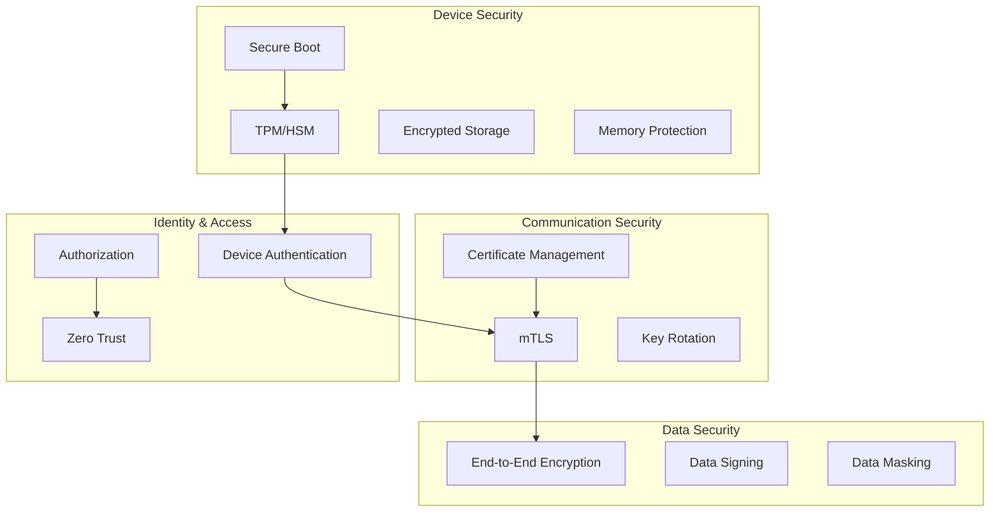

# How to Implement Edge Security Patterns

Author: [nawazdhandala](https://www.github.com/nawazdhandala)

Tags: Edge Computing, Security, IoT, Encryption, Authentication, Zero Trust, TLS

Description: Learn essential security patterns for edge computing and IoT deployments. Cover device authentication, secure communication, data encryption, secure boot, and zero-trust architecture for edge environments.

---

> Edge devices operate in physically exposed environments where attackers can gain direct access. Unlike data center servers behind firewalls, edge devices require defense-in-depth security strategies that assume compromise is possible.

This guide covers security patterns specifically designed for edge computing environments, where traditional perimeter security does not apply.

---

## Edge Security Architecture



---

## Device Authentication

### X.509 Certificate-Based Authentication

```python
# device_auth.py
# Device authentication using X.509 certificates

from cryptography import x509
from cryptography.x509.oid import NameOID, ExtendedKeyUsageOID
from cryptography.hazmat.primitives import hashes, serialization
from cryptography.hazmat.primitives.asymmetric import ec
from datetime import datetime, timedelta
import os

class DeviceCertificateManager:
    """Manages device certificates for authentication"""

    def __init__(self, ca_cert_path: str, ca_key_path: str):
        # Load CA certificate and key
        with open(ca_cert_path, 'rb') as f:
            self.ca_cert = x509.load_pem_x509_certificate(f.read())

        with open(ca_key_path, 'rb') as f:
            self.ca_key = serialization.load_pem_private_key(f.read(), password=None)

    def generate_device_certificate(
        self,
        device_id: str,
        valid_days: int = 365
    ) -> tuple:
        """Generate a new device certificate signed by CA"""

        # Generate device private key (ECDSA P-256)
        device_key = ec.generate_private_key(ec.SECP256R1())

        # Build certificate subject
        subject = x509.Name([
            x509.NameAttribute(NameOID.COUNTRY_NAME, "US"),
            x509.NameAttribute(NameOID.ORGANIZATION_NAME, "MyCompany"),
            x509.NameAttribute(NameOID.ORGANIZATIONAL_UNIT_NAME, "IoT Devices"),
            x509.NameAttribute(NameOID.COMMON_NAME, device_id),
        ])

        # Build certificate
        cert_builder = x509.CertificateBuilder()
        cert_builder = cert_builder.subject_name(subject)
        cert_builder = cert_builder.issuer_name(self.ca_cert.subject)
        cert_builder = cert_builder.public_key(device_key.public_key())
        cert_builder = cert_builder.serial_number(x509.random_serial_number())
        cert_builder = cert_builder.not_valid_before(datetime.utcnow())
        cert_builder = cert_builder.not_valid_after(
            datetime.utcnow() + timedelta(days=valid_days)
        )

        # Add extensions
        cert_builder = cert_builder.add_extension(
            x509.BasicConstraints(ca=False, path_length=None),
            critical=True
        )
        cert_builder = cert_builder.add_extension(
            x509.KeyUsage(
                digital_signature=True,
                key_encipherment=True,
                content_commitment=False,
                data_encipherment=False,
                key_agreement=False,
                key_cert_sign=False,
                crl_sign=False,
                encipher_only=False,
                decipher_only=False
            ),
            critical=True
        )
        cert_builder = cert_builder.add_extension(
            x509.ExtendedKeyUsage([
                ExtendedKeyUsageOID.CLIENT_AUTH,
            ]),
            critical=False
        )

        # Add Subject Alternative Name with device ID
        cert_builder = cert_builder.add_extension(
            x509.SubjectAlternativeName([
                x509.DNSName(f"{device_id}.devices.example.com"),
            ]),
            critical=False
        )

        # Sign with CA key
        certificate = cert_builder.sign(self.ca_key, hashes.SHA256())

        # Serialize
        cert_pem = certificate.public_bytes(serialization.Encoding.PEM)
        key_pem = device_key.private_bytes(
            encoding=serialization.Encoding.PEM,
            format=serialization.PrivateFormat.PKCS8,
            encryption_algorithm=serialization.NoEncryption()
        )

        return cert_pem, key_pem

    def verify_device_certificate(self, cert_pem: bytes) -> dict:
        """Verify a device certificate"""
        try:
            cert = x509.load_pem_x509_certificate(cert_pem)

            # Check if certificate is signed by our CA
            self.ca_cert.public_key().verify(
                cert.signature,
                cert.tbs_certificate_bytes,
                ec.ECDSA(hashes.SHA256())
            )

            # Check validity period
            now = datetime.utcnow()
            if now < cert.not_valid_before or now > cert.not_valid_after:
                return {"valid": False, "error": "Certificate expired or not yet valid"}

            # Extract device ID from CN
            cn = cert.subject.get_attributes_for_oid(NameOID.COMMON_NAME)[0].value

            return {
                "valid": True,
                "device_id": cn,
                "expires": cert.not_valid_after,
                "serial": cert.serial_number
            }

        except Exception as e:
            return {"valid": False, "error": str(e)}
```

### mTLS Server Implementation

```python
# mtls_server.py
# mTLS server for secure device communication

import ssl
import asyncio
from aiohttp import web

def create_mtls_ssl_context(
    server_cert_path: str,
    server_key_path: str,
    ca_cert_path: str
) -> ssl.SSLContext:
    """Create SSL context with mutual TLS"""

    # Create context requiring client certificates
    ssl_context = ssl.create_default_context(ssl.Purpose.CLIENT_AUTH)

    # Load server certificate
    ssl_context.load_cert_chain(
        certfile=server_cert_path,
        keyfile=server_key_path
    )

    # Load CA for verifying client certificates
    ssl_context.load_verify_locations(cafile=ca_cert_path)

    # Require client certificate
    ssl_context.verify_mode = ssl.CERT_REQUIRED

    # Set minimum TLS version
    ssl_context.minimum_version = ssl.TLSVersion.TLSv1_2

    # Disable insecure ciphers
    ssl_context.set_ciphers('ECDHE+AESGCM:DHE+AESGCM:ECDHE+CHACHA20')

    return ssl_context


@web.middleware
async def device_auth_middleware(request, handler):
    """Middleware to extract device identity from client certificate"""

    # Get peer certificate
    transport = request.transport
    ssl_object = transport.get_extra_info('ssl_object')

    if ssl_object:
        peer_cert = ssl_object.getpeercert()
        if peer_cert:
            # Extract device ID from certificate subject
            subject = dict(x[0] for x in peer_cert['subject'])
            device_id = subject.get('commonName')
            request['device_id'] = device_id

    return await handler(request)


async def handle_telemetry(request):
    """Handle telemetry from authenticated device"""
    device_id = request.get('device_id')
    if not device_id:
        return web.json_response({"error": "Unauthorized"}, status=401)

    data = await request.json()
    # Process telemetry from verified device
    print(f"Telemetry from {device_id}: {data}")

    return web.json_response({"status": "ok"})


def create_app():
    app = web.Application(middlewares=[device_auth_middleware])
    app.router.add_post('/api/telemetry', handle_telemetry)
    return app


if __name__ == '__main__':
    ssl_context = create_mtls_ssl_context(
        'server.crt',
        'server.key',
        'ca.crt'
    )

    app = create_app()
    web.run_app(app, ssl_context=ssl_context, port=8443)
```

---

## Secure Data Storage

### Encrypted Local Storage

```python
# secure_storage.py
# Encrypted storage for sensitive data on edge devices

from cryptography.hazmat.primitives.ciphers.aead import AESGCM
from cryptography.hazmat.primitives import hashes
from cryptography.hazmat.primitives.kdf.pbkdf2 import PBKDF2HMAC
import os
import json
import base64
from typing import Any, Optional

class SecureStorage:
    """Encrypted storage for edge devices"""

    def __init__(self, storage_path: str, master_key: bytes = None):
        self.storage_path = storage_path
        self.key = master_key or self._derive_key_from_hardware()

        # Ensure storage directory exists
        os.makedirs(os.path.dirname(storage_path), exist_ok=True)

    def _derive_key_from_hardware(self) -> bytes:
        """Derive encryption key from hardware identifier"""
        # In production, use TPM or secure element
        # This is a simplified example using machine-id
        try:
            with open('/etc/machine-id', 'r') as f:
                machine_id = f.read().strip()
        except FileNotFoundError:
            machine_id = 'default-fallback-id'

        # Derive key using PBKDF2
        kdf = PBKDF2HMAC(
            algorithm=hashes.SHA256(),
            length=32,
            salt=b'edge-device-salt',  # In production, use unique salt per device
            iterations=100000
        )
        return kdf.derive(machine_id.encode())

    def _encrypt(self, data: bytes) -> bytes:
        """Encrypt data using AES-GCM"""
        # Generate random nonce
        nonce = os.urandom(12)

        # Encrypt
        aesgcm = AESGCM(self.key)
        ciphertext = aesgcm.encrypt(nonce, data, None)

        # Return nonce + ciphertext
        return nonce + ciphertext

    def _decrypt(self, encrypted_data: bytes) -> bytes:
        """Decrypt data"""
        # Extract nonce and ciphertext
        nonce = encrypted_data[:12]
        ciphertext = encrypted_data[12:]

        # Decrypt
        aesgcm = AESGCM(self.key)
        return aesgcm.decrypt(nonce, ciphertext, None)

    def store(self, key: str, value: Any):
        """Store encrypted value"""
        # Load existing data
        data = self._load_all()

        # Encrypt value
        value_json = json.dumps(value).encode()
        encrypted = self._encrypt(value_json)

        # Store as base64
        data[key] = base64.b64encode(encrypted).decode()

        # Save
        self._save_all(data)

    def retrieve(self, key: str) -> Optional[Any]:
        """Retrieve and decrypt value"""
        data = self._load_all()

        if key not in data:
            return None

        # Decrypt
        encrypted = base64.b64decode(data[key])
        decrypted = self._decrypt(encrypted)

        return json.loads(decrypted.decode())

    def delete(self, key: str):
        """Delete a key"""
        data = self._load_all()
        if key in data:
            del data[key]
            self._save_all(data)

    def _load_all(self) -> dict:
        """Load all stored data"""
        if not os.path.exists(self.storage_path):
            return {}

        with open(self.storage_path, 'r') as f:
            return json.load(f)

    def _save_all(self, data: dict):
        """Save all data"""
        with open(self.storage_path, 'w') as f:
            json.dump(data, f)


class CredentialStore(SecureStorage):
    """Specialized storage for credentials"""

    def store_credentials(self, name: str, username: str, password: str):
        """Store credentials securely"""
        self.store(f"cred:{name}", {
            "username": username,
            "password": password
        })

    def get_credentials(self, name: str) -> Optional[tuple]:
        """Retrieve credentials"""
        creds = self.retrieve(f"cred:{name}")
        if creds:
            return (creds["username"], creds["password"])
        return None

    def store_api_key(self, name: str, key: str):
        """Store API key"""
        self.store(f"apikey:{name}", {"key": key})

    def get_api_key(self, name: str) -> Optional[str]:
        """Retrieve API key"""
        data = self.retrieve(f"apikey:{name}")
        return data["key"] if data else None
```

---

## Secure Communication

### End-to-End Encrypted Messaging

```python
# e2e_encryption.py
# End-to-end encryption for device communication

from cryptography.hazmat.primitives.asymmetric import ec
from cryptography.hazmat.primitives import hashes, serialization
from cryptography.hazmat.primitives.kdf.hkdf import HKDF
from cryptography.hazmat.primitives.ciphers.aead import AESGCM
import os
import json
from dataclasses import dataclass
from typing import Tuple

@dataclass
class EncryptedMessage:
    """Encrypted message with metadata"""
    ephemeral_public_key: bytes
    nonce: bytes
    ciphertext: bytes
    tag: bytes

class E2EEncryption:
    """End-to-end encryption using ECDH + AES-GCM"""

    def __init__(self):
        # Generate long-term key pair
        self.private_key = ec.generate_private_key(ec.SECP256R1())
        self.public_key = self.private_key.public_key()

    def get_public_key_bytes(self) -> bytes:
        """Export public key for sharing"""
        return self.public_key.public_bytes(
            encoding=serialization.Encoding.PEM,
            format=serialization.PublicFormat.SubjectPublicKeyInfo
        )

    def encrypt_for_recipient(
        self,
        plaintext: bytes,
        recipient_public_key_pem: bytes
    ) -> EncryptedMessage:
        """Encrypt message for a specific recipient"""

        # Load recipient's public key
        recipient_key = serialization.load_pem_public_key(recipient_public_key_pem)

        # Generate ephemeral key pair for this message
        ephemeral_private = ec.generate_private_key(ec.SECP256R1())
        ephemeral_public = ephemeral_private.public_key()

        # Derive shared secret using ECDH
        shared_secret = ephemeral_private.exchange(ec.ECDH(), recipient_key)

        # Derive encryption key using HKDF
        encryption_key = HKDF(
            algorithm=hashes.SHA256(),
            length=32,
            salt=None,
            info=b'e2e-encryption'
        ).derive(shared_secret)

        # Encrypt with AES-GCM
        nonce = os.urandom(12)
        aesgcm = AESGCM(encryption_key)
        ciphertext = aesgcm.encrypt(nonce, plaintext, None)

        return EncryptedMessage(
            ephemeral_public_key=ephemeral_public.public_bytes(
                encoding=serialization.Encoding.PEM,
                format=serialization.PublicFormat.SubjectPublicKeyInfo
            ),
            nonce=nonce,
            ciphertext=ciphertext[:-16],  # Separate ciphertext and tag
            tag=ciphertext[-16:]
        )

    def decrypt_message(self, message: EncryptedMessage) -> bytes:
        """Decrypt a message sent to us"""

        # Load sender's ephemeral public key
        ephemeral_public = serialization.load_pem_public_key(message.ephemeral_public_key)

        # Derive shared secret
        shared_secret = self.private_key.exchange(ec.ECDH(), ephemeral_public)

        # Derive encryption key
        encryption_key = HKDF(
            algorithm=hashes.SHA256(),
            length=32,
            salt=None,
            info=b'e2e-encryption'
        ).derive(shared_secret)

        # Decrypt
        aesgcm = AESGCM(encryption_key)
        ciphertext_with_tag = message.ciphertext + message.tag
        return aesgcm.decrypt(message.nonce, ciphertext_with_tag, None)
```

---

## Zero Trust Implementation

```python
# zero_trust.py
# Zero trust security model for edge devices

from dataclasses import dataclass
from datetime import datetime, timedelta
from typing import Dict, List, Optional
from enum import Enum
import hashlib
import hmac
import jwt

class TrustLevel(Enum):
    NONE = 0
    LOW = 1
    MEDIUM = 2
    HIGH = 3
    CRITICAL = 4

@dataclass
class DeviceContext:
    """Security context for a device"""
    device_id: str
    certificate_fingerprint: str
    ip_address: str
    location: str
    firmware_version: str
    last_attestation: datetime
    trust_score: float

@dataclass
class AccessPolicy:
    """Access policy for resources"""
    resource: str
    required_trust_level: TrustLevel
    required_attestation_age: timedelta
    allowed_locations: List[str]
    allowed_firmware_versions: List[str]

class ZeroTrustEngine:
    """Zero trust policy enforcement"""

    def __init__(self, policies: List[AccessPolicy]):
        self.policies = {p.resource: p for p in policies}
        self.device_contexts: Dict[str, DeviceContext] = {}

    def update_device_context(self, context: DeviceContext):
        """Update security context for a device"""
        self.device_contexts[context.device_id] = context

    def evaluate_access(
        self,
        device_id: str,
        resource: str,
        action: str
    ) -> tuple:
        """Evaluate if device can access resource"""

        # Get device context
        context = self.device_contexts.get(device_id)
        if not context:
            return False, "Device context not found"

        # Get policy for resource
        policy = self.policies.get(resource)
        if not policy:
            return False, "No policy defined for resource"

        # Check trust score
        trust_level = self._calculate_trust_level(context)
        if trust_level.value < policy.required_trust_level.value:
            return False, f"Insufficient trust level: {trust_level.name}"

        # Check attestation freshness
        attestation_age = datetime.utcnow() - context.last_attestation
        if attestation_age > policy.required_attestation_age:
            return False, "Attestation too old"

        # Check location
        if policy.allowed_locations and context.location not in policy.allowed_locations:
            return False, f"Location {context.location} not allowed"

        # Check firmware version
        if policy.allowed_firmware_versions:
            if context.firmware_version not in policy.allowed_firmware_versions:
                return False, f"Firmware version {context.firmware_version} not allowed"

        return True, "Access granted"

    def _calculate_trust_level(self, context: DeviceContext) -> TrustLevel:
        """Calculate trust level based on context"""
        score = context.trust_score

        if score >= 0.9:
            return TrustLevel.CRITICAL
        elif score >= 0.7:
            return TrustLevel.HIGH
        elif score >= 0.5:
            return TrustLevel.MEDIUM
        elif score >= 0.3:
            return TrustLevel.LOW
        else:
            return TrustLevel.NONE

    def calculate_trust_score(self, context: DeviceContext) -> float:
        """Calculate trust score for device"""
        score = 0.0
        factors = 0

        # Certificate validity
        if context.certificate_fingerprint:
            score += 0.3
            factors += 0.3

        # Recent attestation
        attestation_age = datetime.utcnow() - context.last_attestation
        if attestation_age < timedelta(hours=1):
            score += 0.3
        elif attestation_age < timedelta(hours=24):
            score += 0.2
        factors += 0.3

        # Known location
        if context.location:
            score += 0.2
        factors += 0.2

        # Firmware up to date (simplified check)
        if context.firmware_version:
            score += 0.2
        factors += 0.2

        return score / factors if factors > 0 else 0.0


class TokenService:
    """Short-lived token service for zero trust"""

    def __init__(self, secret_key: bytes, token_lifetime: int = 300):
        self.secret_key = secret_key
        self.token_lifetime = token_lifetime

    def issue_token(
        self,
        device_id: str,
        resource: str,
        permissions: List[str]
    ) -> str:
        """Issue a short-lived access token"""
        now = datetime.utcnow()
        payload = {
            "device_id": device_id,
            "resource": resource,
            "permissions": permissions,
            "iat": now,
            "exp": now + timedelta(seconds=self.token_lifetime),
            "jti": hashlib.sha256(f"{device_id}{now}".encode()).hexdigest()[:16]
        }

        return jwt.encode(payload, self.secret_key, algorithm="HS256")

    def verify_token(self, token: str, resource: str) -> tuple:
        """Verify an access token"""
        try:
            payload = jwt.decode(token, self.secret_key, algorithms=["HS256"])

            # Check resource matches
            if payload.get("resource") != resource:
                return False, "Token not valid for this resource"

            return True, payload

        except jwt.ExpiredSignatureError:
            return False, "Token expired"
        except jwt.InvalidTokenError as e:
            return False, f"Invalid token: {e}"
```

---

## Secure Boot Verification

```python
# secure_boot.py
# Secure boot verification for edge devices

import hashlib
from dataclasses import dataclass
from typing import List, Dict
from cryptography.hazmat.primitives import hashes
from cryptography.hazmat.primitives.asymmetric import ec, padding

@dataclass
class BootMeasurement:
    """Measurement of a boot component"""
    component: str
    hash: str
    signature: str
    verified: bool

class SecureBootVerifier:
    """Verify secure boot chain"""

    def __init__(self, trusted_hashes: Dict[str, str], public_key_pem: bytes):
        self.trusted_hashes = trusted_hashes
        self.public_key = serialization.load_pem_public_key(public_key_pem)

    def verify_boot_chain(
        self,
        measurements: List[BootMeasurement]
    ) -> tuple:
        """Verify the complete boot chain"""
        for measurement in measurements:
            # Check hash against trusted values
            if measurement.component in self.trusted_hashes:
                expected_hash = self.trusted_hashes[measurement.component]
                if measurement.hash != expected_hash:
                    return False, f"Hash mismatch for {measurement.component}"

            # Verify signature
            if not self._verify_signature(
                measurement.hash.encode(),
                measurement.signature
            ):
                return False, f"Invalid signature for {measurement.component}"

        return True, "Boot chain verified"

    def _verify_signature(self, data: bytes, signature: str) -> bool:
        """Verify signature of boot component"""
        try:
            import base64
            sig_bytes = base64.b64decode(signature)
            self.public_key.verify(sig_bytes, data, ec.ECDSA(hashes.SHA256()))
            return True
        except Exception:
            return False

    def generate_attestation(
        self,
        measurements: List[BootMeasurement],
        nonce: bytes
    ) -> dict:
        """Generate attestation report"""
        # Combine all measurements
        combined = "".join(m.hash for m in measurements)
        combined += nonce.hex()

        # Create attestation hash
        attestation_hash = hashlib.sha256(combined.encode()).hexdigest()

        return {
            "measurements": [
                {"component": m.component, "hash": m.hash, "verified": m.verified}
                for m in measurements
            ],
            "nonce": nonce.hex(),
            "attestation_hash": attestation_hash,
            "timestamp": datetime.utcnow().isoformat()
        }
```

---

## Conclusion

Edge security requires multiple layers of defense. Physical exposure of devices means you must assume attackers will have direct access. Key security patterns include:

- Device authentication with X.509 certificates and mTLS
- Encrypted storage with hardware-derived keys
- End-to-end encryption for data in transit
- Zero trust architecture with continuous verification
- Secure boot with attestation

Implement these patterns from the beginning. Retrofitting security is much harder than building it in from the start.

---

*Securing your edge infrastructure? [OneUptime](https://oneuptime.com) monitors security events across your edge fleet. Track certificate expiration, failed authentication attempts, and policy violations in real time.*
