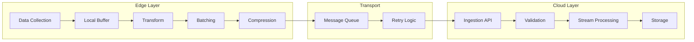

# How to Implement Edge-to-Cloud Data Pipelines

Author: [nawazdhandala](https://www.github.com/nawazdhandala)

Tags: Edge Computing, Data Pipeline, Cloud, ETL, Streaming, IoT, Kafka

Description: Learn how to build reliable data pipelines from edge devices to cloud platforms. Cover data collection, transformation, batching, compression, and delivery with guaranteed delivery and fault tolerance.

---

> Edge-to-cloud data pipelines transport telemetry, events, and analytics from distributed edge devices to centralized cloud platforms. A well-designed pipeline handles unreliable networks, optimizes bandwidth, and ensures data integrity throughout the journey.

This guide covers building production-grade data pipelines that reliably move data from edge to cloud while handling the challenges of distributed systems.

---

## Pipeline Architecture



---

## Edge Data Collection

### Data Collector

```python
# edge_collector.py
# Collects and buffers data at the edge

from dataclasses import dataclass, field, asdict
from datetime import datetime
from typing import List, Dict, Any, Callable
from collections import deque
import asyncio
import json
import uuid

@dataclass
class DataRecord:
    """Single data record for pipeline"""
    record_id: str
    device_id: str
    timestamp: datetime
    data_type: str
    payload: Dict[str, Any]
    metadata: Dict[str, str] = field(default_factory=dict)

    def to_dict(self) -> dict:
        return {
            "record_id": self.record_id,
            "device_id": self.device_id,
            "timestamp": self.timestamp.isoformat(),
            "data_type": self.data_type,
            "payload": self.payload,
            "metadata": self.metadata
        }

class DataCollector:
    """Collects data from various sources at the edge"""

    def __init__(self, device_id: str, max_buffer_size: int = 10000):
        self.device_id = device_id
        self.buffer = deque(maxlen=max_buffer_size)
        self.sources: Dict[str, Callable[[], List[Dict]]] = {}
        self.transforms: List[Callable[[DataRecord], DataRecord]] = []

    def register_source(self, name: str, collector: Callable[[], List[Dict]]):
        """Register a data source"""
        self.sources[name] = collector

    def register_transform(self, transform: Callable[[DataRecord], DataRecord]):
        """Register a data transformation"""
        self.transforms.append(transform)

    async def collect(self) -> int:
        """Collect data from all sources"""
        collected = 0

        for source_name, collector in self.sources.items():
            try:
                raw_data = collector()

                for item in raw_data:
                    record = DataRecord(
                        record_id=str(uuid.uuid4()),
                        device_id=self.device_id,
                        timestamp=datetime.utcnow(),
                        data_type=source_name,
                        payload=item
                    )

                    # Apply transforms
                    for transform in self.transforms:
                        record = transform(record)

                    self.buffer.append(record)
                    collected += 1

            except Exception as e:
                print(f"Collection error from {source_name}: {e}")

        return collected

    def get_batch(self, max_size: int = 100) -> List[DataRecord]:
        """Get a batch of records from buffer"""
        batch = []
        for _ in range(min(max_size, len(self.buffer))):
            if self.buffer:
                batch.append(self.buffer.popleft())
        return batch

    def return_batch(self, batch: List[DataRecord]):
        """Return batch to buffer (for retry)"""
        for record in reversed(batch):
            self.buffer.appendleft(record)

    @property
    def buffer_size(self) -> int:
        return len(self.buffer)


# Example data sources
def collect_sensor_data() -> List[Dict]:
    """Collect sensor readings"""
    import random
    return [{
        "temperature": round(22 + random.uniform(-3, 3), 2),
        "humidity": round(50 + random.uniform(-10, 10), 1),
        "pressure": round(1013 + random.uniform(-10, 10), 1)
    }]

def collect_system_metrics() -> List[Dict]:
    """Collect system metrics"""
    import psutil
    return [{
        "cpu_percent": psutil.cpu_percent(),
        "memory_percent": psutil.virtual_memory().percent,
        "disk_percent": psutil.disk_usage('/').percent
    }]
```

---

## Data Transformation

```python
# transforms.py
# Data transformation functions

from typing import Callable, Dict, Any, List
from dataclasses import replace
from datetime import datetime

def add_metadata(metadata: Dict[str, str]) -> Callable:
    """Add static metadata to records"""
    def transform(record):
        new_metadata = {**record.metadata, **metadata}
        return replace(record, metadata=new_metadata)
    return transform

def filter_fields(allowed_fields: List[str]) -> Callable:
    """Keep only specified fields in payload"""
    def transform(record):
        filtered = {k: v for k, v in record.payload.items() if k in allowed_fields}
        return replace(record, payload=filtered)
    return transform

def rename_fields(mapping: Dict[str, str]) -> Callable:
    """Rename fields in payload"""
    def transform(record):
        renamed = {}
        for old_name, value in record.payload.items():
            new_name = mapping.get(old_name, old_name)
            renamed[new_name] = value
        return replace(record, payload=renamed)
    return transform

def add_computed_field(field_name: str, compute: Callable[[Dict], Any]) -> Callable:
    """Add a computed field to payload"""
    def transform(record):
        value = compute(record.payload)
        new_payload = {**record.payload, field_name: value}
        return replace(record, payload=new_payload)
    return transform

def mask_sensitive_fields(fields: List[str]) -> Callable:
    """Mask sensitive data fields"""
    def transform(record):
        masked = record.payload.copy()
        for field in fields:
            if field in masked:
                masked[field] = "***MASKED***"
        return replace(record, payload=masked)
    return transform

def validate_schema(schema: Dict[str, type]) -> Callable:
    """Validate payload against schema"""
    def transform(record):
        for field, expected_type in schema.items():
            if field in record.payload:
                value = record.payload[field]
                if not isinstance(value, expected_type):
                    raise ValueError(f"Field {field} has wrong type")
        return record
    return transform

class TransformPipeline:
    """Chain multiple transforms"""

    def __init__(self):
        self.transforms: List[Callable] = []

    def add(self, transform: Callable) -> 'TransformPipeline':
        self.transforms.append(transform)
        return self

    def process(self, record):
        """Apply all transforms to record"""
        result = record
        for transform in self.transforms:
            result = transform(result)
        return result
```

---

## Batching and Compression

```python
# batching.py
# Batch and compress data for efficient transmission

import gzip
import json
import lz4.frame
from typing import List, Dict, Any
from dataclasses import dataclass
from datetime import datetime
import hashlib

@dataclass
class DataBatch:
    """Batch of data records for transmission"""
    batch_id: str
    device_id: str
    created_at: datetime
    record_count: int
    compressed_data: bytes
    compression: str
    checksum: str
    size_bytes: int
    original_size_bytes: int

class BatchProcessor:
    """Create and manage data batches"""

    def __init__(
        self,
        device_id: str,
        max_batch_size: int = 100,
        max_batch_bytes: int = 1024 * 1024,  # 1MB
        compression: str = "gzip"  # gzip, lz4, none
    ):
        self.device_id = device_id
        self.max_batch_size = max_batch_size
        self.max_batch_bytes = max_batch_bytes
        self.compression = compression

    def create_batch(self, records: List) -> DataBatch:
        """Create a compressed batch from records"""
        # Serialize records
        data = [r.to_dict() if hasattr(r, 'to_dict') else r for r in records]
        json_data = json.dumps(data).encode('utf-8')
        original_size = len(json_data)

        # Compress
        if self.compression == "gzip":
            compressed = gzip.compress(json_data, compresslevel=6)
        elif self.compression == "lz4":
            compressed = lz4.frame.compress(json_data)
        else:
            compressed = json_data

        # Calculate checksum
        checksum = hashlib.sha256(compressed).hexdigest()

        batch_id = f"{self.device_id}-{datetime.utcnow().timestamp()}"

        return DataBatch(
            batch_id=batch_id,
            device_id=self.device_id,
            created_at=datetime.utcnow(),
            record_count=len(records),
            compressed_data=compressed,
            compression=self.compression,
            checksum=checksum,
            size_bytes=len(compressed),
            original_size_bytes=original_size
        )

    def split_records(self, records: List) -> List[List]:
        """Split records into appropriate batch sizes"""
        batches = []
        current_batch = []
        current_size = 0

        for record in records:
            record_json = json.dumps(
                record.to_dict() if hasattr(record, 'to_dict') else record
            )
            record_size = len(record_json.encode('utf-8'))

            # Check if adding this record exceeds limits
            if (len(current_batch) >= self.max_batch_size or
                current_size + record_size > self.max_batch_bytes):

                if current_batch:
                    batches.append(current_batch)
                current_batch = []
                current_size = 0

            current_batch.append(record)
            current_size += record_size

        if current_batch:
            batches.append(current_batch)

        return batches

    @staticmethod
    def decompress_batch(batch: DataBatch) -> List[Dict]:
        """Decompress a batch"""
        if batch.compression == "gzip":
            decompressed = gzip.decompress(batch.compressed_data)
        elif batch.compression == "lz4":
            decompressed = lz4.frame.decompress(batch.compressed_data)
        else:
            decompressed = batch.compressed_data

        return json.loads(decompressed.decode('utf-8'))
```

---

## Reliable Delivery

```python
# delivery.py
# Reliable delivery with retry and acknowledgment

import asyncio
import aiohttp
from dataclasses import dataclass
from datetime import datetime, timedelta
from typing import Optional, Callable, List
from enum import Enum
import logging
import sqlite3
import json

logger = logging.getLogger(__name__)

class DeliveryStatus(Enum):
    PENDING = "pending"
    SENDING = "sending"
    DELIVERED = "delivered"
    FAILED = "failed"

@dataclass
class DeliveryAttempt:
    """Record of a delivery attempt"""
    attempt_number: int
    timestamp: datetime
    status_code: Optional[int]
    error: Optional[str]

class PersistentDeliveryQueue:
    """SQLite-backed delivery queue for reliability"""

    def __init__(self, db_path: str = "/data/delivery_queue.db"):
        self.db_path = db_path
        self._init_db()

    def _init_db(self):
        conn = sqlite3.connect(self.db_path)
        conn.execute("""
            CREATE TABLE IF NOT EXISTS delivery_queue (
                batch_id TEXT PRIMARY KEY,
                device_id TEXT NOT NULL,
                batch_data BLOB NOT NULL,
                compression TEXT,
                checksum TEXT,
                status TEXT DEFAULT 'pending',
                attempts INTEGER DEFAULT 0,
                created_at TEXT,
                last_attempt TEXT,
                delivered_at TEXT
            )
        """)
        conn.commit()
        conn.close()

    def enqueue(self, batch: 'DataBatch'):
        """Add batch to delivery queue"""
        conn = sqlite3.connect(self.db_path)
        conn.execute("""
            INSERT OR REPLACE INTO delivery_queue
            (batch_id, device_id, batch_data, compression, checksum, created_at)
            VALUES (?, ?, ?, ?, ?, ?)
        """, (
            batch.batch_id,
            batch.device_id,
            batch.compressed_data,
            batch.compression,
            batch.checksum,
            batch.created_at.isoformat()
        ))
        conn.commit()
        conn.close()

    def get_pending(self, limit: int = 10) -> List[dict]:
        """Get pending batches for delivery"""
        conn = sqlite3.connect(self.db_path)
        conn.row_factory = sqlite3.Row
        cursor = conn.execute("""
            SELECT * FROM delivery_queue
            WHERE status IN ('pending', 'failed')
            AND attempts < 10
            ORDER BY created_at ASC
            LIMIT ?
        """, (limit,))
        rows = cursor.fetchall()
        conn.close()
        return [dict(row) for row in rows]

    def mark_sending(self, batch_id: str):
        """Mark batch as being sent"""
        conn = sqlite3.connect(self.db_path)
        conn.execute("""
            UPDATE delivery_queue
            SET status = 'sending', last_attempt = ?, attempts = attempts + 1
            WHERE batch_id = ?
        """, (datetime.utcnow().isoformat(), batch_id))
        conn.commit()
        conn.close()

    def mark_delivered(self, batch_id: str):
        """Mark batch as delivered"""
        conn = sqlite3.connect(self.db_path)
        conn.execute("""
            UPDATE delivery_queue
            SET status = 'delivered', delivered_at = ?
            WHERE batch_id = ?
        """, (datetime.utcnow().isoformat(), batch_id))
        conn.commit()
        conn.close()

    def mark_failed(self, batch_id: str):
        """Mark batch as failed (for retry)"""
        conn = sqlite3.connect(self.db_path)
        conn.execute("""
            UPDATE delivery_queue
            SET status = 'failed'
            WHERE batch_id = ?
        """, (batch_id,))
        conn.commit()
        conn.close()

    def cleanup_delivered(self, older_than_hours: int = 24):
        """Remove old delivered batches"""
        cutoff = (datetime.utcnow() - timedelta(hours=older_than_hours)).isoformat()
        conn = sqlite3.connect(self.db_path)
        conn.execute("""
            DELETE FROM delivery_queue
            WHERE status = 'delivered' AND delivered_at < ?
        """, (cutoff,))
        conn.commit()
        conn.close()


class DataDeliveryService:
    """Reliable data delivery to cloud"""

    def __init__(
        self,
        endpoint: str,
        api_key: str,
        queue: PersistentDeliveryQueue,
        max_retries: int = 10,
        base_delay: float = 1.0,
        max_delay: float = 300.0
    ):
        self.endpoint = endpoint
        self.api_key = api_key
        self.queue = queue
        self.max_retries = max_retries
        self.base_delay = base_delay
        self.max_delay = max_delay

    async def deliver(self, batch: 'DataBatch') -> bool:
        """Deliver a batch to cloud"""
        # Enqueue for persistence
        self.queue.enqueue(batch)

        # Attempt delivery
        return await self._attempt_delivery(batch.batch_id, batch.compressed_data)

    async def _attempt_delivery(self, batch_id: str, data: bytes) -> bool:
        """Attempt to deliver a batch"""
        self.queue.mark_sending(batch_id)

        try:
            async with aiohttp.ClientSession() as session:
                async with session.post(
                    f"{self.endpoint}/api/ingest",
                    data=data,
                    headers={
                        "Content-Type": "application/octet-stream",
                        "Content-Encoding": "gzip",
                        "X-API-Key": self.api_key,
                        "X-Batch-ID": batch_id
                    },
                    timeout=aiohttp.ClientTimeout(total=60)
                ) as response:
                    if response.status == 200:
                        self.queue.mark_delivered(batch_id)
                        logger.info(f"Batch {batch_id} delivered successfully")
                        return True
                    else:
                        logger.warning(f"Delivery failed: {response.status}")
                        self.queue.mark_failed(batch_id)
                        return False

        except Exception as e:
            logger.error(f"Delivery error: {e}")
            self.queue.mark_failed(batch_id)
            return False

    async def process_queue(self):
        """Process pending deliveries"""
        pending = self.queue.get_pending(limit=10)

        for batch_info in pending:
            batch_id = batch_info['batch_id']
            attempts = batch_info['attempts']

            # Calculate backoff delay
            delay = min(self.base_delay * (2 ** attempts), self.max_delay)

            if batch_info['last_attempt']:
                last_attempt = datetime.fromisoformat(batch_info['last_attempt'])
                time_since = (datetime.utcnow() - last_attempt).total_seconds()
                if time_since < delay:
                    continue  # Not ready for retry

            # Attempt delivery
            await self._attempt_delivery(batch_id, batch_info['batch_data'])

    async def run_delivery_loop(self, interval: int = 10):
        """Run continuous delivery loop"""
        while True:
            try:
                await self.process_queue()
            except Exception as e:
                logger.error(f"Delivery loop error: {e}")

            await asyncio.sleep(interval)
```

---

## Cloud Ingestion

```python
# cloud_ingestion.py
# Cloud-side data ingestion service

from fastapi import FastAPI, HTTPException, Header, Request
from typing import Optional
import gzip
import json
import hashlib
from datetime import datetime
import asyncio

app = FastAPI(title="Data Ingestion Service")

# In-memory storage (use proper database in production)
ingested_batches = {}

@app.post("/api/ingest")
async def ingest_data(
    request: Request,
    x_api_key: str = Header(...),
    x_batch_id: str = Header(...),
    content_encoding: Optional[str] = Header(None)
):
    """Ingest data batch from edge device"""

    # Validate API key
    if not validate_api_key(x_api_key):
        raise HTTPException(status_code=401, detail="Invalid API key")

    # Check for duplicate batch
    if x_batch_id in ingested_batches:
        return {"status": "duplicate", "batch_id": x_batch_id}

    # Read and decompress data
    raw_data = await request.body()

    if content_encoding == "gzip":
        try:
            data = gzip.decompress(raw_data)
        except Exception as e:
            raise HTTPException(status_code=400, detail="Invalid gzip data")
    else:
        data = raw_data

    # Parse JSON
    try:
        records = json.loads(data.decode('utf-8'))
    except json.JSONDecodeError:
        raise HTTPException(status_code=400, detail="Invalid JSON")

    # Validate records
    validated_records = []
    for record in records:
        if validate_record(record):
            validated_records.append(record)

    # Store records
    await store_records(x_batch_id, validated_records)

    # Mark batch as processed
    ingested_batches[x_batch_id] = {
        "received_at": datetime.utcnow().isoformat(),
        "record_count": len(validated_records)
    }

    return {
        "status": "ok",
        "batch_id": x_batch_id,
        "records_accepted": len(validated_records)
    }

def validate_api_key(api_key: str) -> bool:
    """Validate API key"""
    # In production, check against database
    return api_key == "valid-api-key"

def validate_record(record: dict) -> bool:
    """Validate a single record"""
    required_fields = ["record_id", "device_id", "timestamp", "data_type", "payload"]
    return all(field in record for field in required_fields)

async def store_records(batch_id: str, records: list):
    """Store records in database"""
    # In production, write to time-series database
    print(f"Storing {len(records)} records from batch {batch_id}")
```

---

## Complete Pipeline Example

```python
# main.py
# Complete edge-to-cloud data pipeline

import asyncio
from edge_collector import DataCollector, collect_sensor_data, collect_system_metrics
from transforms import TransformPipeline, add_metadata, filter_fields
from batching import BatchProcessor
from delivery import PersistentDeliveryQueue, DataDeliveryService

async def main():
    device_id = "edge-001"

    # Initialize components
    collector = DataCollector(device_id)
    collector.register_source("sensors", collect_sensor_data)
    collector.register_source("system", collect_system_metrics)

    # Setup transforms
    transforms = TransformPipeline()
    transforms.add(add_metadata({"region": "us-west", "site": "factory-1"}))

    collector.register_transform(transforms.process)

    # Setup batching
    batch_processor = BatchProcessor(
        device_id=device_id,
        max_batch_size=100,
        compression="gzip"
    )

    # Setup delivery
    queue = PersistentDeliveryQueue()
    delivery = DataDeliveryService(
        endpoint="https://ingest.example.com",
        api_key="your-api-key",
        queue=queue
    )

    # Start delivery loop
    asyncio.create_task(delivery.run_delivery_loop())

    # Main collection loop
    while True:
        # Collect data
        await collector.collect()

        # Create and send batches
        if collector.buffer_size >= 50:
            records = collector.get_batch(100)
            batch = batch_processor.create_batch(records)

            success = await delivery.deliver(batch)
            if not success:
                collector.return_batch(records)

        await asyncio.sleep(10)

if __name__ == "__main__":
    asyncio.run(main())
```

---

## Conclusion

Edge-to-cloud data pipelines must handle unreliable networks, optimize bandwidth, and ensure data integrity. Key components include:

- Data collection with local buffering
- Transformation and validation
- Efficient batching and compression
- Persistent queues for reliability
- Retry logic with exponential backoff
- Cloud-side ingestion with deduplication

Build pipelines that assume failure and design for recovery from the start.

---

*Building data pipelines? [OneUptime](https://oneuptime.com) monitors your pipeline health end-to-end. Track throughput, latency, and delivery success rates from edge to cloud.*
