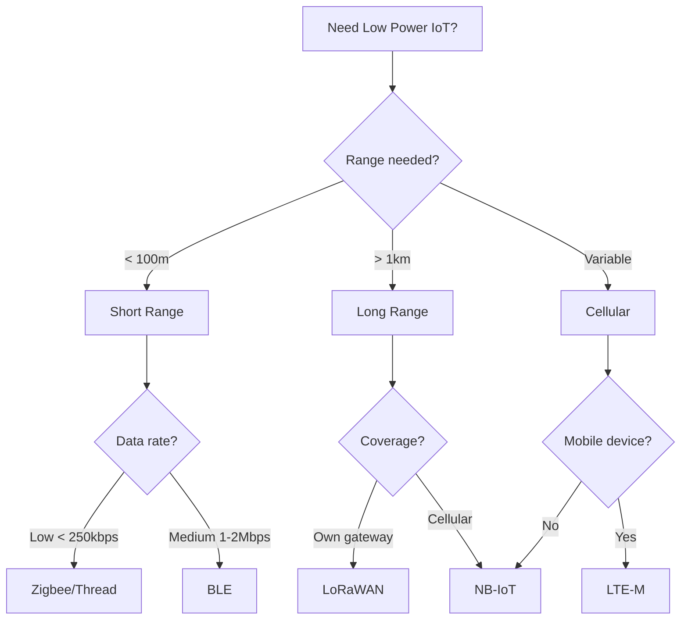

# How to Implement Low-Power IoT Protocols

Author: [nawazdhandala](https://www.github.com/nawazdhandala)

Tags: IoT, Low Power, LoRaWAN, BLE, Zigbee, NB-IoT, Battery, Wireless

Description: Learn how to implement low-power communication protocols for battery-operated IoT devices. Cover LoRaWAN, BLE, Zigbee, and NB-IoT with practical examples for maximizing battery life.

---

> Battery-powered IoT devices must balance communication needs with power consumption. Choosing the right protocol and implementing proper power management can extend battery life from months to years, making remote deployments practical.

This guide covers the major low-power protocols and implementation patterns for maximizing battery life in IoT deployments.

---

## Protocol Comparison

| Protocol | Range | Data Rate | Power | Best For |
|----------|-------|-----------|-------|----------|
| LoRaWAN | 2-15 km | 0.3-50 kbps | Very Low | Long range, low data |
| BLE | 10-100 m | 1-2 Mbps | Low | Short range, moderate data |
| Zigbee | 10-100 m | 250 kbps | Low | Mesh networks |
| NB-IoT | 10+ km | 250 kbps | Medium | Cellular coverage |
| LTE-M | 10+ km | 1 Mbps | Medium | Mobile devices |

---

## LoRaWAN Implementation

### Device Configuration

```python
# lorawan_device.py
# LoRaWAN device implementation

import time
from machine import Pin, SPI, deepsleep
import struct

class LoRaWAN:
    """LoRaWAN device implementation"""

    def __init__(self, dev_eui: bytes, app_eui: bytes, app_key: bytes):
        self.dev_eui = dev_eui
        self.app_eui = app_eui
        self.app_key = app_key

        # LoRa module pins (adjust for your hardware)
        self.spi = SPI(1, baudrate=10000000)
        self.cs = Pin(18, Pin.OUT)
        self.reset = Pin(14, Pin.OUT)
        self.dio0 = Pin(26, Pin.IN)

        self.joined = False
        self.frame_counter = 0

    def reset_module(self):
        """Reset the LoRa module"""
        self.reset.value(0)
        time.sleep_ms(10)
        self.reset.value(1)
        time.sleep_ms(10)

    def configure_low_power(self):
        """Configure module for minimum power consumption"""
        # Set to sleep mode when not transmitting
        self._write_register(0x01, 0x00)  # Sleep mode

        # Configure low data rate optimization
        self._write_register(0x26, 0x0C)  # LowDataRateOptimize

        # Set spreading factor for range vs power tradeoff
        # SF12 = longest range, highest power
        # SF7 = shortest range, lowest power
        self._set_spreading_factor(10)  # Balanced

    def _set_spreading_factor(self, sf: int):
        """Set LoRa spreading factor (7-12)"""
        config = self._read_register(0x1E) & 0x0F
        self._write_register(0x1E, config | ((sf & 0x0F) << 4))

    def join_otaa(self, retries: int = 3) -> bool:
        """Join network using OTAA"""
        for attempt in range(retries):
            # Build join request
            join_request = self._build_join_request()

            # Send join request
            self._send_packet(join_request)

            # Wait for join accept (with timeout)
            if self._wait_for_join_accept(timeout=10):
                self.joined = True
                return True

            # Exponential backoff
            time.sleep(2 ** attempt)

        return False

    def _build_join_request(self) -> bytes:
        """Build OTAA join request"""
        # MHDR (Join Request = 0x00)
        mhdr = bytes([0x00])

        # AppEUI (reversed)
        app_eui = bytes(reversed(self.app_eui))

        # DevEUI (reversed)
        dev_eui = bytes(reversed(self.dev_eui))

        # DevNonce (random)
        import urandom
        dev_nonce = urandom.getrandbits(16).to_bytes(2, 'little')

        # Combine payload
        payload = mhdr + app_eui + dev_eui + dev_nonce

        # Calculate MIC
        mic = self._calculate_mic(payload)

        return payload + mic

    def send_uplink(self, port: int, data: bytes, confirmed: bool = False) -> bool:
        """Send uplink message"""
        if not self.joined:
            if not self.join_otaa():
                return False

        # Build data frame
        frame = self._build_data_frame(port, data, confirmed)

        # Wake up module
        self._write_register(0x01, 0x01)  # Standby mode

        # Send
        success = self._send_packet(frame)

        if success:
            self.frame_counter += 1

        # Return to sleep
        self._write_register(0x01, 0x00)  # Sleep mode

        return success

    def _build_data_frame(self, port: int, data: bytes, confirmed: bool) -> bytes:
        """Build LoRaWAN data frame"""
        # MHDR
        mhdr = 0x40 if not confirmed else 0x80

        # DevAddr (from join)
        dev_addr = self.dev_addr

        # FCtrl
        fctrl = 0x00

        # FCnt
        fcnt = struct.pack('<H', self.frame_counter)

        # FPort
        fport = bytes([port])

        # Encrypt payload
        encrypted = self._encrypt_payload(data)

        # Build frame
        frame = bytes([mhdr]) + dev_addr + bytes([fctrl]) + fcnt + fport + encrypted

        # Calculate MIC
        mic = self._calculate_mic(frame)

        return frame + mic

    def _send_packet(self, data: bytes) -> bool:
        """Send raw packet over LoRa"""
        # Write to FIFO
        self._write_register(0x00, 0x00)  # FIFO addr
        for byte in data:
            self._write_register(0x00, byte)

        # Set payload length
        self._write_register(0x22, len(data))

        # Start transmission
        self._write_register(0x01, 0x03)  # TX mode

        # Wait for TX done
        timeout = 5000  # ms
        start = time.ticks_ms()
        while time.ticks_diff(time.ticks_ms(), start) < timeout:
            if self.dio0.value():  # TX done interrupt
                return True
            time.sleep_ms(10)

        return False

    def _write_register(self, addr: int, value: int):
        """Write to LoRa register"""
        self.cs.value(0)
        self.spi.write(bytes([addr | 0x80, value]))
        self.cs.value(1)

    def _read_register(self, addr: int) -> int:
        """Read from LoRa register"""
        self.cs.value(0)
        self.spi.write(bytes([addr & 0x7F]))
        result = self.spi.read(1)
        self.cs.value(1)
        return result[0]


class LowPowerSensor:
    """Low power sensor using LoRaWAN"""

    def __init__(self, lora: LoRaWAN):
        self.lora = lora
        self.lora.configure_low_power()

    def read_and_send(self):
        """Read sensor and send data"""
        # Read sensor (minimal time awake)
        temperature = self._read_temperature()
        humidity = self._read_humidity()
        battery = self._read_battery()

        # Pack data efficiently (4 bytes total)
        # Temperature: 2 bytes (0.01 degree resolution)
        # Humidity: 1 byte (0-100%)
        # Battery: 1 byte (0-100%)
        data = struct.pack('>hBB',
            int(temperature * 100),
            int(humidity),
            int(battery)
        )

        # Send via LoRaWAN
        success = self.lora.send_uplink(port=1, data=data)

        return success

    def run_duty_cycle(self, interval_minutes: int = 15):
        """Run with deep sleep between transmissions"""
        while True:
            # Read and send
            self.read_and_send()

            # Deep sleep (in microseconds)
            sleep_us = interval_minutes * 60 * 1000000
            deepsleep(sleep_us)

    def _read_temperature(self) -> float:
        """Read temperature sensor"""
        # Implementation depends on sensor
        return 22.5

    def _read_humidity(self) -> float:
        """Read humidity sensor"""
        return 55.0

    def _read_battery(self) -> float:
        """Read battery level percentage"""
        return 85.0
```

---

## BLE Implementation

### BLE Peripheral with Low Power

```python
# ble_sensor.py
# BLE sensor with low power optimization

from machine import Pin, ADC, deepsleep
import bluetooth
import struct
import time

class BLESensor:
    """BLE sensor peripheral with low power"""

    def __init__(self, name: str = "Sensor"):
        self.name = name
        self.ble = bluetooth.BLE()
        self.ble.active(True)
        self.ble.irq(self._irq_handler)

        # Connection state
        self.connected = False
        self.conn_handle = None

        # Service UUIDs
        self.SENSOR_SERVICE = bluetooth.UUID("181A")  # Environmental sensing
        self.TEMP_CHAR = bluetooth.UUID("2A6E")       # Temperature
        self.HUMIDITY_CHAR = bluetooth.UUID("2A6F")   # Humidity
        self.BATTERY_CHAR = bluetooth.UUID("2A19")    # Battery level

        self._setup_services()

    def _setup_services(self):
        """Configure GATT services"""
        # Environmental sensing service
        SENSOR_SERVICE = (
            self.SENSOR_SERVICE,
            (
                (self.TEMP_CHAR, bluetooth.FLAG_READ | bluetooth.FLAG_NOTIFY),
                (self.HUMIDITY_CHAR, bluetooth.FLAG_READ | bluetooth.FLAG_NOTIFY),
            ),
        )

        # Battery service
        BATTERY_SERVICE = (
            bluetooth.UUID("180F"),
            (
                (self.BATTERY_CHAR, bluetooth.FLAG_READ | bluetooth.FLAG_NOTIFY),
            ),
        )

        # Register services
        ((self.temp_handle, self.humidity_handle),
         (self.battery_handle,)) = self.ble.gatts_register_services(
            (SENSOR_SERVICE, BATTERY_SERVICE)
        )

    def _irq_handler(self, event, data):
        """Handle BLE events"""
        if event == 1:  # Central connected
            self.conn_handle = data[0]
            self.connected = True
            # Reduce advertising power when connected
            self._set_tx_power(-8)  # dBm

        elif event == 2:  # Central disconnected
            self.connected = False
            self.conn_handle = None
            # Resume advertising
            self._advertise()

        elif event == 3:  # Write request
            pass

    def _advertise(self, interval_us: int = 1000000):
        """Start advertising with specified interval"""
        # Longer intervals = lower power
        # 1 second interval is good balance for beacons

        payload = self._build_adv_payload()
        self.ble.gap_advertise(interval_us, adv_data=payload)

    def _build_adv_payload(self) -> bytes:
        """Build advertising payload"""
        # Flags
        flags = bytes([0x02, 0x01, 0x06])

        # Complete name
        name_bytes = self.name.encode()
        name = bytes([len(name_bytes) + 1, 0x09]) + name_bytes

        # Service UUIDs
        services = bytes([0x03, 0x03, 0x1A, 0x18])  # Environmental sensing

        return flags + name + services

    def _set_tx_power(self, dbm: int):
        """Set transmit power (lower = less power)"""
        # Valid values: -12, -8, -4, 0, 4 dBm
        # Implementation depends on BLE chip
        pass

    def update_values(self, temperature: float, humidity: float, battery: int):
        """Update characteristic values"""
        # Pack temperature (0.01 degree resolution)
        temp_data = struct.pack('<h', int(temperature * 100))
        self.ble.gatts_write(self.temp_handle, temp_data)

        # Pack humidity (0.01% resolution)
        humidity_data = struct.pack('<H', int(humidity * 100))
        self.ble.gatts_write(self.humidity_handle, humidity_data)

        # Battery level (0-100)
        self.ble.gatts_write(self.battery_handle, bytes([battery]))

        # Notify if connected
        if self.connected:
            self.ble.gatts_notify(self.conn_handle, self.temp_handle)
            self.ble.gatts_notify(self.conn_handle, self.humidity_handle)

    def run_low_power(self, update_interval: int = 60):
        """Run in low power mode"""
        self._advertise(interval_us=1000000)  # 1 second advertising

        while True:
            # Read sensors
            temp = self._read_temperature()
            humidity = self._read_humidity()
            battery = self._read_battery()

            # Update BLE values
            self.update_values(temp, humidity, battery)

            # Light sleep (maintains BLE connection)
            time.sleep(update_interval)

    def _read_temperature(self) -> float:
        return 22.5

    def _read_humidity(self) -> float:
        return 55.0

    def _read_battery(self) -> int:
        return 85
```

---

## Power Management Patterns

```python
# power_management.py
# Power management utilities for IoT devices

from machine import Pin, deepsleep, lightsleep, freq
import time

class PowerManager:
    """Manage device power states"""

    def __init__(self):
        self.wake_reason = None

    def set_cpu_frequency(self, mhz: int):
        """Set CPU frequency (lower = less power)"""
        # Common values: 80, 160, 240 MHz
        freq(mhz * 1000000)

    def deep_sleep(self, seconds: int):
        """Enter deep sleep mode"""
        # Disable peripherals
        self._disable_peripherals()

        # Configure wake source
        self._configure_wake_timer(seconds)

        # Enter deep sleep
        deepsleep(seconds * 1000)

    def light_sleep(self, seconds: int):
        """Enter light sleep (faster wake, more power)"""
        lightsleep(seconds * 1000)

    def _disable_peripherals(self):
        """Disable unused peripherals"""
        # WiFi
        try:
            import network
            sta = network.WLAN(network.STA_IF)
            sta.active(False)
        except:
            pass

        # Bluetooth
        try:
            import bluetooth
            ble = bluetooth.BLE()
            ble.active(False)
        except:
            pass

    def _configure_wake_timer(self, seconds: int):
        """Configure RTC wake timer"""
        from machine import RTC
        rtc = RTC()
        rtc.alarm(RTC.ALARM0, seconds * 1000)

    def get_wake_reason(self) -> str:
        """Get reason for last wake"""
        from machine import wake_reason
        reasons = {
            0: "power_on",
            2: "ext0",
            3: "ext1",
            4: "timer",
            5: "touchpad",
            6: "ulp"
        }
        return reasons.get(wake_reason(), "unknown")


class DutyCycleScheduler:
    """Schedule tasks with duty cycling"""

    def __init__(self, power_manager: PowerManager):
        self.pm = power_manager
        self.tasks = []

    def add_task(self, name: str, interval_seconds: int, callback):
        """Add a periodic task"""
        self.tasks.append({
            "name": name,
            "interval": interval_seconds,
            "callback": callback,
            "last_run": 0
        })

    def run(self):
        """Run scheduler with power optimization"""
        while True:
            now = time.time()
            next_wake = float('inf')

            for task in self.tasks:
                time_since = now - task["last_run"]

                if time_since >= task["interval"]:
                    # Run task
                    try:
                        task["callback"]()
                    except Exception as e:
                        print(f"Task {task['name']} failed: {e}")

                    task["last_run"] = now
                    time_since = 0

                # Calculate next wake time
                time_until = task["interval"] - time_since
                next_wake = min(next_wake, time_until)

            # Sleep until next task
            if next_wake > 0:
                self.pm.deep_sleep(int(next_wake))


def calculate_battery_life(
    battery_mah: int,
    sleep_current_ua: float,
    active_current_ma: float,
    active_time_ms: int,
    cycle_seconds: int
) -> float:
    """Estimate battery life in days"""
    # Sleep power consumption
    sleep_time_s = cycle_seconds - (active_time_ms / 1000)
    sleep_mah = (sleep_current_ua / 1000) * (sleep_time_s / 3600)

    # Active power consumption
    active_mah = active_current_ma * (active_time_ms / 1000 / 3600)

    # Total per cycle
    cycle_mah = sleep_mah + active_mah

    # Cycles per hour
    cycles_per_hour = 3600 / cycle_seconds

    # mAh per hour
    mah_per_hour = cycle_mah * cycles_per_hour

    # Hours of battery life
    hours = battery_mah / mah_per_hour

    # Days
    return hours / 24


# Example calculation
if __name__ == "__main__":
    # Typical LoRaWAN sensor
    days = calculate_battery_life(
        battery_mah=2000,          # 2000mAh battery
        sleep_current_ua=10,        # 10uA in deep sleep
        active_current_ma=50,       # 50mA when transmitting
        active_time_ms=500,         # 500ms transmission
        cycle_seconds=900           # 15 minute interval
    )
    print(f"Estimated battery life: {days:.0f} days ({days/365:.1f} years)")
```

---

## Protocol Selection Guide



---

## Conclusion

Low-power IoT protocols enable battery-powered devices to operate for years without maintenance. Key considerations include:

- Match protocol to range and data requirements
- Implement aggressive duty cycling
- Use deep sleep between transmissions
- Minimize active time with efficient data encoding
- Calculate expected battery life before deployment

Start with conservative power budgets and optimize based on real-world measurements.

---

*Deploying battery-powered IoT? [OneUptime](https://oneuptime.com) monitors your device fleet including battery levels and communication patterns. Get alerts before batteries die and track protocol performance.*
