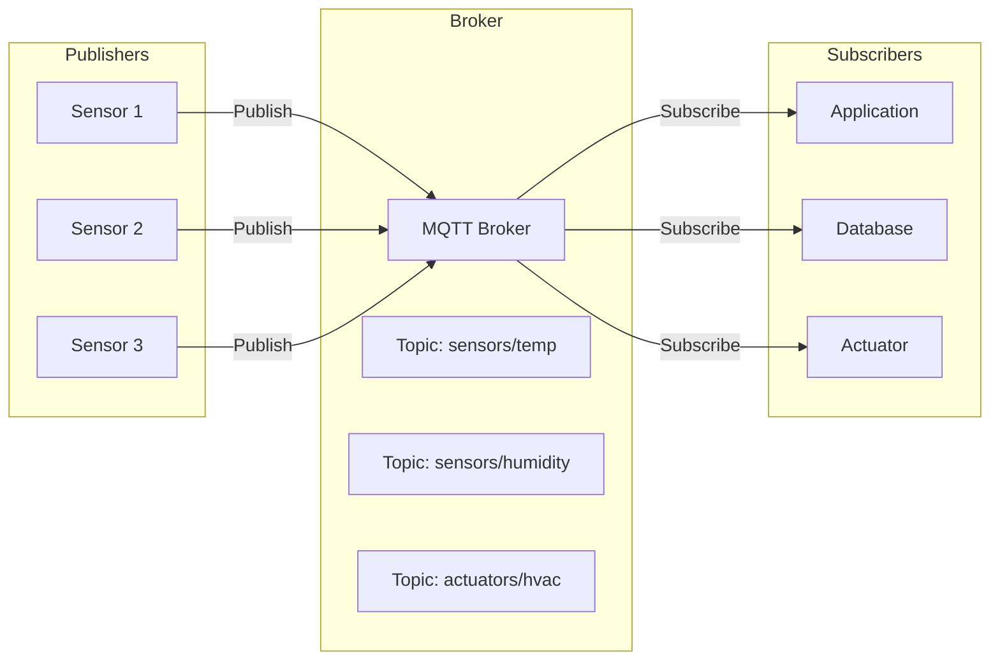
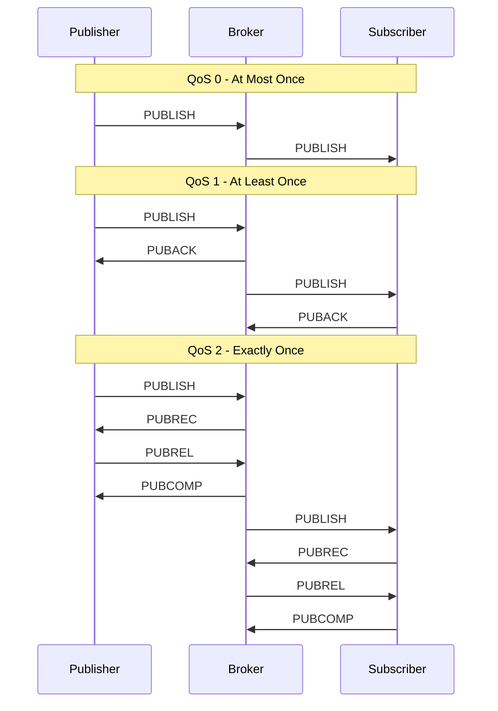

# How to Implement MQTT for IoT Communication

Author: [nawazdhandala](https://www.github.com/nawazdhandala)

Tags: MQTT, IoT, Messaging, Protocol, Mosquitto, Pub/Sub, Embedded

Description: Learn how to implement MQTT for IoT device communication, covering broker setup, topic design, QoS levels, security configuration, and practical examples for connecting sensors and actuators.

---

> MQTT (Message Queuing Telemetry Transport) is the standard messaging protocol for IoT. Its lightweight publish/subscribe model makes it ideal for constrained devices and unreliable networks, consuming minimal bandwidth while providing reliable message delivery.

Originally developed by IBM in 1999 for monitoring oil pipelines, MQTT has become the backbone of IoT communication. This guide covers everything from setting up a broker to implementing secure device communication patterns.

---

## MQTT Architecture Overview

MQTT uses a publish/subscribe pattern with a central broker:



---

## Setting Up Mosquitto Broker

Mosquitto is the most popular open-source MQTT broker.

### Installation

```bash
# Ubuntu/Debian
sudo apt update
sudo apt install mosquitto mosquitto-clients

# Enable and start the service
sudo systemctl enable mosquitto
sudo systemctl start mosquitto

# Verify it's running
sudo systemctl status mosquitto
```

### Basic Configuration

```conf
# /etc/mosquitto/mosquitto.conf
# Mosquitto MQTT broker configuration

# Network listener configuration
# Default port for unencrypted connections
listener 1883 0.0.0.0

# Enable WebSocket support for browser clients
listener 9001
protocol websockets

# Persistence settings
# Enable message persistence across restarts
persistence true
persistence_location /var/lib/mosquitto/

# Logging configuration
log_dest file /var/log/mosquitto/mosquitto.log
log_type error
log_type warning
log_type notice
log_type information

# Connection settings
# Maximum connections (adjust based on your needs)
max_connections 1000

# Keepalive settings
# Max time between messages before considering client disconnected
max_keepalive 120

# Message size limits (default 256MB, reduce for IoT)
message_size_limit 1048576

# Queue settings for QoS 1 and 2 messages
max_queued_messages 1000
max_queued_bytes 0

# Allow anonymous connections (disable in production)
allow_anonymous false

# Password file for authentication
password_file /etc/mosquitto/passwd

# Access control list
acl_file /etc/mosquitto/acl
```

### Setting Up Authentication

```bash
# Create password file with first user
sudo mosquitto_passwd -c /etc/mosquitto/passwd sensor_device_01

# Add additional users
sudo mosquitto_passwd /etc/mosquitto/passwd sensor_device_02
sudo mosquitto_passwd /etc/mosquitto/passwd backend_service

# Set permissions
sudo chown mosquitto:mosquitto /etc/mosquitto/passwd
sudo chmod 600 /etc/mosquitto/passwd
```

### Access Control List

```conf
# /etc/mosquitto/acl
# MQTT Access Control List

# Default: deny all
# Each device gets specific permissions

# Sensor devices can publish to their own topics
user sensor_device_01
topic write sensors/building-a/floor-1/temp
topic write sensors/building-a/floor-1/humidity

user sensor_device_02
topic write sensors/building-a/floor-2/temp
topic write sensors/building-a/floor-2/humidity

# Backend service can read all sensor data
user backend_service
topic read sensors/#
topic readwrite actuators/#

# Devices can subscribe to commands on their topic
user sensor_device_01
topic read commands/sensor_device_01/#
```

---

## Topic Design Best Practices

Good topic structure is crucial for scalable IoT systems:

```
# Topic naming convention
{domain}/{location}/{device-type}/{device-id}/{measurement}

# Examples
sensors/warehouse-a/temperature/sensor-001/reading
sensors/warehouse-a/humidity/sensor-002/reading
actuators/warehouse-a/hvac/unit-001/command
status/warehouse-a/temperature/sensor-001/health

# Wildcards
# + matches single level
sensors/+/temperature/+/reading

# # matches multiple levels
sensors/warehouse-a/#
```

---

## Python MQTT Client Implementation

### Basic Publisher (Sensor Device)

```python
# sensor_publisher.py
# MQTT publisher for IoT sensor device

import paho.mqtt.client as mqtt
import json
import time
import random
import ssl
from datetime import datetime

# Broker configuration
BROKER_HOST = "mqtt.example.com"
BROKER_PORT = 8883  # TLS port
DEVICE_ID = "temp-sensor-001"
USERNAME = "sensor_device_01"
PASSWORD = "secure_password"

# Topic configuration
BASE_TOPIC = f"sensors/building-a/floor-1"
TEMP_TOPIC = f"{BASE_TOPIC}/temperature/{DEVICE_ID}/reading"
STATUS_TOPIC = f"status/{DEVICE_ID}/health"

def on_connect(client, userdata, flags, rc):
    """Callback when connected to broker"""
    if rc == 0:
        print(f"Connected successfully to {BROKER_HOST}")
        # Publish online status
        publish_status(client, "online")
    else:
        print(f"Connection failed with code: {rc}")
        # Common error codes:
        # 1 = incorrect protocol version
        # 2 = invalid client identifier
        # 3 = server unavailable
        # 4 = bad username or password
        # 5 = not authorized

def on_disconnect(client, userdata, rc):
    """Callback when disconnected from broker"""
    print(f"Disconnected with code: {rc}")
    if rc != 0:
        print("Unexpected disconnect, attempting reconnect...")

def on_publish(client, userdata, mid):
    """Callback when message is published"""
    print(f"Message {mid} published successfully")

def publish_status(client, status):
    """Publish device health status"""
    payload = {
        "device_id": DEVICE_ID,
        "status": status,
        "timestamp": datetime.utcnow().isoformat()
    }
    # QoS 1 ensures delivery at least once
    client.publish(STATUS_TOPIC, json.dumps(payload), qos=1, retain=True)

def read_temperature():
    """Simulate temperature reading from sensor"""
    # In production, read from actual sensor hardware
    # Example: GPIO, I2C, SPI interfaces
    return round(20 + random.uniform(-5, 5), 2)

def main():
    # Create MQTT client with clean session
    # Clean session=False maintains subscriptions across reconnects
    client = mqtt.Client(client_id=DEVICE_ID, clean_session=False)

    # Set username and password
    client.username_pw_set(USERNAME, PASSWORD)

    # Configure TLS for secure connection
    client.tls_set(
        ca_certs="/etc/ssl/certs/ca-certificates.crt",
        certfile=None,  # Use for client certificates
        keyfile=None,
        tls_version=ssl.PROTOCOL_TLS
    )

    # Set last will message (sent if client disconnects unexpectedly)
    will_payload = json.dumps({
        "device_id": DEVICE_ID,
        "status": "offline",
        "timestamp": datetime.utcnow().isoformat()
    })
    client.will_set(STATUS_TOPIC, will_payload, qos=1, retain=True)

    # Register callbacks
    client.on_connect = on_connect
    client.on_disconnect = on_disconnect
    client.on_publish = on_publish

    # Connect to broker
    print(f"Connecting to {BROKER_HOST}:{BROKER_PORT}...")
    client.connect(BROKER_HOST, BROKER_PORT, keepalive=60)

    # Start background thread for network operations
    client.loop_start()

    try:
        while True:
            # Read sensor value
            temperature = read_temperature()

            # Create message payload
            payload = {
                "device_id": DEVICE_ID,
                "measurement": "temperature",
                "value": temperature,
                "unit": "celsius",
                "timestamp": datetime.utcnow().isoformat()
            }

            # Publish reading
            # QoS 0 = fire and forget (fastest, no guarantee)
            # QoS 1 = at least once (guaranteed, may duplicate)
            # QoS 2 = exactly once (guaranteed, no duplicates, slowest)
            result = client.publish(TEMP_TOPIC, json.dumps(payload), qos=1)

            print(f"Published: {temperature}C to {TEMP_TOPIC}")

            # Wait before next reading
            time.sleep(30)

    except KeyboardInterrupt:
        print("Shutting down...")
        publish_status(client, "offline")
        time.sleep(1)

    finally:
        client.loop_stop()
        client.disconnect()

if __name__ == "__main__":
    main()
```

### Subscriber (Backend Service)

```python
# backend_subscriber.py
# MQTT subscriber for processing IoT data

import paho.mqtt.client as mqtt
import json
import ssl
from datetime import datetime
from collections import defaultdict

# Broker configuration
BROKER_HOST = "mqtt.example.com"
BROKER_PORT = 8883
CLIENT_ID = "backend-processor-001"
USERNAME = "backend_service"
PASSWORD = "secure_password"

# Topics to subscribe
SENSOR_TOPICS = [
    ("sensors/+/+/+/reading", 1),  # All sensor readings, QoS 1
    ("status/+/health", 1),        # All device statuses, QoS 1
]

# Store recent readings for analysis
readings_buffer = defaultdict(list)

def on_connect(client, userdata, flags, rc):
    """Handle successful connection"""
    if rc == 0:
        print("Connected to MQTT broker")

        # Subscribe to all topics
        # Resubscribe on reconnect to handle broker restarts
        for topic, qos in SENSOR_TOPICS:
            client.subscribe(topic, qos)
            print(f"Subscribed to: {topic}")
    else:
        print(f"Connection failed: {rc}")

def on_message(client, userdata, msg):
    """Process incoming messages"""
    try:
        # Parse JSON payload
        payload = json.loads(msg.payload.decode())

        # Extract topic components
        topic_parts = msg.topic.split("/")

        if "sensors" in msg.topic:
            process_sensor_reading(topic_parts, payload)
        elif "status" in msg.topic:
            process_device_status(topic_parts, payload)

    except json.JSONDecodeError:
        print(f"Invalid JSON on topic {msg.topic}")
    except Exception as e:
        print(f"Error processing message: {e}")

def process_sensor_reading(topic_parts, payload):
    """Process a sensor reading"""
    # Extract metadata from topic
    # sensors/{location}/{sensor-type}/{device-id}/reading
    location = topic_parts[1]
    sensor_type = topic_parts[2]
    device_id = topic_parts[3]

    # Extract values from payload
    value = payload.get("value")
    unit = payload.get("unit")
    timestamp = payload.get("timestamp")

    print(f"[{timestamp}] {device_id} @ {location}: {value} {unit}")

    # Store for batch processing
    readings_buffer[device_id].append({
        "value": value,
        "timestamp": timestamp
    })

    # Check for anomalies
    check_anomaly(device_id, sensor_type, value)

    # Forward to database or analytics service
    store_reading(device_id, location, sensor_type, value, unit, timestamp)

def process_device_status(topic_parts, payload):
    """Process device health status"""
    device_id = payload.get("device_id")
    status = payload.get("status")
    timestamp = payload.get("timestamp")

    print(f"[{timestamp}] Device {device_id} is {status}")

    if status == "offline":
        # Trigger alert for device going offline
        alert_device_offline(device_id, timestamp)

def check_anomaly(device_id, sensor_type, value):
    """Check for anomalous readings"""
    # Define thresholds per sensor type
    thresholds = {
        "temperature": {"min": -10, "max": 50},
        "humidity": {"min": 0, "max": 100},
        "pressure": {"min": 800, "max": 1200}
    }

    if sensor_type in thresholds:
        limits = thresholds[sensor_type]
        if value < limits["min"] or value > limits["max"]:
            print(f"ANOMALY: {device_id} reported {value} (outside {limits})")
            trigger_anomaly_alert(device_id, sensor_type, value)

def store_reading(device_id, location, sensor_type, value, unit, timestamp):
    """Store reading in database"""
    # Implementation depends on your database
    # Example: InfluxDB, TimescaleDB, MongoDB
    pass

def alert_device_offline(device_id, timestamp):
    """Handle device offline alert"""
    # Send notification via webhook, email, etc.
    pass

def trigger_anomaly_alert(device_id, sensor_type, value):
    """Handle anomaly detection"""
    # Send alert to monitoring system
    pass

def main():
    # Create client with persistent session
    client = mqtt.Client(client_id=CLIENT_ID, clean_session=False)

    # Authentication
    client.username_pw_set(USERNAME, PASSWORD)

    # TLS configuration
    client.tls_set(
        ca_certs="/etc/ssl/certs/ca-certificates.crt",
        tls_version=ssl.PROTOCOL_TLS
    )

    # Callbacks
    client.on_connect = on_connect
    client.on_message = on_message

    # Reconnect settings
    client.reconnect_delay_set(min_delay=1, max_delay=60)

    # Connect and run
    print(f"Connecting to {BROKER_HOST}:{BROKER_PORT}...")
    client.connect(BROKER_HOST, BROKER_PORT, keepalive=60)

    # Blocking call that processes network traffic
    client.loop_forever()

if __name__ == "__main__":
    main()
```

---

## QoS Levels Explained

Understanding QoS is critical for reliable IoT messaging:



Choose QoS based on your requirements:
- **QoS 0**: High-frequency telemetry where occasional loss is acceptable
- **QoS 1**: Most IoT use cases requiring guaranteed delivery
- **QoS 2**: Critical commands, billing data, or regulatory requirements

---

## Enabling TLS Security

Configure TLS on Mosquitto:

```conf
# /etc/mosquitto/conf.d/tls.conf
# TLS configuration for secure MQTT

# TLS listener
listener 8883 0.0.0.0

# Certificate files
cafile /etc/mosquitto/certs/ca.crt
certfile /etc/mosquitto/certs/server.crt
keyfile /etc/mosquitto/certs/server.key

# Require client certificates (optional, for mutual TLS)
# require_certificate true
# use_identity_as_username true

# TLS version (minimum TLS 1.2 recommended)
tls_version tlsv1.2

# Disable insecure listener in production
# listener 1883 localhost
```

Generate certificates:

```bash
# Generate CA key and certificate
openssl genrsa -out ca.key 4096
openssl req -x509 -new -nodes -key ca.key -sha256 -days 3650 \
  -out ca.crt -subj "/CN=MQTT CA"

# Generate server key and CSR
openssl genrsa -out server.key 2048
openssl req -new -key server.key -out server.csr \
  -subj "/CN=mqtt.example.com"

# Sign server certificate
openssl x509 -req -in server.csr -CA ca.crt -CAkey ca.key \
  -CAcreateserial -out server.crt -days 365 -sha256

# Set permissions
sudo cp ca.crt server.crt server.key /etc/mosquitto/certs/
sudo chown mosquitto:mosquitto /etc/mosquitto/certs/*
sudo chmod 600 /etc/mosquitto/certs/server.key
```

---

## Retained Messages and Last Will

Use retained messages for device state:

```python
# Publish retained message (persists until overwritten)
client.publish(
    "devices/sensor-001/status",
    json.dumps({"online": True}),
    qos=1,
    retain=True  # Message is retained on broker
)

# Last Will Testament (LWT)
# Sent automatically if client disconnects unexpectedly
client.will_set(
    "devices/sensor-001/status",
    json.dumps({"online": False}),
    qos=1,
    retain=True
)
```

---

## Conclusion

MQTT provides the foundation for reliable IoT communication. Its lightweight protocol, flexible QoS options, and publish/subscribe model make it suitable for everything from small sensor networks to enterprise IoT deployments.

Key takeaways:
- Use Mosquitto as a reliable open-source broker
- Design topic hierarchies for scalability
- Choose QoS levels based on reliability requirements
- Always enable TLS in production
- Use retained messages and LWT for device status tracking
- Implement proper authentication and ACLs

MQTT 5.0 adds features like message expiry, topic aliases, and enhanced error reporting. Consider upgrading when your clients support it.

---

*Building IoT applications? [OneUptime](https://oneuptime.com) monitors your MQTT infrastructure and IoT devices. Track broker health, message throughput, and device connectivity with real-time dashboards and intelligent alerting.*
