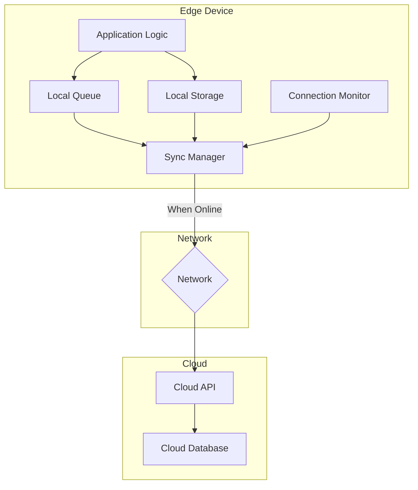

# How to Implement Offline-First Edge Applications

Author: [nawazdhandala](https://www.github.com/nawazdhandala)

Tags: Edge Computing, Offline-First, Data Sync, SQLite, Queue, Resilience, IoT

Description: Learn how to build edge applications that work reliably without network connectivity. Implement local storage, data synchronization, conflict resolution, and message queuing for resilient IoT systems.

---

> Offline-first design ensures your edge applications continue operating when network connectivity is unavailable or unreliable. Rather than treating offline as an error state, offline-first applications embrace intermittent connectivity as a normal operating condition.

Edge devices often operate in environments with poor network coverage: remote industrial sites, moving vehicles, underground facilities, or simply areas with congested networks. Building applications that handle disconnection gracefully is essential for reliable IoT deployments.

---

## Offline-First Architecture

A robust offline-first architecture includes several components:



---

## Local Data Storage

### SQLite for Structured Data

```python
# local_storage.py
# SQLite-based local storage for edge applications

import sqlite3
import json
from datetime import datetime
from typing import List, Dict, Optional, Any
from dataclasses import dataclass, asdict
from contextlib import contextmanager
import threading

@dataclass
class DataRecord:
    """Represents a data record for synchronization"""
    id: str
    device_id: str
    data_type: str
    payload: Dict[str, Any]
    timestamp: datetime
    synced: bool = False
    sync_attempts: int = 0
    last_sync_attempt: Optional[datetime] = None

class LocalStorage:
    """SQLite-based local storage with sync tracking"""

    def __init__(self, db_path: str = "/data/edge_local.db"):
        self.db_path = db_path
        self.lock = threading.Lock()
        self._init_database()

    def _init_database(self):
        """Initialize database schema"""
        with self._get_connection() as conn:
            conn.executescript("""
                -- Main data table
                CREATE TABLE IF NOT EXISTS data_records (
                    id TEXT PRIMARY KEY,
                    device_id TEXT NOT NULL,
                    data_type TEXT NOT NULL,
                    payload TEXT NOT NULL,
                    timestamp TEXT NOT NULL,
                    synced INTEGER DEFAULT 0,
                    sync_attempts INTEGER DEFAULT 0,
                    last_sync_attempt TEXT,
                    created_at TEXT DEFAULT CURRENT_TIMESTAMP
                );

                -- Index for sync queries
                CREATE INDEX IF NOT EXISTS idx_synced ON data_records(synced);
                CREATE INDEX IF NOT EXISTS idx_timestamp ON data_records(timestamp);
                CREATE INDEX IF NOT EXISTS idx_data_type ON data_records(data_type);

                -- Configuration table
                CREATE TABLE IF NOT EXISTS config (
                    key TEXT PRIMARY KEY,
                    value TEXT NOT NULL,
                    updated_at TEXT DEFAULT CURRENT_TIMESTAMP
                );

                -- Sync state tracking
                CREATE TABLE IF NOT EXISTS sync_state (
                    id INTEGER PRIMARY KEY,
                    last_sync_timestamp TEXT,
                    last_sync_status TEXT,
                    records_synced INTEGER DEFAULT 0,
                    records_failed INTEGER DEFAULT 0
                );

                -- Initialize sync state if empty
                INSERT OR IGNORE INTO sync_state (id) VALUES (1);
            """)

    @contextmanager
    def _get_connection(self):
        """Get database connection with proper handling"""
        conn = sqlite3.connect(self.db_path, timeout=30.0)
        conn.row_factory = sqlite3.Row
        try:
            yield conn
            conn.commit()
        except Exception:
            conn.rollback()
            raise
        finally:
            conn.close()

    def store(self, record: DataRecord) -> bool:
        """Store a data record locally"""
        with self.lock:
            with self._get_connection() as conn:
                conn.execute("""
                    INSERT OR REPLACE INTO data_records
                    (id, device_id, data_type, payload, timestamp, synced, sync_attempts)
                    VALUES (?, ?, ?, ?, ?, ?, ?)
                """, (
                    record.id,
                    record.device_id,
                    record.data_type,
                    json.dumps(record.payload),
                    record.timestamp.isoformat(),
                    1 if record.synced else 0,
                    record.sync_attempts
                ))
                return True

    def store_batch(self, records: List[DataRecord]) -> int:
        """Store multiple records efficiently"""
        with self.lock:
            with self._get_connection() as conn:
                conn.executemany("""
                    INSERT OR REPLACE INTO data_records
                    (id, device_id, data_type, payload, timestamp, synced, sync_attempts)
                    VALUES (?, ?, ?, ?, ?, ?, ?)
                """, [
                    (r.id, r.device_id, r.data_type, json.dumps(r.payload),
                     r.timestamp.isoformat(), 1 if r.synced else 0, r.sync_attempts)
                    for r in records
                ])
                return len(records)

    def get_unsynced(self, limit: int = 100) -> List[DataRecord]:
        """Get records that need synchronization"""
        with self._get_connection() as conn:
            cursor = conn.execute("""
                SELECT * FROM data_records
                WHERE synced = 0
                ORDER BY timestamp ASC
                LIMIT ?
            """, (limit,))

            records = []
            for row in cursor:
                records.append(DataRecord(
                    id=row['id'],
                    device_id=row['device_id'],
                    data_type=row['data_type'],
                    payload=json.loads(row['payload']),
                    timestamp=datetime.fromisoformat(row['timestamp']),
                    synced=bool(row['synced']),
                    sync_attempts=row['sync_attempts']
                ))
            return records

    def mark_synced(self, record_ids: List[str]) -> int:
        """Mark records as successfully synced"""
        with self.lock:
            with self._get_connection() as conn:
                placeholders = ','.join(['?' for _ in record_ids])
                cursor = conn.execute(f"""
                    UPDATE data_records
                    SET synced = 1, last_sync_attempt = ?
                    WHERE id IN ({placeholders})
                """, [datetime.utcnow().isoformat()] + record_ids)
                return cursor.rowcount

    def increment_sync_attempts(self, record_ids: List[str]) -> int:
        """Increment sync attempt counter for failed syncs"""
        with self.lock:
            with self._get_connection() as conn:
                placeholders = ','.join(['?' for _ in record_ids])
                cursor = conn.execute(f"""
                    UPDATE data_records
                    SET sync_attempts = sync_attempts + 1,
                        last_sync_attempt = ?
                    WHERE id IN ({placeholders})
                """, [datetime.utcnow().isoformat()] + record_ids)
                return cursor.rowcount

    def get_config(self, key: str, default: Any = None) -> Any:
        """Get configuration value"""
        with self._get_connection() as conn:
            cursor = conn.execute(
                "SELECT value FROM config WHERE key = ?", (key,)
            )
            row = cursor.fetchone()
            if row:
                return json.loads(row['value'])
            return default

    def set_config(self, key: str, value: Any):
        """Set configuration value"""
        with self.lock:
            with self._get_connection() as conn:
                conn.execute("""
                    INSERT OR REPLACE INTO config (key, value, updated_at)
                    VALUES (?, ?, ?)
                """, (key, json.dumps(value), datetime.utcnow().isoformat()))

    def cleanup_old_synced(self, days: int = 7) -> int:
        """Remove old synced records to free space"""
        with self.lock:
            with self._get_connection() as conn:
                cursor = conn.execute("""
                    DELETE FROM data_records
                    WHERE synced = 1
                    AND datetime(timestamp) < datetime('now', '-' || ? || ' days')
                """, (days,))
                return cursor.rowcount

    def get_storage_stats(self) -> Dict:
        """Get storage statistics"""
        with self._get_connection() as conn:
            cursor = conn.execute("""
                SELECT
                    COUNT(*) as total_records,
                    SUM(CASE WHEN synced = 0 THEN 1 ELSE 0 END) as unsynced_records,
                    SUM(CASE WHEN synced = 1 THEN 1 ELSE 0 END) as synced_records,
                    MIN(timestamp) as oldest_record,
                    MAX(timestamp) as newest_record
                FROM data_records
            """)
            row = cursor.fetchone()
            return dict(row)
```

---

## Message Queue for Reliable Delivery

```python
# message_queue.py
# Persistent message queue for offline-first delivery

import sqlite3
import json
import uuid
from datetime import datetime, timedelta
from typing import Optional, List, Dict, Any
from dataclasses import dataclass
from enum import Enum
import threading

class MessagePriority(Enum):
    LOW = 1
    NORMAL = 2
    HIGH = 3
    CRITICAL = 4

class MessageStatus(Enum):
    PENDING = "pending"
    PROCESSING = "processing"
    SENT = "sent"
    FAILED = "failed"
    DEAD_LETTER = "dead_letter"

@dataclass
class QueueMessage:
    """Message in the persistent queue"""
    id: str
    topic: str
    payload: Dict[str, Any]
    priority: MessagePriority
    status: MessageStatus
    created_at: datetime
    attempts: int = 0
    max_attempts: int = 5
    next_retry: Optional[datetime] = None
    error_message: Optional[str] = None

class PersistentQueue:
    """SQLite-backed persistent message queue"""

    def __init__(self, db_path: str = "/data/message_queue.db"):
        self.db_path = db_path
        self.lock = threading.Lock()
        self._init_database()

    def _init_database(self):
        """Initialize queue database"""
        conn = sqlite3.connect(self.db_path)
        conn.executescript("""
            CREATE TABLE IF NOT EXISTS messages (
                id TEXT PRIMARY KEY,
                topic TEXT NOT NULL,
                payload TEXT NOT NULL,
                priority INTEGER NOT NULL,
                status TEXT NOT NULL,
                created_at TEXT NOT NULL,
                attempts INTEGER DEFAULT 0,
                max_attempts INTEGER DEFAULT 5,
                next_retry TEXT,
                error_message TEXT,
                processed_at TEXT
            );

            CREATE INDEX IF NOT EXISTS idx_status ON messages(status);
            CREATE INDEX IF NOT EXISTS idx_priority ON messages(priority DESC);
            CREATE INDEX IF NOT EXISTS idx_next_retry ON messages(next_retry);
            CREATE INDEX IF NOT EXISTS idx_topic ON messages(topic);

            -- Dead letter queue for failed messages
            CREATE TABLE IF NOT EXISTS dead_letters (
                id TEXT PRIMARY KEY,
                original_id TEXT NOT NULL,
                topic TEXT NOT NULL,
                payload TEXT NOT NULL,
                error_message TEXT,
                failed_at TEXT NOT NULL
            );
        """)
        conn.commit()
        conn.close()

    def enqueue(
        self,
        topic: str,
        payload: Dict[str, Any],
        priority: MessagePriority = MessagePriority.NORMAL,
        max_attempts: int = 5
    ) -> str:
        """Add message to queue"""
        message_id = str(uuid.uuid4())
        now = datetime.utcnow()

        with self.lock:
            conn = sqlite3.connect(self.db_path)
            conn.execute("""
                INSERT INTO messages
                (id, topic, payload, priority, status, created_at, max_attempts)
                VALUES (?, ?, ?, ?, ?, ?, ?)
            """, (
                message_id,
                topic,
                json.dumps(payload),
                priority.value,
                MessageStatus.PENDING.value,
                now.isoformat(),
                max_attempts
            ))
            conn.commit()
            conn.close()

        return message_id

    def dequeue(self, topics: List[str] = None) -> Optional[QueueMessage]:
        """Get next message to process"""
        with self.lock:
            conn = sqlite3.connect(self.db_path)
            conn.row_factory = sqlite3.Row

            # Build query
            query = """
                SELECT * FROM messages
                WHERE status = ?
                AND (next_retry IS NULL OR datetime(next_retry) <= datetime('now'))
            """
            params = [MessageStatus.PENDING.value]

            if topics:
                placeholders = ','.join(['?' for _ in topics])
                query += f" AND topic IN ({placeholders})"
                params.extend(topics)

            query += " ORDER BY priority DESC, created_at ASC LIMIT 1"

            cursor = conn.execute(query, params)
            row = cursor.fetchone()

            if row:
                # Mark as processing
                conn.execute("""
                    UPDATE messages SET status = ? WHERE id = ?
                """, (MessageStatus.PROCESSING.value, row['id']))
                conn.commit()

                message = QueueMessage(
                    id=row['id'],
                    topic=row['topic'],
                    payload=json.loads(row['payload']),
                    priority=MessagePriority(row['priority']),
                    status=MessageStatus.PROCESSING,
                    created_at=datetime.fromisoformat(row['created_at']),
                    attempts=row['attempts'],
                    max_attempts=row['max_attempts']
                )
                conn.close()
                return message

            conn.close()
            return None

    def acknowledge(self, message_id: str):
        """Mark message as successfully sent"""
        with self.lock:
            conn = sqlite3.connect(self.db_path)
            conn.execute("""
                UPDATE messages
                SET status = ?, processed_at = ?
                WHERE id = ?
            """, (MessageStatus.SENT.value, datetime.utcnow().isoformat(), message_id))
            conn.commit()
            conn.close()

    def fail(self, message_id: str, error: str):
        """Mark message as failed, schedule retry or move to dead letter"""
        with self.lock:
            conn = sqlite3.connect(self.db_path)
            conn.row_factory = sqlite3.Row

            # Get current message
            cursor = conn.execute("SELECT * FROM messages WHERE id = ?", (message_id,))
            row = cursor.fetchone()

            if row:
                new_attempts = row['attempts'] + 1

                if new_attempts >= row['max_attempts']:
                    # Move to dead letter queue
                    conn.execute("""
                        INSERT INTO dead_letters
                        (id, original_id, topic, payload, error_message, failed_at)
                        VALUES (?, ?, ?, ?, ?, ?)
                    """, (
                        str(uuid.uuid4()),
                        message_id,
                        row['topic'],
                        row['payload'],
                        error,
                        datetime.utcnow().isoformat()
                    ))

                    conn.execute("""
                        UPDATE messages
                        SET status = ?, error_message = ?
                        WHERE id = ?
                    """, (MessageStatus.DEAD_LETTER.value, error, message_id))
                else:
                    # Schedule retry with exponential backoff
                    retry_delay = min(300, 2 ** new_attempts)  # Max 5 minutes
                    next_retry = datetime.utcnow() + timedelta(seconds=retry_delay)

                    conn.execute("""
                        UPDATE messages
                        SET status = ?, attempts = ?, next_retry = ?, error_message = ?
                        WHERE id = ?
                    """, (
                        MessageStatus.PENDING.value,
                        new_attempts,
                        next_retry.isoformat(),
                        error,
                        message_id
                    ))

            conn.commit()
            conn.close()

    def get_queue_stats(self) -> Dict:
        """Get queue statistics"""
        conn = sqlite3.connect(self.db_path)
        conn.row_factory = sqlite3.Row

        cursor = conn.execute("""
            SELECT
                status,
                COUNT(*) as count
            FROM messages
            GROUP BY status
        """)

        stats = {row['status']: row['count'] for row in cursor}

        # Dead letter count
        cursor = conn.execute("SELECT COUNT(*) as count FROM dead_letters")
        stats['dead_letters'] = cursor.fetchone()['count']

        conn.close()
        return stats
```

---

## Synchronization Manager

```python
# sync_manager.py
# Manages data synchronization between edge and cloud

import asyncio
import aiohttp
from datetime import datetime, timedelta
from typing import List, Callable, Optional
import logging
from enum import Enum
from dataclasses import dataclass

from local_storage import LocalStorage, DataRecord
from message_queue import PersistentQueue, MessagePriority

logger = logging.getLogger(__name__)

class ConnectionState(Enum):
    ONLINE = "online"
    OFFLINE = "offline"
    DEGRADED = "degraded"

@dataclass
class SyncConfig:
    """Synchronization configuration"""
    cloud_url: str
    api_key: str
    batch_size: int = 100
    sync_interval: int = 30  # seconds
    timeout: int = 30
    max_retries: int = 3

class SyncManager:
    """Manages offline-first data synchronization"""

    def __init__(
        self,
        config: SyncConfig,
        storage: LocalStorage,
        queue: PersistentQueue
    ):
        self.config = config
        self.storage = storage
        self.queue = queue
        self.connection_state = ConnectionState.OFFLINE
        self.last_sync = None
        self.sync_in_progress = False
        self._on_state_change: Optional[Callable] = None

    def on_connection_state_change(self, callback: Callable):
        """Register callback for connection state changes"""
        self._on_state_change = callback

    async def check_connectivity(self) -> bool:
        """Check if cloud endpoint is reachable"""
        try:
            async with aiohttp.ClientSession() as session:
                async with session.get(
                    f"{self.config.cloud_url}/health",
                    timeout=aiohttp.ClientTimeout(total=5)
                ) as response:
                    is_online = response.status == 200

                    new_state = ConnectionState.ONLINE if is_online else ConnectionState.OFFLINE

                    if new_state != self.connection_state:
                        logger.info(f"Connection state changed: {self.connection_state} -> {new_state}")
                        self.connection_state = new_state
                        if self._on_state_change:
                            self._on_state_change(new_state)

                    return is_online

        except Exception as e:
            logger.debug(f"Connectivity check failed: {e}")
            if self.connection_state != ConnectionState.OFFLINE:
                self.connection_state = ConnectionState.OFFLINE
                if self._on_state_change:
                    self._on_state_change(ConnectionState.OFFLINE)
            return False

    async def sync_records(self) -> dict:
        """Synchronize pending records with cloud"""
        if self.sync_in_progress:
            logger.debug("Sync already in progress, skipping")
            return {"status": "skipped", "reason": "sync_in_progress"}

        self.sync_in_progress = True
        result = {
            "status": "completed",
            "synced": 0,
            "failed": 0,
            "start_time": datetime.utcnow().isoformat()
        }

        try:
            # Check connectivity first
            if not await self.check_connectivity():
                return {"status": "offline", "synced": 0, "failed": 0}

            # Get unsynced records in batches
            while True:
                records = self.storage.get_unsynced(limit=self.config.batch_size)
                if not records:
                    break

                # Prepare batch payload
                batch_payload = [
                    {
                        "id": r.id,
                        "device_id": r.device_id,
                        "data_type": r.data_type,
                        "payload": r.payload,
                        "timestamp": r.timestamp.isoformat()
                    }
                    for r in records
                ]

                # Send to cloud
                success, failed_ids = await self._send_batch(batch_payload)

                if success:
                    # Mark all as synced
                    synced_ids = [r.id for r in records if r.id not in failed_ids]
                    self.storage.mark_synced(synced_ids)
                    result["synced"] += len(synced_ids)
                    result["failed"] += len(failed_ids)
                else:
                    # Mark sync attempt
                    self.storage.increment_sync_attempts([r.id for r in records])
                    result["failed"] += len(records)
                    break  # Stop on batch failure

            self.last_sync = datetime.utcnow()
            result["end_time"] = self.last_sync.isoformat()

        except Exception as e:
            logger.error(f"Sync error: {e}")
            result["status"] = "error"
            result["error"] = str(e)

        finally:
            self.sync_in_progress = False

        return result

    async def _send_batch(self, batch: List[dict]) -> tuple:
        """Send a batch of records to cloud"""
        failed_ids = []

        try:
            async with aiohttp.ClientSession() as session:
                async with session.post(
                    f"{self.config.cloud_url}/api/ingest/batch",
                    json={"records": batch},
                    headers={
                        "Authorization": f"Bearer {self.config.api_key}",
                        "Content-Type": "application/json"
                    },
                    timeout=aiohttp.ClientTimeout(total=self.config.timeout)
                ) as response:
                    if response.status == 200:
                        result = await response.json()
                        # Check for partial failures
                        failed_ids = result.get("failed_ids", [])
                        return True, failed_ids
                    elif response.status == 207:  # Partial success
                        result = await response.json()
                        failed_ids = result.get("failed_ids", [])
                        return True, failed_ids
                    else:
                        logger.error(f"Batch send failed: {response.status}")
                        return False, []

        except asyncio.TimeoutError:
            logger.error("Batch send timeout")
            return False, []
        except Exception as e:
            logger.error(f"Batch send error: {e}")
            return False, []

    async def process_queue(self):
        """Process messages in the persistent queue"""
        if not await self.check_connectivity():
            return

        while True:
            message = self.queue.dequeue()
            if not message:
                break

            try:
                success = await self._send_queue_message(message)
                if success:
                    self.queue.acknowledge(message.id)
                    logger.debug(f"Message {message.id} sent successfully")
                else:
                    self.queue.fail(message.id, "Send failed")

            except Exception as e:
                logger.error(f"Queue processing error: {e}")
                self.queue.fail(message.id, str(e))

    async def _send_queue_message(self, message) -> bool:
        """Send a single queue message"""
        try:
            async with aiohttp.ClientSession() as session:
                async with session.post(
                    f"{self.config.cloud_url}/api/messages/{message.topic}",
                    json=message.payload,
                    headers={
                        "Authorization": f"Bearer {self.config.api_key}",
                        "Content-Type": "application/json"
                    },
                    timeout=aiohttp.ClientTimeout(total=self.config.timeout)
                ) as response:
                    return response.status in [200, 201, 202]

        except Exception as e:
            logger.error(f"Message send error: {e}")
            return False

    async def start_sync_loop(self):
        """Start continuous synchronization loop"""
        logger.info("Starting sync loop")

        while True:
            try:
                # Sync records
                result = await self.sync_records()
                logger.info(f"Sync result: {result}")

                # Process queue
                await self.process_queue()

            except Exception as e:
                logger.error(f"Sync loop error: {e}")

            # Wait for next sync interval
            await asyncio.sleep(self.config.sync_interval)
```

---

## Conflict Resolution

```python
# conflict_resolution.py
# Handle conflicts when syncing data

from enum import Enum
from dataclasses import dataclass
from datetime import datetime
from typing import Dict, Any, Optional
import hashlib
import json

class ConflictStrategy(Enum):
    """Strategies for resolving sync conflicts"""
    CLIENT_WINS = "client_wins"     # Local changes always win
    SERVER_WINS = "server_wins"     # Server changes always win
    LATEST_WINS = "latest_wins"     # Most recent timestamp wins
    MERGE = "merge"                  # Attempt to merge changes
    MANUAL = "manual"               # Flag for manual resolution

@dataclass
class ConflictRecord:
    """Record of a detected conflict"""
    record_id: str
    local_version: Dict[str, Any]
    server_version: Dict[str, Any]
    local_timestamp: datetime
    server_timestamp: datetime
    resolved: bool = False
    resolution: Optional[str] = None

class ConflictResolver:
    """Handles data conflicts during synchronization"""

    def __init__(self, default_strategy: ConflictStrategy = ConflictStrategy.LATEST_WINS):
        self.default_strategy = default_strategy
        self.conflicts = []

    def detect_conflict(
        self,
        local_data: Dict[str, Any],
        server_data: Dict[str, Any]
    ) -> bool:
        """Detect if there is a conflict between local and server data"""
        # Compare content hashes (excluding metadata)
        local_hash = self._compute_hash(local_data.get("payload", {}))
        server_hash = self._compute_hash(server_data.get("payload", {}))

        return local_hash != server_hash

    def _compute_hash(self, data: Dict) -> str:
        """Compute hash of data for comparison"""
        # Sort keys for consistent hashing
        json_str = json.dumps(data, sort_keys=True)
        return hashlib.md5(json_str.encode()).hexdigest()

    def resolve(
        self,
        local_data: Dict[str, Any],
        server_data: Dict[str, Any],
        strategy: ConflictStrategy = None
    ) -> Dict[str, Any]:
        """Resolve conflict between local and server data"""
        strategy = strategy or self.default_strategy

        local_ts = datetime.fromisoformat(local_data.get("timestamp", "1970-01-01"))
        server_ts = datetime.fromisoformat(server_data.get("timestamp", "1970-01-01"))

        if strategy == ConflictStrategy.CLIENT_WINS:
            return local_data

        elif strategy == ConflictStrategy.SERVER_WINS:
            return server_data

        elif strategy == ConflictStrategy.LATEST_WINS:
            if local_ts >= server_ts:
                return local_data
            return server_data

        elif strategy == ConflictStrategy.MERGE:
            return self._merge_data(local_data, server_data)

        elif strategy == ConflictStrategy.MANUAL:
            # Store conflict for manual resolution
            conflict = ConflictRecord(
                record_id=local_data.get("id"),
                local_version=local_data,
                server_version=server_data,
                local_timestamp=local_ts,
                server_timestamp=server_ts
            )
            self.conflicts.append(conflict)
            # Return server version as default
            return server_data

        return server_data

    def _merge_data(
        self,
        local_data: Dict[str, Any],
        server_data: Dict[str, Any]
    ) -> Dict[str, Any]:
        """Attempt to merge local and server data"""
        merged = server_data.copy()
        local_payload = local_data.get("payload", {})
        server_payload = server_data.get("payload", {})

        # Merge payloads - local values override server for same keys
        merged_payload = {**server_payload, **local_payload}
        merged["payload"] = merged_payload
        merged["timestamp"] = datetime.utcnow().isoformat()
        merged["merged"] = True

        return merged

    def get_pending_conflicts(self) -> list:
        """Get conflicts awaiting manual resolution"""
        return [c for c in self.conflicts if not c.resolved]
```

---

## Complete Example Application

```python
# main.py
# Complete offline-first edge application

import asyncio
import uuid
from datetime import datetime
import random
import logging

from local_storage import LocalStorage, DataRecord
from message_queue import PersistentQueue, MessagePriority
from sync_manager import SyncManager, SyncConfig, ConnectionState

logging.basicConfig(level=logging.INFO)
logger = logging.getLogger(__name__)

DEVICE_ID = "edge-device-001"

# Initialize components
storage = LocalStorage("/data/edge_local.db")
queue = PersistentQueue("/data/message_queue.db")

sync_config = SyncConfig(
    cloud_url="https://api.example.com",
    api_key="your-api-key",
    batch_size=50,
    sync_interval=30
)

sync_manager = SyncManager(sync_config, storage, queue)

def on_connection_change(state: ConnectionState):
    """Handle connection state changes"""
    logger.info(f"Connection state: {state.value}")
    if state == ConnectionState.ONLINE:
        # Trigger immediate sync when coming online
        asyncio.create_task(sync_manager.sync_records())

sync_manager.on_connection_state_change(on_connection_change)

async def collect_sensor_data():
    """Simulate sensor data collection"""
    while True:
        # Simulate reading from sensor
        temperature = round(22 + random.uniform(-3, 3), 2)
        humidity = round(50 + random.uniform(-10, 10), 1)

        # Create data record
        record = DataRecord(
            id=str(uuid.uuid4()),
            device_id=DEVICE_ID,
            data_type="sensor_reading",
            payload={
                "temperature": temperature,
                "humidity": humidity,
                "unit_temp": "celsius",
                "unit_humidity": "percent"
            },
            timestamp=datetime.utcnow()
        )

        # Store locally (works offline)
        storage.store(record)
        logger.debug(f"Stored: temp={temperature}, humidity={humidity}")

        # Check for alerts
        if temperature > 25:
            queue.enqueue(
                topic="alerts",
                payload={
                    "type": "high_temperature",
                    "value": temperature,
                    "device_id": DEVICE_ID,
                    "timestamp": datetime.utcnow().isoformat()
                },
                priority=MessagePriority.HIGH
            )

        await asyncio.sleep(5)

async def main():
    """Main application entry point"""
    logger.info(f"Starting edge application: {DEVICE_ID}")

    # Start tasks
    tasks = [
        asyncio.create_task(collect_sensor_data()),
        asyncio.create_task(sync_manager.start_sync_loop())
    ]

    # Run until interrupted
    try:
        await asyncio.gather(*tasks)
    except asyncio.CancelledError:
        logger.info("Shutting down...")

if __name__ == "__main__":
    asyncio.run(main())
```

---

## Conclusion

Offline-first design is essential for reliable edge applications. By storing data locally, queuing messages, and synchronizing when connectivity allows, your applications remain functional regardless of network conditions.

Key principles:
- Store all data locally before attempting network operations
- Use persistent queues with retry logic for reliable delivery
- Implement conflict resolution strategies for bidirectional sync
- Monitor connection state and trigger sync when coming online
- Clean up old synced data to manage storage constraints

Start with basic local storage and add sophistication as your requirements evolve.

---

*Building offline-first edge applications? [OneUptime](https://oneuptime.com) monitors your edge devices even when they are offline. Track sync status, queue depths, and connectivity patterns across your distributed infrastructure.*
